# Enterprise Education ERP — Final Architecture Blueprint

**Configurable Education ERP / Student Management System**

> The complete, merged enterprise architecture blueprint (Parts A–H) in a single document. Two-plane modular monolith · isolated deployment per client · configuration-driven · NestJS/PostgreSQL/Next.js. 87 recorded decisions (D1–D87). No source code.

---

## Master Table of Contents

- **Part A — Strategy & Domain Design**
- **Part B — Backend & Data Architecture**
- **Part C — Frontend, Authentication & Access Architecture**
- **Part D — Platform Core: Identity, Access, Configuration & Workflow**
- **Part E — Cross-Cutting Services: Reporting, Notifications, Files & Integration**
- **Part F — Enterprise Security Architecture**
- **Part G — Performance, Scalability, Infrastructure, DevOps & Operations**
- **Part H — Engineering Standards, Roadmap & Critical Review**

For a section-level index see `ARCHITECTURE_INDEX.md`; for the decision log see `decisions/decision-records.md`.

---


<div style="page-break-before: always;"></div>

---

# ═══ PART A ═══

# Enterprise Education ERP — Architecture Blueprint
## Part A — Strategy & Domain Design

**Product:** Enterprise Education ERP (configurable, multi-institution)
**Architecture style:** Two-plane Modular Monolith
**Tenancy model:** Isolated deployment per client (separate database, storage, config)
**Document status:** Part A of the full blueprint. Covers Sections 1–8. Parts B–F follow on approval.
**Decision format:** Every significant decision is recorded as Recommendation → Why → Pros → Cons → Alternatives → Final Decision.

> Scope of Part A: the strategic shape of the system and its domain model — the executive summary, the Domain-Driven Design analysis, the domain map, subdomain classification, bounded contexts, their relationships, the modular-monolith structure, and the module dependency rules. No backend internals, database schema, or non-functional design appears here; those are Parts B–E. This part is the foundation the rest depends on, so it is deliberately thorough.

---

## 1. Executive Architecture Summary

### 1.1 The shape of the system in one paragraph

The product is a configuration-driven Education ERP delivered as **two cooperating modular monoliths**. A single vendor-operated **Control Plane** provisions, licenses, migrates, and monitors a fleet of isolated client deployments. Each client runs its own **Application Plane** instance — a self-contained modular-monolith ERP with its own PostgreSQL database, object storage, and configuration, serving multiple institutes, campuses, and academic sessions for that one client. Inside the Application Plane, behavior is driven by data, not code: a first-class **Configuration & Definition Engine** and a **declarative Workflow Engine** let academic structures, grading, fees, custom fields, forms, and approval flows be defined and versioned without deployments. Bounded contexts are implemented as strictly-encapsulated NestJS modules that integrate only through published interfaces and in-process domain events, so the system stays simple to operate as one deployable, yet internally decoupled enough to evolve — or, if ever truly necessary, to extract a module — over a ten-year horizon.

### 1.2 The five decisions that define the architecture

The architecture rests on five load-bearing decisions, each detailed later in this document and in Parts B–F:

First, a **two-plane split**: the fleet-management concerns (provisioning, licensing, migration, monitoring) live in a separate Control Plane, never mixed into the per-client ERP. Second, **isolated-deployment-per-client tenancy**: each client is a physically separate database and storage, giving clean isolation and white-label readiness at the cost of an operations commitment that the Control Plane exists to absorb. Third, a **modular monolith, not microservices**: one deployable per plane, with enforced internal module boundaries — the right balance of simplicity and structure for a 4–8 engineer team. Fourth, **configuration as a core upstream domain**: the Configuration Engine is not a helper utility but a bounded context that most other contexts depend on, because the entire product thesis is no-code adaptability. Fifth, **event-and-interface integration between modules**, never shared database access, so boundaries are real and the monolith does not silently rot into a tangle.

### 1.3 Guiding principles

The architecture is governed by a small set of principles applied consistently throughout the blueprint. **Configuration over code** — institution-specific knowledge lives in data; the engine is generic and never names a school or a university. **Isolation by default** — client data never crosses deployment boundaries; only consented, anonymized vendor telemetry leaves a client. **Boundaries are enforced, not aspirational** — module encapsulation is checked by tooling, not left to discipline. **Build to the team** — every abstraction must be maintainable by a small senior team; we reject complexity (sandboxed plugins, BPMN engines, premature microservices) that the team cannot sustainably own. **Compliance is designed in** — audit, encryption, retention, and exportability are baseline capabilities, not later retrofits.

### 1.4 What this architecture explicitly is not

To prevent scope drift, the blueprint explicitly excludes: microservices (rejected in Section 7), shared multi-tenant databases (rejected by the tenancy model), sandboxed third-party plugin execution (out of scope for early phases per Cluster 8), a third-party BPMN workflow engine (rejected in favor of a declarative state machine per Cluster 3), and runtime creation of arbitrary new entities (excluded by the Level-B configuration scope per Cluster 2). These exclusions are deliberate and protect the small team's ability to deliver and maintain the system.

### 1.5 Scale envelope this architecture targets

The structure is sized for the trajectory you confirmed: 10–20 client deployments in year one, 50–100 by year three, 200+ by year five, with a largest single client of 30,000+ students, 2,000+ staff, and 3,000+ concurrent users during peak events such as result publishing, online admission, fee generation, and semester registration. Part E details how partitioning, read replicas, Redis, and queue-based load-shedding meet these peaks; Part A only notes that the domain and module structure are designed so that the heavy contexts (Assessment, Finance, Enrollment) are independently optimizable without disturbing the rest.

---

## 2. Domain-Driven Design

### 2.1 Why strategic DDD, and why it matters more here than usual

Strategic DDD is the practice of dividing a large problem into bounded contexts, each with its own consistent model and language, and being deliberate about how those contexts relate. For most products this is good hygiene. For this product it is essential, for two reasons specific to your requirements. First, the configuration-driven thesis means the *meaning* of core concepts varies per client — a "level" is a Class in one deployment and a Semester in another — so the system must separate the stable structural model from the client-specific labels and rules, which is exactly a bounded-context concern. Second, the separate-deployment tenancy and the control/application split create a natural, hard boundary that DDD context mapping describes precisely. Getting the boundaries right now is what lets a small team build incrementally without the modules collapsing into each other.

> **Decision D1 — Adopt strategic DDD with explicit bounded contexts as the organizing principle.**
> **Recommendation:** Organize the entire system as a set of bounded contexts, each implemented as an encapsulated module, with explicit context mapping between them.
> **Why:** The domain is large (20+ contexts), multi-institution, and configuration-driven; without enforced boundaries a small team will produce a big ball of mud within two years. DDD gives a shared language and hard seams.
> **Pros:** Clear ownership; localized change; testability; future extraction possible; onboarding is easier because each context is self-describing.
> **Cons:** Upfront design cost; requires discipline and tooling to enforce; some duplication of similar concepts across contexts (e.g., a student reference appears in several contexts).
> **Alternatives:** (a) Layered-only architecture with no context boundaries — simpler initially, rots fast. (b) Microservices — real boundaries but operationally unaffordable for this team and tenancy model. (c) Anemic CRUD modules — fast to start, no domain integrity, fails the configuration thesis.
> **Final Decision:** Strategic DDD with enforced module boundaries. The duplication cost is real but acceptable and is managed by a minimal shared kernel (Section 8).

### 2.2 The two planes as the top-level domain division

Before listing education domains, the single most important domain distinction is between the two planes, because they have entirely different actors, lifecycles, and even deployment topology.

The **Control Plane** is the vendor's domain. Its actors are the vendor's operations and support staff. Its concern is the *fleet* — creating client deployments, issuing licenses and entitlements, rolling out version migrations across all databases safely, and watching fleet health and product telemetry. It holds no student, fee, or academic data. It is deployed once, centrally, by the vendor.

The **Application Plane** is the client's domain. Its actors are the institution's administrators, teachers, students, parents, and accountants. Its concern is running *one institution group's* education operations. It holds all the sensitive education data. It is deployed N times, once per client, in isolation.

This division is structural and permanent. Everything in Sections 3–8 is tagged to one plane or the other.

---

## 3. Domain Map

The domain map below shows all domains grouped by plane and by strategic category. The categories — Platform Core, Education Core, Supporting, Generic, and Control Plane — are defined and justified in Section 4.

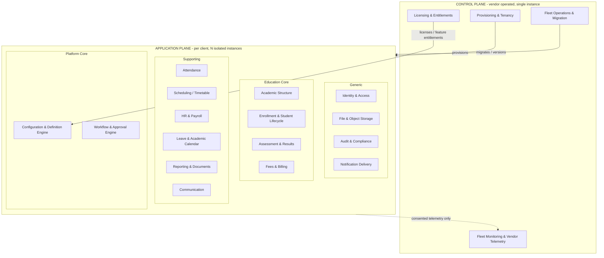

The arrows from the Control Plane into the Application Plane are deliberately few and one-directional: the Control Plane provisions, licenses, and migrates; the Application Plane emits only consented telemetry back. No student data flows upward.

---

## 4. Subdomain Classification

Classifying subdomains by strategic value tells the team where to invest its best engineering and where to keep things deliberately simple. The classes are: **Core** (the competitive differentiators — invest the most), **Supporting** (necessary and somewhat specific, but not differentiators), and **Generic** (commodity problems — use standard patterns and libraries, do not over-engineer). Because this product's differentiation is split between its no-code platform capabilities and its education domain, the Core class is divided into **Platform Core** and **Education Core**. The Control Plane is classified separately as its own operational core.

### 4.1 Platform Core (the strategic heart — horizontal capabilities)

These are the capabilities that make the product configurable, which is the entire reason it can serve schools, universities, and madrasas from one codebase. They deserve the strongest engineers and the most rigorous design.

The **Configuration & Definition Engine** holds the definition registry (institution types, templates, hierarchy-level catalog), dynamic custom fields, dynamic forms, configurable grading and fee structures, terminology, configuration versioning, audit history, and rollback. The **Workflow & Approval Engine** holds workflow definitions and running instances supporting sequential and conditional approvals, escalation, delegation, and timeout actions, defined declaratively as data.

### 4.2 Education Core (the strategic domain — vertical capabilities)

These are the education domains where correctness and richness directly determine product value. **Academic Structure** owns the configurable hierarchy and the subject/course catalogue. **Enrollment & Student Lifecycle** owns admission, student records, enrollment, promotion, transfer, and status from applicant to alumnus. **Assessment & Results** owns exams, configurable grading systems, marks, result processing, and transcripts. **Fees & Billing** owns configurable fee structures, invoicing, payments, discounts, and waivers.

### 4.3 Supporting subdomains

Necessary to run an institution, institution-specific in flavor, but not where the product wins or loses: **Attendance**, **Scheduling/Timetable**, **HR & Payroll**, **Leave & Academic Calendar**, **Reporting & Documents**, and **Communication**. These are built solidly but pragmatically, reusing the Platform Core (config, workflow) heavily rather than inventing per-context machinery.

### 4.4 Generic subdomains

Solved problems where the goal is a clean, secure, standard implementation, not innovation: **Identity & Access** (authentication, sessions, devices, RBAC), **File & Object Storage**, **Audit & Compliance logging**, and **Notification Delivery** (the channel-level send infrastructure for email/SMS/push, distinct from the Communication context that decides what to send). For these we lean on established patterns and libraries and resist gold-plating.

### 4.5 Control Plane subdomains

Operationally core to the vendor but invisible to clients: **Provisioning & Tenancy**, **Licensing & Entitlements**, **Fleet Operations & Migration**, and **Fleet Monitoring & Vendor Telemetry**. These are small but critical; an immature Control Plane makes 200 deployments unmanageable.

### 4.6 Classification summary

| Subdomain | Plane | Class | Investment level |
|---|---|---|---|
| Configuration & Definition Engine | Application | Platform Core | Highest |
| Workflow & Approval Engine | Application | Platform Core | Highest |
| Academic Structure | Application | Education Core | High |
| Enrollment & Student Lifecycle | Application | Education Core | High |
| Assessment & Results | Application | Education Core | High |
| Fees & Billing | Application | Education Core | High |
| Attendance | Application | Supporting | Medium |
| Scheduling / Timetable | Application | Supporting | Medium |
| HR & Payroll | Application | Supporting | Medium |
| Leave & Academic Calendar | Application | Supporting | Medium |
| Reporting & Documents | Application | Supporting | Medium |
| Communication | Application | Supporting | Medium |
| Identity & Access | Application | Generic | Standard |
| File & Object Storage | Application | Generic | Standard |
| Audit & Compliance | Application | Generic | Standard |
| Notification Delivery | Application | Generic | Standard |
| Provisioning & Tenancy | Control | Control Core | High |
| Licensing & Entitlements | Control | Control Core | Medium |
| Fleet Operations & Migration | Control | Control Core | High |
| Fleet Monitoring & Telemetry | Control | Control Core | Medium |

> **Decision D2 — Treat Configuration and Workflow as Platform Core, not as shared utilities.**
> **Recommendation:** Elevate the Configuration Engine and Workflow Engine to first-class core bounded contexts that other contexts depend on as suppliers.
> **Why:** The product's differentiation and your Level-B requirement (dynamic fields, forms, grading, fees, workflows, all versioned) live entirely in these two engines. Treating them as utilities would scatter configuration logic across every module and reproduce the hard-coding you are trying to eliminate.
> **Pros:** One authoritative place for configurable behavior; consistent versioning/audit/rollback; every domain module gets configurability for free; prevents config logic leaking into domains.
> **Cons:** These engines become critical-path dependencies; a defect here affects many contexts; they require the most careful design and testing.
> **Alternatives:** (a) Per-module configuration — simpler per module, but duplicated and inconsistent, and defeats the thesis. (b) An external low-code platform — too heavy, loses control, and pulls toward runtime arbitrary entities you excluded.
> **Final Decision:** Configuration and Workflow are Platform Core supplier contexts. They are built first and best (reflected in the Part F roadmap).

---

## 5. Bounded Context Design

A bounded context is a boundary within which a model and its language are consistent. Each context below lists its responsibility and the core terms of its ubiquitous language. Contexts are *logical*; Section 7 maps them to modules, and the Part F roadmap sequences which are built first — a small team does not build all twenty on day one.

### 5.1 Application Plane bounded contexts

**Identity & Access Context.** Responsibility: who a user is and what they may do — authentication, refresh tokens, sessions, devices, password recovery, roles, and permissions. Language: User, Credential, Session, Device, Role, Permission, Grant. Upstream to every other context.

**Organization Context.** Responsibility: the structure *within* a client deployment — institutes, campuses, academic sessions, and their relationships and regional settings. Language: Institute, Campus, Academic Session, Shift, Locale. (The client/tenant itself is provisioned by the Control Plane; this context governs what lives inside it.)

**Configuration Context.** Responsibility: definitions and configurable behavior — the definition registry, custom fields, dynamic forms, terminology, configurable grading and fee templates, and configuration versioning, audit, and rollback. Language: Definition, Template, Custom Field, Form Schema, Setting, Scope, Version, Effective Value, Terminology Mapping. A primary upstream supplier.

**Academic Structure Context.** Responsibility: the configurable hierarchy (levels and nodes) and the subject/course catalogue. Language: Level, Node, Enrollment Leaf, Subject, Course, Hierarchy Path. Depends on Configuration for level definitions.

**Enrollment & Student Lifecycle Context.** Responsibility: admission, student master records, enrollment into structure nodes, promotion, transfer, and lifecycle status. Language: Applicant, Admission, Student, Enrollment, Promotion, Transfer, Status. Triggers admission approval via the Workflow context.

**Attendance Context.** Responsibility: presence records for students and staff under configurable modes, and minimum-attendance evaluation. Language: Attendance Record, Mode, Status, Working Day, Minimum Percentage.

**Assessment & Results Context.** Responsibility: exams, configurable grading systems, marks entry, result processing, ranking, and transcripts. Language: Exam, Exam Group, Grading System, Grade Rule, Mark, Result, GPA/CGPA, Transcript. Depends on Configuration for grading definitions.

**Scheduling Context.** Responsibility: timetable, periods, rooms, and conflict detection. Language: Period, Routine Entry, Room, Shift, Conflict.

**Finance Context (Fees & Billing).** Responsibility: configurable fee structures, invoice generation, payments, discounts, waivers, and clearance checks. Language: Fee Type, Fee Structure, Invoice, Payment, Discount, Waiver, Due, Clearance. Depends on Configuration for fee templates; triggers waiver approval via Workflow.

**HR & Payroll Context.** Responsibility: staff records, employment, payroll models, allowances, deductions, and salary processing. Language: Staff, Employment, Payroll Rule, Allowance, Deduction, Salary Slip. Triggers employee/payroll approvals via Workflow.

**Leave & Calendar Context.** Responsibility: leave types and applications, holidays, vacations, and the working-day calendar that Attendance and Payroll consume. Language: Leave Type, Leave Application, Holiday, Vacation, Working Day. Triggers leave approval via Workflow.

**Workflow Context.** Responsibility: declarative workflow definitions and running instances — sequential and conditional approvals, escalation, delegation, and timeout actions — generic and domain-agnostic. Language: Workflow Definition, Step, Condition, Instance, Task, Escalation, Delegation, Timeout, Decision. A primary supplier to several domains.

**Communication Context.** Responsibility: deciding what to communicate and to whom — notices, announcements, templates, targeting, and triggering of notifications on domain events. Language: Notice, Template, Audience, Trigger, Channel Preference.

**Reporting & Documents Context.** Responsibility: report definitions, generation, certificates, and exports, built from read models across contexts. Language: Report Definition, Filter, Dataset, Document Template, Export, Certificate.

**Files & Media Context.** Responsibility: object storage and document lifecycle — upload, retrieval, retention, and deletion. Language: File, Object, Bucket Path, Lifecycle, Retention.

**Audit & Compliance Context.** Responsibility: the append-only audit trail, data export, configurable retention, and erasure support. Language: Audit Entry, Actor, Action, Before/After, Retention Policy, Export Request, Erasure Request.

### 5.2 Control Plane bounded contexts

**Provisioning & Tenancy Context.** Responsibility: the client lifecycle — creating, suspending, and decommissioning isolated deployments, each with its own database and storage. Language: Client, Deployment, Provisioning Manifest, Environment.

**Licensing & Entitlements Context.** Responsibility: plans, feature entitlements, and limits issued to each client, which the Application Plane's Configuration context consumes as feature flags. Language: Plan, Entitlement, Limit, License Token.

**Fleet Operations & Migration Context.** Responsibility: rolling schema and application versions across all deployments safely, with health gating and rollback. Language: Release, Migration Batch, Rollout Wave, Health Gate, Rollback.

**Fleet Monitoring & Telemetry Context.** Responsibility: collecting usage, error, and product telemetry — explicitly excluding student data — for vendor product decisions and fleet health. Language: Metric, Heartbeat, Error Event, Usage Counter.

> **Decision D3 — The Configuration context publishes effective values; consumers never read configuration internals.**
> **Recommendation:** Configuration exposes a query interface returning *resolved effective values* (after scope resolution) and publishes change events; no other context reaches into configuration's storage or models.
> **Why:** Configuration's internal model (scopes, versions, overrides) is complex; leaking it would couple every domain to that complexity and break versioning guarantees.
> **Pros:** Domains stay simple — they ask "what is the effective grading scale here?" and get an answer; configuration can evolve its internals freely; versioning and audit stay centralized.
> **Cons:** A query indirection on hot paths (mitigated by caching, Part E); requires a well-designed published contract.
> **Alternatives:** (a) Shared configuration tables read directly — fast but couples everyone to the schema. (b) Embedding config in each domain — defeats the thesis.
> **Final Decision:** Published-language query interface plus change events, with aggressive caching of resolved values.

---

## 6. Context Relationships

Context mapping records *how* contexts integrate and which side leads. The patterns used here are the standard DDD ones: **Customer/Supplier** (downstream depends on upstream, who accommodates them), **Conformist** (downstream simply accepts upstream's model), **Anti-Corruption Layer / ACL** (downstream translates upstream's model to protect its own), **Open Host Service / Published Language** (an upstream offers a stable public contract for many consumers), and **Shared Kernel** (a small shared model, used sparingly).

### 6.1 The integration mechanism in a modular monolith

Because both planes are modular monoliths, contexts integrate **in-process**, by two means only. Synchronous needs (e.g., "give me the effective fee structure," "does this user have this permission") go through a published **application interface / query port** exposed by the upstream context. Asynchronous needs (e.g., "a student was enrolled," "a result was published") go through an in-process **domain event bus** that downstream contexts subscribe to. Cross-context access to another context's entities, repositories, or tables is forbidden (enforced in Section 8). This is what makes the boundaries real despite everything running in one process.

> **Decision D4 — Integrate contexts via published interfaces and domain events only; never via shared data access.**
> **Recommendation:** All cross-context interaction occurs through an upstream context's published query interface or through domain events on an in-process bus.
> **Why:** Shared database access between modules is the single most common way a modular monolith degrades into a big ball of mud; it creates hidden coupling that defeats the boundaries.
> **Pros:** Real decoupling; each context owns its data; future extraction to a service is possible because the contract already exists; clear, testable seams.
> **Cons:** Some indirection and event plumbing; eventual consistency for event-driven flows; developers must resist the temptation to "just join the table."
> **Alternatives:** (a) Shared tables / cross-module repositories — fastest, rots fastest. (b) A message broker (Kafka/RabbitMQ) even in-monolith — unnecessary operational weight for in-process events now; reserved for later if a context is extracted.
> **Final Decision:** Published interfaces plus an in-process domain event bus. A real broker is deferred to Part E and only if a context is ever extracted.

### 6.2 Application Plane context relationship map

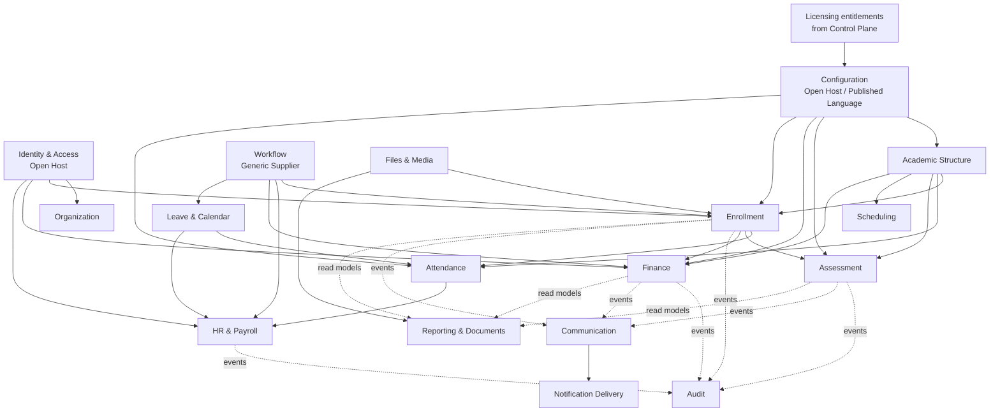

### 6.3 The defining relationships, explained

**Identity & Access is Open Host to everyone.** It publishes a stable user/permission contract that all contexts conform to. No context invents its own notion of a user. This is upstream of all.

**Configuration is Open Host / Published Language to the domain contexts.** Academic Structure, Assessment, Finance, Enrollment, and Attendance are **customers** of Configuration; they consume resolved effective values through its published interface and protect themselves with a thin ACL so that a change in configuration's internals never ripples into domain logic. Configuration in turn is a **customer** of the Control Plane's Licensing context, conforming to the entitlements it is issued.

**Academic Structure is supplier to the education domains.** Enrollment, Attendance, Assessment, Scheduling, and Finance all reference the hierarchy; Academic Structure leads and they conform to its node model.

**Enrollment is supplier to the activity domains.** Attendance, Assessment, and Finance all reference enrolled students; Enrollment leads.

**Workflow is a Generic Supplier with an important inversion.** Enrollment (admission), HR (leave, employee), Finance (fee waiver), and Leave are **customers** of Workflow — but Workflow must remain domain-agnostic. So the relationship is inverted through events: a domain *registers a workflow definition* and *raises a request*; Workflow runs the generic state machine and emits decision events; the domain reacts. Workflow never imports domain concepts. This keeps the engine reusable and prevents domain logic leaking into it. An ACL on each domain side translates generic workflow decisions into domain actions.

**Audit and Communication are downstream event consumers.** Every significant domain action raises a domain event; Audit subscribes to record it append-only, and Communication subscribes to decide whether to notify. The domains do not know who is listening — pure publish/subscribe — which keeps them decoupled from cross-cutting concerns. Notification Delivery sits downstream of Communication as the channel-level sender.

**Reporting is downstream and read-only.** It builds from dedicated read models fed by events or queried through published interfaces, never by reaching into source tables, so that reporting load and schema are isolated from the transactional contexts.

### 6.4 Control Plane to Application Plane relationship

The Control Plane is **upstream supplier** to the Application Plane through a strict **Published Language**: a provisioning manifest (what deployment to create) and a license/entitlement contract (what features and limits apply). The Application Plane **conforms** to these. The only upstream flow is **consented telemetry** — usage, error, and product metrics with no student data — which the Application Plane publishes and the Control Plane's Telemetry context consumes. This single, narrow, well-defined seam is what allows 200+ isolated deployments to be managed centrally without compromising isolation.

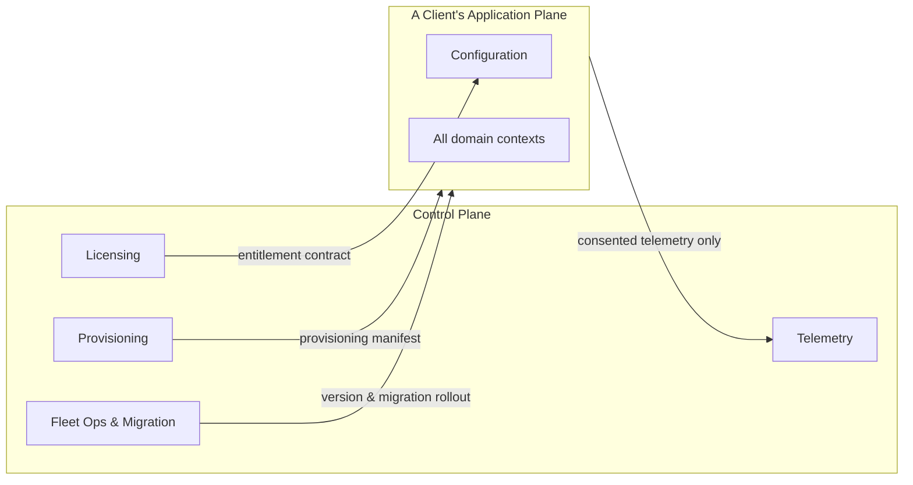

---

## 7. Modular Monolith Architecture

### 7.1 Why modular monolith, decisively

> **Decision D5 — Modular Monolith per plane, not microservices.**
> **Recommendation:** Build each plane as a single deployable modular monolith with strictly encapsulated internal modules.
> **Why:** A 4–8 engineer team with a 6-month deadline and 200+ isolated deployments cannot afford the operational tax of microservices (network boundaries, distributed transactions, per-service CI/CD, observability across services) — multiplied across every client deployment. A modular monolith gives most of the architectural benefit (clear boundaries, independent evolution) with a fraction of the operational cost. The isolation you need is already provided by the per-client deployment model, not by service decomposition.
> **Pros:** One deployable to build, test, ship, and run per plane; in-process calls (no network failure modes); single transaction boundary available where needed; far simpler operations across 200 deployments; faster development for a small team; boundaries still enforced internally.
> **Cons:** A bad change can affect the whole deployable; scaling is coarse-grained (scale the whole app, not one module) — though acceptable given per-client deployments; requires discipline/tooling to keep modules from coupling.
> **Alternatives:** (a) Microservices — real independent scaling and deployment, but operationally unaffordable here and adds distributed-systems complexity the domain does not need. (b) Layered monolith with no module boundaries — simplest, but no real seams; rots. (c) Modular monolith now with selective extraction later — this is effectively our choice, with the extraction option preserved by strict boundaries.
> **Final Decision:** Modular monolith per plane, with boundaries strict enough that any single context could later be extracted if a genuine, measured need arises. We do not extract now.

### 7.2 The two deployables

There are exactly two application artifacts. The **Control Plane** deployable runs once, centrally, and contains the four control contexts. The **Application Plane** deployable is what gets provisioned per client; every client runs the same artifact against its own isolated database and storage, with behavior differentiated entirely by configuration and license entitlements — never by per-client code. This "same artifact, different data" rule is what keeps 200+ deployments maintainable: there is one codebase to patch, and the Fleet Operations context rolls it out.

> **Decision D6 — One Application Plane artifact for all clients; differentiation by configuration, never by per-client code or branches.**
> **Recommendation:** Ship an identical Application Plane build to every client; all client-specific behavior comes from configuration and entitlements.
> **Why:** Per-client code branches or forks would make 200 deployments unmaintainable and would reintroduce the hard-coding the product exists to avoid.
> **Pros:** One codebase to secure and patch; fleet-wide migrations are uniform; the configuration thesis is enforced structurally; white-labeling is runtime config.
> **Cons:** Every client capability must be expressible as configuration or entitlement — a real design constraint on every feature; no quick per-client hacks.
> **Alternatives:** (a) Per-client forks/branches — flexible short-term, catastrophic long-term. (b) Build-time per-client variants — still N artifacts to manage.
> **Final Decision:** Single artifact, configuration-driven differentiation. The design constraint is accepted as a feature, not a limitation.

### 7.3 Internal structure of a plane — modules over layers, layered within modules

Each plane is organized **primarily by module (bounded context) and secondarily by layer**. That is, the top-level structure is a set of modules (one per bounded context), and *inside* each module sits a consistent four-layer structure. This "modules first, layers inside" arrangement keeps all of a context's code together (high cohesion) rather than scattering it across global "controllers/services/repositories" folders.

The four layers inside every module, with the dependency rule that dependencies point strictly inward:

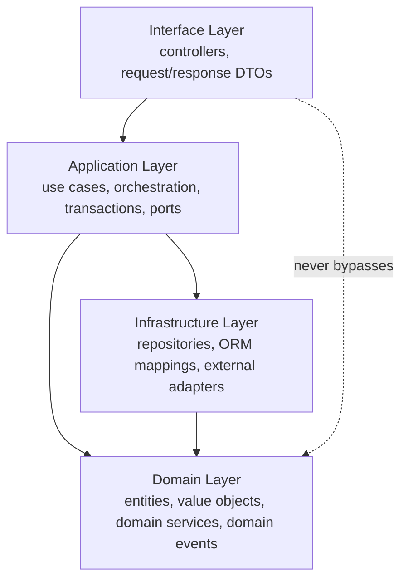

The **Interface layer** handles transport — receiving requests and shaping responses — and nothing else. The **Application layer** holds use cases: it orchestrates domain objects, manages transactions, and defines *ports* (interfaces) that infrastructure implements; it is where cross-context calls are made through published contracts. The **Domain layer** is pure: entities, value objects, domain services, and domain events, with no dependency on frameworks, ORM, or other modules — this is where business invariants live. The **Infrastructure layer** implements the ports: repositories, persistence mappings, and adapters to external systems (storage, email, the event bus). Dependencies always point inward toward the domain; the domain depends on nothing outward. This is the standard clean/onion arrangement, applied per module.

### 7.4 The shared kernel and platform foundation

A deliberately **minimal shared kernel** holds only the most stable, universal primitives: base entity conventions, common value objects (such as Money, DateRange, identifiers), result and error types, and the domain-event base. It is intentionally tiny because every addition couples all modules to it; changes to the shared kernel require architecture review (Section 8). Alongside it, a **platform foundation** provides cross-cutting infrastructure that modules use but that carries no business meaning: the event bus, the configuration query client, the identity/permission client, logging, and caching access. The platform foundation is infrastructure, not a domain, and domains depend on it through interfaces.

### 7.5 How bounded contexts map to modules

The mapping is one-to-one in the common case: each bounded context from Section 5 becomes one top-level module. A few generic contexts (Files, Notification Delivery, Audit) are thin and may be implemented as platform-foundation services rather than full domain modules, since they have little domain logic. The Part F roadmap sequences construction; logically, the complete module set is the context set from Section 5.

---

## 8. Module Dependency Rules

Boundaries that are not enforced are merely suggestions. These rules are mandatory, and Part B specifies the tooling that enforces them (module encapsulation, lint boundary rules, and architecture tests in CI).

### 8.1 The dependency rule (within a module)

Inside any module, dependencies point inward only: Interface → Application → Domain, and Infrastructure → Domain, with the Application layer depending on Domain and defining ports that Infrastructure implements. The Domain layer depends on nothing outside itself — no framework, no ORM, no other module. Any violation (for example, a controller calling a repository directly, or an entity importing an ORM decorator into pure domain code) is a defect caught in review and CI.

### 8.2 The cross-module rules (between modules)

Cross-module interaction is permitted **only** through (a) another module's published application interface / query port, or (b) domain events on the in-process event bus. The following are forbidden without exception: importing another module's entities, value objects, repositories, or infrastructure; querying another module's tables; and sharing an ORM relationship across a module boundary. A module's internals are private; only its published contract is public.

### 8.3 The allowed dependency direction (the module graph must be acyclic)

Modules are layered into tiers, and dependencies may only point from a higher tier to a lower (more foundational) tier, never the reverse and never sideways into a peer's internals. The tiers, from most foundational upward:

| Tier | Modules | May depend on | May NOT depend on |
|---|---|---|---|
| 0 — Platform foundation | Event bus, config client, identity client, logging, cache | Shared kernel only | Any domain module |
| 1 — Platform Core | Configuration, Workflow | Foundation, shared kernel | Education/Supporting domains |
| 1 — Generic | Identity & Access, Files, Audit, Notification Delivery | Foundation, shared kernel | Education/Supporting domains |
| 2 — Education Core (structural) | Academic Structure | Configuration, Identity, foundation | Enrollment and downstream domains |
| 3 — Education Core (activity) | Enrollment | Academic Structure, Configuration, Identity, Workflow | Assessment/Finance/Attendance internals |
| 4 — Activity & Supporting | Attendance, Assessment, Finance, Scheduling, HR & Payroll, Leave & Calendar | Tiers below + Workflow + Configuration | Each other's internals (use events) |
| 5 — Cross-cutting consumers | Communication, Reporting & Documents | Events + published read interfaces | Writing into source domains |

The key consequences: Platform Core and Generic modules must **never** depend on a domain module (Configuration cannot know about Enrollment); domains depend on platforms, not the reverse. Workflow and Configuration are depended-upon by many but depend on none of the domains, preserving their reusability. Peer domains at Tier 4 integrate with each other **only through events**, never direct calls, which keeps the graph acyclic. Communication and Reporting sit at the top as pure consumers and never write back into domains.

> **Decision D7 — Enforce an acyclic, tiered module dependency graph with platform contexts strictly below domain contexts.**
> **Recommendation:** Permit dependencies only downward through the tier table above; forbid cycles and sideways internal access; enforce in CI.
> **Why:** Without an enforced acyclic graph, a modular monolith inevitably develops circular and hidden dependencies that make it unshippable in parts and unextractable later. Keeping platform engines below domains guarantees their reusability and prevents the configuration/workflow engines from absorbing domain knowledge.
> **Pros:** Predictable build/test order; no cycles; reusable platform engines; future extraction stays possible; new engineers can reason about allowed dependencies from one table.
> **Cons:** Occasionally forces an event-based interaction where a direct call would have been quicker to write; requires CI enforcement tooling.
> **Alternatives:** (a) Unconstrained dependencies with good intentions — fails within months. (b) Strict layering without a module graph — controls layers but not inter-module cycles.
> **Final Decision:** Tiered acyclic module graph, enforced by architecture tests and boundary lint rules in CI (specified in Part B).

### 8.4 Shared kernel governance

The shared kernel is the one place all modules legitimately share code, which makes it dangerous. Rule: nothing enters the shared kernel unless it is universal, stable, and free of business-domain meaning (Money and DateRange qualify; "Student" does not). Every change to the shared kernel requires explicit architecture review, because it ripples across all modules. When in doubt, duplicate a small value object in two contexts rather than promote it to the kernel — duplication is cheaper than coupling.

### 8.5 Event and contract stability

Because events and published interfaces are the integration surface, they are treated as **contracts**: they are versioned, documented, and changed with care, since a breaking change affects every subscriber or caller. Domain events are named in past tense (StudentEnrolled, ResultPublished) and carry a stable, minimal payload. Adding fields is safe; removing or repurposing them is a breaking change requiring coordinated review. Part B defines the event contract and versioning conventions.

---

## Part A — Closing Note and What Comes Next

Part A has established the strategic skeleton: a two-plane modular monolith, isolated-deployment tenancy managed by a lightweight Control Plane, Configuration and Workflow elevated to Platform Core supplier contexts, a complete set of bounded contexts with explicit relationships, and an enforced, acyclic, tiered module dependency graph. Every later part hangs off this structure — the backend folder layout (Part B) realizes the module-and-layer arrangement of Section 7; the database design (Part B) respects the per-context data ownership of Section 6; authentication and authorization (Part C) implement the Identity Open Host of Section 6; and the roadmap (Part F) sequences the contexts of Section 5 for a small team to deliver in six months.

**Awaiting your approval to proceed to Part B — Backend & Data Architecture** (backend folder structure, modules, shared components, domain/application/infrastructure layers, DTO/entity/repository/service strategy, guards/filters/interceptors/middleware, the full PostgreSQL architecture, the Configuration Engine design, and the Workflow Engine design).

*End of Part A.*


<div style="page-break-before: always;"></div>

---

# ═══ PART B ═══

# Enterprise Education ERP — Architecture Blueprint
## Part B — Backend & Data Architecture

**Scope:** Backend application architecture, the layered module internals, the request pipeline, asynchronous infrastructure, and the complete PostgreSQL data architecture, including the resolution of the TypeORM-versus-dynamic-configuration question.
**Status:** Part B of the blueprint. Builds directly on Part A's two-plane modular monolith, bounded contexts, and tiered module dependency graph.
**Constraint:** No source code. Folder trees, conceptual ERDs, table designs, field listings, and strategies only.
**Decision format:** Significant decisions recorded as Recommendation → Why → Pros → Cons → Alternatives → Final Decision. (Decision numbering continues from Part A; this part is D8–D24.)

---

## B-1. NestJS Application Architecture (Sections 1–3, 11–12)

### 1. Complete NestJS Architecture

The Application Plane is a single NestJS application organized **modules-first, layered-inside**, exactly as Part A Section 7 specified. NestJS's own module system is the enforcement mechanism for bounded-context boundaries: each bounded context is a NestJS feature module that exports only its published application interface and its event contracts, and keeps everything else (domain models, persistence, repositories) private to the module. A context that wants another context's capability imports that context's *published provider*, never its internals — and NestJS's provider encapsulation makes "internals" genuinely unreachable rather than merely discouraged.

The application is composed of four top-level concerns that map to four root folders: the **bounded-context modules** (`modules/`), the **platform foundation** (`platform/`) which is tier-0 infrastructure with no domain meaning, the **shared kernel** (`shared/`) which is the tiny stable set of universal domain primitives, and the **common plumbing** (`common/`) which holds the NestJS-specific cross-cutting pipeline elements (guards, interceptors, filters, middleware). This separation matters: it keeps framework plumbing out of the domain, keeps infrastructure out of business logic, and gives each of the four a different change-control policy (the shared kernel is the most locked-down; common plumbing is the most freely edited).

> **Decision D8 — Persistence model and domain model are separated for Core contexts; pragmatically merged for Generic/Supporting contexts.**
> **Recommendation:** In Platform Core and Education Core contexts (Configuration, Workflow, Academic Structure, Enrollment, Assessment, Finance), keep a pure domain model distinct from TypeORM persistence entities, with mappers between them. In Generic and simpler Supporting contexts (Files, Audit, Notification, Attendance, Scheduling), allow TypeORM entities to serve directly as the working model to avoid ceremony.
> **Why:** Full domain/persistence separation everywhere is the textbook clean-architecture answer, but for a 4–8 engineer team it is too much ceremony in CRUD-heavy contexts where there is little real domain logic. Concentrating the separation where business invariants are rich (results processing, fee calculation, configuration versioning) buys correctness where it matters and speed where it does not.
> **Pros:** Domain logic in core contexts is testable without a database and insulated from ORM quirks; simpler contexts ship faster; the team applies effort proportionally.
> **Cons:** Two conventions in one codebase (must be clearly documented so engineers know which applies where); a context that grows in complexity may need to be "promoted" to full separation later.
> **Alternatives:** (a) Full separation everywhere — purest, slowest, over-engineered for CRUD. (b) ORM-entities-as-domain everywhere — fastest, but rich domains (grading, fees) leak persistence concerns into business logic and become hard to test and change.
> **Final Decision:** Calibrated separation — full in Core, merged in Generic/Supporting — with the classification documented in the engineering standards (Part F) so the rule is unambiguous.

### 2. Backend Folder Structure

The structure below is the canonical layout. Every bounded-context module repeats the same internal four-layer shape, so an engineer who learns one module can navigate all of them.

```
src/
├── main.ts                          # bootstrap, global pipes/filters/interceptors
├── app.module.ts                    # composition root: wires modules + platform
│
├── modules/                         # one folder per bounded context (Part A §5)
│   ├── configuration/
│   │   ├── configuration.module.ts  # public provider exports + event subscriptions
│   │   ├── interface/               # controllers + request/response DTOs (transport only)
│   │   ├── application/             # use-cases, application services, ports (interfaces)
│   │   ├── domain/                  # domain entities, value objects, domain services, events
│   │   └── infrastructure/          # ORM persistence entities, repository impls, adapters, mappers
│   ├── workflow/                    #   (same four-layer shape)
│   ├── identity/
│   ├── organization/
│   ├── academic-structure/
│   ├── enrollment/
│   ├── attendance/
│   ├── assessment/
│   ├── scheduling/
│   ├── finance/
│   ├── hr-payroll/
│   ├── leave-calendar/
│   ├── communication/
│   └── reporting/
│
├── platform/                        # tier-0 foundation, no domain meaning
│   ├── persistence/                 # TypeORM datasource, base repository, transaction manager
│   ├── event-bus/                   # in-process domain event dispatcher
│   ├── outbox/                      # transactional outbox + relay
│   ├── cache/                       # Redis access, cache-aside helpers, invalidation
│   ├── queue/                       # BullMQ setup, producers
│   ├── jobs/                        # scheduler + repeatable job definitions
│   ├── storage/                     # S3/MinIO object-storage adapter
│   ├── config-client/              # query port into Configuration context (resolved values)
│   ├── identity-client/            # query port into Identity context (user/permission)
│   └── observability/               # structured logging, metrics, tracing
│
├── shared/                          # shared kernel — tiny, stable, domain-neutral
│   ├── domain/                      # BaseEntity conventions, value objects (Money, DateRange, Id), Result, DomainEvent base
│   └── types/                       # universal types, error taxonomy
│
├── common/                          # NestJS cross-cutting plumbing
│   ├── guards/                      # auth, tenant/institute scope, permissions
│   ├── interceptors/                # context, audit, serialization, timeout, cache
│   ├── filters/                     # global exception filter, domain-error mapping
│   ├── middleware/                  # correlation id, request context, body limits
│   ├── decorators/                  # @CurrentUser, @CurrentScope, @RequirePermissions, @RequireFeature
│   ├── pipes/                       # validation pipe config, dynamic-field validation pipe
│   └── dto/                         # base DTOs: pagination, filtering, envelope
│
└── config/                          # application/env config (NOT business configuration)
```

> **Decision D9 — Four named roots (`modules`, `platform`, `shared`, `common`) with distinct change-control.**
> **Recommendation:** Separate domain modules, infrastructure foundation, the shared kernel, and framework plumbing into four roots, each with its own review policy.
> **Why:** Conflating them (the common "everything in shared/" anti-pattern) is how monoliths lose their boundaries; distinct roots make dependency direction and change risk visible at a glance.
> **Pros:** Clear ownership; the shared kernel can be locked down while plumbing stays editable; new engineers learn the map quickly.
> **Cons:** Requires occasional judgment about where a new utility belongs; some teams find four roots more than they're used to.
> **Alternatives:** (a) Single `shared/` for all cross-cutting code — simpler, but mixes domain primitives with framework plumbing and infra. (b) Type-first global folders (`controllers/`, `services/`) — scatters each context's code, defeats cohesion.
> **Final Decision:** Four roots as above, documented in engineering standards.

### 3. Module Structure

A module's `*.module.ts` is its public contract. It declares which providers are exported (the application services other contexts may call), registers the controllers in its interface layer, and wires its infrastructure implementations to the ports its application layer defines. The rule from Part A Section 8 is realized here mechanically: a module exports *only* its application service interfaces and never its repositories, persistence entities, or domain internals. Cross-module imports of anything not exported are impossible through Nest's DI, and a CI architecture test additionally fails the build if a module file path imports from another module's `domain/` or `infrastructure/` folders.

Each module also declares its **event subscriptions** (which domain events from other contexts it reacts to) and its **published events** (its event contracts). This makes a module self-describing: reading its module file tells you what it offers, what it consumes synchronously, and what it reacts to asynchronously.

### 11. Shared Module Strategy

The shared module (`shared/`) is the shared kernel and is deliberately minimal. It contains only universal, stable, domain-neutral building blocks: the base entity conventions (identifier type, timestamp fields, soft-delete marker, optimistic-lock version), reusable value objects that genuinely recur everywhere (Money with currency, DateRange, PercentageScore, a strongly-typed Id), the domain-event base type, and a Result/error taxonomy used for explicit success/failure returns. Nothing with business-domain meaning enters it — "Student," "Invoice," and "Grade" belong to their contexts, not the kernel. The governing rule from Part A holds: when unsure, duplicate a small value object across two contexts rather than promote it, because duplication is cheaper than the coupling a shared-kernel addition creates. Every change to the shared module requires architecture review because it ripples across all modules.

### 12. Common Module Strategy

The common module (`common/`) holds the NestJS-specific cross-cutting plumbing that the request pipeline needs but that carries no domain meaning: guards, interceptors, exception filters, middleware, decorators, pipes, and base transport DTOs (pagination, filtering, the response envelope). This is distinct from the shared kernel (which is domain primitives) and from the platform foundation (which is infrastructure like Redis and the event bus). The distinction matters because these three have different natures: common plumbing is framework-coupled and freely editable; the shared kernel is domain and locked-down; the platform is infrastructure and adapter-based. Keeping them apart prevents the classic mess where a "utils" or "shared" folder accumulates guards, value objects, database helpers, and string utilities in one undifferentiated heap.

---

## B-2. Layered Module Internals (Sections 4–10)

### 4. Domain Layer Design

The domain layer is the innermost layer and, in Core contexts, the heart of the system. It contains domain entities and aggregates that own business invariants, value objects that model concepts without identity, domain services for logic that spans multiple entities, and domain events that record significant occurrences. It depends on nothing outward — no NestJS, no TypeORM, no other module — which is what lets it be unit-tested in isolation and kept stable while infrastructure churns around it.

The aggregate is the key design unit: a cluster of entities and value objects with a single root that enforces consistency for the whole cluster and is the only entry point for changes. Examples in this system: a Result aggregate enforces that weighted components sum correctly and grades derive from the active grading system; a FeeInvoice aggregate enforces that line items, discounts, and net amounts stay consistent; a WorkflowInstance aggregate enforces that step transitions follow the definition. Aggregates are kept deliberately small — large aggregates create contention and transaction bloat — and references between aggregates are by identity, not by object graph, which also keeps TypeORM relationships from sprawling across the model.

### 5. Application Layer Design

The application layer orchestrates use cases. Each use case is a thin coordinator that loads aggregates through repository ports, invokes domain behavior, persists results, raises domain events through the outbox, and manages the transaction boundary. It contains no business rules itself — those live in the domain — and no transport concerns — those live in the interface layer. It is also where this context's calls to *other* contexts happen, always through published interfaces (for example, Finance's application layer asks the Configuration client for the effective fee structure and asks the Identity client for permission checks). The application layer defines **ports**: interfaces for the things it needs (repositories, the config client, the storage adapter) which the infrastructure layer implements. This dependency inversion is what keeps the application and domain layers free of infrastructure detail.

The transaction boundary lives here, at the use-case level: one use case is one transaction (with rare, explicit exceptions), and the domain events it produced are written to the outbox *inside the same transaction* so that an event is never lost or emitted for a rolled-back change. This is the linchpin of reliable event-driven integration and is detailed in Section 18.

### 6. Infrastructure Layer Design

The infrastructure layer implements the ports the application layer declares. It holds the TypeORM persistence entities (the database-shaped model), the repository implementations that translate between persistence entities and domain models via mappers (in Core contexts), the adapters to external systems (object storage, email/SMS providers, the cache), and the event-publishing implementation. It is the only layer that knows about TypeORM, Redis, S3, or any concrete technology. Because it sits at the outer edge and implements inward-facing ports, any of these technologies can be swapped by writing a new adapter without touching domain or application code — the practical payoff of the dependency rule.

### 7. DTO Strategy

> **Decision D10 — Separate, explicit request and response DTOs; never expose persistence entities across the API.**
> **Recommendation:** Define distinct request DTOs (validated input) and response DTOs (serialized output) in the interface layer; map to/from domain or persistence models internally; never serialize a TypeORM entity directly to a client.
> **Why:** Leaking entities couples the API contract to the database schema, accidentally exposes internal or soft-deleted fields, and breaks the moment the schema changes. Explicit DTOs give a stable, documented, intentional API surface.
> **Pros:** Stable API independent of schema; precise control over what is exposed (no accidental leakage of audit fields, password hashes, internal flags); clean Swagger documentation; versionable.
> **Cons:** Mapping boilerplate between DTOs and models; two shapes to maintain per resource.
> **Alternatives:** (a) Return entities directly — fastest, but couples and leaks; a frequent source of security and compatibility bugs. (b) Generic serialization with field exclusion decorators on entities — better than nothing, but still couples the API to the entity and is easy to get wrong.
> **Final Decision:** Explicit request/response DTOs with a thin mapping layer. Request DTOs carry validation rules; response DTOs are pure shape. Pagination, filtering, and the response envelope come from `common/dto`.

The DTO strategy also accounts for the dynamic side: where a resource carries configurable custom fields, the static DTO covers the fixed columns and a typed `customFields` map covers the dynamic ones, validated at runtime against the field definitions (Section 17). This keeps the static contract stable while admitting per-client custom data.

### 8. Entity Strategy

Per Decision D8, Core contexts maintain two models — a pure **domain entity/aggregate** (in `domain/`) and a **persistence entity** (a TypeORM entity in `infrastructure/`) — connected by a mapper. Generic and simpler Supporting contexts use a single TypeORM entity as the working model. In all cases, every persistence entity follows the shared conventions: a time-ordered UUID primary key (UUIDv7, so keys are index-friendly and sortable by creation), the scoping columns appropriate to the table (institute_id and, where relevant, campus_id and session_id, since one client deployment contains multiple institutes/campuses/sessions), audit columns (created_at, updated_at, created_by, updated_by), the soft-delete marker (deleted_at), and an optimistic-lock version column. Entities never carry presentation logic and never reference another context's entities by object relationship — cross-context references are by identifier only, preserving the aggregate and module boundaries.

### 9. Repository Strategy

> **Decision D11 — Repository ports in the application layer, TypeORM implementations in infrastructure, returning domain models for Core contexts.**
> **Recommendation:** The application layer declares repository interfaces in terms of the domain (load/save aggregates, intention-revealing query methods); the infrastructure layer implements them with TypeORM, mapping persistence entities to domain models. Avoid the active-record pattern and avoid leaking the TypeORM repository to the application layer.
> **Why:** This keeps domain and application code free of ORM concepts, makes them testable with in-memory fakes, and confines all TypeORM specifics to one place. Intention-revealing methods ("findEnrollableStudentsForSession") read better and optimize better than generic find-by-criteria sprinkled through services.
> **Pros:** Testable domain/application layers; one place for query tuning; the ORM is swappable; queries are named and discoverable.
> **Cons:** More indirection than calling TypeORM directly; mapping cost; risk of repository interfaces growing too many bespoke methods (managed by keeping them aggregate-focused).
> **Alternatives:** (a) Active record (entities save themselves) — concise but fuses domain and persistence, hard to test, poor for rich domains. (b) Generic repository exposed everywhere — convenient, but scatters query logic and ORM coupling across services.
> **Final Decision:** Port-and-adapter repositories returning domain models in Core contexts; thinner TypeORM-backed repositories in Generic/Supporting contexts. Complex and hot-path queries use the TypeORM query builder inside the repository implementation (never in services), selecting only needed columns to avoid over-fetching and N+1.

### 10. Service Strategy

The word "service" is overloaded, so the blueprint uses three precise terms. **Application services** (a.k.a. use-case handlers) live in the application layer and orchestrate one use case each; they are the only place transactions and cross-context calls occur. **Domain services** live in the domain layer and hold business logic that doesn't naturally belong to a single entity (for example, a result-calculation service that combines marks, weights, and the grading system). **Infrastructure services / adapters** live in the infrastructure layer and wrap external systems (storage, email). Keeping these three distinct prevents the classic "fat service" that mixes orchestration, business rules, and I/O into an untestable thousand-line file. The rule of thumb: if a method touches the database or an external system, it belongs to infrastructure behind a port; if it coordinates a use case and a transaction, it is an application service; if it expresses a business rule, it is domain.


---

## B-3. Request Pipeline (Sections 13–17)

The request pipeline is the ordered chain every HTTP request passes through before reaching a controller, and the chain every response passes through on the way out. Ordering is deliberate and security-critical: cheap rejections happen first, identity is established before authorization, and authorization before any business logic.

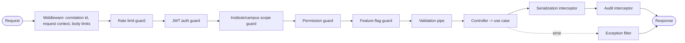

### 13. Guards

Guards make allow/deny decisions before a request reaches a controller, in this order. The **rate-limit guard** sheds abusive or excessive traffic early (per-user and per-IP, with sensitive endpoints like login throttled harder; Redis-backed so limits hold across instances). The **JWT auth guard** validates the access token and establishes the authenticated user. The **scope guard** establishes and enforces the institute/campus the request operates in — critical here because one deployment holds multiple institutes, so every scoped request must prove the user may act in that institute/campus, preventing cross-institute data access within the same client. The **permission guard** checks the specific required permission (declared on the handler via a decorator) against the user's resolved, cached permission set. The **feature-flag guard** blocks endpoints whose module/feature is not entitled or enabled for this client/institute, tying into the Configuration and Licensing contexts. Guards never contain business logic; they only decide admission.

### 14. Interceptors

Interceptors wrap handler execution to add cross-cutting behavior without polluting business code. The **context interceptor** binds the request's correlation id, user, and scope into an async-local context available throughout the call (so deep code and the audit/event machinery can access "who and where" without threading parameters). The **serialization interceptor** transforms domain/persistence models into response DTOs and strips anything not explicitly exposed. The **audit interceptor** records mutating operations (it cooperates with the event-driven audit trail in Section 29 rather than replacing it). The **cache interceptor** serves cache-aside reads for hot, cacheable endpoints (resolved configuration, permission maps). A **timeout interceptor** bounds request duration so a slow query cannot hold a connection indefinitely. Interceptors are configured globally where universal and per-handler where selective.

### 15. Exception Filters

A single global exception filter is the one place errors become HTTP responses, producing a consistent error envelope (a stable error code, a human-readable message, an optional field reference, and the correlation id for support). It maps the domain error taxonomy from the shared kernel to appropriate HTTP statuses: validation failures to 422, authorization failures to 403, authentication failures to 401, not-found to 404, optimistic-lock/conflict to 409, and unexpected errors to 500 with the internal detail logged but never leaked to the client. Centralizing this guarantees that no stack trace, SQL fragment, or internal identifier ever reaches a user, which is both a security and a support-quality requirement. Domain code throws meaningful domain errors; the filter translates them; controllers contain no try/catch ceremony.

### 16. Middleware

Middleware runs before guards and handles concerns that are about the raw request rather than the authenticated operation: assigning a correlation id (propagated through logs, events, and the audit trail for end-to-end traceability), initializing the request context, enforcing body-size and payload limits, and basic hardening headers (the heavier security headers and CORS are configured at the application and Nginx layers, covered in Part E). Middleware is kept thin; anything needing the authenticated user or scope belongs in a guard or interceptor, not middleware.

### 17. Validation Architecture

> **Decision D12 — Two-tier validation: static DTO validation for fixed contracts, definition-driven dynamic validation for configurable fields and forms.**
> **Recommendation:** Validate fixed request DTOs with the standard decorator-based validation pipe; validate dynamic custom fields and dynamic form submissions at runtime against their field/form definitions from the Configuration context.
> **Why:** The product has two kinds of input — stable, code-defined fields (a login, a date range) and client-configured fields (a custom admission field, a dynamic form). The first is best validated by static, compile-time-friendly rules; the second cannot be, because its rules live in data and vary per client. One mechanism cannot serve both well.
> **Pros:** Static inputs get fast, strongly-typed, well-documented validation; dynamic inputs get correct per-client validation driven by the same definitions that render the forms, so rules never drift between rendering and validation.
> **Cons:** Two validation paths to maintain; the dynamic validator is a real component that must support the field types and rules the definition model allows.
> **Alternatives:** (a) Static validation only — cannot validate client-defined fields at all. (b) Fully dynamic validation for everything — loses compile-time safety and clarity for the stable 80% of inputs.
> **Final Decision:** Two-tier validation. The static tier uses the framework validation pipe with a strict global configuration (whitelist unknown properties out, transform types, forbid non-whitelisted properties). The dynamic tier is a definition-driven validation service in the Configuration context, invoked via a pipe for endpoints that accept configurable fields; it enforces required/type/range/option/uniqueness rules expressed as data, returning the same error envelope as static validation so clients see one consistent error shape.

---

## B-4. Asynchronous & Infrastructure (Sections 18–21)

### 18. Event Architecture

> **Decision D13 — In-process domain events with a transactional outbox for reliability; a real broker deferred.**
> **Recommendation:** Domain events are dispatched in-process to subscribers, but every event is first written to an outbox table inside the same database transaction as the state change that produced it; a relay then publishes committed outbox events to in-process handlers and, where work is heavy, onto a queue. No external message broker initially.
> **Why:** Part A chose event-based integration between contexts; doing it purely in-memory risks losing events if the process crashes after committing a change but before handlers run, which for audit and notifications is unacceptable. The outbox pattern guarantees that an event exists if and only if its change committed, giving at-least-once delivery without the operational weight of Kafka/RabbitMQ across 200 deployments.
> **Pros:** No lost events; events and state are atomically consistent; no broker to run per deployment; clean path to a real broker later if a context is extracted (the outbox simply feeds the broker instead).
> **Cons:** Outbox table and relay to build and monitor; at-least-once means handlers must be idempotent; a small publish latency.
> **Alternatives:** (a) Pure in-memory events — simplest, but loses events on crash. (b) Broker from day one — reliable, but heavy operations multiplied across every client deployment, unjustified at current scale. (c) Database LISTEN/NOTIFY — usable but lacks durability and replay.
> **Final Decision:** Transactional outbox feeding in-process handlers, with heavy handlers offloaded to BullMQ. Handlers are idempotent (keyed by event id). Events are versioned, past-tense, minimal-payload contracts (per Part A Section 8.5). A broker is reconsidered only if and when a context is extracted to its own service.

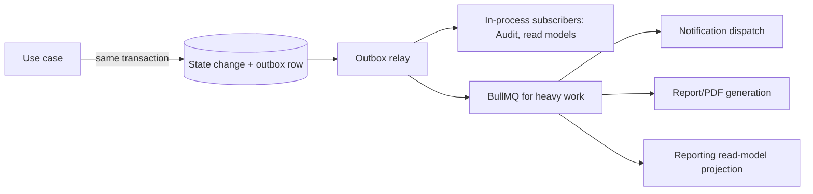

### 19. Redis Integration Strategy

Redis is the shared, in-memory backbone for several distinct concerns, each namespaced to avoid collision and each with its own eviction policy. It caches **resolved configuration** (the effective-value answers from the Configuration context, which are read constantly and change rarely — invalidated by configuration-change events, so reads are fast and never stale). It caches **permission maps** per user (rebuilt on role/permission change). It backs **session and refresh-token state** (including a denylist for revoked tokens, enabling real logout and device revocation). It enforces **rate limiting** with shared counters so limits hold across application instances. It provides **distributed locks** for jobs that must not run concurrently across instances (for example, monthly invoice generation per institute). And it is the **backing store for BullMQ**. Crucially, because each client deployment is isolated, each has its own Redis namespace/instance — there is no cross-client cache sharing, consistent with the tenancy model. Cache invalidation is event-driven, not time-based, for correctness-sensitive data like configuration and permissions; time-based expiry is used only for genuinely tolerant data.

### 20. Queue Architecture

> **Decision D14 — BullMQ on Redis for all asynchronous and deferred work.**
> **Recommendation:** Use BullMQ (Redis-backed) as the single queue technology for background processing, with named queues per work type and per-priority lanes for peak events.
> **Why:** The locked stack already includes Redis; BullMQ is the mature, NestJS-friendly Redis queue with retries, backoff, repeatable (cron) jobs, rate limiting, and concurrency control — covering every async need without adding a second infrastructure dependency.
> **Pros:** One dependency (Redis) serves cache and queue; robust retry/backoff/idempotency support; per-deployment isolation falls out naturally; good observability.
> **Cons:** Redis durability is weaker than a dedicated broker — acceptable because the outbox is the source of truth and jobs are replayable from it; very high throughput would eventually favor a dedicated broker (not at current scale).
> **Alternatives:** (a) A dedicated broker (RabbitMQ/Kafka) — more durable/scalable, but a second infrastructure component per deployment, unjustified now. (b) Database-backed job table — simple, but reinvents BullMQ poorly.
> **Final Decision:** BullMQ on the per-deployment Redis. Named queues (notifications, documents, bulk-operations, projections, telemetry, maintenance) with priority lanes so peak-event work (result publishing, fee generation) can be throttled and isolated from interactive traffic.

### 21. Background Jobs

Background jobs fall into two categories: **scheduled** (time-triggered) and **deferred** (event- or request-triggered). Scheduled jobs include monthly invoice generation, late-fine application, attendance-threshold warning notifications, workflow timeout and escalation checks (driving the escalation/timeout features of the Workflow engine), retention and archival sweeps, and per-deployment backup triggers. Deferred jobs include PDF generation (marksheets, transcripts, ID cards, salary slips, fee receipts), bulk operations (bulk admission import, bulk promotion, bulk invoice runs, bulk report exports), notification dispatch, reporting read-model projection, and consented telemetry shipping to the Control Plane. Every job is **idempotent** and safe to retry (peak-event jobs especially, since they may be re-run), uses distributed locks where a job must be singleton across instances, reports progress for long-running bulk work, and emits failures to observability with the correlation id. Heavy peak-event jobs run on dedicated priority lanes so a 30,000-student result-publish run cannot starve interactive requests — the load-shedding strategy is detailed in Part E.


---

## B-5. PostgreSQL Data Architecture (Sections 22–31)

### 22. PostgreSQL Architecture

Each client deployment owns one PostgreSQL database — there is no shared database and no tenant_id discriminator, because isolation is physical (Part A tenancy model). Within that database, scoping is by institute_id, campus_id, and session_id columns, since one client contains multiple institutes, campuses, and academic sessions. The database runs behind a connection pooler (PgBouncer in transaction mode) so that the application's many short transactions do not exhaust PostgreSQL connections; at the largest client's scale a **read replica** serves reporting and analytics so heavy read workloads never contend with transactional writes (Part E details replica routing). Schemas are used to separate concerns within the database: an application schema for operational tables, an audit schema for the append-only audit and history tables, and an archive schema for cold partitions. Primary keys are time-ordered UUIDs (UUIDv7) — globally unique (helpful for merges, exports, and future federation), non-guessable (no sequential enumeration), and index-friendly because their time-ordering avoids the index fragmentation random UUIDs cause.

> **Decision D15 — One database per client; institute/campus/session as scoping columns; UUIDv7 keys; PgBouncer; read replica at scale.**
> **Recommendation:** Physical database isolation per client with intra-database scoping columns, time-ordered UUID keys, transaction-mode pooling, and a read replica for the large client's reporting.
> **Why:** Matches the tenancy model, gives clean isolation and per-client backup/restore/retention, keeps keys index-friendly and non-enumerable, and protects transactional latency from reporting load.
> **Pros:** Strong isolation; simple per-client compliance and backup; no cross-client leakage risk; good index behavior; reporting isolated from writes.
> **Cons:** No trivial cross-client queries (acceptable — Part A routes vendor needs through telemetry); per-deployment database operations multiply (absorbed by the Control Plane); a replica adds cost at the largest tier only.
> **Alternatives:** (a) Shared DB with tenant_id — cheaper to run, but contradicts the isolation requirement and raises leakage risk. (b) Schema-per-client in one DB — middle ground, but weaker isolation and harder per-client retention/erasure.
> **Final Decision:** As recommended. Bigint sequences are rejected in favor of UUIDv7 specifically for non-enumerability and federation-readiness.

### 23. ERD Design

The conceptual ERD below shows the core relational spine. It is intentionally a representative core, not the full 100+ table model; the dynamic configuration tables (Section 33) and the per-context detail tables hang off this spine.

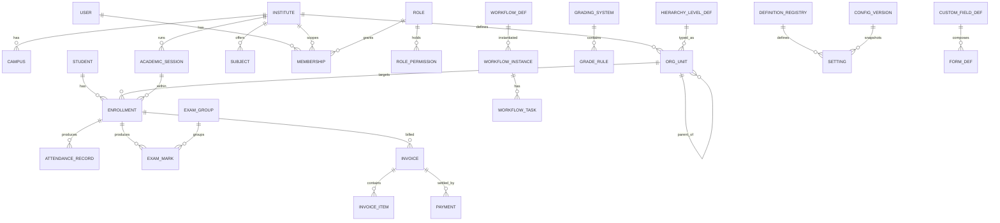

### 24. Table Design

Tables fall into four families, each with its own conventions. **Reference/structural tables** (institute, campus, session, org_unit, subject, role) change rarely and are heavily read — they are cached and indexed for lookup. **Transactional tables** (enrollment, attendance_record, exam_mark, invoice, payment, payroll) are high-volume, append-heavy, and the targets of partitioning and careful indexing. **Configuration tables** (definition_registry, setting, custom_field_def, form_def, config_version) are the dynamic layer (Section 33), mixing relational structure with JSONB values. **Audit/history tables** (audit_log, config history) are append-only and immutable. Every table carries the standard columns from the entity strategy: UUIDv7 id, the relevant scoping columns (institute_id always where applicable; campus_id and session_id where relevant), created_at/updated_at/created_by/updated_by, deleted_at, and a version column for optimistic locking. Money is stored as integer minor units with an explicit currency, never as floating point. Enumerations that are truly fixed are constrained at the database level; enumerations that clients can extend live in configuration, not as database enums (so they can change without a migration).

### 25. Relationships

Foreign keys enforce referential integrity everywhere within a context's own tables. Across context boundaries, references are by identifier with a foreign key only where the referenced table is owned by a context the referrer legitimately depends on per the tier graph (for example, enrollment references org_unit and session, which are upstream of it); the application still mediates cross-context writes through events, but the database FK protects integrity for these legitimate downward references. Delete behavior is **restrict plus soft-delete**, never cascading hard delete: you cannot hard-delete a row that others reference, and academic and financial records are soft-deleted rather than removed, preserving history and audit. The few genuinely ephemeral tables (transient tokens, expired job records) may be hard-deleted by maintenance jobs.

### 26. Index Strategy

Indexing is designed around the actual hot queries, not added blindly. Every primary key and every foreign key used in joins is indexed. **Composite indexes** cover the dominant access patterns: attendance by (institute_id, session_id, date, org_unit_id) for daily class views; exam marks by (exam_group_id, student_id) for result generation; invoices by (institute_id, status, due_date) for due reports; audit by (entity_type, entity_id, created_at). **Partial indexes** exclude soft-deleted rows (indexing only where deleted_at is null), which keeps the common "active records" queries fast and the indexes small. **Unique constraints** that must coexist with soft delete are implemented as partial unique indexes scoped to non-deleted rows (so a campus code freed by soft delete can be reused) and scoped to the right boundary (unique per institute, not globally). **GIN indexes** support JSONB querying where dynamic fields are filtered (Section 34). Indexes are created in migrations, reviewed for write-amplification cost, and monitored for usage so unused indexes are dropped.

### 27. Partitioning Strategy

> **Decision D16 — Range-partition the high-volume time-series tables; keep the rest unpartitioned.**
> **Recommendation:** Partition attendance_record, exam_mark, audit_log, and notification tables by time range (typically by academic session, or by month for audit/notifications); leave reference and lower-volume tables unpartitioned.
> **Why:** At the largest client (30,000 students), attendance and marks accumulate into tens of millions of rows per year; partitioning keeps queries and index maintenance fast by pruning to the relevant period, and makes archival a cheap partition-detach rather than a mass delete. Partitioning everything would add complexity with no benefit for small tables.
> **Pros:** Query pruning keeps hot-period queries fast; index maintenance is per-partition; archival/retention becomes detach-and-move, not expensive deletes; old data can live on cheaper storage.
> **Cons:** Partitioned tables have constraints (the partition key must be in primary/unique keys); more moving parts; cross-partition queries need care.
> **Alternatives:** (a) No partitioning — simplest, but the large client's tables degrade and archival means costly bulk deletes. (b) Partition everything — needless complexity on small tables.
> **Final Decision:** Range partition the four high-volume families, aligned to session for academic data and to month for audit/notifications; revisit candidates as data grows.

### 28. Soft Delete Strategy

Soft delete is universal for academic, financial, and configuration data and is implemented with a deleted_at timestamp plus a global query filter so that ordinary queries see only live rows automatically. Three pitfalls are handled explicitly: **uniqueness** (partial unique indexes scoped to non-deleted rows, so codes/identifiers free up on deletion), **referential integrity** (restrict-on-delete prevents soft-deleting a row still referenced by live rows, or the application reassigns/cascades the soft-delete deliberately), and **query leakage** (the global filter is applied at the repository layer, with an explicit, audited "include deleted" path for admin/recovery use only). Soft-deleted records remain available for history, audit, and the controlled recovery window before archival or, where retention policy permits, eventual purge.

### 29. Audit Trail Strategy

> **Decision D17 — Event-sourced, append-only audit trail fed by the outbox, separate from configuration version history.**
> **Recommendation:** Maintain an immutable, append-only audit_log written from domain events via the outbox, capturing actor, action, entity type and id, before/after snapshots (JSONB), correlation id, scope, ip, and timestamp; keep it distinct from the Configuration context's version history used for rollback.
> **Why:** Compliance (Cluster 7) requires a tamper-evident record of who changed what and when; sourcing it from the same outbox that drives integration guarantees the audit reflects exactly what happened and cannot be silently bypassed. Configuration rollback is a different concern (restoring a prior config version) and is modeled separately so the two do not entangle.
> **Pros:** Tamper-evident and complete; never bypassed because it rides the outbox; supports compliance export; partitioned for scale; decoupled from request code.
> **Cons:** Storage growth (managed by partitioning and archival); before/after snapshots add write volume; not a substitute for config rollback (intentionally separate).
> **Alternatives:** (a) Trigger-based audit in the database — captures raw changes but loses business context (actor intent, correlation) and is harder to reason about. (b) Interceptor-only audit — convenient but bypassable and misses non-HTTP changes.
> **Final Decision:** Outbox-fed append-only audit_log in a dedicated schema, partitioned by month, immutable (no updates/deletes except retention-driven archival), with configuration version history kept as a separate rollback mechanism in the Configuration context.

### 30. Archival Strategy

Archival keeps the operational database lean while honoring retention and history requirements. Closed academic sessions' high-volume data (attendance, marks) and old audit/notification partitions are, after a defined operational window, detached and moved to the archive schema (and optionally to cheaper object storage as compressed exports), remaining queryable for reports and compliance but out of the hot path. Retention is **configurable per client** (Cluster 7): each client sets how long categories of data are retained operationally, how long archived, and when (if ever) data is purged — with mandatory export-before-purge so nothing is destroyed without a recoverable copy. Right-to-erasure requests are handled through this same machinery, locating and removing or anonymizing a subject's data across operational and archived stores while preserving the integrity of aggregate records. Archival runs as scheduled background jobs with progress and audit.

### 31. Migration Strategy

> **Decision D18 — Explicit, versioned TypeORM migrations using expand-contract, rolled out fleet-wide by the Control Plane in health-gated waves; synchronize is never used in any environment.**
> **Recommendation:** All schema change is via reviewed, versioned migrations applied with the expand-contract (backward-compatible) pattern; the Control Plane's Fleet Operations context orchestrates applying them across all client databases in waves with health gates and rollback.
> **Why:** TypeORM's auto-synchronize is dangerous and forbidden in production; across 200+ isolated databases, migrations must be applied uniformly, safely, and observably, which is exactly a Control Plane responsibility. Expand-contract (add new structures, migrate, switch reads/writes, then remove old) enables zero-downtime changes.
> **Pros:** Reproducible, reviewable schema history; safe zero-downtime changes; uniform fleet rollout with the ability to halt on failure; per-database success tracking.
> **Cons:** Expand-contract is multi-step and requires discipline; fleet rollout tooling is real work (justified by the deployment count); some migrations span releases.
> **Alternatives:** (a) synchronize/auto-migrate — convenient and catastrophic; rejected outright. (b) Manual per-client migration — unmanageable beyond a handful of clients.
> **Final Decision:** Versioned migrations, expand-contract, fleet-orchestrated with health gates and rollback. Definition/seed data (institution types, default templates, base grading scales) ships as idempotent seed migrations so new deployments start with the standard catalog, which clients then extend.


---

## B-6. TypeORM & Dynamic Configuration (Sections 32–34)

### 32. TypeORM Best Practices

TypeORM is the locked ORM, and used disciplined it serves the structured relational core well; used naively it produces slow queries and leaky abstractions. The standards are: **migrations only, never synchronize**, in every environment. **Repositories over active record** — entities are persistence shapes, not self-saving objects (per Decision D11). **Query builder for complex and hot-path reads**, with explicit column selection to avoid over-fetching and explicit joins to avoid N+1; entity-manager find methods are fine for simple lookups. **No lazy relations** — they hide N+1 queries; relations are loaded explicitly when needed. **Transactions at the use-case boundary** via an injected transaction manager, with the outbox write inside the same transaction. **Optimistic locking** via the version column for entities subject to concurrent edits (marks, invoices, configuration). **Controlled cascades** — automatic cascade persist/remove is avoided except within a single aggregate; cross-aggregate changes go through their own use cases. **Indexes defined in migrations**, not only via entity decorators, so the team controls exactly what exists in the database. **Connection pooling** sized to the deployment and fronted by PgBouncer. These practices keep TypeORM in its lane: a competent mapper for the structured core, not a magic layer.

### 33. Dynamic Configuration Storage

This is the decision Part A promised — how the Level-B configurable behavior is stored without hard-coding and without descending into an unqueryable mess.

> **Decision D8-bis (the core data decision) — Hybrid storage: relational definitions + relational values with JSONB payloads, never a generic EAV table.**
> **Recommendation:** Store the configuration *definitions* (institution types, templates, custom-field definitions, form definitions, grading/fee templates) as strongly-typed relational tables; store configuration *values* in a settings table whose payload is JSONB and whose scope is expressed by relational columns (institute_id, campus_id, session_id, etc.); store entity *custom-field values* as a JSONB column on the owning entity, validated against the field definitions. Do not implement a generic entity-attribute-value (EAV) table.
> **Why:** The dynamic layer has two natures. Definitions are structured, finite, and queried by the engine — they belong in real tables with real columns and constraints. Values are sparse, variable per client, and schemaless by nature — JSONB stores them flexibly while remaining queryable via GIN indexes. EAV (one row per attribute) is the classic trap: it is flexible but produces unreadable queries, no integrity, and terrible performance at scale. JSONB gives the flexibility of EAV with far better queryability and atomicity, and the definitions provide the integrity EAV lacks because validation is enforced at the application layer from the definition.
> **Pros:** Definitions get integrity, constraints, and clarity; values get flexibility and per-client variation; JSONB is queryable and indexable (unlike EAV); custom-field values live with their entity (one row, atomic) rather than scattered; the same definitions drive both form rendering and validation, so they never drift.
> **Cons:** JSONB is less strictly typed than columns (mitigated by definition-driven validation); deeply nested or heavily-filtered JSONB needs careful GIN indexing; some queries on dynamic fields are slower than on real columns (mitigated by the promote-to-column rule in Section 34).
> **Alternatives:** (a) Generic EAV — maximal flexibility, but the well-known performance and integrity disaster at scale; rejected. (b) A separate table per custom field — integrity but a schema change per client field, defeating the no-code goal. (c) Everything in JSONB including definitions — loses the integrity and queryability that definitions need.
> **Final Decision:** The hybrid as recommended. Definitions relational and strongly typed; values and custom-field data in JSONB scoped by relational columns; EAV explicitly forbidden. Configuration **versioning** is a config_version table that snapshots the effective configuration so rollback restores a prior version; configuration **audit** rides the same append-only audit trail; **rollback** re-points the active version. The engine resolves effective values by the most-specific-scope-wins rule from Part A and caches the result in Redis, invalidated by configuration-change events.

The storage shape, conceptually:

| Concern | Storage | Why |
|---|---|---|
| Institution types, templates | Relational tables | Structured, finite, integrity-bearing |
| Custom-field definitions | Relational tables | Define type/rules the validator enforces |
| Form definitions | Relational tables (+ JSONB layout) | Structure relational; flexible layout in JSONB |
| Setting values (scoped) | Settings table: relational scope columns + JSONB value | Flexible value, queryable scope |
| Entity custom-field values | JSONB column on the owning entity | Atomic with the row, sparse, per-client |
| Config versions (rollback) | config_version snapshots | Restore a prior effective configuration |
| Config changes (audit) | Append-only audit trail | Tamper-evident history |

### 34. JSONB Usage Strategy

JSONB is powerful and, used indiscriminately, becomes a way to avoid designing a schema — so its use is governed by explicit rules. **Use JSONB for:** entity custom-field values, dynamic form submissions, setting values, flexible metadata, domain-event payloads, and audit before/after snapshots — all cases that are genuinely sparse, variable, or schemaless. **Do not use JSONB for:** core relational entities, anything requiring foreign-key integrity, financial amounts (always typed columns), or fields that are frequently filtered, joined, or aggregated in their own right. The governing **promote-to-column rule**: when a custom or JSONB-held field becomes frequently queried, filtered, or reported on, it is promoted to a real typed column with its own index — JSONB is for the long tail of variable fields, not for data that has earned first-class status. JSONB fields that *are* queried get **GIN indexes** (with jsonb_path_ops where containment queries dominate, for smaller, faster indexes). Payload **size is bounded** (large blobs go to object storage, not JSONB). And every JSONB write that represents client data is **validated against its definition** before storage, so "schemaless" never means "unvalidated." This keeps JSONB an asset for genuine flexibility rather than a dumping ground that erodes data quality.

---

## Part B — Closing Note and What Comes Next

Part B has defined how the Application Plane is built: a NestJS modular monolith with four named roots and a consistent four-layer module shape; a calibrated domain/persistence separation (full in Core, pragmatic in Generic); explicit DTOs, port-and-adapter repositories, and a precise three-way service vocabulary; an ordered, security-first request pipeline of middleware, guards, interceptors, and a single error filter; reliable event-driven integration via a transactional outbox feeding in-process handlers and BullMQ; Redis for caching, sessions, rate limiting, locks, and queues; and a PostgreSQL data architecture sized for the largest client — one database per deployment, UUIDv7 keys, partitioned time-series tables, partial-indexed soft deletes, an outbox-fed immutable audit trail, configurable archival and retention, and fleet-orchestrated expand-contract migrations. Most importantly, it resolved the central data question: a hybrid configuration store — relational definitions plus JSONB values, never EAV — that makes the Level-B configurability real, queryable, versioned, and validated.

The decisions here directly enable later parts: the request pipeline's guards realize the authentication and authorization designs of Part C; the read-replica and partitioning choices feed the performance and scalability designs of Part E; the outbox and audit trail underpin the security and compliance designs of Part E; and the migration/fleet orchestration connects to the DevOps design of Part E and the Control Plane introduced in Part A.

**Awaiting your approval to proceed to the next part.** Per your instruction, I have generated Part B only and will not continue until you direct me. When ready, tell me which part to produce next (your original plan groups Frontend/Auth/Access as Part C, cross-cutting services as Part D, non-functional as Part E, and execution/critique as Part F).

*End of Part B.*


<div style="page-break-before: always;"></div>

---

# ═══ PART C ═══

# Enterprise Education ERP — Architecture Blueprint
## Part C — Frontend, Authentication & Access Architecture

**Scope:** The Next.js (App Router) frontend — its application structure, multi-portal routing, dashboard and layout strategy, state and data layer, the authentication and authorization flows, the permission and component systems, and the cross-cutting concerns of white-labeling, theming, internationalization, and mobile-readiness.
**Status:** Part C of the blueprint. Builds on Part A (two-plane, per-client deployment, Identity as Open Host) and Part B (the backend API, RBAC, configuration engine, dynamic validation).
**Constraint:** No source code. Route trees, folder trees, diagrams, and conceptual examples only.
**Decision format:** Significant decisions as Recommendation → Why → Pros → Cons → Alternatives → Final Decision. Numbering continues from Part B (D19 onward).

---

## C-1. Next.js Application Architecture (Sections 1–3, 5, 17)

### 1. Complete Next.js Architecture

The frontend is a single Next.js (App Router) application that serves all six portals — Super Admin, Institute Admin, Teacher, Student, Parent, and Accountant — from one codebase and one build artifact. Like the backend, it follows the "one artifact, configuration-driven" rule: a single build is deployed per client deployment and loads that client's branding, terminology, locale defaults, and feature entitlements at runtime, so branding or terminology changes never require a rebuild (Cluster 5). The application separates two concerns that are commonly and harmfully merged: **routing/composition** (the `app/` directory — thin route files that compose features and own layouts, guards, and navigation) and **features** (a `src/features/` directory — the actual domain UI, hooks, data slices, and types). Route files stay thin and declarative; features are self-contained and portable.

> **Decision D19 — One unified Next.js app with portal-segmented routing, not separate apps per portal.**
> **Recommendation:** Serve all portals from a single Next.js application using App Router route groups per portal, with a post-login redirect that routes each user to their portal by role.
> **Why:** The portals share the same design system, auth, API client, theme engine, and i18n; splitting them into six apps would duplicate all of that six times and complicate deployment across 200+ client deployments. A unified app with strong internal boundaries gives portal separation without the duplication.
> **Pros:** One design system, one auth/data/theme/i18n stack, one build and deploy per client; shared components reused across portals; consistent UX; simpler fleet operations.
> **Cons:** A single large app must be carefully code-split so a parent never downloads admin code; portal boundaries are enforced by convention and routing, not by separate deployables.
> **Alternatives:** (a) Separate app per portal — clean isolation, but six times the infrastructure and shared-code duplication. (b) Micro-frontends — maximum isolation, heavy complexity unjustified for one team and a shared design system.
> **Final Decision:** Unified app, portal route groups, aggressive per-route code-splitting so each portal ships only its own code.

### 2. App Router Structure

The App Router is organized with route groups: a public group for unauthenticated pages, and an authenticated portal group whose layout establishes the auth guard, the application chrome, and the providers (store, theme, i18n, permissions). Each portal is its own segment under the authenticated group, with its own nested layout and navigation, while sharing the design system and data layer.

```
app/
├── layout.tsx                       # root: Store, Theme, I18n, Permission providers; loads per-client bootstrap config
├── not-found.tsx
├── error.tsx                        # root error boundary
│
├── (public)/                        # unauthenticated
│   ├── layout.tsx                   # minimal chrome, branding from runtime config
│   ├── login/
│   ├── forgot-password/
│   └── set-password/
│
├── (portal)/                        # authenticated shell
│   ├── layout.tsx                   # AUTH GUARD + chrome (sidebar/topbar) + scope (institute/campus) selector
│   ├── page.tsx                     # role-aware landing -> redirects to the user's portal
│   │
│   ├── super-admin/                 # one segment per portal
│   │   ├── layout.tsx               # portal nav + portal-level permission gate
│   │   ├── dashboard/
│   │   ├── organizations/           # institutes, campuses, sessions
│   │   ├── configuration/           # definitions, templates, terminology
│   │   └── ...
│   ├── institute-admin/
│   ├── teacher/
│   ├── student/
│   ├── parent/
│   └── accountant/
│
└── api/                             # thin BFF route handlers (token refresh proxy, config bootstrap)
```

> **Decision D20 — Public pages use Server Components; the authenticated portal is client-rendered with RTK Query, using App Router for layout, routing, and code-splitting.**
> **Recommendation:** Render public/marketing/login pages as Server Components (SSR, cacheable, fast first paint). Render the authenticated ERP behind the portal layout primarily as Client Components, fetching data through RTK Query, while still using App Router for nested layouts, route-level code-splitting, and streaming the shell.
> **Why:** App Router's default Server Components shine for public, cacheable, SEO-relevant content — exactly the login and marketing pages. But the authenticated ERP is the opposite case: every screen is per-user, permission-filtered, frequently mutated, and behind auth, so it benefits little from RSC's static/edge caching and benefits greatly from a rich client cache with optimistic updates and invalidation — which is RTK Query's strength and is your locked choice. Forcing RSC data-fetching onto permissioned, interactive dashboards would fight both the data's nature and the locked stack.
> **Pros:** Fast, cacheable public surface; rich, responsive, cache-coherent authenticated experience; App Router still provides nested layouts, code-splitting, and streaming for the shell; honors the locked RTK Query choice.
> **Cons:** Two rendering modes in one app (clear boundary: public = server, portal = client); the authenticated bundle is larger (mitigated by per-route splitting); gives up some RSC data-fetching ergonomics inside the portal.
> **Alternatives:** (a) Full RSC data fetching everywhere — fights the per-user permissioned reality and sidelines RTK Query. (b) Pure SPA with no App Router — loses nested layouts, streaming, and code-splitting. (c) Server Actions for mutations — viable later, but bypasses the unified RTK Query cache and the typed API client; deferred.
> **Final Decision:** Hybrid as recommended — server-rendered public shell, client-rendered RTK Query portal, App Router throughout for structure.

### 3. Folder Structure

```
src/
├── app/                             # (above) routing & composition only
│
├── features/                        # feature-sliced domain UI
│   ├── enrollment/
│   │   ├── components/              # feature components
│   │   ├── hooks/                   # feature hooks
│   │   ├── api/                     # RTK Query endpoints for this feature
│   │   ├── types/
│   │   └── index.ts                 # public surface of the feature
│   ├── attendance/
│   ├── assessment/
│   ├── finance/
│   ├── configuration/
│   ├── workflow/
│   └── ...                          # one slice per domain area
│
├── shared/                          # cross-feature reusable building blocks
│   ├── ui/                          # design-system components (Button, Table, Modal, Field...)
│   ├── forms/                       # form engine + dynamic form renderer
│   ├── tables/                      # table engine
│   ├── layout/                      # app chrome: Sidebar, Topbar, ScopeSwitcher
│   ├── permission/                  # permission provider + can() hook + <Can> gate
│   ├── theme/                       # theme engine, CSS-variable provider
│   ├── i18n/                        # message catalogs + label resolver (i18n + terminology)
│   └── utils/
│
├── lib/                             # framework-level setup
│   ├── store/                       # Redux Toolkit store + RTK Query base API
│   ├── api/                         # base query, auth interceptor, error normalization
│   ├── auth/                        # token handling, silent refresh, session
│   └── config/                      # runtime client-config bootstrap loader
│
└── middleware.ts                    # edge auth gate for protected routes
```

### 5. Layout Strategy

Layouts are nested to match the routing: a **root layout** mounts the global providers (Redux store, theme, i18n, permissions) and loads the per-client bootstrap configuration before rendering, so branding and terminology are correct from first paint. The **portal (authenticated) layout** enforces the auth guard, renders the application chrome (sidebar, topbar, and the institute/campus scope switcher — essential because one deployment holds multiple institutes), and establishes the scope context every feature reads. Each **portal-specific layout** renders that portal's navigation and applies a portal-level permission gate (a parent cannot reach an admin route even by typing the URL). This nesting means cross-cutting chrome and guards are declared once at the right level and inherited, while each portal customizes only its navigation.

### 17. Feature-Based Folder Structure

> **Decision D21 — Feature-sliced architecture: features own their components, hooks, API slices, and types; routing only composes them.**
> **Recommendation:** Organize all domain UI under `src/features/<feature>`, each slice exposing a small public surface; keep `app/` route files thin, importing from features. Cross-feature reusable primitives live in `src/shared`.
> **Why:** Organizing by technical type (all components together, all hooks together) scatters a feature across the codebase and makes change risky; organizing by feature keeps everything for a domain area together, mirrors the backend's bounded contexts, and lets the team reason about and code-split per feature.
> **Pros:** High cohesion; change is localized; features map to backend contexts and to portals' needs; natural code-splitting boundaries; new engineers find everything for a feature in one place.
> **Cons:** Requires judgment about what is feature-specific vs shared; risk of duplicated primitives if `shared` is under-used (managed by review).
> **Alternatives:** (a) Type-first folders — familiar but scatters features. (b) Everything in `app/` — couples domain UI to routing and defeats reuse.
> **Final Decision:** Feature-sliced with a thin `app/` and a curated `shared/`, mirroring the backend's modular boundaries for conceptual symmetry across the stack.

---

## C-2 will continue with dashboard, portals, routing, authorization, and permissions; C-3 with state and data; C-4 with authentication; C-5 with the UI system; C-6 with white-labeling, theming, i18n, and mobile.

---

## C-2. Portals, Dashboard, Routing, Authorization & Permissions (Sections 4, 22, 20, 10, 11)

### 22. Multi-Portal Strategy

The six portals share one application but present six distinct experiences, differentiated by navigation, default landing, available features, and data scope — all driven by the authenticated user's role and permissions rather than by separate code. After login, a role-aware landing route redirects the user into their portal: a teacher to the teacher portal, a parent to the parent portal, and so on. A user who legitimately holds more than one role (e.g., a teacher who is also a parent) is offered a portal switch. Each portal's surface is further filtered by permissions, so two institute admins with different permission sets see different menus within the same portal. The portal a user lands in is UX; the real protection is the permission system (Section 11) enforced both in routing and, authoritatively, by the backend.

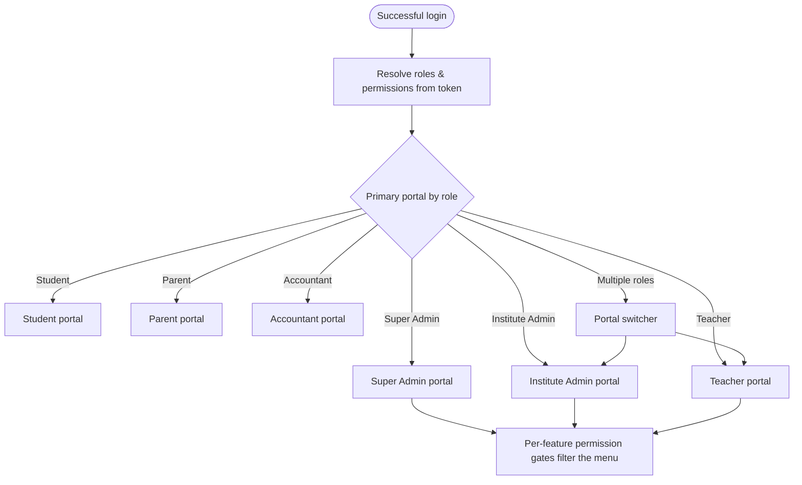

### 4. Dashboard Architecture

Each portal's dashboard is composed of permission-gated widgets rather than a fixed page. A widget declares the permission it requires and the data it needs; the dashboard renders only the widgets the user may see, so the same dashboard route yields different content per user without branching code. Widgets fetch their own data through RTK Query (each widget is independently cacheable and refetchable), show their own loading and empty states, and fail in isolation (one widget erroring does not blank the dashboard, by widget-level error boundaries). Heavy or cross-cutting widgets (institution-wide analytics) are lazy-loaded and may be deferred so the dashboard shell paints immediately and fills in progressively. This widget-and-gate model means new dashboard capabilities are added by registering a widget with its permission, not by editing a monolithic dashboard page.

### 20. Route Protection

Route protection is layered, defense-in-depth, with the authoritative check always on the backend. At the **edge**, Next.js middleware checks for a valid authentication cookie on protected routes and redirects unauthenticated requests to login before any portal code loads. At the **portal layout**, a client guard confirms the user's role permits this portal and redirects otherwise. At the **feature/route level**, a permission gate hides or blocks routes and actions the user's permissions do not allow. None of these client checks are trusted for security — they are UX, preventing users from reaching screens they cannot use; every data request they trigger is independently authorized by the backend's guards (Part B). This separation is stated explicitly so no engineer mistakes client-side gating for enforcement.

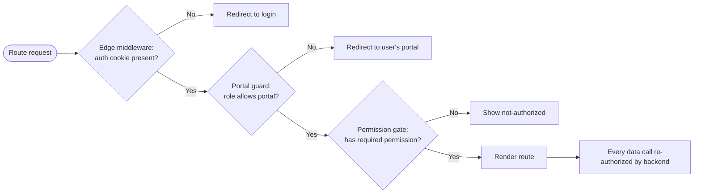

### 10. Authorization Flow (Frontend)

The frontend authorization flow mirrors the backend RBAC but only for presentation. On authentication the client receives the user's effective permission set and roles (carried in the access token and/or fetched once and cached). A central permission provider exposes a simple capability check used everywhere: routes, menus, buttons, and fields ask "may the current user do X here?" and render accordingly. Scope is part of the question — permissions are evaluated in the context of the currently selected institute/campus, so the same user may have different capabilities in different institutes within the deployment. When the user switches scope, the permission context updates and the UI re-renders to match. Because permissions can change (role edits), the cached set is invalidated on the relevant events and on token refresh.

### 11. Permission Architecture (Frontend)

> **Decision D22 — Centralized, declarative permission gating mirroring backend permission strings; client gating is UX-only.**
> **Recommendation:** A single permission provider supplies a `can(permission, scope)` capability and a declarative gate component/hook used to wrap routes, menu items, actions, and fields. Permission strings are identical to the backend's (module.resource.action), so the two stay in lockstep.
> **Why:** Scattering ad-hoc role checks (`if role === 'admin'`) through the UI is unmaintainable and drifts from the backend; a single declarative mechanism keyed on the same permission strings keeps the UI consistent and easy to audit, while making it unmistakable that the backend is the real enforcer.
> **Pros:** One place to reason about access; UI and API share a permission vocabulary; menus/buttons/fields gate uniformly; easy to audit; scope-aware.
> **Cons:** The permission set must be loaded and kept fresh; a large permission set adds token/payload size (managed by compact encoding and caching).
> **Alternatives:** (a) Role-based `if` checks inline — fast to write, unmaintainable, drifts from backend. (b) Server-driven UI (backend returns the menu) — strong consistency, but heavier coupling and chattier; reserved as a future option for the most dynamic menus.
> **Final Decision:** Centralized declarative permission gating on shared permission strings, scope-aware, explicitly UX-only with backend as the authority.


---

## C-3. State & Data Layer (Sections 6, 7, 8, 19)

### 6. State Management Strategy

The architecture distinguishes three kinds of state and assigns each the right tool, avoiding the common mistake of putting everything in one global store. **Server state** — data that lives on the backend (students, invoices, results) — is owned by RTK Query, which handles fetching, caching, invalidation, and refetching; it is the large majority of state in an ERP. **Global client state** — a small amount of cross-cutting UI state (the selected institute/campus scope, theme, language, the authenticated session summary) — lives in a few Redux Toolkit slices. **Local component state** — ephemeral UI state (form field focus, a modal's open flag, a dropdown's expansion) — stays in the component with React state and never goes near the global store. The rule: data from the server is RTK Query; truly global UI concerns are Redux slices; everything else is local. This keeps the global store small and the data layer coherent.

### 7. RTK Query Architecture

> **Decision D23 — RTK Query as the single server-state layer, organized as one base API with per-feature endpoint injection and tag-based invalidation.**
> **Recommendation:** Define one base API (shared base query with auth, error normalization, and scope headers) and inject endpoints per feature slice; use a disciplined cache-tag taxonomy so mutations invalidate exactly the right queries.
> **Why:** A single base API centralizes auth token attachment, the institute/campus scope header, error normalization, and refresh handling, while per-feature endpoint injection keeps each feature's data access inside its slice (consistent with the feature-sliced structure). Tag-based invalidation gives precise, automatic cache coherence — a successful enrollment invalidates the student list and the dashboard counts without manual refetch wiring.
> **Pros:** One place for cross-cutting request concerns; features own their endpoints; automatic, precise cache invalidation; optimistic updates and request deduplication out of the box; less boilerplate than hand-rolled fetching.
> **Cons:** Tag taxonomy must be designed deliberately or invalidation becomes too broad (refetch storms) or too narrow (stale UI); a learning curve for the team.
> **Alternatives:** (a) React Query — excellent, but Redux Toolkit is already in the stack and RTK Query is your locked choice; using both would duplicate the data layer. (b) Manual fetch + slices — maximal control, maximal boilerplate and bug surface.
> **Final Decision:** RTK Query, one base API, per-feature injected endpoints, a documented cache-tag taxonomy (per-entity and per-list tags, scope-qualified) so invalidation is precise. Peak-event screens (result publishing) use polling or manual invalidation deliberately rather than aggressive auto-refetch.

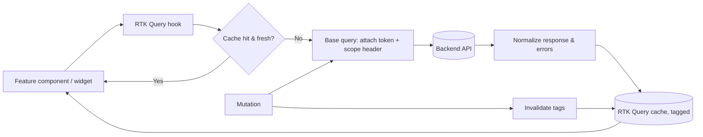

### 8. API Layer Design

The API layer is the single boundary between the frontend and the backend. A base query wraps every request to attach the access token, set the active institute/campus scope header (so the backend scopes data correctly), normalize errors into the consistent envelope the backend already returns (Part B), and trigger the silent-refresh flow on a 401 (Section 9). Feature endpoints are typed against shared DTO contracts so the client and server agree on shapes; where the backend exposes the dynamic layer (custom fields, dynamic forms), the typed contract covers the fixed fields and a typed dynamic map covers configurable ones, validated by the same definitions the backend uses. This single, typed, interceptor-equipped API layer means cross-cutting request concerns are handled once, and no feature talks to the network directly.

### 19. Caching Strategy (Frontend)

Frontend caching operates at several levels with clear ownership. **RTK Query cache** is the primary layer for server data, with tag-based invalidation and configurable staleness per endpoint (reference data like the academic structure is cached long and rarely refetched; volatile data like live attendance is short-lived). **Runtime client config** (branding, terminology, feature entitlements) is fetched once at bootstrap and cached for the session, refreshed on explicit change. **The permission set** is cached and invalidated on role change and token refresh. **Static assets** are cached by the browser and CDN with content-hashing (Part E). The strategy deliberately avoids over-caching mutable, permission-sensitive data: anything that affects what a user may see or owe is invalidated on the events that change it, never left to time-based expiry alone. RTK Query's request deduplication also prevents the dashboard's many widgets from issuing duplicate calls for the same data.

---

## C-4. Authentication Flow (Section 9)

### 9. Authentication Flow

> **Decision D24 — Access token in memory, refresh token in an httpOnly secure cookie, with silent refresh; never store tokens in localStorage.**
> **Recommendation:** Keep the short-lived access token in memory (and attach it to API calls), keep the long-lived refresh token in an httpOnly, secure, SameSite cookie the JavaScript cannot read, and refresh access tokens silently via a backend refresh endpoint. A thin BFF route handler can proxy refresh so the cookie stays first-party.
> **Why:** localStorage tokens are readable by any injected script, making them the primary prize in an XSS attack; an httpOnly cookie for the refresh token removes it from JavaScript's reach, and keeping the access token only in memory limits its exposure window. This is the standard secure-by-default posture for SPA-style authenticated apps.
> **Pros:** Refresh token not exposed to XSS; access token short-lived and memory-only; real logout and device revocation possible (backend denylist from Part B); silent refresh keeps sessions seamless.
> **Cons:** In-memory access token is lost on full page reload (re-acquired by an immediate silent refresh on load); cookie handling requires correct SameSite/secure config and CSRF defense for cookie-based calls (Part E covers CSRF).
> **Alternatives:** (a) Both tokens in localStorage — simplest, but maximally XSS-exposed; rejected. (b) Both in cookies — viable but makes attaching the access token to API calls and cross-portal logic clumsier; the hybrid is cleaner.
> **Final Decision:** Memory access token + httpOnly refresh cookie + silent refresh, with device/session management surfaced in a security settings screen (list devices, revoke). MFA, when enabled per client (Cluster 6), inserts a verification step into the flow below.

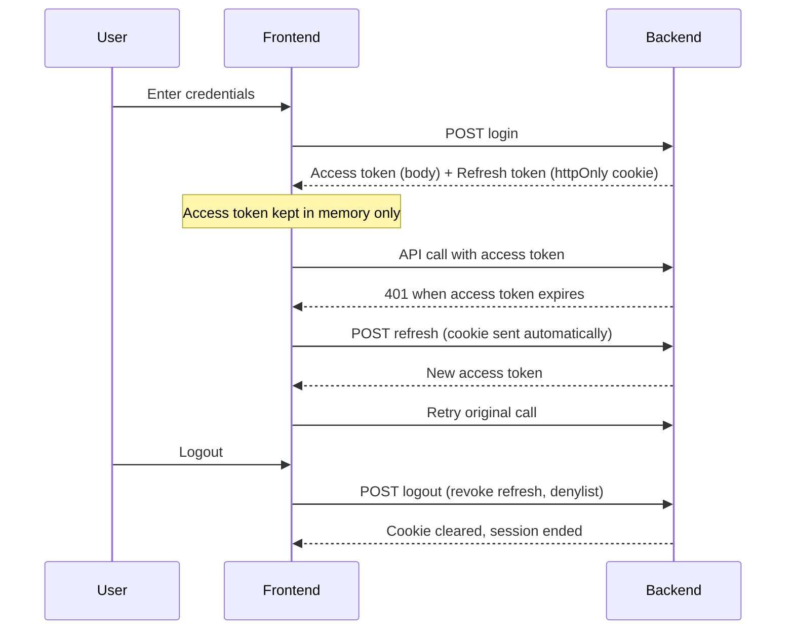

On application load, the frontend immediately attempts a silent refresh: if the refresh cookie is valid, it obtains a fresh access token and restores the session without a visible login; if not, it routes to login. When a client enables MFA, login returns a challenge that the user satisfies (TOTP) before tokens are issued; the architecture is built so SSO/SAML federation (Cluster 6 future) slots in as an alternative credential step without disturbing the token model.


---

## C-5. UI System (Sections 12, 13, 14, 15, 16)

### 13. Design System Architecture

The design system is the foundation the entire UI is built on, and it is **token-driven** so that white-labeling works at runtime. Design decisions — colors, spacing, typography, radii, shadows — are expressed as design tokens implemented as CSS custom properties on the root, not hard-coded into components. Components consume tokens (a button references the primary-color token, never a literal hex), which is precisely what lets a client's brand color flow through the whole interface by changing token values at runtime (Section 23). Above the tokens sits a library of primitive components (Button, Input, Select, Field, Card, Table, Modal, Toast, Badge) in `shared/ui`, built on Tailwind configured to read the token variables, with consistent variants, sizes, and states. Feature components compose these primitives; they never reinvent base elements. This two-tier system (tokens → primitives → feature components) gives visual consistency, runtime themeability, and a single place to evolve the look.

### 12. Component Architecture

Components are layered by responsibility. **Primitives** (`shared/ui`) are stateless, presentational, design-system building blocks with no domain knowledge. **Composite/shared components** (tables, the form engine, modals, the layout chrome) combine primitives into reusable patterns, still domain-agnostic. **Feature components** (`features/<feature>/components`) hold domain UI and may use feature hooks and RTK Query, but delegate all presentation to primitives and composites. **Route components** (`app/`) are thin and compose feature components. The dependency direction is strict and downward — features use shared, shared uses primitives, primitives use tokens — never the reverse, mirroring the backend's dependency discipline. Container/presentational separation is applied where it adds value (data-bound containers vs pure presentational children) so that presentational components stay easily testable and reusable.

### 14. Table Architecture

> **Decision D25 — A single configurable, headless-driven table engine; feature tables are configuration, not bespoke code.**
> **Recommendation:** Build one table engine in `shared/tables` that handles column definition, server-side pagination/sorting/filtering, row selection, density, and column visibility; feature tables supply a column configuration and a query hook rather than re-implementing a table.
> **Why:** An ERP has dozens of data grids (students, staff, invoices, results, audit). Re-implementing each is slow and inconsistent; a single engine driven by configuration gives uniform behavior (pagination, sorting, export, empty/loading/error states), accessibility, and one place to optimize. Server-side operations are essential because the largest client's tables have tens of thousands of rows that must never be loaded client-side.
> **Pros:** Consistent behavior and accessibility everywhere; server-side paging/sort/filter scales to large datasets; one place to add features (export, column chooser, saved views); feature tables are quick to build.
> **Cons:** The engine must be general enough without becoming a sprawling configuration language; very unusual grids may need escape hatches.
> **Alternatives:** (a) Bespoke tables per feature — inconsistent, slow, unscalable. (b) A heavy third-party data-grid — capable but opinionated, heavy, and harder to theme to the design tokens.
> **Final Decision:** One headless-logic-driven table engine with server-side operations, themed via design tokens, configured per feature by columns + a query hook. Custom/dynamic columns (from configurable custom fields) are supported via the same column-definition mechanism.

### 15. Form Architecture

> **Decision D26 — A unified form engine with a definition-driven dynamic renderer mirroring the backend's two-tier validation.**
> **Recommendation:** One form engine in `shared/forms` handles static forms (typed fields, schema validation) and, critically, a dynamic renderer that builds forms at runtime from form/field definitions supplied by the Configuration context, validating against the same definitions the backend uses.
> **Why:** The product's configurability means admission forms, custom fields, and other inputs are defined per client as data; the frontend must render and validate those without code changes, and its validation must match the backend's exactly (the same definitions drive both), or users get inconsistent errors. A unified engine also keeps static forms consistent (labels, errors, layout, accessibility).
> **Pros:** Static and dynamic forms share one consistent system; dynamic forms render and validate from the same definitions as the backend, so rules never drift; one place for field types, error display, and accessibility; new field types added once.
> **Cons:** The dynamic renderer is a real component supporting the definition model's field types and rules; complex conditional form logic must be expressible in the definition.
> **Alternatives:** (a) Hand-built forms per screen — fast initially, but cannot serve client-defined fields and drifts from backend validation. (b) Two separate systems for static and dynamic — duplicated field types and inconsistent UX.
> **Final Decision:** One form engine; static forms use typed schemas; dynamic forms render from definitions and validate against them, returning the same error envelope shape as the backend. Form state, validation timing, and submission/error handling are standardized across both.

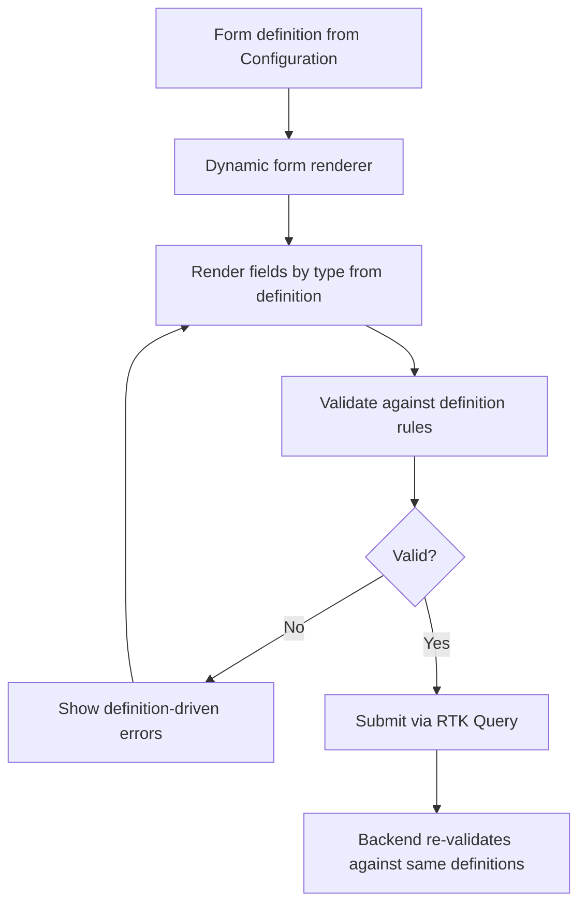

### 16. Modal Architecture

Modals are managed centrally rather than scattered as local flags, because uncontrolled modal state leads to stacking bugs, focus traps, and inconsistent behavior. A modal manager provides a declarative way to open, stack, and dismiss modals and drawers, with consistent overlay behavior, focus management, escape/click-away handling, and accessibility (focus trap, return focus on close, ARIA roles) handled once. Confirmation dialogs, form modals, and side drawers are all variants built on the same primitive, themed by design tokens. This centralization ensures that a confirmation before a destructive action, a quick-edit drawer, and a multi-step wizard all behave and look consistent, and that modal-heavy flows (bulk actions, approvals) do not produce focus or stacking defects.

---

## C-6. White-Labeling, Theming, i18n & Mobile (Sections 18, 21, 23, 24, 25)

### 18. Error Handling

Error handling is layered to match the rendering model. **Route-level error boundaries** (App Router `error.tsx` at root and per portal) catch render-time failures and show a recoverable error screen rather than a blank page. **Widget/feature-level boundaries** isolate failures so one broken widget never blanks a dashboard. **Data-layer errors** from RTK Query are normalized by the base query into the consistent envelope and surfaced as inline messages, toasts, or field errors as appropriate — a validation error maps to field highlights, an authorization error to a not-authorized state, a network error to a retry affordance. **Global concerns** (session expiry, lost connectivity) are handled centrally with appropriate recovery (silent refresh, reconnect prompts). Every user-facing error carries the correlation id from the backend so support can trace it. The principle: fail in the smallest scope possible, always offer a recovery path, and never expose raw technical detail.

### 21. White-Labeling Strategy

> **Decision D27 — Runtime white-labeling driven by per-client bootstrap configuration; no rebuild for branding or terminology.**
> **Recommendation:** On application load, fetch a per-client bootstrap configuration (brand colors, logo, favicon, app name, default locale, enabled features/portals, and terminology overrides) and apply it at runtime via design tokens and providers, so the same build serves any client's branding.
> **Why:** Cluster 5 requires that branding changes need no rebuild, and the per-client deployment model means each deployment serves exactly one client's brand. Driving branding from runtime configuration honors both, and reuses the same configuration philosophy as the backend.
> **Pros:** No rebuild or redeploy for branding/terminology changes; one artifact across all clients; branding consistent across all portals and generated views; aligns with the configuration-driven thesis.
> **Cons:** A brief bootstrap step before first meaningful paint (mitigated by caching the config and a branded loading state); branding assets must be served per client.
> **Alternatives:** (a) Build-time theming per client — produces N artifacts, contradicts the one-artifact rule and the no-rebuild requirement. (b) Subdomain-keyed runtime theming on a shared multi-tenant frontend — viable for shared SaaS, but unnecessary given per-client deployments.
> **Final Decision:** Runtime bootstrap configuration applied via design tokens and providers. Branding, terminology, locale defaults, and feature/portal entitlements all load at boot; changing them in the client's configuration is reflected on next load with no deployment.

### 23. Theme Engine Design

The theme engine is the mechanism that applies white-label branding and visual theming at runtime. It works by mapping the per-client brand configuration onto the design tokens (CSS custom properties) at the root, so every token-consuming component instantly reflects the client's palette, logo, and typography choices. It supports light/dark modes (each a token set) and per-client brand overrides layered on top. Because components reference tokens rather than literals, no component code changes when the brand changes — only token values do. The engine resolves tokens in a clear precedence: client brand overrides, then mode (light/dark), then system defaults, so a client's primary color wins where set and sensible defaults fill the rest. This is the visual counterpart to the backend's most-specific-wins configuration resolution.

### 24. Internationalization Design

> **Decision D28 — Two distinct layers: i18n for UI language (English/Bangla) and terminology mapping for per-client domain relabeling, resolved together by one label resolver.**
> **Recommendation:** Separate static UI translation (i18n message catalogs for English and Bangla, with bilingual data support) from per-client terminology overrides (Class → Grade), and resolve any displayed label through one resolver that checks terminology overrides first, then the i18n catalog.
> **Why:** These are genuinely different concerns. Language translation is about the same concept in another tongue; terminology mapping is about a client calling a concept by a different name in the same language. Conflating them would force terminology changes through translation files and break per-client customization. Bangladesh-first with bilingual needs makes both first-class.
> **Pros:** Clean separation of language vs client vocabulary; a teacher in Bangla sees translated UI and the client's chosen terms; bilingual data (names in English and Bangla) supported; future languages add a catalog without touching terminology.
> **Cons:** Two layers to resolve on every label (cheap, cached); content authors must know which layer a string belongs to.
> **Alternatives:** (a) i18n only, putting client terms in translation files — breaks per-client customization and pollutes catalogs. (b) Terminology only — cannot serve a second language.
> **Final Decision:** Two layers, one resolver (terminology override → i18n catalog → key fallback), with right-to-left readiness noted for future markets and bilingual data fields where institutions need both scripts.

### 25. Mobile-Ready Strategy

> **Decision D29 — Responsive-web-first now; API and design system shaped for a future React Native app; no native build in early phases.**
> **Recommendation:** Make every portal fully responsive and touch-friendly so the web app is usable on phones today; keep the API client and design tokens structured so a future React Native app can reuse the contracts and visual language; defer the native app to a later phase (Cluster 8).
> **Why:** Parents and students in Bangladesh are heavily mobile, so the web must work well on phones immediately; but a native app is a separate product with its own lifecycle that a small team should not start in the first phases. Designing the API and tokens cleanly now makes the eventual native app far cheaper without building it prematurely.
> **Pros:** Usable on mobile from day one; no premature native investment; the eventual native app reuses API contracts and design tokens; the team stays focused.
> **Cons:** Responsive web is not identical to native UX (no offline-first, limited push depth) until the native app exists; some mobile-specific flows wait.
> **Alternatives:** (a) Build native now — premature for a small team and timeline. (b) PWA as a middle step — a reasonable later option (installable, push) noted for a future phase. (c) Ignore mobile web — unacceptable given the parent/student audience.
> **Final Decision:** Responsive-web-first with mobile-friendly tables, forms, and navigation; API and tokens kept reusable; native (React Native) and PWA explicitly deferred to later phases per the roadmap.

---

## Part C — Closing Note and What Comes Next

Part C has defined the frontend and access experience: a single Next.js App Router application serving six permission-gated portals from one configuration-driven artifact; a hybrid rendering model (server-rendered public shell, client-rendered RTK Query portal); a feature-sliced structure mirroring the backend's bounded contexts; a three-tier state strategy with RTK Query owning server state; a secure authentication flow (memory access token, httpOnly refresh cookie, silent refresh) ready for MFA and future SSO; layered, UX-only route and permission protection over an authoritative backend; a token-driven design system with one table engine and one form engine — the latter rendering and validating dynamic forms from the same definitions as the backend; and runtime white-labeling, a token-based theme engine, a two-layer i18n-plus-terminology model, and a responsive-web-first mobile posture.

These choices interlock with the rest of the blueprint: the permission gating and auth flow consume the Identity Open Host and RBAC from Parts A and B; the dynamic form and table engines consume the configuration definitions and dynamic validation from Part B; the runtime theme and terminology consume the per-client configuration; and the responsive/token foundation feeds the future mobile and white-label expansion in Part F's roadmap. The performance implications of the client-rendered portal (bundle splitting, CDN, caching) are detailed in Part E.

**Awaiting your approval to proceed.** I have generated Part C only. When ready, direct me to the next part — your plan groups cross-cutting services (notifications, reporting, file management) as Part D, the non-functional architecture (security, performance, scalability, DevOps, observability, backup/DR) as Part E, and engineering standards, roadmap, and the critical self-review as Part F.

*End of Part C.*


<div style="page-break-before: always;"></div>

---

# ═══ PART D ═══

# Enterprise Education ERP — Architecture Blueprint
## Part D — Platform Core: Identity, Access, Configuration & Workflow

**Scope:** The implementation-level design of the four platform capabilities that everything else depends on — authentication, authorization, the configuration engine, and the workflow engine. This is the authoritative deep design; Parts A–C referenced these capabilities, and Part D specifies their internal mechanics.
**Status:** Part D of the blueprint. Builds on Part A (Identity & Configuration & Workflow as upstream contexts), Part B (RBAC pipeline, outbox, hybrid config storage, dynamic validation), and Part C (frontend auth/permission consumption).
**Constraint:** No source code. Mechanics, data shapes (as field listings), resolution algorithms (as steps), and state machines (as diagrams) only.
**Decision format:** Significant decisions as Recommendation → Why → Pros → Cons → Alternatives → Final Decision. Numbering continues from Part C (D30 onward).

---

## D-1. Authentication Architecture (Sections 1–8)

### 1. Authentication Architecture

Authentication lives entirely in the Identity & Access context (Part A's Open Host) and is built around a deliberately small, layered set of mechanisms: a stateless short-lived access token for request authorization, a stateful rotating refresh token for session continuity, server-side session and device records for visibility and revocation, optional MFA enforced per client, secure password recovery, and a pluggable identity-provider abstraction that makes future SSO a configuration concern rather than a rewrite. The guiding posture is **stateless where it scales, stateful where it must be revocable**: access tokens are stateless so every request validates them without a database hit, while sessions, devices, and refresh tokens are stateful so they can be listed, revoked, and reasoned about. Because each client is an isolated deployment, all of this is per-client — separate keys, separate sessions, no shared identity surface.

### 2. JWT Strategy

> **Decision D30 — Short-lived access tokens signed with rotating asymmetric keys; tokens carry identity, active scope, roles, and a permissions-version, not the full permission set.**
> **Recommendation:** Issue access tokens with a short lifetime (on the order of 10–15 minutes), signed with an asymmetric algorithm (ES256/RS256) using a key set that can rotate via a published key endpoint. The token carries the user id, the active institute/campus scope, the user's role identifiers, and a permissions-version stamp — but not the expanded permission list, which is resolved and cached separately.
> **Why:** Short lifetimes bound the damage of a leaked token; asymmetric signing lets any verifier validate without holding a signing secret, which is exactly what future SSO/federation and any auxiliary verifier need, and it enables clean key rotation. Putting a permissions-version (rather than the full permission set) in the token keeps tokens small and, crucially, makes permission changes take effect quickly: bumping the version invalidates cached permissions without waiting for token expiry.
> **Pros:** Small bounded-exposure tokens; verifiable without secret sharing (federation-ready); key rotation supported; permission changes propagate fast via version bump; no per-request DB hit for the common path.
> **Cons:** Asymmetric signing is slightly heavier than symmetric and needs key management; resolving permissions separately adds one cached lookup; a permissions-version scheme must be maintained.
> **Alternatives:** (a) Symmetric (HS256) signing — simpler, but the secret must be shared with every verifier, blocking clean federation. (b) Embed the full permission set in the token — avoids the lookup, but bloats tokens and makes permission changes wait for expiry. (c) Long-lived access tokens — fewer refreshes, far larger breach window; rejected.
> **Final Decision:** Short-lived asymmetric-signed access tokens carrying identity, scope, roles, and permissions-version; permissions resolved from a cache keyed by that version. Keys rotate on a schedule with overlap so in-flight tokens stay valid.

### 3. Refresh Token Strategy

> **Decision D31 — Rotating refresh tokens with token-family reuse detection; stored hashed, never as plaintext.**
> **Recommendation:** Each use of a refresh token issues a new one and invalidates the old (rotation); all refresh tokens descend from an issuance event into a "family." If a already-used (rotated-out) refresh token is ever presented again, treat it as theft: revoke the entire family, ending all sessions derived from it. Store only hashes of refresh tokens.
> **Why:** Rotation limits a refresh token's useful lifetime to a single use; reuse detection turns the classic refresh-token-theft scenario into a self-defeating one — if an attacker replays a stolen token, the legitimate user's next refresh (or the attacker's) exposes the reuse and the whole family is killed. Hashing at rest means a database compromise does not yield usable tokens.
> **Pros:** Strong protection against refresh-token theft and replay; bounded token validity; database breach does not leak usable tokens; clean session lineage for revocation.
> **Cons:** Rotation requires careful handling of races (two near-simultaneous refreshes) — solved with a short grace window keyed to the rotation; more state to track than static refresh tokens.
> **Alternatives:** (a) Static long-lived refresh tokens — simple, but a stolen token works until expiry with no detection. (b) Rotation without reuse detection — better, but misses the theft signal.
> **Final Decision:** Rotating, hashed, family-tracked refresh tokens with reuse detection and full-family revocation on detected replay, with a small race-tolerance window. The refresh token lives in the httpOnly cookie from Part C.

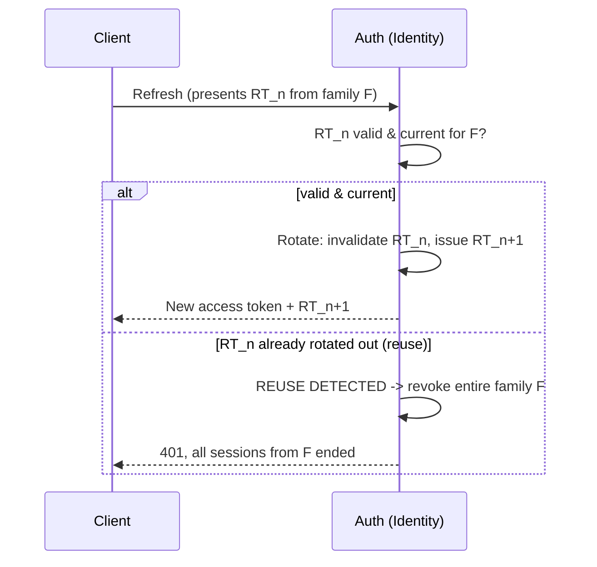

### 4. Session Management

A session is a server-side record representing one authenticated login lineage, linked to the refresh-token family, the user, the originating device, and metadata (created time, last-seen, ip, user agent). Sessions exist so that authentication is **observable and revocable**: a user (or admin) can list active sessions and revoke any of them, and revocation is immediate because the access token's short life plus a Redis denylist of revoked token/family identifiers means a revoked session cannot outlive a few minutes. Concurrent sessions are allowed (a user on a laptop and a phone) and each is independently revocable. Logout revokes the current session's family and denylists its tokens. Because Redis is per-deployment, the denylist and session state are isolated per client.

### 5. Device Management

Devices are first-class so that users and administrators can see and control where the account is active. On login, a device record is created or matched (by a stable device identifier plus contextual signals — never by anything that fingerprints the user covertly), capturing a friendly name, type, last-seen, and location hint. Each session is bound to a device, enabling per-device session lists ("Chrome on Windows — last active 2 hours ago") and per-device revocation ("sign out that device"). Device management also underpins security signals: a login from a new device can trigger a notification and, where a client enables it, an MFA step-up. Devices and their sessions are revocable individually or in bulk ("sign out all other devices").

### 6. MFA Architecture

> **Decision D32 — TOTP-based MFA with recovery codes, enabled per client and optionally step-up for sensitive actions.**
> **Recommendation:** Offer time-based one-time-password (TOTP) MFA with an enrollment flow and single-use recovery codes; let each client enable MFA as policy (optional, encouraged, or required per role), and support step-up MFA for high-risk actions (e.g., publishing results, bulk financial operations).
> **Why:** TOTP is standard, offline-capable, and free of SMS-delivery cost and SIM-swap risk — appropriate for the Bangladesh market and beyond. Per-client policy honors Cluster 6 (MFA optional initially, enabled per client). Step-up lets the system demand stronger proof only when the action warrants it, balancing security and friction.
> **Pros:** Strong second factor without per-message cost; offline; per-client and per-role policy; step-up protects the riskiest actions without burdening routine use; recovery codes prevent lockout.
> **Cons:** Enrollment and recovery flows to build; recovery codes must be stored hashed and handled carefully; some users find authenticator apps unfamiliar (mitigated by clear enrollment UX).
> **Alternatives:** (a) SMS OTP — familiar but costs per message, is phishable, and carries SIM-swap risk. (b) Email OTP — weak second factor (email is often the same account's recovery). (c) No MFA — unacceptable for an enterprise product handling minors' data.
> **Final Decision:** TOTP plus hashed single-use recovery codes, per-client/per-role policy, with step-up for sensitive operations. The design leaves room to add WebAuthn/passkeys later as a stronger factor.

### 7. Password Recovery

Password recovery is built to be secure against the attacks that target it. A recovery request issues a single-use, short-expiry, high-entropy token delivered out-of-band (email/SMS), stored hashed; presenting a valid token lets the user set a new password, after which the token and all of the user's active sessions are invalidated (forcing re-login everywhere, in case the account was compromised). The flow is **non-enumerating**: it returns the same response whether or not the address exists, so attackers cannot use it to discover valid accounts. It is **rate-limited** per account and per ip to prevent abuse. Password changes enforce the password policy and check against known-breached passwords where feasible. The same machinery underpins first-time account activation (admin-invited users set their initial password through an equivalent single-use token).

### 8. SSO-Ready Design

> **Decision D33 — Abstract authentication behind an identity-provider port with adapters; ship local credentials now, design the seam for OIDC/SAML.**
> **Recommendation:** Define an internal identity-provider abstraction (a port) that the authentication flow depends on; implement a local-credentials adapter now, and design the seam so OIDC (Google Workspace) and SAML adapters can be added later with just-in-time provisioning and account linking — without changing the token, session, or RBAC model.
> **Why:** Cluster 6 wants future Google Workspace and SAML SSO without a rewrite. If authentication depends on an abstraction rather than on a hard-coded password check, adding a federated provider becomes implementing an adapter, not re-architecting auth. JIT provisioning (create/link a local user on first federated login) and account linking (connect a federated identity to an existing user) are the two mechanics that make federation usable in an education context where users may pre-exist.
> **Pros:** Federation becomes additive, not disruptive; the token/session/RBAC model is unchanged by the credential source; per-client choice of provider; clean account-linking story.
> **Cons:** The abstraction adds a layer now for a future need; SSO adapters, JIT provisioning, and linking are real work when the time comes (deferred per roadmap).
> **Alternatives:** (a) Hard-code local auth now, add SSO later by refactoring — cheaper now, expensive and risky later. (b) Adopt a third-party identity platform (e.g., an external IdP) outright — powerful, but adds an external dependency and cost per deployment and reduces control; reserved as an option, not the default.
> **Final Decision:** Identity-provider port with a local adapter today; OIDC/SAML adapters, JIT provisioning, and account linking designed-for and scheduled for a later phase. The credential source is pluggable; everything downstream of authentication is unchanged.

---

## D-2, D-3, D-4 follow: authorization, the configuration engine, and the workflow engine.

---

## D-2. Authorization Architecture (Sections 9–14)

### 9. Authorization Architecture

Authorization answers three independent questions for every protected operation, and the design keeps them separate because conflating them is the usual source of access bugs. **Can the user perform this action?** is RBAC — a permission check. **In which institute/campus may they act?** is scoping — the multi-institute boundary within a deployment. **Which specific records may they touch?** is data access control — ownership and relationship rules (a teacher's own classes, a parent's own children). A request is authorized only when all three pass. The first two are checked in the request pipeline guards (Part B); the third is enforced in the data layer so it cannot be bypassed by a query that forgets to filter. The backend is the sole authority; the frontend's gating (Part C) is convenience only.

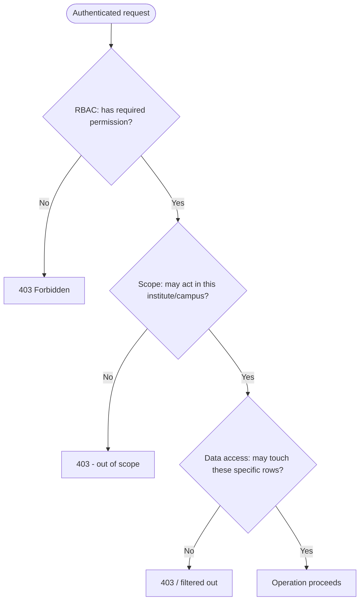

### 10. RBAC Design

Roles bundle permissions; permissions are fine-grained strings in the form module.resource.action (the same vocabulary the frontend uses). A user is connected to a role **through a scoped membership** — the link carries the institute (and optionally campus) the role applies in — so the same person can be an Institute Admin in one institute and merely a Teacher in another within the same deployment. A user's effective permissions for a given scope are the union of the permissions of the roles they hold in that scope. Default roles (Organization Admin, Institute Admin, Principal, Teacher, Accountant, Exam Controller, HR Officer, Admission Officer, Student, Parent) ship as seed data, not as code constants, which is what makes them editable and extensible.

| Concept | Holds | Notes |
|---|---|---|
| Permission | module.resource.action string | Fine-grained, shared with frontend, registry-defined |
| Role | A set of permissions | Seed roles + custom roles, all data |
| Membership | (user, institute, optional campus, role) | The scoped link; one user may have many |
| Effective permissions | Union of role permissions for the active scope | Resolved and cached by permissions-version |

### 11. Dynamic Permission System

> **Decision D34 — Permissions and roles are data, not code; effective permissions are resolved and cached, invalidated by a version stamp.**
> **Recommendation:** Maintain a permission registry (the catalog of valid permission strings) and roles as data; let clients define custom roles by composing registered permissions; resolve a user's effective permission set per scope and cache it, invalidating via the permissions-version that also lives in the access token (D30).
> **Why:** Hard-coding roles or permission checks in code (the `if role === 'admin'` anti-pattern) makes the system rigid and contradicts the configuration thesis; a registry plus data-defined roles lets institutions create exactly the roles they need (a "Library Assistant," an "Exam Coordinator") without a deployment, while the permission registry keeps custom roles from inventing permissions the code does not enforce.
> **Pros:** Custom roles without code change; one catalog of enforceable permissions; consistent enforcement; fast checks via cache; permission changes propagate quickly via version bump.
> **Cons:** A registry to maintain (new features register their permissions); resolution-and-cache machinery to build; care needed so a custom role cannot escalate beyond registered permissions.
> **Alternatives:** (a) Hard-coded roles — simple, rigid, anti-thesis. (b) Fully attribute-based access control (ABAC) for everything — extremely flexible but complex to reason about and audit for a small team; we use RBAC as the spine and add targeted ownership rules (Section 14) rather than full ABAC.
> **Final Decision:** Registry-backed, data-defined RBAC with custom roles, cached resolution keyed by permissions-version. New code that introduces a capability must register its permission in the catalog (an engineering-standard rule).

### 12. Institute-Level Access

Because one deployment contains multiple institutes, the institute is the primary access boundary inside it. Every scoped request establishes an active institute (from the token's scope claim or an explicit scope selection), and the scope guard verifies the user has a membership granting access there before any handler runs. Data is tagged with institute_id, and the data layer applies the active institute as a mandatory filter, so a user scoped to Institute A simply cannot see Institute B's rows even if they craft the request — the filter is applied in the repository from the request context, not left to each query. Organization-wide roles (an Organization Admin) hold memberships spanning all institutes; institute-scoped roles hold a membership for one. Switching institutes re-establishes scope and re-resolves permissions.

### 13. Campus-Level Access

Campuses subdivide an institute, and access can be further scoped to a campus where an institution operates that way. The mechanism mirrors institute scoping one level down: a membership may carry a campus, the active scope may include a campus, and campus-tagged data is filtered by the active campus. This supports the realistic case of a campus administrator who manages only their branch while an institute administrator sees all campuses. Campus scoping is optional — institutions that do not use multiple campuses operate with a single default campus and never see the distinction — and composes cleanly with institute scoping (campus access always implies and is bounded by institute access).

### 14. Data Access Controls

> **Decision D35 — Three-layer data access: RBAC permission, mandatory scope filter, and ownership/relationship rules enforced in the data layer.**
> **Recommendation:** Enforce data access as RBAC (the action) plus a mandatory institute/campus scope filter applied in the repository from request context, plus ownership/relationship predicates for roles whose access is inherently row-limited (a teacher to their assigned classes, a student to their own record, a parent to their children). Apply these in the data layer, not in controllers, so no query can forget them.
> **Why:** Permission alone is too coarse — a teacher has the "view marks" permission but must see only their own classes' marks. Scoping handles institute/campus; ownership handles the within-scope row limits. Enforcing in the data layer (a scoped repository that always applies the context's filters) makes bypass structurally difficult, whereas per-controller filtering is inevitably forgotten somewhere.
> **Pros:** Correct, fine-grained access; bypass-resistant because filters are applied centrally; clear separation of the three questions; field-level masking can be layered for sensitive attributes.
> **Cons:** Ownership predicates vary by role and resource and must be defined per case; the scoped-repository discipline must be enforced (architecture tests); some queries become more complex.
> **Alternatives:** (a) Controller-level filtering — flexible but bypass-prone; one forgotten filter is a data leak. (b) PostgreSQL row-level security — strong, but harder to manage across the dynamic, application-driven scope model and adds operational complexity per deployment; the application-layer scoped repository is preferred, with RLS reserved as a defense-in-depth option for the most sensitive tables.
> **Final Decision:** Three-layer enforcement (permission + mandatory scope filter + ownership predicates) centralized in the data layer, with field-level masking for sensitive attributes and RLS available as optional defense-in-depth on the highest-risk tables.

---

## D-3. Configuration Engine Design (Sections 15–21)

### 15. Configuration Engine Design

The configuration engine is the Platform Core capability that realizes the no-hard-coding thesis, and its internal design follows directly from Part B's hybrid storage decision. It has four cooperating parts. The **definition registry** holds, as structured relational data, what *can* be configured: institution types, templates, hierarchy-level definitions, custom-field definitions, form definitions, grading and fee templates, and the terminology key catalog. The **value store** holds what a client *did* configure: settings whose payloads are JSONB and whose applicability is expressed by relational scope columns (organization, institute, campus, session, and finer). The **resolution engine** answers "what is the effective value here?" by walking scopes most-specific-first and returning the first value found, or the definition default. The **cache** (Redis) holds resolved values for hot reads, invalidated by configuration-change events so reads are fast and never stale. Consumers never touch definitions or values directly; they ask the engine for resolved effective values through its published interface (Part A's Open Host).

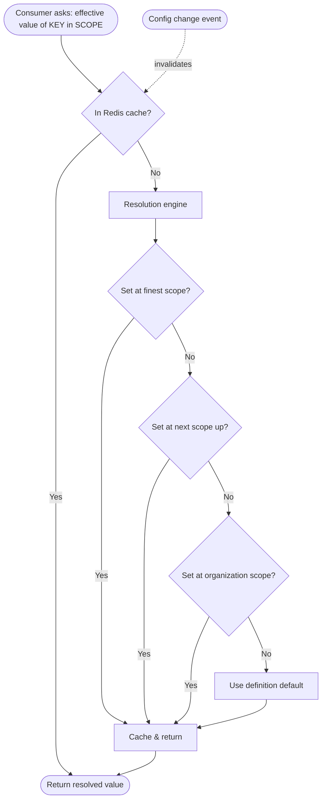

### 16. Configuration Versioning

> **Decision D36 — Change-set-based configuration versioning: every publish creates an immutable version snapshot with an active pointer.**
> **Recommendation:** Group configuration edits into a change set; publishing a change set creates a new immutable configuration version (a snapshot of the effective configuration at that point) and advances an active-version pointer. Prior versions are retained immutably for diff and rollback.
> **Why:** Cluster 2 requires versioning, audit history, and rollback. Snapshotting on publish gives a clean, restorable history and a precise answer to "what was the configuration on the day this result was computed?" — which matters because historical academic and financial records must reference the configuration that was active when they were created (Part A's immutability principle).
> **Pros:** Restorable history; precise point-in-time configuration; clean diffs between versions; supports the "historical records reference the config active at the time" rule; auditable.
> **Cons:** Snapshots consume storage (bounded — configuration is small relative to transactional data); change-set discipline must be enforced in the UI/flow.
> **Alternatives:** (a) Row-level history on each setting only — captures changes but makes "the whole configuration at time T" expensive to reconstruct. (b) No versioning, audit-only — cannot roll back or reconstruct point-in-time config.
> **Final Decision:** Change-set publishing to immutable version snapshots with an active pointer; per-setting change history additionally feeds the audit trail. Records that depend on configuration (results, invoices) store the configuration version id they were computed under.

### 17. Configuration Rollback

Rollback re-points the active configuration to a prior version, but never blindly. Before activating a target version, the engine validates it against the current definition schema (a definition may have changed since), surfaces a diff of what will change, and warns when operational data already created under the newer configuration could be affected (Part A's "warn before changing published config when data exists"). Rollback is itself an audited change set, so the act of rolling back is recorded and is itself reversible. Where a full rollback is too broad, the change-set model supports targeted reversal of a specific change rather than the whole version. Critically, rolling back configuration does not rewrite history: records already computed under a given version keep referencing that version, so a rollback changes future behavior, not past records.

### 18. Dynamic Form System

Forms are defined as data: a form definition references ordered field definitions, each field carrying a key, a label (subject to terminology and i18n), a type (text, number, date, select, multiselect, file, boolean, and the like), validation rules (required, range, pattern, option set, uniqueness), and optional conditional visibility (show this field when another field has a given value). The same definition drives both rendering (the frontend's dynamic form renderer, Part C) and validation (the backend's dynamic validation tier, Part B), so the two never diverge. Submissions of configurable fields are stored as JSONB on the owning entity (next section). New field types are added to the engine once and become available to every form; new forms and fields are created by clients as data, with no deployment.

### 19. Dynamic Custom Fields

> **Decision D37 — Custom field values stored as validated JSONB on the owning entity; frequently-queried fields promoted to real columns.**
> **Recommendation:** Attach custom-field definitions to entity types (student, staff, etc.); store the values in a JSONB column on the owning row; validate every write against the field definitions; and apply the promote-to-column rule when a custom field becomes frequently filtered or reported on.
> **Why:** This is the Part B hybrid decision applied to entities: JSONB-on-the-row keeps a record's custom data atomic with the record (one row, one transaction), avoids the EAV anti-pattern, and stays queryable via GIN indexes, while definition-driven validation ensures "schemaless" never means "unvalidated." Promotion handles the cases where a custom field outgrows JSONB.
> **Pros:** Per-client custom fields without schema changes; atomic with the entity; queryable; validated; a clear path (promotion) when a field needs first-class performance.
> **Cons:** JSONB querying is less efficient than columns for heavy filters (mitigated by GIN indexes and promotion); validation must run on every write.
> **Alternatives:** (a) EAV — flexible, but the performance/integrity disaster rejected in Part B. (b) A column per custom field — needs a migration per client field, defeating no-code.
> **Final Decision:** Validated JSONB custom-field values on the owning entity, GIN-indexed where queried, with the promote-to-column escape hatch — exactly consistent with Part B's JSONB strategy.

### 20. Dynamic Academic Structures

> **Decision D38 — Separate the timeless structure definition from the per-session instance; the hierarchy is data with a marked enrollment leaf.**
> **Recommendation:** Model academic structure in two parts: a per-institute **structure definition** (the ordered hierarchy-level definitions and the org-unit tree describing what the institution *is* — Faculty → Department → ... → the enrollment leaf), and per-**session instances** that realize concrete nodes for a given academic session. Mark the lowest active level as the enrollment leaf where students attach.
> **Why:** This is the definition-versus-instance separation flagged in the very first review: if structure and session-instance are conflated, every node duplicates each year and rollover becomes a mess. Separating them means the institution defines its structure once and each session instantiates it, so promotion and rollover create new instances without duplicating the definition, and historical sessions remain intact.
> **Pros:** No duplication at session rollover; clean promotion/rollover; historical sessions preserved; one structural truth per institution; supports any institution type generically.
> **Cons:** Two related models to keep coherent (definition and instance); the enrollment-leaf concept must be enforced; resolving "a student's path" spans both.
> **Alternatives:** (a) Single structure carrying the session — simple, but duplicates the structure every year and complicates rollover (the flaw caught in the initial review). (b) Hard-coded per-type structures — defeats configurability.
> **Final Decision:** Definition/instance separation with a marked enrollment leaf, the hierarchy expressed as configurable level definitions and an org-unit tree, per institute, instantiated per session. Roll-up queries (all students in a faculty) are served by the tree path; the structure feeds Enrollment, Attendance, Assessment, Scheduling, and Finance as their upstream (Part A).

### 21. Dynamic Fee Structures

Fee structures are configuration, not code. A fee definition catalogs fee types (admission, tuition, exam, lab, transport, and client-defined types); a fee structure binds amounts to structure nodes (a class, a program) for an academic session, carries an **effective-from date** so a mid-cycle change never alters historical invoices, and references computation rules expressed as configuration — components, discounts, waivers, schedules (one-time, monthly, semester, installment), and late-fine rules. The Finance context resolves the effective fee structure through the configuration engine (most-specific-wins: campus override beats institute default), computes invoices from it, and stamps each invoice with the configuration version used, so a published invoice is permanently consistent even as fee configuration evolves. This makes fees fully client-configurable while keeping financial history immutable and auditable.


---

## D-4. Workflow Engine Design (Sections 22–29)

### 22. Workflow Engine Design

The workflow engine is the second Platform Core capability, and its design follows Part A's most important workflow rule: it must be **generic and domain-agnostic**. It knows nothing about admissions, leave, or fee waivers; it knows states, transitions, tasks, approvers, escalation, delegation, and timeouts. Domains use it by registering a declarative workflow definition and raising a request; the engine runs the state machine and emits decision events; the domain reacts through its own anti-corruption layer (Part A's inversion). This keeps every approval flow — admission, leave, employee onboarding, fee waiver, procurement — running on one engine without that engine accumulating domain knowledge, and lets a client design new approval flows as configuration.

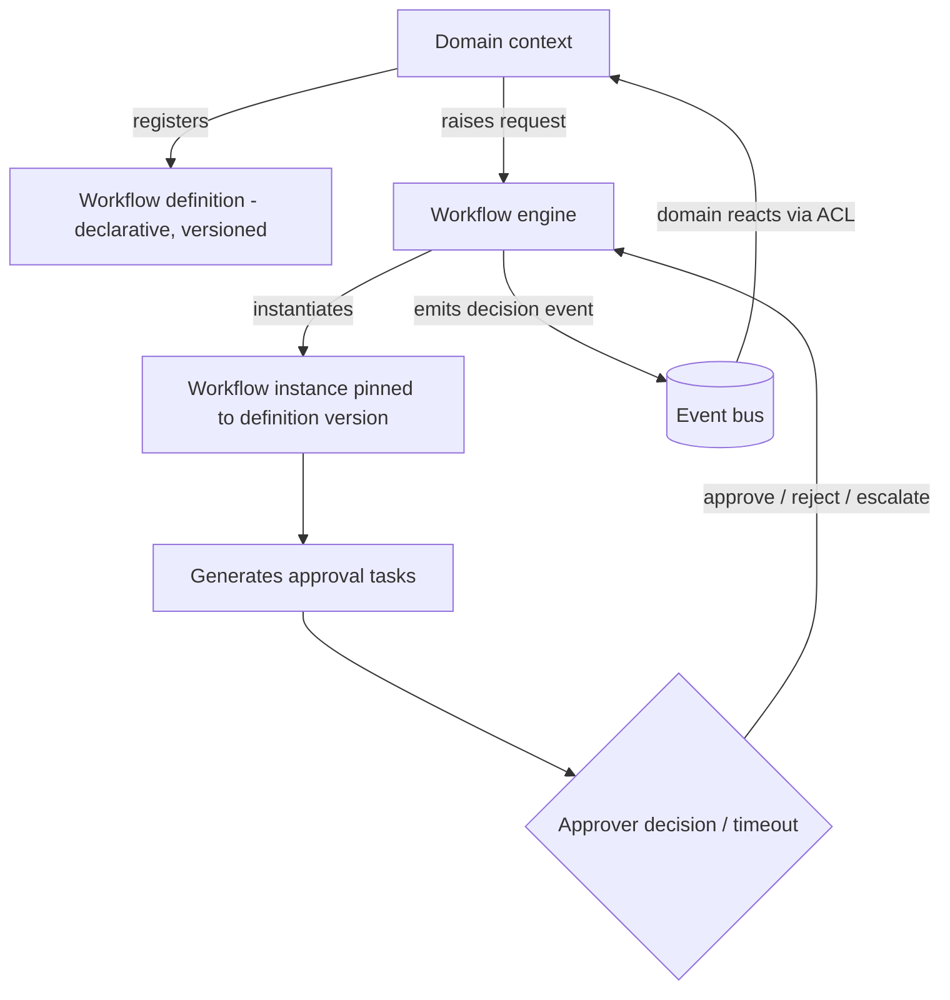

### 23. State Machine Design

> **Decision D39 — Declarative finite state machine defined as data; instances are pinned to the definition version they started under.**
> **Recommendation:** A workflow definition is a declarative finite state machine — states, transitions, guard conditions on transitions, and actions on entry/exit — stored as data. A running instance records its current state and is pinned to the exact definition version it began on, so changing a definition never disturbs in-flight instances.
> **Why:** Cluster 3 wants sequential and conditional approvals, escalation, delegation, and timeouts, without a BPMN engine. A declarative FSM expresses all of these as data: conditional approvals are guarded transitions, escalation and timeouts are time-triggered transitions, delegation reassigns a task. Pinning instances to their starting version is essential — an approval that began under last month's policy must finish under it, even if the policy changed.
> **Pros:** Expresses the required patterns without a heavy BPMN engine; definitions are data (client-configurable, versionable); in-flight instances are stable across definition changes; simple to reason about and audit.
> **Cons:** Very complex graph-shaped processes (many parallel branches with joins) are awkward in a pure FSM (acceptable — these are not in scope; BPMN explicitly deferred per Cluster 3); guard/condition expression needs a small, safe rule grammar.
> **Alternatives:** (a) A third-party BPMN engine — handles arbitrarily complex flows, but heavy, a large dependency per deployment, and overkill for approval chains; deferred per Cluster 3. (b) Hard-coded approval flows per domain — fast, but defeats configurability and scatters approval logic.
> **Final Decision:** Declarative FSM as data, version-pinned instances, with a small safe condition grammar for guards. BPMN remains explicitly out of scope unless a future requirement genuinely demands graph-shaped orchestration.

### 24. Approval Engine

The approval engine is the workflow engine specialized to the dominant case — chains of human decisions. A definition's steps each specify how approvers are resolved (a fixed role such as Principal, a specific user, or a dynamic resolver such as "the applicant's reporting manager"), whether the step is sequential or parallel (all-must-approve or any-one-approves), and the conditions under which the step applies. When an instance reaches a step, the engine generates tasks for the resolved approvers, waits for decisions (approve/reject/return-for-changes), and transitions per the outcome and the definition's guards — enabling conditional branches such as "fee waivers above a threshold require an extra approval." Each domain registers its own definitions (admission approval, leave approval, employee approval, fee-waiver approval, procurement approval) and reacts to the engine's terminal decision event.

### 25. Escalation Rules

Escalation is a time-triggered transition declared in the definition: if a task is not acted on within a configured duration, the engine escalates — typically reassigning or additionally assigning to a higher authority (the approver's superior, the principal) and notifying. Escalation can be multi-level (escalate again if still unacted) and is driven by the scheduled-jobs mechanism from Part B (a periodic sweep finds overdue tasks and fires their escalation transition). Because escalation is declarative, a client configures "escalate leave approvals to the principal after two days" without code. Every escalation is recorded in the workflow audit trail.

### 26. Delegation Rules

Delegation lets an approver temporarily transfer their approval authority to another user — for planned absence or load-sharing. A delegation specifies the delegator, the delegate, the scope (which workflows or all), and a validity window; while active, tasks that would route to the delegator route to (or are also offered to) the delegate, with the original authority and the delegation both recorded so the audit trail shows who acted under whose authority. Delegation is bounded (it expires) and revocable, and it never silently expands the delegate's own permissions beyond the delegated approval — it is authority to act on specific tasks, audited as such.

### 27. Timeout Rules

Timeouts define what happens when a step's time budget elapses, and the action is declarative per step: it may **remind** (notify and keep waiting), **escalate** (Section 25), **auto-approve** (where policy permits low-risk auto-progression), or **auto-reject/expire** (where inaction should fail the request). Timeouts and escalations share the same scheduled-sweep mechanism. The choice of timeout action is a deliberate policy expressed in configuration — a client may auto-remind for routine approvals but auto-escalate for time-critical ones — and every timeout-triggered transition is audited, so an auto-action is never silent or unexplained.

### 28. Workflow Versioning

Workflow definitions are versioned exactly like configuration (Section 16): editing a definition and publishing creates a new immutable version, while the active pointer advances. The non-negotiable rule, already stated in D39, is that a running instance is pinned to the version it started under and runs to completion on that version; only new instances use the new version. This guarantees process integrity — an approval cannot have its rules changed mid-flight — and gives a precise audit answer to "which approval policy governed this request?" Versioning also enables safe iteration: a client can refine an approval flow without fear of disrupting approvals already in progress.

### 29. Workflow Audit Trail

> **Decision D40 — Every workflow event is recorded immutably and feeds the central audit trail, with full lineage of decisions, escalations, delegations, and timeouts.**
> **Recommendation:** The workflow engine records every instance event — creation, each transition, each task assignment and decision, every escalation, delegation, and timeout action — immutably, and publishes these as domain events that also feed the central append-only audit trail (Part B).
> **Why:** Approvals are exactly the operations auditors and administrators scrutinize ("who approved this admission, when, and under what policy?"). A complete, immutable workflow history, tied into the central audit trail, answers these definitively and supports compliance (Cluster 7). Capturing delegation and escalation lineage ensures that actions taken under delegated or escalated authority are attributable.
> **Pros:** Complete, tamper-evident approval history; clear attribution including delegated/escalated actions; ties into central audit and compliance export; supports dispute resolution and accountability.
> **Cons:** Storage growth (bounded and partitioned like the rest of the audit trail); every workflow event must be captured (handled by routing all transitions through the engine, never out-of-band).
> **Alternatives:** (a) Log only terminal outcomes — loses the lineage auditors need. (b) Workflow-local logs separate from the central audit — fragments the compliance story.
> **Final Decision:** Full immutable workflow event history feeding the central audit trail, with version, actor, authority (including delegation/escalation lineage), and timestamp on every event.

---

## Part D — Closing Note and What Comes Next

Part D has specified the Platform Core in implementation detail. Authentication is a layered, per-deployment design: short-lived asymmetric-signed access tokens carrying scope and a permissions-version, rotating hashed refresh tokens with family-based reuse detection, revocable server-side sessions and devices, per-client TOTP MFA with step-up, non-enumerating rate-limited password recovery, and a pluggable identity-provider seam ready for OIDC/SAML. Authorization answers three separate questions — RBAC permission, mandatory institute/campus scope, and ownership/relationship data rules — with data-defined roles and permissions resolved and cached by version, enforced centrally in the data layer so they cannot be bypassed. The configuration engine realizes the no-hard-coding thesis: a definition registry plus JSONB-scoped values, most-specific-wins resolution with cache invalidation by event, change-set versioning to immutable snapshots, validated rollback that never rewrites history, and that same machinery powering dynamic forms, validated custom fields, the definition/instance-separated academic structure, and effective-dated fee structures. The workflow engine is a generic, domain-agnostic declarative state machine with version-pinned instances, an approval engine supporting sequential/parallel/conditional steps, and declarative escalation, delegation, and timeout rules, every event feeding the immutable audit trail.

These engines are what the rest of the system stands on: every domain context consumes the configuration engine for its behavior and the workflow engine for its approvals; the authorization model governs every request across all parts; and the audit and versioning machinery underpins the compliance design in Part E. With the Platform Core specified, the remaining parts are the non-functional architecture (Part E: security, performance, scalability, DevOps, observability, backup/DR) and the execution layer (Part F: cross-cutting services if not yet covered, engineering standards, the phased roadmap, and the critical self-review).

**Awaiting your approval to proceed.** I have generated Part D only and will not continue until you direct me to the next part.

*End of Part D.*


<div style="page-break-before: always;"></div>

---

# ═══ PART E ═══

# Enterprise Education ERP — Architecture Blueprint
## Part E — Cross-Cutting Services: Reporting, Notifications, Files & Integration

**Scope:** The cross-cutting service families that every domain relies on — reporting and document generation, the multi-channel notification system, file and media management, and the integration surface (public API, webhooks, external integrations, and the internal extensibility model that underpins the future marketplace).
**Status:** Part E of the blueprint. Builds on Part B (outbox/events, BullMQ, object-storage adapter, read replica), Part D (configuration engine, RBAC/scoping, audit), and Cluster answers (per-client reporting, Bangladesh notification gateways, GDPR-aligned retention, internal plugins with public APIs and no sandboxed third-party code).
**Constraint:** No source code. Diagrams, data shapes, flows, and decisions only.
**Decision format:** Recommendation → Why → Pros → Cons → Alternatives → Final Decision. Numbering continues from Part D (D41 onward).

---

## E-1. Reporting Architecture (Sections 1–6)

### 1. Reporting Architecture

> **Decision D41 — Reporting reads from dedicated read models (a reporting projection), never from transactional tables directly; heavy generation runs on the queue; the largest client uses the read replica.**
> **Recommendation:** Build reporting on read models — denormalized projections maintained from domain events (Part B's outbox) and/or served from the read replica — kept separate from the transactional schema. Generate heavy reports asynchronously on BullMQ workers. Reporting is per-client only (Cluster 4); no data leaves the deployment.
> **Why:** Reports aggregate across many contexts and run heavy scans; running them against live transactional tables couples reporting to every source schema and lets a big report degrade interactive performance — unacceptable at the 30,000-student client during peak events. Read models isolate reporting load and schema, and the read replica absorbs the heaviest queries. Batch generation is acceptable (Cluster 4), so async is the right default.
> **Pros:** Reporting load isolated from transactions; report shapes optimized independently of source schemas; the replica absorbs heavy reads; consistent with Part A's "Reporting is a downstream read-only consumer"; scales for the largest client.
> **Cons:** Read models add storage and projection machinery; projections are eventually consistent (acceptable for reports); two representations of some data to keep coherent.
> **Alternatives:** (a) Query transactional tables directly — simplest, but couples reporting to every schema and loads the OLTP database; rejected at this scale. (b) A separate analytics database/warehouse per deployment now — powerful, but premature operational weight; the read-model-plus-replica approach is the staged path, and a per-client data mart is noted as a future option (Cluster 4).
> **Final Decision:** Event-fed read models plus replica-served queries, async batch generation on the queue, strictly per-client. A per-client data mart and the optional central analytics platform remain future, consent-bound extensions (Cluster 4), with vendor telemetry carrying only usage/error/product metrics — never student data.

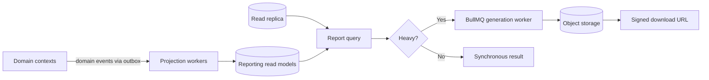

### 2. Dynamic Report Builder

> **Decision D42 — Report definitions are configuration: datasets, filters, columns, and grouping defined as data and resolved through the configuration engine.**
> **Recommendation:** Model reports as report definitions — a selected dataset (a read model), available filters, chosen columns, grouping/sorting, and output formats — stored as data and managed through the configuration engine, so institutions can build and save reports without code.
> **Why:** An ERP needs dozens of reports and every institution wants slightly different cuts; hard-coding each is endless work and inflexible. A definition-driven builder lets clients compose reports from curated datasets and filters, reusing the same configuration/versioning/audit machinery as the rest of the system, while curated datasets keep the builder safe (clients compose within bounded, permission-checked data, not arbitrary queries).
> **Pros:** Clients build and save their own reports; reuses configuration engine (versioning, audit); curated datasets prevent unsafe or unbounded queries; consistent with the no-hard-coding thesis.
> **Cons:** The builder is a real component; datasets must be curated and permission-scoped; very bespoke reports may still need a custom dataset added by the team.
> **Alternatives:** (a) Hard-coded reports only — simple, inflexible, endless backlog. (b) Raw query access — maximal flexibility, but a security and performance hazard (unbounded queries, data leakage); rejected.
> **Final Decision:** Definition-driven report builder over curated, permission-scoped datasets, with saved report definitions versioned and audited like other configuration. The team adds new datasets; clients compose reports on them.

### 3. Report Templates

Report and document templates (marksheets, transcripts, fee receipts, ID cards, certificates) are configurable artifacts: a template defines layout, branding placement, columns, and signature areas, consuming the per-client branding and terminology (Part C) so output looks native to each institution. Templates are versioned, and — critically — a generated document records the template version and the data version it was produced from, so a re-print is faithful and a historical marksheet always reflects the grading and template active when it was issued (consistent with Part D's "historical records reference the configuration active at the time"). Templates render through the document pipeline (Section 5).

### 4. Excel Export

Excel export targets data-heavy outputs (student lists, fee collection, payroll sheets, merit lists) where recipients need to sort, filter, and pivot. Exports are generated from the same read models as on-screen reports, run on the queue for large datasets (a 30,000-row export never blocks a request), and stream to object storage for download via a signed URL. Exports respect the requesting user's permissions and scope — an export can never contain rows the user could not see on screen — and large exports report progress and notify on completion. Column sets and formatting follow the report definition, so an export and its on-screen report stay consistent.

### 5. PDF Export

> **Decision D43 — Two-tier PDF generation: HTML-template rendering via a headless browser for rich documents, a lightweight generator for simple ones; all heavy generation async to object storage.**
> **Recommendation:** Render rich, branded documents (marksheets, transcripts, certificates, ID cards) from HTML templates through a headless-browser renderer that honors the design tokens and branding; use a lighter programmatic generator for simple, high-volume documents (receipts) where full HTML rendering is overkill. Run bulk generation on the queue, store outputs in object storage, deliver via signed URLs, and support bulk runs that produce a downloadable archive.
> **Why:** Rich documents need pixel-faithful, brand-consistent layout that HTML/CSS templates express best and that reuse the same design tokens as the UI; headless rendering achieves that. But headless rendering is resource-heavy, so simple high-volume documents use a lighter path. Async generation protects interactive performance during bulk runs (printing all marksheets for a 30,000-student institution).
> **Pros:** Rich documents are brand-faithful and template-driven (configurable, no code per document); simple documents generate cheaply; bulk runs never block users; outputs are stored, auditable, and re-printable.
> **Cons:** Headless rendering needs managed worker resources (memory/CPU) and careful concurrency limits; two generation paths to maintain.
> **Alternatives:** (a) Headless rendering for everything — simplest mentally, but wasteful for high-volume simple documents. (b) Programmatic-only generation — efficient, but painful for rich, frequently-restyled, brand-specific layouts.
> **Final Decision:** Two-tier generation (HTML+headless for rich, programmatic for simple), async on the queue with concurrency limits, outputs to object storage with signed-URL delivery and bulk archive support.

### 6. Scheduled Reports

Scheduled reports use the background-jobs mechanism (Part B): a schedule definition binds a report definition to a cadence (daily attendance summary, monthly fee collection), a recipient set, and a delivery channel (in-app, email). At each run a worker generates the report from read models, stores it, and notifies recipients with a signed link. Schedules respect permissions (a scheduled report is generated under a service identity bounded to the recipients' visibility) and are configurable per client without code. Failed runs surface to observability (Part F's monitoring) and retry per policy.

---

## E-2. Notification Architecture (Sections 7–13)

### 7. Notification Architecture

> **Decision D44 — Two-layer notifications: the Communication context decides what to send; a provider-agnostic Notification Delivery layer with per-channel adapters sends it, all queue-driven and event-fed.**
> **Recommendation:** Separate deciding (Communication context: which event triggers which message to which audience, with templates) from delivering (Notification Delivery: channel adapters for email, SMS, push, in-app). Trigger notifications from domain events (the outbox), render templates per channel and language, enqueue on BullMQ, and deliver through pluggable provider adapters.
> **Why:** Mixing "what to notify" with "how to send" couples business rules to providers and makes channel or provider changes invasive. Separating them, with provider-agnostic adapters, lets a client swap SMS providers or add push without touching the rules, and event-driven triggering means notifications fire reliably from the same outbox that guarantees no lost events (Part B). Queue-driven delivery decouples send latency and absorbs bursts (result-publish day).
> **Pros:** Providers and channels swappable without touching business rules; reliable event-driven triggering; burst absorption via queue; per-channel, per-language templates; clean separation of concerns.
> **Cons:** Two layers plus adapters to build; template management across channels and languages; idempotency/dedup required (handled below).
> **Alternatives:** (a) Direct sends from domain code — simple, but couples domains to providers, risks lost notifications, and floods under bursts. (b) A third-party notification platform — capable, but adds external dependency/cost per deployment and reduces control; reserved as an adapter option, not the default.
> **Final Decision:** Decide/deliver separation, provider-agnostic channel adapters, event-triggered and queue-driven, with per-channel/per-language templates. This is the "ports/adapters" pattern validated in the starter-repo analysis, applied to notifications.

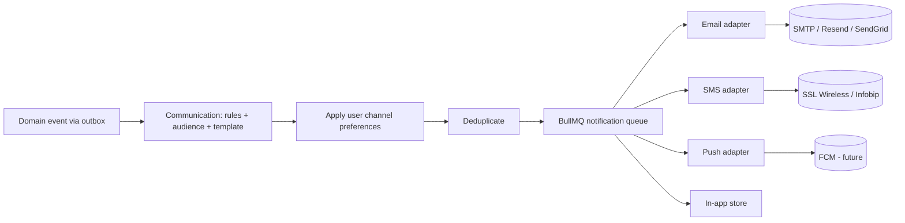

### 8. Email Service

Email delivery is a channel adapter behind a provider-agnostic port, with implementations for SMTP, and managed providers (Resend/SendGrid) selectable per client by configuration; a console adapter serves development. Templates are per-language (English/Bangla) with variable substitution, and rendering reuses the template machinery. The service handles bounce/complaint feedback where the provider supports it, respects per-user preferences, and records delivery outcomes for the audit and notification history. Account-related emails (invitations, password recovery, MFA setup) are transactional and always sent regardless of marketing-style preferences.

### 9. SMS Service

> **Decision D45 — SMS via a provider-agnostic adapter with Bangladesh gateways, Bangla Unicode templates, and strict cost controls.**
> **Recommendation:** Implement SMS as a channel adapter with Bangladesh-appropriate providers (SSL Wireless, Infobip), Bangla (Unicode) and English templates, and cost controls: deduplication (no more than one SMS per recipient per event per day), opt-in/opt-out, rate limits, and per-client credentials stored encrypted.
> **Why:** Bangladesh parents expect Bangla SMS, and SMS carries real per-message cost, so the service must minimize spend and avoid flooding. A provider-agnostic adapter lets a client choose or switch gateways; dedup and rate limits protect cost and goodwill; Unicode handling is essential for Bangla.
> **Pros:** Local-market fit; controlled cost; no flooding; provider flexibility; secure per-client credentials.
> **Cons:** SMS dedup and preference logic to build; Unicode/segment-length handling adds complexity; provider onboarding per client.
> **Alternatives:** (a) A single hard-coded gateway — simpler, but locks clients to one provider and pricing. (b) No cost controls — risks runaway spend and parent annoyance.
> **Final Decision:** Provider-agnostic SMS adapter, Bangladesh gateways, Bangla+English Unicode templates, dedup/rate-limit/opt-out cost controls, encrypted per-client credentials. SMS is a Phase-2 capability (per the roadmap) but the trigger and template infrastructure are built in Phase 1 so enabling it is configuration, not new code.

### 10. Push Notifications

Push is a channel adapter designed-for-now, enabled-later, targeting the future mobile app via a push provider (e.g., FCM). The architecture treats push identically to other channels — event-triggered, template-rendered, preference-respecting, queue-delivered — so when the mobile app ships (Part F roadmap), enabling push is adding the adapter and device-token registration, not re-architecting notifications. Device-token management ties into the device model from Part D. Until the mobile app exists, push is dormant but its seam is in place.

### 11. In-App Notifications

In-app notifications are the always-available channel: every notification is also recorded as an in-app item (recipient, type, title, body, read/unread, timestamp, link), surfaced in the application's notification center across all portals. The client retrieves and marks them through the data layer (RTK Query, Part C), with unread counts and real-time-ish updates via polling initially and a lightweight push/websocket later if warranted. In-app notifications have no per-message cost and no delivery uncertainty, so they are the reliable baseline; email/SMS/push are added per event and per preference on top.

### 12. Notification Preferences

Preferences let each user control which channels they receive which categories of notification on, within client-set policy. A preference resolves per (user, notification category, channel): a parent might receive fee reminders by SMS and in-app but exam schedules in-app only. The Communication context applies preferences after deciding the audience and before enqueuing, and transactional/critical notifications (security, account) override preferences so they are never suppressed. Client-level policy can mandate or cap certain channels (e.g., disable SMS to control cost, or require in-app for all). Preferences are scoped and stored per user, with sensible defaults from the client configuration.

### 13. Notification Queue

The notification queue is a dedicated BullMQ queue (Part B) with priority lanes so urgent notifications (security alerts) are not stuck behind a bulk result-publish blast to 30,000 parents. Delivery is idempotent (keyed by notification id) so retries never double-send, with backoff on provider failures and a dead-letter path for exhausted retries that surfaces to observability. Bulk notification runs (result published for a whole institute) are chunked and rate-limited to respect provider throughput and cost controls. The queue decouples the triggering event from delivery, so a slow provider never slows the domain operation that triggered the notification.

DOCEOF
echo "E-1 and E-2 appended."
---

## E-3. File Management Architecture (Sections 14–18)

### 14. File Management Architecture

> **Decision D46 — Private object storage (S3/MinIO) behind an adapter; access only via short-lived signed URLs; scoped paths; server-side encryption; virus scanning on upload.**
> **Recommendation:** Store all files in private object storage through a provider-agnostic adapter (MinIO self-hosted or AWS S3 per deployment), never publicly accessible; grant access only via short-lived signed URLs issued after a permission/scope check; organize objects under a scoped path convention; encrypt at rest server-side; and scan uploads for malware before they become available.
> **Why:** Files include sensitive student documents and identity images; public buckets or long-lived URLs are a classic leakage vector. Signed URLs gated by the same authorization model (Part D) ensure a file is reachable only by someone permitted to see it, for a short window. Scoped paths keep one institute's files organized and support per-institute lifecycle. Virus scanning prevents the platform from distributing malware uploaded by users.
> **Pros:** No public exposure; access tied to the authorization model; short exposure windows; per-client/per-institute organization; encryption at rest; malware containment; provider-swappable (MinIO ↔ S3).
> **Cons:** Signed-URL issuance adds an authorization step per access; virus scanning adds upload latency and a scanning component; lifecycle management is real work.
> **Alternatives:** (a) Public-read buckets with obscure keys — convenient, but security-through-obscurity and a leakage risk; rejected. (b) Serving files through the application — gives full control but loads the app with large transfers; signed URLs offload transfer to storage while keeping control.
> **Final Decision:** Private storage, authorization-gated short-lived signed URLs, scoped paths (per organization/institute/entity), server-side encryption at rest, and pre-availability virus scanning, all behind a storage port so MinIO and S3 are interchangeable per deployment.

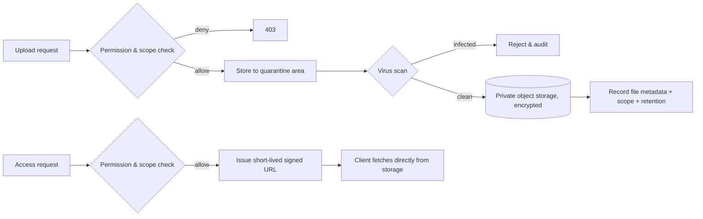

### 15. Document Storage

Documents are user-uploaded files tied to records — admission documents (birth certificate, national ID, testimonials, transfer certificates), verification artifacts, and supporting attachments. Each is stored with metadata (owning entity, document type, scope, uploader, verification status, retention class) so it can be listed, verified, and lifecycle-managed. Document verification status (pending/verified/rejected) gates downstream actions (e.g., admission finalization) per the domain rules. Documents are scoped and access-controlled exactly like any other data — a user sees only documents within their institute/campus and ownership, enforced before any signed URL is issued.

### 16. Certificate Storage

Certificates are system-generated documents (ID cards, admit cards, transcripts, transfer certificates, completion certificates) produced by the document pipeline (Section 5) and stored with provenance: the template version, the data/configuration version, a sequential certificate number where applicable, and the issuing scope. Provenance makes certificates **verifiable and re-issuable** — a re-print reproduces the original faithfully, and a certificate can be validated against its recorded number and provenance (supporting a future QR/verification feature). Certificates follow stricter retention (they are records of issuance) and are immutable once issued; a correction issues a new certificate rather than altering the original.

### 17. Media Storage

Media are images and similar assets — student and staff photos, institution logos, and content media. They follow the same private-storage-and-signed-URL model but with media-specific handling: images are processed on upload (resized into the variants the UI and documents need — thumbnail, card, full — to avoid serving large originals), optimized, and served via signed URLs through the CDN where appropriate (Section on performance in the non-functional design). Photos are sensitive (they identify minors), so they are access-controlled like documents, never public, and subject to retention and erasure like other personal data.

### 18. File Lifecycle Management

> **Decision D47 — Configurable, retention-class-driven file lifecycle with tiering, archival, and compliant erasure.**
> **Recommendation:** Assign every file a retention class; drive lifecycle by configurable per-client retention policies (Cluster 7) — active storage, transition to cheaper/cold storage after a window, archival, and eventual deletion or anonymization — with export-before-purge and full audit, and support targeted erasure for right-to-erasure requests.
> **Why:** Files accumulate and include personal data of minors; GDPR-aligned principles (Cluster 7) require configurable retention, exportability, and erasure. Retention classes let different file types follow different rules (a transient upload purged quickly; a certificate retained for years), and tiering controls storage cost at the 30,000-student scale.
> **Pros:** Compliance-ready (configurable retention, erasure, export); storage cost controlled by tiering; per-client policy; auditable lifecycle; consistent with the data archival strategy in Part B.
> **Cons:** Lifecycle machinery and retention-class tagging to build; erasure across active/archived/derived copies (thumbnails) must be thorough; legal-hold cases need handling.
> **Alternatives:** (a) Keep everything forever — simplest, but non-compliant and ever-growing cost. (b) Fixed global retention — simple, but cannot meet differing per-type, per-client legal needs.
> **Final Decision:** Retention-class-driven, per-client-configurable lifecycle with tiering, archival, export-before-purge, thorough erasure (including derived media), and audit — the file-side counterpart to Part B's data archival and retention strategy, governed by the same compliance posture.

---

## E-4. Integration Architecture (Sections 19–25)

### 19. Integration Architecture

Integration is how a client deployment connects to the outside world — inbound (other systems calling the ERP) and outbound (the ERP calling or notifying other systems) — and it is built on three pillars consistent with Cluster 8: a **public API** as the controlled inbound surface, **webhooks** as the outbound event surface, and **provider adapters** for the specific external services the ERP itself uses (payment, SMS, email, SSO). All three reuse the platform's existing machinery: the public API uses the same RBAC/scoping and the outbox-driven events feed webhooks. Critically, integration adds capability without opening the system to untrusted code — there is no third-party code execution (Section 25); extension happens through these well-defined, secured surfaces.

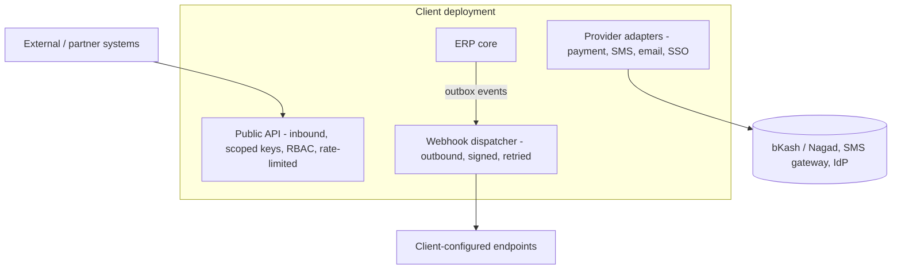

### 20. Public API Design

> **Decision D48 — Versioned REST public API governed by the same RBAC/scoping model, authenticated by scoped API credentials, rate-limited, and documented via OpenAPI.**
> **Recommendation:** Expose a versioned REST public API as the official integration surface; authenticate integrations with scoped, revocable API credentials (client-credentials style) bound to a permission set and institute/campus scope; apply the same authorization, validation, and rate limiting as the interactive API; document everything with OpenAPI.
> **Why:** Cluster 8 wants public APIs for integrations as the basis of a future marketplace. Reusing the existing RBAC/scoping/validation for the public API means external callers are governed exactly like internal ones — no parallel, weaker access path — and scoped, revocable credentials keep integrations least-privileged and auditable. Versioning protects integrators from breaking changes; OpenAPI makes the surface self-documenting.
> **Pros:** One authorization model for internal and external access; least-privilege, revocable, auditable integration credentials; versioning shields integrators; self-documenting; the foundation for the marketplace.
> **Cons:** Public API surface must be curated and stabilized (a contract to maintain); credential management and rate-limiting per integration to build; versioning discipline required.
> **Alternatives:** (a) Expose internal endpoints directly — fast, but leaks unstable internals and risks a weaker access path. (b) GraphQL public API — flexible for integrators, but a larger attack surface and harder to rate-limit/version safely for a small team initially; REST first, GraphQL reconsidered later.
> **Final Decision:** Versioned REST public API, scoped/revocable credentials under the same RBAC/scoping, rate-limited, OpenAPI-documented. This API is the curated subset of capability deemed stable for external use — not a passthrough to internal endpoints.

### 21. API Gateway Strategy

> **Decision D49 — Per-deployment gateway concerns split between Nginx (edge) and the application; no separate API-gateway product at current scale.**
> **Recommendation:** Handle edge concerns (TLS termination, routing, static assets, basic protection, request size limits) at Nginx in front of each deployment, and application-level gateway concerns (authentication, authorization, rate limiting, versioning, request context) inside the NestJS application. Do not introduce a dedicated API-gateway product per deployment.
> **Why:** The per-deployment, modular-monolith model means there is one application behind Nginx per client; a separate API-gateway product would add an operational component to every one of 200+ deployments for concerns the application and Nginx already handle well. Edge vs application split keeps responsibilities clear without extra infrastructure.
> **Pros:** No extra component per deployment; clear edge/app responsibility split; rate limiting and auth stay close to the application's own model; simpler fleet operations.
> **Cons:** The application carries gateway concerns (acceptable — they are already there); a future multi-service topology might later warrant a real gateway (deferred until/unless that happens).
> **Alternatives:** (a) A dedicated API gateway per deployment — powerful, but unjustified operational weight at this scale and topology. (b) A central shared gateway — contradicts the isolated-deployment model.
> **Final Decision:** Nginx edge + application-level gateway concerns per deployment; revisit only if the topology ever becomes multi-service. The Control Plane may run its own small gateway for vendor APIs, separate from client deployments.

### 22. Webhook Design

> **Decision D50 — Outbound webhooks driven by the outbox, signed, retried with backoff, and subscribable per event type.**
> **Recommendation:** Let clients register endpoints subscribed to specific event types; dispatch webhooks from the outbox-fed event stream; sign each payload (HMAC) so receivers can verify authenticity; retry with exponential backoff and a dead-letter path; and record every delivery attempt.
> **Why:** Webhooks are the outbound half of integration and the natural complement to the public API. Driving them from the outbox guarantees they reflect committed events reliably (no lost or phantom webhooks). Signing prevents spoofing; retries handle transient receiver outages; per-event subscription keeps traffic relevant and least-exposed.
> **Pros:** Reliable (outbox-backed); authentic (signed); resilient (retry/backoff/dead-letter); least-exposure (per-event subscription); auditable delivery history; reuses existing event machinery.
> **Cons:** Delivery infrastructure (retries, dead-letter, signing, attempt logging) to build; receivers must handle idempotency and verify signatures (documented for integrators).
> **Alternatives:** (a) No webhooks, polling only — simpler for the vendor, worse for integrators and chattier. (b) Fire-and-forget webhooks without retries/signing — unreliable and insecure.
> **Final Decision:** Outbox-driven, signed, retried, per-event-subscribed webhooks with delivery auditing — the outbound integration surface paired with the inbound public API.

### 23. External Integrations

External services the ERP itself depends on are each wrapped behind a provider-agnostic port with per-client, encrypted credentials, so providers are swappable and isolated per deployment. The key integrations: **payment** (bKash, Nagad for Bangladesh, plus card providers later) behind a payment port, so the Finance context calls a generic interface and the adapter handles the provider; **SMS and email** (Sections 8–9); **SSO/identity providers** (Part D's identity-provider port, OIDC/SAML adapters); and future integrations (accounting systems, government education boards) added as adapters. The ports/adapters discipline means adding or switching a provider is implementing an adapter and supplying configuration — never changing domain logic. Credentials are stored encrypted (Part F security) and scoped per client.

### 24. Future Marketplace Design

> **Decision D51 — Build the marketplace's foundations now (public API, webhooks, entitlements); defer the marketplace product itself.**
> **Recommendation:** Treat the public API, webhooks, scoped credentials, and the licensing/entitlements model (Control Plane, Part A) as the marketplace foundation, built and hardened now; defer building the marketplace experience (discovery, listing, partner onboarding, billing) to a later phase.
> **Why:** Cluster 8 envisions a future API marketplace but prioritizes stability and a small team now. A marketplace is mostly the disciplined exposure of stable APIs plus entitlement and partner management; building the API/webhook/entitlement foundation well now means the marketplace later is largely assembly, not new core architecture. Building the marketplace product prematurely would divert the small team from the core ERP.
> **Pros:** No wasted effort — the foundation is needed anyway; marketplace becomes incremental later; avoids premature platform-building; keeps the team focused on the core product and first paying client.
> **Cons:** No marketplace in early phases (acceptable per Cluster 8); the foundation must be designed with eventual marketplace needs in mind (entitlement granularity, API stability).
> **Alternatives:** (a) Build the marketplace now — premature, diverts the team, unjustified before product-market fit. (b) Ignore marketplace entirely in the design — would force a larger retrofit later.
> **Final Decision:** Foundations now (stable public API, webhooks, scoped credentials, entitlements), marketplace product deferred to a later roadmap phase, designed-for but not built.

### 25. Internal Plugin Architecture

> **Decision D52 — Internal modular extensibility through trusted extension points and configuration; explicitly no sandboxed third-party code execution in early phases.**
> **Recommendation:** Achieve extensibility three ways, all within the trusted codebase and the existing architecture: (1) the configuration engine (the primary extensibility — behavior changes as data), (2) defined extension points/hooks within trusted modules where new internal capabilities plug in cleanly, and (3) the public API and webhooks for external integration. Do not execute untrusted third-party code in the deployment.
> **Why:** Cluster 8 is explicit: internal modular extensibility and public APIs, no sandboxed third-party code execution early, with a focus on stability, maintainability, and security. Sandboxed third-party plugin execution is a major security and operations project (isolation, resource limits, supply-chain risk) that a small team should not take on now — and most real extensibility needs are met by configuration plus a stable API. Reserving extension to trusted code and configuration keeps the system secure and maintainable.
> **Pros:** Real extensibility without the security/operations burden of untrusted code; configuration covers most variation; the public API/webhooks cover external extension; maintainable and secure for a small team.
> **Cons:** Third parties cannot run code inside the deployment (by design); some advanced extensions wait for the API or a trusted contribution; the "plugin" terminology means internal extensibility, which must be communicated clearly.
> **Alternatives:** (a) Sandboxed third-party plugins now — powerful, but a large security/ops project, explicitly out of scope per Cluster 8. (b) No extensibility model — rigid, contradicts the product's adaptable nature.
> **Final Decision:** Configuration-first extensibility, trusted internal extension points, and the public API/webhooks as the external surface; sandboxed third-party execution explicitly deferred and revisited only with dedicated security/ops investment.

---

## Part E — Closing Note and What Comes Next

Part E has specified the cross-cutting services on top of the platform built in Parts A–D. Reporting reads from event-fed read models and the replica, never the transactional tables, with a configuration-driven report builder and a two-tier document pipeline producing brand-faithful, provenance-stamped PDFs and Excel exports asynchronously to object storage. Notifications separate deciding from delivering, with provider-agnostic channel adapters (Bangladesh-ready SMS, email, future push, always-on in-app), event-triggered and queue-driven with preferences, dedup, and cost controls. File management uses private, encrypted object storage with authorization-gated signed URLs, virus scanning, and a configurable retention-class lifecycle that satisfies the compliance posture. And the integration architecture exposes a versioned, RBAC-governed public API and outbox-driven signed webhooks, wraps external services (payment, SMS, email, SSO) behind swappable ports, lays the marketplace foundations while deferring the marketplace product, and delivers extensibility through configuration and trusted extension points — with no untrusted code execution, exactly as Cluster 8 requires.

Every choice here reused existing machinery rather than inventing new infrastructure: the outbox drives reporting projections, notifications, and webhooks; BullMQ runs the heavy generation and delivery; the configuration engine powers report and notification templates; the authorization model governs the public API and file access; and the compliance posture drives file retention. What remains is the non-functional hardening and execution layer — security, performance, scalability, DevOps, observability, and backup/DR — and the engineering standards, phased roadmap, and the critical self-review.

**Awaiting your approval to proceed.** I have generated Part E only and will not continue until you direct me to the next part.

*End of Part E.*


<div style="page-break-before: always;"></div>

---

# ═══ PART F ═══

# Enterprise Education ERP — Architecture Blueprint
## Part F — Enterprise Security Architecture

**Scope:** The complete security architecture — threat model, OWASP coverage, attack-specific defenses, authentication/authorization/session/password security, secrets and encryption, audit and monitoring, compliance and GDPR readiness, retention and export, disaster-recovery security, incident response, and the security testing program.
**Status:** Part F of the blueprint. Consolidates and hardens the security threads from Part A (isolation), Part B (audit, encryption baseline, parameterized access), Part D (auth, RBAC, scoping), and Part E (file security, webhooks, PDF rendering), under the Cluster 7 compliance posture.
**Constraint:** No source code. Threat models, control mappings, diagrams, and decisions only.
**Decision format:** Recommendation → Why → Pros → Cons → Alternatives → Final Decision. Numbering continues from Part E (D53 onward).

> **Framing.** Two facts govern this entire part. First, the system processes the personal data of **minors**, which raises the sensitivity and legal bar on every control — child-data protection is the highest priority, not an afterthought. Second, the strongest security control is already architectural: **each client is a physically isolated deployment** (Part A), so cross-client data exposure is structurally prevented rather than merely access-controlled. The security effort therefore concentrates on the risks that isolation does not solve: leakage *between institutes within one deployment*, integrity of academic and financial records, account takeover, and the server-side request surfaces.

---

## F-1. Security Foundation & Threat Model (Sections 1–2)

### 1. Enterprise Security Architecture

> **Decision D53 — Defense-in-depth with deployment isolation as the primary control and scoped, least-privilege access as the secondary.**
> **Recommendation:** Layer controls so no single failure is catastrophic: physical deployment isolation per client (network/database/storage), then edge protections (TLS, WAF-style rules, rate limiting at Nginx), then application controls (authentication, RBAC, mandatory scope and ownership filters), then data controls (encryption, field masking, audit), then operational controls (monitoring, secrets management, patching). Treat isolation as the outer wall and least-privilege scoped access as the inner enforcement.
> **Why:** A single layer will eventually fail; defense-in-depth ensures a breach of one control meets another. Isolation makes the worst-case blast radius one client, never the fleet; least-privilege scoping makes the worst case within a client one institute or one user's authorized data, never everything. For minors' data, bounding blast radius is the dominant design goal.
> **Pros:** Bounded blast radius (one client, then one scope); no single point of total failure; each layer independently testable; aligns with the tenancy model.
> **Cons:** More controls to build and operate; layered defenses add some latency and complexity; requires discipline to keep every layer effective.
> **Alternatives:** (a) Perimeter-only security — one wall, catastrophic if breached. (b) Application-only security on a shared database — no isolation wall; a single flaw exposes all clients; rejected by the tenancy model.
> **Final Decision:** Defense-in-depth anchored by deployment isolation and least-privilege scoped access, with every subsequent section specifying one or more layers.

```mermaid
flowchart TD
    A[Layer 1: Deployment isolation - separate network, DB, storage per client] --> B[Layer 2: Edge - TLS, rate limiting, request filtering at Nginx]
    B --> C[Layer 3: Application - authN, RBAC, mandatory scope & ownership filters]
    C --> D[Layer 4: Data - encryption at rest/in transit, field masking, immutable audit]
    D --> E[Layer 5: Operations - monitoring, secrets mgmt, patching, backups]
```

### 2. Threat Model

> **Decision D54 — STRIDE-based threat modeling plus an education-specific threat catalog, prioritized by impact on minors' data and on academic/financial integrity.**
> **Recommendation:** Model threats with STRIDE (Spoofing, Tampering, Repudiation, Information disclosure, Denial of service, Elevation of privilege) against the system's assets and trust boundaries, and maintain an explicit education-specific threat catalog for the risks generic models miss.
> **Why:** STRIDE gives systematic coverage of categories; the education catalog captures domain-specific high-impact threats (mass exposure of children's records, grade tampering, fee fraud) that drive concrete controls. Prioritizing by impact on minors and on record integrity focuses scarce small-team effort where harm is greatest.
> **Pros:** Systematic plus domain-aware; ties threats to concrete controls; prioritized by real-world harm; reviewable and updatable.
> **Cons:** Threat modeling is ongoing work requiring discipline; must be revisited as the system evolves.
> **Alternatives:** (a) Ad-hoc security — misses categories. (b) Generic checklist only — misses domain threats like grade tampering.
> **Final Decision:** STRIDE plus an education threat catalog, reviewed each phase.

The principal assets and the threats against them:

| Asset | Primary threats | Worst-case impact | Anchor controls |
|---|---|---|---|
| Minors' PII (records, photos, IDs) | Information disclosure, mass exfiltration, IDOR | Exposure of children's data | Isolation, scope+ownership filters, field encryption, signed URLs, audit |
| Academic records (marks, results) | Tampering, repudiation | Grade fraud, loss of trust | Immutable marks, version-stamping, full audit, RBAC + step-up MFA |
| Financial records (invoices, payments) | Tampering, fraud | Financial loss, disputes | Immutable invoices, audit, payment-adapter integrity, RBAC |
| Authentication & accounts | Spoofing, account takeover | Impersonation, mass access | MFA, refresh reuse detection, session/device control, password policy |
| Authorization model | Elevation of privilege, scope bypass | Cross-institute or cross-user access | Mandatory scope filters, ownership predicates, permission registry |
| Server-side fetch (webhooks, PDF render, integrations) | SSRF, template injection | Internal access, data exfiltration | Egress allowlists, URL validation, sandboxed rendering inputs |
| Availability (peak events) | Denial of service | Outage during results/admissions | Rate limiting, queue load-shedding, autoscaling (Part E/scaling) |
| Audit trail | Tampering, repudiation | Loss of accountability | Append-only, immutable, tamper-evident audit |

The trust boundaries that matter most: the client↔application boundary (every request authenticated and authorized), the institute↔institute boundary within a deployment (the scope filter), the application↔external boundary (egress controls for SSRF), and the deployment↔deployment boundary (isolation, never crossed).

```mermaid
flowchart TD
    subgraph Untrusted
        U1[End users: admin, teacher, student, parent]
        U2[External systems / integrations]
        U3[Public internet]
    end
    subgraph Edge
        NG[Nginx: TLS, rate limit, filtering]
    end
    subgraph Trusted - per client deployment
        APP[Application: authN, RBAC, scope, ownership]
        DB[(PostgreSQL - encrypted)]
        FILES[(Object storage - private, encrypted)]
        REDIS[(Redis)]
    end
    U1 --> NG
    U2 --> NG
    U3 --> NG
    NG --> APP
    APP --> DB
    APP --> FILES
    APP --> REDIS
    APP -. egress allowlist .-> U2
```

---

## F-2. OWASP & Attack-Specific Defenses (Sections 3–7)

### 3. OWASP Top 10 Coverage

The OWASP Top 10 is addressed systematically; the table maps each category to this system's anchor controls, most of which were established in earlier parts and are consolidated here.

| OWASP category | Anchor controls in this architecture |
|---|---|
| Broken Access Control | Mandatory scope + ownership filters in the data layer (D35); permission registry; IDOR prevention via ownership predicates; non-enumerable UUIDv7 keys |
| Cryptographic Failures | TLS everywhere (D61); encryption at rest with field-level for sensitive data (D60); hashed tokens/passwords; no secrets in code (D59) |
| Injection | Parameterized access only via TypeORM/query builder (D57); curated datasets for reporting (no raw SQL); validated dynamic inputs (D12) |
| Insecure Design | Defense-in-depth, threat modeling, isolation, least privilege — this whole part |
| Security Misconfiguration | Hardened defaults, no debug in prod, centralized error filter (no stack leakage), security headers, fleet-uniform config |
| Vulnerable Components | Dependency scanning in CI (D71); pinned versions; regular patching via fleet ops |
| Authentication Failures | MFA (D32), refresh reuse detection (D31), rate-limited non-enumerating recovery (D7/D32), session/device control |
| Software & Data Integrity | Signed artifacts, immutable audit, version-stamped records, signed webhooks (D50) |
| Logging & Monitoring Failures | Append-only audit (D17), security monitoring and alerting (D64), correlation ids |
| SSRF | Egress allowlists and URL validation for all server-side fetches (D58) |

### 4. XSS Protection

> **Decision D55 — Output-encoding by default, a strict Content Security Policy, and treating all dynamic and rich content (custom fields, notices, PDF templates) as untrusted.**
> **Recommendation:** Rely on React's automatic output encoding for the UI, enforce a strict CSP that disallows inline scripts and untrusted sources, and explicitly sanitize any place where user-or-config-supplied content becomes markup — notices, rich text, dynamic custom-field values, and especially the HTML templates rendered to PDF.
> **Why:** XSS is the path to stealing the in-memory access token (Part C) and to acting as a victim. React encodes by default, but the danger spots are the exceptions: rich-text content, configurable custom fields whose values are rendered, and the HTML-to-PDF templates (Part E) which execute in a rendering context. A strict CSP is the backstop that neutralizes injected scripts even if encoding is missed somewhere.
> **Pros:** Default-safe rendering; CSP backstop limits damage of any miss; protects the token; covers the rich-content and PDF-template danger zones explicitly.
> **Cons:** Strict CSP requires discipline (no inline scripts; nonce/hashes); sanitizing rich content needs a vetted sanitizer; PDF templates need a constrained, sandboxed rendering input.
> **Alternatives:** (a) Rely on framework escaping alone — misses rich content and PDF templates. (b) Sanitize only on input — input sanitization is fragile; output encoding plus CSP is the robust posture.
> **Final Decision:** Default output encoding, strict CSP (no inline script, allowlisted sources, nonces where needed), vetted sanitization of rich/dynamic content, and constrained, untrusted-input-safe PDF template rendering. The token's memory-only storage (Part C) plus CSP together make token theft via XSS substantially harder.

### 5. CSRF Protection

> **Decision D56 — Bearer-token API calls are CSRF-immune; the cookie-based refresh path is protected by SameSite plus an anti-CSRF token.**
> **Recommendation:** Because the main API authorizes via a bearer access token sent in the Authorization header (not a cookie), those requests are not CSRF-exploitable. Protect the one cookie-bearing endpoint — refresh — with a strict SameSite cookie attribute and an additional anti-CSRF measure (double-submit token or origin checking).
> **Why:** CSRF exploits ambient cookie authentication; an Authorization-header bearer token is not sent automatically by the browser cross-site, so header-authorized endpoints are inherently safe. The refresh endpoint is the exception because it relies on the httpOnly cookie; SameSite blocks cross-site cookie sending and the anti-CSRF token closes the residual gap.
> **Pros:** Most of the API needs no CSRF tokens (simpler); the one cookie path is robustly protected; layered (SameSite + token).
> **Cons:** The refresh path needs the extra measure correctly implemented; SameSite interactions with any cross-subdomain setup must be verified.
> **Alternatives:** (a) CSRF tokens on every endpoint — unnecessary overhead for header-authorized calls. (b) SameSite alone on refresh — good, but defense-in-depth favors adding the token.
> **Final Decision:** No CSRF tokens on bearer-authorized endpoints; SameSite + anti-CSRF token (and origin validation) on the cookie-based refresh endpoint.

### 6. SQL Injection Protection

> **Decision D57 — Parameterized access only, through TypeORM and the query builder; no string-concatenated SQL anywhere; reporting uses curated datasets, never raw user SQL.**
> **Recommendation:** All database access goes through TypeORM repositories and the query builder with parameterized inputs; raw SQL is forbidden except rare, reviewed, fully-parameterized cases; JSONB queries are parameterized; the dynamic report builder composes over curated, server-defined datasets and filters, never raw user-supplied SQL.
> **Why:** Parameterization eliminates classic SQLi by separating code from data. The one place an ERP risks reintroducing SQLi is a "flexible report builder" that accepts raw query fragments; constraining the builder to curated datasets and parameterized filters keeps that flexibility safe.
> **Pros:** Structurally eliminates SQLi; the report builder stays safe; reviewable raw-SQL exceptions; covers JSONB queries.
> **Cons:** Curated datasets are less flexible than raw SQL (an acceptable, deliberate trade for safety); occasional complex query needs a reviewed parameterized raw statement.
> **Alternatives:** (a) Allow raw SQL freely — flexible, dangerous. (b) Raw user SQL in reporting — a direct injection and data-leakage path; rejected in Part E.
> **Final Decision:** Parameterized-only access, forbidden string concatenation, curated parameterized reporting; raw SQL only via reviewed, parameterized exceptions flagged in code review and architecture tests.

### 7. SSRF Protection

> **Decision D58 — Strict egress controls for every server-side outbound request: allowlists, internal-range blocking, and URL validation; this explicitly covers webhooks, file-URL fetches, integration callbacks, and PDF rendering.**
> **Recommendation:** Any server-initiated outbound request validates and constrains the destination: block requests to internal/loopback/link-local/metadata IP ranges, resolve and re-validate hostnames to prevent DNS-rebinding, allowlist destinations where possible (integration endpoints), and treat user/config-supplied URLs as hostile until validated. Apply this to webhook delivery, any feature that fetches a URL, integration callbacks, and the headless PDF renderer's resource loading.
> **Why:** SSRF lets an attacker make the trusted server reach internal services or cloud metadata endpoints — a severe risk, and this system has several server-side fetch surfaces: webhooks (client-supplied endpoints), the headless PDF renderer (which can load resources referenced in templates), and integration callbacks. Without egress controls, a malicious template or webhook target could pivot into the internal network or storage.
> **Pros:** Closes the SSRF class across all fetch surfaces; protects internal services and cloud metadata; defends the PDF renderer and webhook surfaces specifically called out as risky in Part E.
> **Cons:** Egress validation adds a step to every outbound call; allowlists need maintenance; DNS-rebinding defense requires re-resolution care.
> **Alternatives:** (a) Trust outbound destinations — leaves SSRF wide open, especially via webhooks and templates. (b) Network-level egress firewalling only — good defense-in-depth, but application-level validation is still needed for correctness and per-target rules.
> **Final Decision:** Application-level egress validation (range-blocking, allowlists, re-resolution) combined with network-level egress restrictions, applied uniformly to webhooks, URL fetches, integration callbacks, and the PDF renderer. The renderer additionally runs with constrained, network-restricted inputs so a template cannot weaponize it.

DOCEOF
echo "F-1 and F-2 appended."
---

## F-3. Authentication, Authorization, Session & Password Security (Sections 8–11)

### 8. Authentication Security

Authentication security consolidates the Part D mechanics into a hardened posture. Access tokens are short-lived and asymmetric-signed so a leak is brief and verifiable; refresh tokens rotate with family-based reuse detection so theft is self-defeating; MFA (TOTP) is available per client and stepped-up for sensitive actions (publishing results, bulk financial operations, exporting bulk records). Brute-force and credential-stuffing are countered by per-account and per-ip rate limiting on login, progressive delays, and lockout-with-notification on repeated failures. New-device logins trigger notification and optional step-up. Account enumeration is prevented across login, recovery, and registration (uniform responses). All authentication events — success, failure, MFA, new device, lockout — feed the audit trail and security monitoring. Because each deployment is isolated, a credential compromise is bounded to one client.

### 9. Authorization Security

Authorization security centers on the three-layer model from Part D — permission, mandatory scope filter, ownership predicate — enforced in the data layer so it cannot be bypassed by a forgetful query. The specific high-impact risks and their controls: **IDOR** (accessing another student's record by guessing an id) is prevented by ownership predicates plus non-enumerable UUIDv7 keys, so neither guessing nor authorization gaps expose another's data; **cross-institute leakage** is prevented by the mandatory institute scope filter applied from request context; **privilege escalation** via custom roles is prevented by the permission registry, which bounds custom roles to registered, code-enforced permissions so a role cannot grant a capability the code does not check. Authorization decisions are testable in isolation, and dedicated scope-isolation and ownership tests run in CI (D71) to catch regressions — a forgotten filter is a build failure, not a production leak.

### 10. Session Security

Sessions are server-side, revocable, and observable (Part D). Security properties: revocation is immediate (short token life plus Redis denylist), so logout and admin revocation take effect within minutes; concurrent sessions are visible and individually revocable per device; idle and absolute session lifetimes are enforced; a password change or detected compromise invalidates all sessions; refresh-token reuse revokes the whole family. Session fixation is prevented by issuing fresh tokens on authentication and never accepting client-supplied session identifiers. Sensitive operations can require a fresh authentication (step-up) regardless of session age. Session and device state is per-deployment in that client's Redis, never shared.

### 11. Password Security

Passwords are protected at rest with a strong, salted, memory-hard hashing function (Argon2id or equivalent), never reversible encryption and never plain text. Policy enforces sufficient length and rejects known-breached passwords (checked against a breach corpus where feasible) rather than relying solely on composition rules. Recovery and first-time activation use single-use, short-expiry, hashed tokens through a non-enumerating, rate-limited flow (Part D). Passwords are never logged, never returned, and never placed in tokens. For institutions that adopt SSO later, the federated path bypasses local passwords entirely (Part D's identity-provider abstraction), reducing password risk. MFA mitigates the residual risk of weak or reused passwords, which is significant in a parent/student population.

---

## F-4. Secrets & Encryption (Sections 12–15)

### 12. Secrets Management

> **Decision D59 — Secrets are externalized, never in code or images; per-client integration credentials are encrypted with envelope encryption; access is least-privilege and audited.**
> **Recommendation:** Keep application secrets (database credentials, signing keys, provider keys) outside the codebase and container images, supplied at runtime from environment/secret storage; encrypt per-client integration credentials (payment, SMS, SSO) at rest using envelope encryption (a per-deployment key encrypting per-credential data keys); restrict and audit secret access.
> **Why:** Secrets in code or images leak through repositories, logs, and image registries — a leading breach cause. Externalizing them and encrypting stored credentials with envelope encryption means a database or backup compromise does not directly yield usable provider credentials, and per-deployment keys keep one client's secrets isolated.
> **Pros:** No secrets in source/images; stored credentials protected even if the database leaks; per-client isolation of secrets; rotatable; auditable access.
> **Cons:** Secret storage and envelope-encryption machinery to operate; key management discipline required; the Control Plane must provision secrets securely per deployment.
> **Alternatives:** (a) Secrets in env files committed or baked into images — convenient, a frequent breach source; rejected. (b) Plain-stored credentials — a single DB leak exposes all integrations.
> **Final Decision:** Externalized runtime secrets, envelope-encrypted per-client credentials, least-privilege audited access, provisioned by the Control Plane. A managed secret store (cloud KMS/secret manager or self-hosted equivalent) backs key storage.

### 13. Encryption At Rest

> **Decision D60 — Layered encryption at rest: volume/disk + database storage encryption + application-level field encryption for the most sensitive data + encrypted backups and object storage.**
> **Recommendation:** Encrypt the database storage and volumes, encrypt object storage server-side, encrypt backups, and additionally apply application-level field encryption to the most sensitive fields (national identifiers and similar high-risk PII) so they are protected even from someone with raw database read access.
> **Why:** Storage-level encryption protects against media/backup theft but not against an actor with database read access; field-level encryption of the most sensitive identifiers adds a layer that protects them even then. For minors' identity data, this extra layer is justified. Encrypted backups and object storage close the obvious exfiltration channels.
> **Pros:** Defense-in-depth at rest; sensitive identifiers protected beyond storage encryption; backups and files covered; bounded per-deployment keys.
> **Cons:** Field-level encryption complicates querying those fields (acceptable — they are rarely queried directly and can be searched via blind indexes if needed) and adds key-management overhead; some performance cost.
> **Alternatives:** (a) Storage encryption only — protects media theft but not DB-read compromise of sensitive identifiers. (b) Encrypt everything at field level — heavy performance and query cost for little marginal benefit over storage encryption for non-sensitive fields.
> **Final Decision:** Storage + backup + object-storage encryption universally, plus targeted field-level encryption for the most sensitive PII, with keys managed per deployment and rotated (D62).

### 14. Encryption In Transit

> **Decision D61 — TLS everywhere, internal and external, with strong ciphers and HSTS.**
> **Recommendation:** Terminate TLS at Nginx for client traffic with modern ciphers and HSTS, and encrypt all internal connections too — application to database, to Redis, to object storage — so traffic is never in clear text even within the deployment's network.
> **Why:** External TLS is table stakes; internal TLS matters because a compromised network position should not yield clear-text database or cache traffic, and it supports the GDPR-aligned encryption-in-transit requirement (Cluster 7). HSTS prevents downgrade and stripping attacks.
> **Pros:** No clear-text anywhere; downgrade/stripping prevented; meets compliance; protects internal lateral traffic.
> **Cons:** Internal TLS adds certificate management and minor overhead; must be maintained as services and certs rotate.
> **Alternatives:** (a) External TLS only, clear-text internal — common but leaves internal traffic exposed to a foothold. (b) No HSTS — leaves downgrade risk.
> **Final Decision:** TLS for all external and internal connections, modern ciphers, HSTS, with certificate management automated per deployment.

### 15. Key Rotation Strategy

> **Decision D62 — Scheduled rotation for all key classes with overlap windows; per-deployment keys; no shared keys across clients.**
> **Recommendation:** Rotate each key class on a schedule with grace overlap so in-flight artifacts stay valid: JWT signing keys (publish new, accept old until expiry, via a key set), encryption keys (envelope KEK/DEK so rotating the KEK re-wraps data keys without re-encrypting all data), and integration credentials (coordinated with providers). Keys are per-deployment; none are shared across clients.
> **Why:** Rotation limits the value and lifetime of any compromised key. The KEK/DEK envelope design makes encryption-key rotation cheap (re-wrap keys, not re-encrypt terabytes). Overlap windows prevent rotation from invalidating valid in-flight tokens or sessions. Per-deployment keys keep a key compromise bounded to one client.
> **Pros:** Bounded key lifetime and blast radius; cheap encryption-key rotation via envelope; no rotation-induced outages; per-client isolation.
> **Cons:** Key-management and rotation automation to operate; overlap windows must be handled correctly; the Control Plane coordinates fleet-wide rotation.
> **Alternatives:** (a) Static keys — simplest, but a compromise is unbounded in time. (b) Rotation without overlap — risks invalidating valid tokens/sessions during rotation.
> **Final Decision:** Scheduled, overlap-windowed rotation for signing, encryption (envelope KEK/DEK), and credential keys; per-deployment; orchestrated by the Control Plane.

```mermaid
flowchart TD
    KEK[Per-deployment master key / KEK in secret store] --> DEK1[Data key: field encryption]
    KEK --> DEK2[Data key: backup encryption]
    KEK --> SIGN[Signing key set: JWT - rotated with overlap]
    KEK --> CRED[Wraps per-client integration credentials]
    Rotate([Scheduled rotation]) -.re-wrap DEKs, no bulk re-encrypt.-> KEK
```


---

## F-5. Audit, Monitoring & Compliance (Sections 16–21)

### 16. Audit Logs

The audit trail (designed in Part B, security-framed here) is the backbone of accountability and compliance. It is **append-only and immutable** — never updated or deleted except by retention-driven archival — so it is tamper-evident; it is **complete**, sourced from the outbox so every committed change is recorded and none can be bypassed; and it is **rich**, capturing actor, action, entity, before/after, scope, correlation id, ip, and timestamp. Security-relevant events get special attention: authentication outcomes, permission and role changes, scope-violation attempts, bulk exports, configuration and grading changes, and financial actions. The audit trail is access-controlled (reading it is itself a permission), partitioned and retained per policy, and exportable for compliance. For the highest-integrity needs, the trail supports tamper-evidence (chained hashes) so any alteration is detectable.

### 17. Security Monitoring

> **Decision D63 — Per-deployment security monitoring with anomaly alerting, plus aggregated security signals to the Control Plane carrying no student data.**
> **Recommendation:** Aggregate logs and security events within each deployment and alert on anomalies — spikes in failed logins, privilege changes, mass-export activity, repeated scope-violation attempts, new-device logins for privileged accounts, and unusual data access volumes. Forward only security signals and metrics (counts, error rates, alert events) — never student data — to the Control Plane for fleet-wide visibility.
> **Why:** Detection is as important as prevention; many breaches are caught by noticing anomalous behavior. Per-deployment monitoring respects isolation; forwarding only non-sensitive signals to the Control Plane (consistent with Cluster 4's telemetry boundary) gives the vendor fleet-wide security awareness without violating isolation or privacy.
> **Pros:** Early breach detection; respects isolation and the no-student-data-leaves rule; fleet-wide security visibility for the vendor; actionable alerts on the highest-risk patterns.
> **Cons:** Monitoring and alerting infrastructure to operate; tuning to avoid alert fatigue; the Control Plane aggregation must be carefully scoped to non-sensitive signals.
> **Alternatives:** (a) No monitoring — prevention-only, blind to breaches in progress. (b) Centralize full logs to the vendor — violates isolation and privacy; rejected.
> **Final Decision:** Per-deployment monitoring and anomaly alerting; only non-sensitive security signals and metrics aggregated to the Control Plane. Alerts route to an on-call/incident process (Section 23).

### 18. Compliance Readiness

> **Decision D64 — A GDPR-aligned baseline applied everywhere, with Bangladesh-first specifics and explicit minor-data protections, designed so jurisdiction-specific rules are configuration.**
> **Recommendation:** Adopt GDPR-aligned principles as the universal baseline (lawful basis, data minimization, purpose limitation, subject rights, breach notification, records of processing, controller/processor clarity), layer Bangladesh-specific requirements now, and treat minors' data with heightened protection (parental consent, restricted processing). Build retention, consent, and rights mechanisms as configurable so a new jurisdiction is largely configuration, not re-engineering.
> **Why:** Cluster 7 is Bangladesh-first with international future; building to a GDPR-aligned baseline now means international readiness without a later overhaul, and minors' data legally demands the strongest handling. Making jurisdiction rules configurable matches the product's configuration thesis and avoids per-market forks.
> **Pros:** Internationally ready; strong minor-data protection; new jurisdictions mostly configuration; consistent with the configurable architecture; reduces legal risk.
> **Cons:** A higher baseline costs more upfront than Bangladesh-only minimum; consent and rights machinery to build; ongoing legal review needed.
> **Alternatives:** (a) Bangladesh-minimum now, retrofit for international later — cheaper now, a painful and risky retrofit. (b) Full multi-jurisdiction now — over-built before those markets exist.
> **Final Decision:** GDPR-aligned configurable baseline with Bangladesh specifics and heightened minor protections; jurisdiction-specific rules expressed as configuration; legal review each phase.

### 19. GDPR Readiness

GDPR readiness comprises concrete mechanisms, all of which reuse existing machinery. **Data-subject rights**: access and portability via the export mechanism (Section 21), erasure via the lifecycle/erasure mechanism (Part E / Section 20), rectification via normal edit-with-audit. **Consent management**: recording lawful basis and consent (notably parental consent for minors), with the ability to withdraw. **Data minimization and purpose limitation**: collecting only what definitions require and using it only for stated purposes. **Records of processing**: the system's own documentation of what data it holds and why. **Breach notification**: the incident-response process (Section 23) meets notification timelines. **Controller/processor clarity**: the institution is typically the data controller and the vendor the processor, with a data-processing agreement; the architecture supports this by keeping each client's data isolated and under that client's control. These are designed-in capabilities, exercised per client as their jurisdiction requires.

### 20. Data Retention Policies

Retention is configurable per client and per data category (Cluster 7), enforced automatically by the archival and lifecycle machinery (Part B/E). Each category — academic records, financial records, attendance, documents, audit, communications — has a retention class governing how long it stays operational, how long archived, and when (if ever) it is purged or anonymized, always with export-before-purge so nothing is irrecoverably destroyed without a copy. **Legal holds** suspend deletion for data under dispute or legal requirement. Minors' data follows heightened rules. Retention enforcement is automated (scheduled jobs), audited (every retention action recorded), and reversible-until-purge. Because retention is configuration, a client in a new jurisdiction sets policies without code changes.

### 21. Data Export Policies

> **Decision D65 — Machine-readable, scoped, audited data export for subject-access/portability and client data ownership.**
> **Recommendation:** Provide export in machine-readable formats at three granularities — a single data subject (for access/portability requests), a scoped set (an institute's data), and a full client export (data ownership/offboarding) — each permission-gated, scoped, audited, and delivered securely.
> **Why:** GDPR portability and subject-access require machine-readable per-subject export; client data ownership (the institution owns its data) requires the ability to export everything on demand or at offboarding. Making export a first-class, audited capability satisfies both and reinforces that clients control their data.
> **Pros:** Meets portability/access rights; supports clean offboarding and data ownership; audited and scoped so export itself is controlled; reuses the reporting/export pipeline.
> **Cons:** Export of large datasets must be handled asynchronously and securely (signed, expiring delivery); must not become an exfiltration channel (hence permission-gating and audit).
> **Alternatives:** (a) No structured export — fails portability and offboarding. (b) Unrestricted export — an exfiltration risk; rejected in favor of gated, audited export.
> **Final Decision:** Three-granularity, machine-readable, permission-gated, audited, securely-delivered export, with bulk exports run asynchronously and treated as sensitive operations (step-up MFA, alerting).

---

## F-6. DR Security, Incident Response & Testing (Sections 22–25)

### 22. Disaster Recovery Security

Disaster recovery must not become a security weak point. Backups are **encrypted** (D60) and stored with access controls as strict as production; restore procedures are access-controlled and audited so a restore cannot be used to exfiltrate or tamper; DR environments enforce the same isolation, encryption, and access controls as production (no relaxed "temporary" DR posture). Backups are tested by periodic restore drills, and the integrity of backups is verified so a corrupted or tampered backup is detected before it is relied on. Per-deployment isolation extends to backups — one client's backups are isolated from another's — so a DR event for one client never exposes another. The full backup/restore/RPO/RTO design sits in the operational (DevOps/DR) section of the blueprint; this section governs its security properties.

### 23. Security Incident Response

> **Decision D66 — A defined incident-response process with severity classification, breach-notification timelines, runbooks, and clear vendor/client responsibilities.**
> **Recommendation:** Maintain an incident-response plan covering detection, triage and severity classification, containment, eradication, recovery, and post-incident review; define breach-notification timelines (aligned to GDPR's 72-hour expectation where applicable); provide runbooks for the likely incident types (account compromise, data exposure, availability event); and clarify who does what between the vendor (processor) and the client (controller), since notification obligations often fall on the controller.
> **Why:** Incidents are inevitable; the difference between a contained event and a catastrophe is preparation. With minors' data and isolated per-client deployments, both the response speed and the controller/processor coordination matter — the vendor must detect and contain, and the client must often notify regulators and parents. Predefined runbooks and responsibilities make response fast and correct under pressure.
> **Pros:** Fast, correct response; meets legal notification timelines; clear vendor/client coordination; runbooks reduce errors during incidents; post-incident review drives improvement.
> **Cons:** Plan, runbooks, and drills to build and maintain; requires periodic exercise to stay effective.
> **Alternatives:** (a) Ad-hoc response — slow, error-prone, risks missing legal timelines. (b) Plan without drills — degrades; untested plans fail under pressure.
> **Final Decision:** A maintained, drilled incident-response plan with severity classes, notification timelines, runbooks, and explicit controller/processor responsibilities, integrated with security monitoring (Section 17) and the audit trail.

```mermaid
flowchart LR
    D[Detect: monitoring / alert / report] --> T[Triage & classify severity]
    T --> C[Contain: isolate, revoke, block]
    C --> E[Eradicate: remove cause, patch]
    E --> R[Recover: restore, verify integrity]
    R --> N[Notify: client/controller, regulators within timelines]
    N --> P[Post-incident review & improvement]
```

### 24. Security Testing Strategy

> **Decision D67 — Security testing integrated into CI: SAST, dependency and secret scanning, plus dedicated authorization and isolation tests; nothing ships without passing them.**
> **Recommendation:** Run static analysis (SAST), dependency vulnerability scanning, and secret scanning on every build; add dynamic scanning (DAST) against staging; and write dedicated security tests — especially authorization tests (every permission enforced), scope-isolation tests (no cross-institute access), and ownership tests (no cross-user access) — that fail the build on regression.
> **Why:** Security regressions are easy to introduce and hard to catch by eye; automating detection in CI makes security continuous rather than a periodic event. The authorization and isolation tests are the most valuable here because access-control bugs are the highest-impact risk (cross-institute or cross-user data exposure), and they are exactly the kind of regression a test catches and a human misses.
> **Pros:** Continuous security; catches dependency and secret leaks early; access-control regressions become build failures; cheap relative to a breach.
> **Cons:** Test suite and scanning to build and maintain; scanning tuning to manage false positives; authorization tests must be kept comprehensive as features grow.
> **Alternatives:** (a) Manual security review only — periodic, misses regressions between reviews. (b) Scanning without authorization tests — misses the highest-impact access-control bugs.
> **Final Decision:** SAST + dependency + secret scanning + DAST in CI/CD, plus mandatory authorization, scope-isolation, and ownership test suites that gate every release.

### 25. Penetration Testing Strategy

> **Decision D68 — Regular independent penetration testing at a cadence and rigor appropriate to handling minors' data, with tracked remediation.**
> **Recommendation:** Commission independent third-party penetration tests on a regular cadence (at minimum annually and before major releases or new-market launches), covering the application, the public API, authentication/authorization, the multi-institute isolation boundary, and the server-side fetch surfaces; track findings to remediation with severity-based timelines; and re-test fixes.
> **Why:** Automated testing and internal review miss what skilled adversarial testers find; for a system holding minors' data, independent validation is both prudent and increasingly expected by institutional clients and regulators. Focusing pen tests on the isolation boundary, access control, and SSRF surfaces targets this architecture's highest-impact risks.
> **Pros:** Independent adversarial validation; finds what internal testing misses; builds client and regulator confidence; targeted at the real risk areas; drives prioritized remediation.
> **Cons:** Cost and scheduling; findings require remediation capacity; must be repeated as the system evolves.
> **Alternatives:** (a) No external testing — over-reliance on internal assurance, a blind spot for a sensitive system. (b) One-time test — security decays; point-in-time assurance goes stale.
> **Final Decision:** Recurring independent penetration testing (annual minimum plus major-release and new-market triggers), scoped to access control, isolation, API, and SSRF surfaces, with severity-based remediation SLAs and re-testing. Bug-bounty or responsible-disclosure is noted as a later addition once the product and team mature.

---

## Part F — Closing Note

Part F has specified the security architecture as defense-in-depth anchored by the per-deployment isolation that bounds every worst case to a single client, with least-privilege scoped access bounding it further to a single institute or user within that client. It established a STRIDE-plus-education threat model prioritizing minors' data and record integrity; mapped the OWASP Top 10 to concrete controls; specified attack-class defenses (output-encoding and CSP for XSS, SameSite-plus-token for the one cookie path, parameterized-only access for injection, and egress controls for SSRF across webhooks and the PDF renderer); hardened authentication, authorization, sessions, and passwords on the Part D foundation; layered secrets management and encryption at rest and in transit with overlap-windowed per-deployment key rotation; made the audit trail tamper-evident and security monitoring anomaly-aware while respecting the isolation/telemetry boundary; built a GDPR-aligned, configurable compliance baseline with heightened minor protections, retention, and export; secured disaster recovery; defined an incident-response process meeting notification timelines with clear controller/processor roles; and embedded security testing in CI alongside recurring independent penetration testing.

Throughout, the design reused the architecture's existing strengths — isolation, the outbox-fed immutable audit, the three-layer authorization model, the configuration engine, and the ports/adapters discipline — rather than bolting on a separate security system, which is what makes this posture sustainable for a small team. The remaining work in the blueprint is operational and execution-level: the performance, scalability, DevOps, observability, and backup/DR mechanics, and then the engineering standards, the phased roadmap, and the critical self-review that stress-tests every decision made across Parts A–F.

**Awaiting your approval to proceed.** I have generated Part F only and will not continue until you direct me to the next part.

*End of Part F.*


<div style="page-break-before: always;"></div>

---

# ═══ PART G ═══

# Enterprise Education ERP — Architecture Blueprint
## Part G — Performance, Scalability, Infrastructure, DevOps & Operations

**Scope:** The non-functional and operational architecture — performance and caching, database optimization, scalability across tiers, the per-deployment and fleet infrastructure, Docker and Nginx, CI/CD and deployment, observability, backup and disaster recovery, and cost.
**Status:** Part G of the blueprint. Builds on Part A (per-client deployment, Control Plane fleet ops), Part B (Redis, BullMQ, partitioning, read replica, expand-contract migrations), Part E (read models, CDN), and Part F (DR and backup security).
**Constraint:** No source code. Topology diagrams, tiering tables, pipelines, and decisions only.
**Decision format:** Recommendation → Why → Pros → Cons → Alternatives → Final Decision. Numbering continues from Part F (D69 onward).

> **Framing.** Two realities govern this part. First, there are two scaling axes: each **client deployment** scales for its own load (the largest at 30,000 students and ~3,000 peak concurrent), and the **fleet** scales by number of deployments (200+ in five years). Most decisions must work on both axes. Second, because deployments are isolated, performance, deployment, monitoring, backup, and cost are **fleet-wide operations orchestrated by the Control Plane** — the per-deployment footprint is modest, but it is multiplied by N, which is the dominant cost and operational consideration and is addressed honestly in the cost sections and the Part H self-review.

---

## G-1. Performance Architecture (Sections 1–8)

### 1. Performance Architecture

> **Decision D69 — Performance is engineered to named peak events with explicit budgets: cache-first reads, async-everything for heavy work, and queue-based load-shedding.**
> **Recommendation:** Define performance targets per peak event (result publishing, online admission, fee generation, semester registration) and engineer to them with three levers: serve hot reads from cache rather than the database, push all heavy or bulk work to the queue rather than the request path, and shed load gracefully during peaks via priority queues and rate limiting so interactive traffic stays responsive.
> **Why:** An ERP's load is spiky, not steady — it is calm most days and slams during a handful of predictable events. Engineering to average load fails on result-publish day; engineering to peak everywhere is wasteful. Naming the peaks and budgeting for them focuses effort, and the cache-first/async/load-shed triad keeps interactive latency stable even when a 30,000-student bulk job is running.
> **Pros:** Predictable performance during the events that matter; interactive responsiveness protected from bulk work; effort focused where load actually spikes; cost-efficient (not over-provisioned for steady state).
> **Cons:** Requires identifying and load-testing each peak event; async flows add eventual-consistency UX (progress indicators); priority/queue tuning needed.
> **Alternatives:** (a) Provision for peak everywhere, always — simple, expensive, wasteful off-peak. (b) Optimize reactively after incidents — risks failing the first big result-publish, the worst time to fail.
> **Final Decision:** Peak-event-driven performance budgets, cache-first reads, async heavy work, queue-based load-shedding, validated by load tests against each named peak (the load-test plan ties into CI, Section 19).

### 2. Redis Strategy

Redis is the per-deployment in-memory backbone (Part B), serving five roles under namespaced keyspaces: resolved-configuration cache, permission-map cache, session/refresh-token state and denylist, rate-limit counters, distributed locks, and the BullMQ backing store. The strategy here adds operational shape: each deployment has its own Redis (isolation preserved, no cross-client sharing); larger-tier deployments run Redis with high availability (primary/replica with automatic failover) so a Redis loss does not take down sessions and queues; eviction policies are set per keyspace (cache keyspaces evict under pressure; session and queue keyspaces are protected from eviction); and cache invalidation is event-driven for correctness-sensitive data (configuration, permissions) and time-based only for genuinely tolerant data. Redis memory is sized per tier, with the queue and session footprint monitored so a backlog never silently exhausts memory.

### 3. Cache Layers

> **Decision D70 — Three cache layers with clear ownership: in-process for tiny hot data, Redis for shared resolved data, CDN for static and signed media.**
> **Recommendation:** Use a small in-process cache for the hottest, smallest, rarely-changing data (e.g., the current request's resolved config snapshot), Redis as the shared distributed cache across app instances (resolved configuration, permissions, hot reference data), and a CDN edge cache for static assets and cacheable media. Each layer has explicit invalidation; the most-specific correctness-sensitive data is invalidated by event, never left to expiry alone.
> **Why:** Different data has different access patterns; one cache cannot serve all well. In-process avoids even a Redis round-trip for the hottest data but must be kept small and consistent across instances (short TTL or event invalidation); Redis is the shared source of cached truth across horizontally-scaled instances; the CDN offloads static and media delivery from the application entirely.
> **Pros:** Each layer matched to its data; minimal latency for hot data; shared consistency via Redis; static/media load offloaded to the edge; correctness preserved by event invalidation.
> **Cons:** Multi-layer invalidation is the hard part — an in-process cache across instances needs careful, event-driven invalidation to avoid staleness; more moving parts to reason about.
> **Alternatives:** (a) Redis-only — simpler, but a Redis round-trip for the hottest data and no edge offload. (b) In-process only — fast, but inconsistent across horizontally-scaled instances; unacceptable for permissions/config.
> **Final Decision:** Three layers (in-process → Redis → CDN), event-driven invalidation for correctness-sensitive data, with in-process caches kept small and invalidated via the event bus to stay consistent across instances.

```mermaid
flowchart TD
    Req([Request]) --> L1{In-process cache?<br/>tiny, hot, event-invalidated}
    L1 -- hit --> Resp([Serve])
    L1 -- miss --> L2{Redis cache?<br/>shared resolved data}
    L2 -- hit --> Resp
    L2 -- miss --> DB[(PostgreSQL)]
    DB --> Fill[Populate Redis + in-process]
    Fill --> Resp
    Static([Static assets / signed media]) --> CDN{CDN edge cache}
    CDN -- hit --> ServeS([Serve from edge])
    CDN -- miss --> OS[(Object storage / app)]
    Change([Config/permission change event]) -.invalidates.-> L1
    Change -.invalidates.-> L2
```

### 4. Database Optimization

PostgreSQL optimization consolidates the Part B data design into operational practice. The levers: **partitioning** of high-volume time-series tables (attendance, marks, audit, notifications) so queries prune to the relevant period; **disciplined indexing** (composite indexes on hot access patterns, partial indexes excluding soft-deleted rows, GIN indexes on queried JSONB) created and reviewed in migrations; **connection pooling** via PgBouncer in transaction mode so the application's many short transactions never exhaust connections; **autovacuum tuning** for the high-churn tables so bloat and transaction-id wraparound are controlled; **materialized read models** for reporting (Part E) refreshed from events rather than live aggregation; and **query plan review** for the dominant queries with monitoring of slow queries in production. Each deployment is tuned to its tier — a 30,000-student client gets more aggressive partitioning, a read replica, and larger pool/memory settings than a small coaching center.

### 5. Query Optimization

Query optimization is enforced as discipline, not left to chance. The dominant queries (attendance by class/date, result generation by exam group, fee due lists, audit lookups) are designed against their supporting composite indexes and reviewed; complex and hot-path queries use the TypeORM query builder with explicit column selection (never select-all) and explicit joins inside repository implementations, never scattered through services; pagination is mandatory on list endpoints so no query returns an unbounded result set (critical at the 30,000-student client); and slow-query logging in production surfaces regressions to the team. Reporting queries run against read models or the replica, never the transactional tables, so a heavy analytical query never competes with interactive writes.

### 6. N+1 Prevention

> **Decision D71 — N+1 queries are prevented structurally: no lazy relations, explicit batched loading, and detection in tests and monitoring.**
> **Recommendation:** Forbid lazy relations (which silently issue per-row queries); load related data explicitly with joins or batched lookups; use a batching/data-loader pattern where a list needs related data per item; and detect N+1 patterns through query-count assertions in tests and slow-query/high-query-count monitoring in production.
> **Why:** N+1 is the most common and most damaging ORM performance bug — a list of 1,000 students each triggering a separate query for its guardian turns one request into 1,001. It is invisible in development with small data and catastrophic at the 30,000-student scale. Structural prevention (no lazy relations) plus detection (query-count tests) catches it before production.
> **Pros:** Eliminates the most common ORM performance failure; catches regressions in CI; scales to large datasets; predictable query counts.
> **Cons:** Explicit loading is more verbose than lazy relations; batching adds a pattern to learn; query-count tests must be written for hot endpoints.
> **Alternatives:** (a) Lazy relations for convenience — the direct cause of N+1; rejected (consistent with Part B). (b) Hope code review catches it — unreliable; N+1 hides until data grows.
> **Final Decision:** No lazy relations, explicit/batched loading, query-count assertions in tests for hot endpoints, and production high-query-count alerting.

### 7. Read Replica Strategy

> **Decision D72 — A read replica for the large-tier deployments, serving reporting, exports, and heavy reads; transactional reads/writes stay on the primary.**
> **Recommendation:** Provision a PostgreSQL read replica for large-tier deployments and route reporting queries, bulk exports, and read-model projections to it; keep all transactional reads and writes on the primary. Tolerate replication lag for reporting (where slight staleness is acceptable) and never route consistency-critical reads to the replica.
> **Why:** At the 30,000-student client, reporting and bulk-export load is heavy and bursty (result-publish, fee-collection reports); running it on the primary contends with interactive transactions. A replica absorbs that load, protecting transactional latency during exactly the peak events. Smaller tiers do not need a replica, so it is provisioned by tier, not universally.
> **Pros:** Reporting/export load isolated from transactions; protects interactive latency at peak; provisioned only where needed (cost-efficient); also provides a warm standby for DR.
> **Cons:** Replication lag means replica reads are slightly stale (fine for reports, not for consistency-critical reads); added cost and operational surface at the large tier; routing logic to maintain.
> **Alternatives:** (a) Everything on the primary — simpler, but reporting degrades transactions at scale. (b) Replica for all tiers — wasteful for small clients with light reporting load.
> **Final Decision:** Tier-based read replica (large tier and up), reporting/export/projection reads routed to it, consistency-critical reads on the primary, with replication-lag monitoring. The replica doubles as a DR standby (Section 31).

### 8. CDN Strategy

> **Decision D73 — CDN for static assets and cacheable signed media; the application never serves bulk static or media transfer.**
> **Recommendation:** Serve the frontend's static assets (content-hashed JS/CSS, fonts, images) through a CDN with long-lived immutable caching, and deliver cacheable media (logos, processed image variants) via the CDN in front of object storage; sensitive signed media is delivered through the CDN with short-lived signed URLs so access control is preserved while transfer is offloaded.
> **Why:** Serving static assets and media from the application wastes its resources on bulk transfer and adds latency for distant users. A CDN offloads this to the edge, improving load times (important for parents/students on mobile networks in Bangladesh) and freeing the application for dynamic work. Content-hashing makes static assets safely cacheable forever; short-lived signed URLs keep sensitive media access-controlled even when edge-delivered.
> **Pros:** Faster loads, especially on mobile and at distance; application offloaded from bulk transfer; safe long-lived caching of hashed assets; access control preserved for signed media.
> **Cons:** CDN configuration and cache-invalidation discipline; signed-media-through-CDN needs correct short-TTL handling; per-deployment vs shared CDN decision (a shared CDN with per-client paths is acceptable since assets are not sensitive; sensitive media remains signed).
> **Alternatives:** (a) Serve everything from the app — simplest, slow and resource-heavy at scale. (b) No CDN, browser-cache only — misses edge distribution and offload.
> **Final Decision:** CDN for static assets (immutable long-cache) and cacheable/signed media (short-TTL signed), offloading transfer from the application while preserving access control for sensitive media.

---

## G-2. Scalability (Sections 9–14)

### 9. Scalability Roadmap

Scalability is planned in three tiers that the Control Plane uses to size each deployment to its client, and that describe the fleet's growth path. The roadmap's principle: scale each deployment vertically and horizontally for its client's size, and scale the fleet by provisioning more deployments — never by merging clients into a shared system (which the tenancy model forbids).

| Tier | Client profile | Deployment shape | Key scaling features |
|---|---|---|---|
| Current / Small | Coaching center, single school, < 2,000 students, low concurrency | Single app instance + Postgres + Redis, Compose | Modest resources; no replica; vertical headroom |
| Medium | Multi-campus school/college, 2,000–10,000 students | 2–3 app instances behind Nginx + Postgres + Redis(HA) | Horizontal app instances; worker separation; HA Redis |
| Large | University, 10,000–30,000+ students, 3,000 peak concurrent | Multiple app + worker instances + Postgres primary & read replica + Redis HA | Read replica; partitioning; priority queues; autoscaling workers |

### 10. Current Scale

At current/small scale, a deployment is a single application instance with its own PostgreSQL and Redis, typically run via Docker Compose on a modest host, sized for low concurrency and a few thousand students. There is no read replica and no horizontal app scaling — vertical headroom and caching are sufficient. This keeps the per-deployment cost low for the many small clients that will dominate the early fleet, while the architecture (stateless app, externalized state) means scaling up later is configuration and provisioning, not redesign. The Control Plane provisions this shape by default and monitors for clients approaching the medium-tier threshold.

### 11. Medium Scale

At medium scale, the deployment runs two-to-three stateless application instances behind Nginx (which load-balances), with workers separated from web instances so background jobs do not compete with interactive requests, and Redis in a highly-available configuration so sessions and queues survive a node loss. PostgreSQL remains a single well-tuned primary with connection pooling. This tier handles multi-campus institutions with several thousand students and meaningful concurrency. Horizontal app scaling is possible precisely because the application is stateless (JWT-based auth, state in Postgres/Redis), so instances can be added without sticky sessions.

### 12. Large Scale

At large scale, the deployment adds a PostgreSQL read replica (reporting/exports/projections routed to it), more web and worker instances (workers autoscaled by queue depth so a result-publish backlog spins up capacity and releases it after), aggressive partitioning of the high-volume tables, and priority queues that protect interactive traffic during peaks. Redis runs HA. This tier serves the 30,000-student university with 3,000 peak concurrent users during result publishing and semester registration. The load-shedding triad (cache-first, async, priority queues) plus the replica and worker autoscaling are what make these peaks survivable without provisioning peak capacity year-round.

### 13. Horizontal Scaling

> **Decision D74 — Horizontal scaling within a deployment via stateless app and worker instances behind Nginx; workers scale independently by queue depth.**
> **Recommendation:** Scale a deployment out by running multiple stateless application instances behind Nginx and multiple worker instances consuming the queue, with web and worker pools scaled independently — web by request load, workers by queue depth. State lives in Postgres and Redis, never in the app, so any instance can serve any request.
> **Why:** The application was designed stateless (JWT auth, externalized sessions/cache/queue) precisely to enable this. Separating web and worker scaling lets bulk jobs (result generation) scale workers without over-scaling web, and lets interactive load scale web without idle workers — matching capacity to the two different load shapes. No sticky sessions are needed because authentication is stateless.
> **Pros:** Linear scale-out within a deployment; independent web/worker scaling matches the two load profiles; no sticky sessions; resilient to instance loss; cost-matched to actual load.
> **Cons:** Requires the app to remain rigorously stateless (a discipline); a load balancer (Nginx) and process orchestration; shared Postgres/Redis become the scaling ceiling (addressed by replica and Redis HA).
> **Alternatives:** (a) Vertical-only scaling — simpler, but a ceiling and a single point of failure. (b) Stateful instances with sticky sessions — fragile, complicates scaling and failover.
> **Final Decision:** Stateless horizontal scaling of independent web and worker pools behind Nginx, workers autoscaled by queue depth at the large tier, with Postgres (primary+replica) and Redis(HA) as the shared backbone.

### 14. Vertical Scaling

Vertical scaling — giving a deployment bigger CPU, memory, and faster storage — is the first and simplest lever, used to size each tier and to give small/medium deployments headroom before horizontal scaling is warranted. It is especially relevant for PostgreSQL, where a larger primary (more memory for cache, faster disk for writes) often delivers more benefit per unit effort than application instances for a database-bound workload. The Control Plane right-sizes each deployment's resources to its tier and adjusts as a client grows, treating vertical scaling as the default and horizontal scaling as the response when a single instance's ceiling or availability needs are reached. The two are complementary: vertical for the database and baseline, horizontal for the stateless app and workers.

DOCEOF
echo "G-1 and G-2 appended."
---

## G-3. Infrastructure & DevOps (Sections 15–23)

### 15. Infrastructure Architecture

> **Decision D75 — Per-deployment containerized topology orchestrated by the Control Plane; Docker Compose now, with a clear migration path to a cluster orchestrator as the fleet grows.**
> **Recommendation:** Each client deployment is a self-contained set of containers — Nginx, app instances, worker instances, PostgreSQL (primary + optional replica), Redis, and object storage (MinIO or cloud S3) — provisioned and managed by the Control Plane. Run deployments with Docker Compose initially; adopt a cluster orchestrator (Kubernetes or Nomad) for the fleet when deployment count and operational load justify it.
> **Why:** Compose is simple and sufficient for tens of isolated deployments and a small team, avoiding the steep operational cost of Kubernetes prematurely. But at 200+ deployments, manual or Compose-only operations become unwieldy, and an orchestrator pays off — so the architecture is designed to migrate to one, with the Control Plane abstracting "how a deployment runs" so the underlying mechanism can change without redesign.
> **Why now vs later:** introducing Kubernetes on day one would burden a 4–8 person team with significant ops complexity before it is needed; deferring it indefinitely would make the fleet unmanageable. The trigger is fleet size and ops load, monitored by the Control Plane.
> **Pros:** Simple early operations; isolation preserved per deployment; a clear, abstracted path to orchestration; no premature complexity for the small team.
> **Cons:** A future migration from Compose to an orchestrator is real work (mitigated by the Control Plane abstraction); running 200+ Compose deployments is the awkward middle that motivates the migration.
> **Alternatives:** (a) Kubernetes from day one — robust at fleet scale, but heavy for the early team and small fleet. (b) Compose forever — breaks down operationally past a few dozen deployments.
> **Final Decision:** Compose-per-deployment now, Control-Plane-abstracted, with a planned migration to a cluster orchestrator once fleet size/ops load crosses a defined threshold (a roadmap milestone, Part H/I).

```mermaid
flowchart TD
    subgraph CP[Control Plane - vendor]
        Prov[Provisioning]
        Fleet[Fleet ops & migration]
        Mon[Fleet monitoring]
    end
    subgraph DEP[One client deployment - isolated]
        NG[Nginx: TLS, LB, static]
        APP1[App instance]
        APP2[App instance]
        WK[Worker instances - BullMQ]
        PG[(PostgreSQL primary)]
        RP[(Read replica - large tier)]
        RD[(Redis HA)]
        OBJ[(Object storage MinIO/S3)]
    end
    Prov -->|provisions| DEP
    Fleet -->|rolls out releases & migrations| DEP
    DEP -->|non-sensitive signals| Mon
    NG --> APP1
    NG --> APP2
    APP1 --> PG
    APP2 --> PG
    APP1 --> RD
    WK --> PG
    WK --> RD
    PG --> RP
    APP1 --> OBJ
```

### 16. Docker Architecture

The application ships as a single container image built with multi-stage Docker builds (build stage with full toolchain and pnpm, slim runtime stage with only production artifacts), producing a small, reproducible image that runs as a non-root user with a health-check endpoint. The same image runs everywhere — every client deployment, every environment — differentiated only by configuration and entitlements (Part A's one-artifact rule), so there is exactly one image to build, scan, and patch per release. Images are versioned and stored in a registry the Control Plane pulls from during rollout. Web and worker run from the same image with different entry commands (web serves HTTP, worker consumes the queue), keeping the build single while allowing independent scaling.

### 17. Nginx Architecture

Nginx fronts each deployment and owns the edge concerns established in Part E: TLS termination with modern ciphers and HSTS, reverse-proxying and load-balancing across the deployment's app instances, serving/caching static assets and routing media to the CDN/object storage, enforcing request size limits and basic protective rules, and applying security headers. It is the single ingress per deployment, so health checks and graceful draining route through it during deployments (Section 21). Configuration is templated and provisioned by the Control Plane so all deployments share a consistent, hardened Nginx posture, with per-deployment specifics (domain, certificates) injected at provisioning.

### 18. GitHub Actions Architecture

CI runs in GitHub Actions and does the work that happens once per release, independent of the fleet: install dependencies (pnpm), lint and type-check, run the test suites (unit, integration, and the security/authorization/isolation tests from Part F), run security scans (SAST, dependency, secret), build the single Docker image, and publish it to the registry. The pipeline gates merges and releases — nothing reaches the registry without passing tests and scans. Crucially, CI builds and validates the artifact; it does not deploy to 200 clients. Fleet rollout is a separate, Control-Plane-orchestrated step (Section 19), keeping the build pipeline simple and the rollout governed by health gates rather than a CI job fanning out to hundreds of targets.

### 19. CI/CD Pipeline

> **Decision D76 — Build-and-validate once in CI; the Control Plane orchestrates fleet rollout in health-gated waves with coupled expand-contract migrations.**
> **Recommendation:** CI builds, tests, scans, and publishes one validated image. The Control Plane's Fleet Operations context then rolls that release across deployments in waves (canary → staged → full), running the coupled expand-contract migrations (Part B) per deployment, gating each wave on health checks, and halting/rolling back automatically on failure.
> **Why:** Separating "produce a good artifact" (CI) from "safely roll it across 200 isolated deployments" (Control Plane) keeps each concern manageable. A CI job that deploys to hundreds of targets is fragile and hard to gate; a fleet orchestrator with waves and health gates can canary a release on a few deployments, catch problems before the blast radius grows, and apply per-deployment migrations safely.
> **Pros:** Simple, fast CI; safe staged fleet rollout; problems caught at canary, not fleet-wide; per-deployment migration safety; automatic halt/rollback; consistent with Part A/B.
> **Cons:** The fleet-rollout orchestration is real Control Plane work (justified by the deployment count); waves make a full rollout take longer than a single deploy (a worthwhile safety trade).
> **Alternatives:** (a) CI deploys to all clients directly — fragile, ungated, dangerous at scale. (b) Manual per-client deploys — unmanageable past a handful.
> **Final Decision:** CI produces one validated image; Control Plane rolls it out in canary→staged→full waves with health gates, coupled migrations, and automatic rollback.

```mermaid
flowchart LR
    PR[PR / merge] --> CI[GitHub Actions: lint, typecheck, test, security scan]
    CI --> Build[Build single Docker image]
    Build --> Reg[(Image registry)]
    Reg --> CPlane[Control Plane fleet rollout]
    CPlane --> W1[Wave 1: canary deployments]
    W1 --> Gate1{Healthy?}
    Gate1 -- No --> RB[Halt & rollback]
    Gate1 -- Yes --> W2[Wave 2: staged]
    W2 --> Gate2{Healthy?}
    Gate2 -- No --> RB
    Gate2 -- Yes --> W3[Wave 3: full fleet]
```

### 20. Deployment Strategy

Deployment combines two levels. **Per-deployment**, each release is applied with zero downtime via blue-green or rolling update (Section 21), coupled with expand-contract migrations so the database stays compatible with both old and new app versions during the transition. **Fleet-wide**, releases roll out in waves (Section 19) so a regression is caught on a small canary before it reaches the whole fleet. The Control Plane tracks each deployment's version and migration state, so the fleet is never in an unknown state and a specific deployment can be targeted, paused, or rolled back. Releases are scheduled to avoid clients' peak events where possible (not deploying to a university during result-publish).

### 21. Blue-Green Deployment

> **Decision D77 — Per-deployment zero-downtime releases via blue-green (or rolling) with health-gated cutover and instant rollback.**
> **Recommendation:** For each deployment, stand up the new version alongside the old (blue-green) or replace instances incrementally (rolling), cut traffic over only after the new version passes health checks, and keep the old version available for instant rollback until the new one is confirmed healthy. Pair with expand-contract migrations so the database serves both versions during cutover.
> **Why:** Institutions cannot tolerate downtime during the day; zero-downtime deployment is required. Blue-green gives the cleanest instant rollback (flip traffic back) at the cost of running two versions briefly; rolling is lighter on resources. Health-gated cutover ensures a broken release never receives traffic, and expand-contract migrations prevent the schema from breaking either version mid-deploy.
> **Pros:** No downtime; instant rollback; broken releases never serve traffic; safe schema evolution; confidence to deploy during business hours (off-peak).
> **Cons:** Blue-green briefly doubles resources per deployment (multiplied across the fleet — a cost consideration); rolling is cheaper but rollback is less instant; requires health checks and drain handling.
> **Alternatives:** (a) Stop-deploy-start — downtime, unacceptable. (b) Rolling only — lighter, but rollback is slower than blue-green's traffic flip; offered as the resource-efficient option for smaller tiers.
> **Final Decision:** Blue-green for larger tiers (instant rollback worth the brief resource doubling), rolling for smaller tiers (resource-efficient), both health-gated with expand-contract migrations, selected per tier by the Control Plane.

### 22. Rollback Strategy

Rollback operates at four coordinated levels, all of which the architecture already supports. **Application rollback** reverts to the previous image (instant via blue-green traffic flip). **Migration rollback** is safe because expand-contract migrations are backward-compatible — the previous app version still works against the migrated schema, so an app rollback does not require an immediate schema rollback (the contract phase is deferred until the new version is confirmed). **Configuration rollback** re-points to a prior configuration version (Part D). **Bulk-operation rollback** reverts a bulk action like promotion within its window (designed earlier). **Fleet rollback** halts a wave and reverts the affected deployments. This layered rollback means a failure at any level — code, schema, configuration, or a bulk job — has a defined, tested recovery path, and the Control Plane coordinates fleet-level reversions.

### 23. Environment Strategy

The environments are development, staging, and production, plus the Control Plane's own environments. **Development** is local (Docker Compose) with seed data. **Staging** mirrors production closely (same image, same migration path, representative data volumes) and is where DAST and pre-release validation run — critically, staging is where a release is proven before any client sees it. **Production** is the fleet of isolated client deployments. Ephemeral preview environments may be spun up per feature branch for review. The key discipline: the same image and migration path flow dev → staging → production unchanged, so what is tested in staging is exactly what ships, and no client deployment ever receives an artifact that did not pass staging. The Control Plane and its data (provisioning, licensing) have their own staged environments, kept entirely separate from client data.


---

## G-4. Observability (Sections 24–28)

### 24. Monitoring Architecture

> **Decision D78 — Per-deployment observability (logs, metrics, traces) with non-sensitive signal aggregation to the Control Plane; built on open standards.**
> **Recommendation:** Each deployment emits structured logs, metrics, and distributed traces consumed by a per-deployment observability stack; the Control Plane aggregates only non-sensitive operational signals (health, error rates, key metrics, alerts) fleet-wide — never logs containing student data. Use open standards (OpenTelemetry for traces/metrics, structured JSON logs) so tooling is swappable.
> **Why:** Observability is essential to operate 200+ deployments, but isolation and privacy (Part F, Cluster 4) forbid centralizing sensitive logs. Per-deployment observability respects isolation; aggregating only non-sensitive signals gives the vendor fleet-wide operational awareness without violating privacy. Open standards avoid lock-in to a monitoring vendor.
> **Pros:** Operable fleet; isolation/privacy preserved; vendor sees fleet health without sensitive data; standards-based and swappable; ties into the security monitoring from Part F.
> **Cons:** Observability infrastructure per deployment (cost and ops, multiplied by N); careful scoping of what aggregates to the Control Plane; correlation across the boundary needs consistent ids.
> **Alternatives:** (a) Centralize all logs to the vendor — violates isolation/privacy; rejected. (b) No fleet aggregation — the vendor flies blind across 200 deployments.
> **Final Decision:** Per-deployment observability on open standards, with non-sensitive operational signals aggregated to the Control Plane, sharing correlation ids and the security-monitoring pipeline (Part F).

### 25. Logging

Logging is structured (JSON), carries the correlation id that threads a request through middleware, services, events, queue jobs, and the audit trail (Part B), and is leveled appropriately (debug suppressed in production). The non-negotiable rule for an education system: **no personal data of minors in logs** — logs record identifiers and actions, never the sensitive content itself, which protects privacy and keeps logs out of compliance scope. Logs are centralized per deployment, retained per policy, and access-controlled. Security-relevant events (Part F) are logged with the detail incident response needs. Because the same correlation id appears in logs, traces, and audit, an investigator can reconstruct a request's full path across all three.

### 26. Metrics

Metrics cover three layers. **Infrastructure metrics** (CPU, memory, disk, connection-pool saturation, Redis memory, queue depth) reveal resource health. **Application metrics** following the RED method (Rate, Errors, Duration per endpoint) reveal service health and latency, with special attention to the peak-event endpoints. **Business metrics** (admissions processed, results published, invoices generated, notification delivery rates) reveal whether the system is doing its job and feed both operations and product. Metrics are collected per deployment and the key health/error/latency metrics roll up to the Control Plane for fleet dashboards. Queue depth and worker throughput are watched closely because they drive worker autoscaling at the large tier and are the early-warning signal for peak-event overload.

### 27. Tracing

> **Decision D79 — Distributed tracing with OpenTelemetry, propagating the correlation id across modules, the queue, and external calls — even within the monolith.**
> **Recommendation:** Instrument the application with distributed tracing that follows a request across module boundaries, into queued background jobs, and out to external calls (database, Redis, storage, providers), propagating the correlation id throughout, using OpenTelemetry.
> **Why:** Even in a modular monolith, a single user action can span several modules synchronously, trigger asynchronous queue jobs, and make external calls; without tracing, diagnosing a slow or failed peak-event operation means guessing. Tracing shows exactly where time goes and where a failure occurred. Carrying the correlation id into queue jobs is what connects the synchronous request to the asynchronous work it spawned (a result-publish request and the bulk job it queued).
> **Pros:** Pinpoints latency and failure across module, queue, and external boundaries; connects sync requests to async jobs; standards-based; invaluable during peak-event incidents.
> **Cons:** Instrumentation effort and a small runtime overhead; trace storage/retention to manage; sampling needed at high volume.
> **Alternatives:** (a) Logs only — can reconstruct flow painfully via correlation id, but no latency breakdown. (b) No tracing — slow incident diagnosis, especially across the async boundary.
> **Final Decision:** OpenTelemetry distributed tracing with correlation-id propagation across modules, queue jobs, and external calls, sampled at high volume, per deployment.

### 28. Alerting

> **Decision D80 — SLO-based alerting on symptoms users feel, routed by severity to on-call, fleet-aware, and tuned against fatigue.**
> **Recommendation:** Define service-level objectives (availability and latency for key flows) and alert on SLO burn and user-facing symptoms (error-rate spikes, latency breaches, queue backlog growth, failed deployments, security anomalies from Part F) rather than on every low-level metric. Route alerts by severity to an on-call process, make them fleet-aware (which deployment, which tier), and continuously tune to avoid fatigue.
> **Why:** Alerting on causes (high CPU) produces noise; alerting on symptoms (users seeing errors, results not publishing) produces signal. SLO-based alerting ties alerts to actual user impact, and severity routing ensures a security incident or a fleet-wide outage gets immediate attention while a minor anomaly does not page someone at 3 a.m. Fatigue is the enemy of alerting — a tuned, symptom-based set keeps responders trusting the alerts.
> **Pros:** Signal over noise; alerts tied to user impact and SLOs; severity-appropriate response; fleet-aware; sustainable for a small on-call rotation.
> **Cons:** Defining good SLOs and tuning alerts is ongoing work; symptom-based alerting needs good metrics underneath; on-call process to staff.
> **Alternatives:** (a) Alert on every threshold — noise, fatigue, ignored alerts. (b) No alerting, dashboards only — misses incidents until users complain.
> **Final Decision:** SLO- and symptom-based alerting, severity-routed to on-call, fleet-aware, integrated with the security-monitoring alerts from Part F, and tuned continuously against fatigue.

---

## G-5. Backup, Disaster Recovery & Cost (Sections 29–33)

### 29. Backup Strategy

> **Decision D81 — Per-deployment automated, encrypted backups with point-in-time recovery, tested by restore drills, orchestrated by the Control Plane.**
> **Recommendation:** Each deployment runs automated PostgreSQL backups with continuous WAL archiving for point-in-time recovery (PITR), plus object-storage versioning/replication for files; all backups are encrypted (Part F) and stored isolated per client, with offsite/separate-region copies; the Control Plane orchestrates and verifies backups fleet-wide; and backups are proven by periodic automated restore drills.
> **Why:** Education data is critical and largely irreplaceable (a lost result history or fee ledger is catastrophic). PITR allows recovery to a moment before an incident, not just the last nightly snapshot. Per-client isolated, encrypted backups preserve the tenancy and security model. The rule that makes backups real: a backup is not a backup until a restore has been tested — untested backups routinely fail when needed.
> **Pros:** Recoverable to a point in time; per-client isolation preserved; encrypted and offsite; verified by drills; fleet-orchestrated so no deployment is forgotten.
> **Cons:** WAL archiving and backup storage cost (multiplied across the fleet); restore drills take effort; offsite copies add transfer cost.
> **Alternatives:** (a) Nightly snapshots only — simple, but up to a day of data loss and no point-in-time recovery. (b) No offsite copies — a regional failure loses both primary and backup.
> **Final Decision:** PITR via continuous WAL archiving plus object-storage versioning, encrypted, per-client isolated, offsite-replicated, fleet-orchestrated and drill-verified.

### 30. Restore Strategy

Restore is a documented, tested procedure, not an improvisation. It supports several scenarios: full deployment restore (rebuild a client from backup after catastrophic loss), point-in-time restore (recover to just before a bad migration or accidental mass deletion), and partial/targeted restore (recover specific data, e.g., a mistakenly deleted class's records, via the soft-delete recovery window before falling back to backup). Restores are access-controlled and audited (Part F) so they cannot be used to exfiltrate or tamper. Recovery targets — RPO (how much data loss is tolerable) and RTO (how fast service must return) — are defined per tier (tighter for the large university than a small coaching center) and validated by the restore drills that prove the backups. The Control Plane can initiate and track a restore for any deployment.

### 31. Disaster Recovery

> **Decision D82 — Tiered DR with RPO/RTO targets per tier; the large tier uses the read replica as a warm standby and cross-region capability; isolation preserved throughout.**
> **Recommendation:** Define RPO/RTO per tier and meet them with tier-appropriate DR: small tiers rely on fast restore from PITR backups; large tiers add a warm standby (the read replica, promotable to primary) and cross-region backup/failover capability so a regional outage is survivable. Maintain DR runbooks, test failover periodically, and preserve per-client isolation and encryption in DR exactly as in production (Part F).
> **Why:** Different clients tolerate different downtime — a university during semester registration needs fast recovery; a small coaching center can tolerate a longer restore. Meeting DR by tier matches cost to need. Reusing the large tier's read replica as a promotable standby gives fast failover without separate DR infrastructure. Testing failover is what turns a DR plan from paper into reality.
> **Pros:** DR matched to client need and cost; large clients get fast failover via the existing replica; cross-region survives regional outage; isolation/encryption preserved in DR; tested, not theoretical.
> **Cons:** Cross-region and warm-standby add cost at the large tier (multiplied where applied); failover testing takes effort; runbooks to maintain.
> **Alternatives:** (a) Uniform high DR for all — expensive for small clients who don't need it. (b) Backup-restore-only for all — too slow for the large university's RTO.
> **Final Decision:** Tiered DR with per-tier RPO/RTO, warm-standby/cross-region for the large tier (reusing the replica), backup-restore for smaller tiers, isolation/encryption preserved, failover drilled. RPO/RTO targets are set with each client per their tier and contract.

```mermaid
flowchart LR
    subgraph Normal
        P[(Primary)] --> R[(Read replica / warm standby)]
        P --> B[Encrypted PITR backups + WAL]
        B --> OFF[(Offsite / cross-region copy)]
    end
    Incident([Disaster]) --> Decide{Tier & severity}
    Decide -- Small tier --> Restore[Restore from PITR backup -> RTO target]
    Decide -- Large tier --> Promote[Promote warm standby -> fast failover]
    Decide -- Regional outage --> Cross[Recover from cross-region copy]
    Restore --> Verify[Verify integrity + audit]
    Promote --> Verify
    Cross --> Verify
```

### 32. Cost Optimization

> **Decision D83 — Cost is optimized by tiering, right-sizing, storage lifecycle, worker autoscaling, and a shared Control Plane — while accepting that isolation has an irreducible per-deployment cost.**
> **Recommendation:** Control cost with: tier-based right-sizing (small clients get small footprints), storage lifecycle/archival to cheaper tiers (Part B/E), worker autoscaling so peak capacity is rented only during peaks, MinIO self-hosting where it beats cloud S3 cost, reserved/committed capacity for the steady fleet baseline, and a single shared Control Plane amortized across all clients. Accept and plan for the irreducible cost that isolation imposes — each deployment carries its own database, Redis, and backups.
> **Why:** Isolation is a deliberate, valuable choice (Part A) but it is the dominant cost driver: 200 deployments mean 200 databases, 200 Redis instances, 200 backup streams. The optimizations above shave real cost (right-sizing, lifecycle, autoscaling, MinIO, reservations), but none eliminates the per-deployment floor — so cost planning must be honest that cost scales roughly with deployment count, and pricing must reflect that.
> **Pros:** Meaningful cost reduction via right-sizing, lifecycle, autoscaling, and reservations; shared Control Plane amortized; cost matched to client size; honest cost model.
> **Cons:** The per-deployment floor cannot be optimized away under strict isolation; very small clients may be disproportionately expensive to host in isolation (a tension flagged for the self-review).
> **Alternatives:** (a) Pool small clients into a shared database to cut cost — contradicts the isolation requirement; noted as a future tradeoff to consider only if economics demand it. (b) No optimization — cost balloons with the fleet.
> **Final Decision:** Tiering, right-sizing, storage lifecycle, worker autoscaling, MinIO where cheaper, reservations for baseline, shared Control Plane — with explicit acknowledgment that strict isolation sets a per-deployment cost floor that pricing must cover. The small-client economics tension is carried into the Part H self-review.

### 33. Infrastructure Cost Planning

Cost planning models the fleet as the sum of per-deployment costs by tier plus the shared Control Plane, and projects it along the growth path (10–20 → 50–100 → 200+ deployments). Each deployment's cost comprises compute (app + workers), the database (and replica at large tier), Redis (HA at medium+), object storage (with lifecycle savings), backups (WAL + offsite), CDN, and observability — most of which scale with tier, while a floor exists even for the smallest client. The honest implications for the business: cost grows roughly linearly with the number of deployments (isolation prevents the sublinear economics of shared multi-tenancy), small clients carry a disproportionate fixed overhead, and the large tier's replica/HA/cross-region features concentrate cost in a few big clients. This argues for tier-based pricing that covers each tier's true cost, a possible minimum price floor for the smallest clients to cover their fixed overhead, and continuous monitoring of per-deployment unit economics by the Control Plane. The Part H self-review revisits whether strict isolation for the very smallest clients remains the right economic choice as the fleet grows.

---

## Part G — Closing Note

Part G has specified how the system performs, scales, deploys, and is operated across two axes — per-deployment and fleet-wide. Performance is engineered to named peak events with cache-first reads, async heavy work, and queue-based load-shedding, on a three-layer cache and an optimized, partitioned, pooled PostgreSQL with tier-based read replicas and a CDN. Scalability is tiered (small/medium/large), scaling each deployment vertically and horizontally (stateless web and queue-driven worker pools) and the fleet by provisioning more deployments. Infrastructure is containerized per deployment and Control-Plane-orchestrated, Compose now with a planned path to a cluster orchestrator, fronted by a hardened Nginx, built as one Docker image, validated once in GitHub Actions and rolled out fleet-wide in health-gated canary→staged→full waves with coupled expand-contract migrations, zero-downtime blue-green/rolling releases, and four-level rollback. Observability is per-deployment on open standards (structured logs with no minor PII, RED/USE metrics, OpenTelemetry tracing, SLO-based alerting) with non-sensitive signals aggregated to the Control Plane. Backup and DR are per-client, encrypted, PITR-capable, drill-verified, and tiered, with warm-standby failover for the large tier. And cost is optimized by tiering, right-sizing, lifecycle, autoscaling, and a shared Control Plane — while honestly acknowledging the irreducible per-deployment cost floor that strict isolation imposes.

Every operational choice respected the architecture's two governing realities: isolation (preserved through deployment, backup, DR, and observability) and the small team (Compose-before-Kubernetes, build-once-roll-out-orchestrated, symptom-based alerting). The honest cost tension around isolating the very smallest clients, and the Compose-to-orchestrator transition timing, are carried forward as inputs to the critical self-review.

**Awaiting your approval to proceed.** I have generated Part G only and will not continue until you direct me. What remains is the execution and critique layer — engineering standards, the phased development roadmap, and the critical architecture self-review that stress-tests every decision across Parts A–G.

*End of Part G.*


<div style="page-break-before: always;"></div>

---

# ═══ PART H ═══

# Enterprise Education ERP — Architecture Blueprint
## Part H — Engineering Standards, Roadmap & Critical Review

**Scope:** The execution layer — engineering standards, Git and review workflow, the testing program, architecture governance, the five-phase development roadmap, and the critical CTO-level self-review with scorecard and go/no-go.
**Status:** Final part of the blueprint. Consolidates and stress-tests every decision across Parts A–G.
**Constraint:** No source code.
**Tone of Sections 17–20:** Deliberately critical and unsparing, as requested.

---

## H-1. Engineering Standards (Sections 1–15)

### 1. Engineering Standards

Engineering standards exist to make a small team's output consistent, reviewable, and maintainable over a decade, despite turnover. They are enforced wherever possible by tooling (linters, formatters, architecture tests, CI gates) rather than by memory, because a standard that depends on everyone remembering it will erode under deadline pressure. The standards below are mandatory and CI-gated; deviations require an architecture-decision record (Section 14).

### 2. Coding Standards

TypeScript is used in strict mode everywhere, with explicit types at module boundaries and inference within. Formatting and lint rules (Prettier + ESLint) are enforced in CI so no time is spent debating style. Functions and classes are kept small and single-purpose; the domain layer stays free of framework and ORM imports (enforced by architecture tests, per Part B). Errors are explicit (the shared error taxonomy, never silent catches); no `any` except at vetted boundaries with justification; no dead code (CI flags it); and no secrets, credentials, or personal data in code or logs (secret scanning in CI, Part F). Asynchronous code uses consistent patterns, and all I/O is behind ports so it is mockable.

### 3. Naming Conventions

Names follow consistent, predictable rules so code is navigable: domain terms use the ubiquitous language of their bounded context (a "Student" is a Student, not a "User" or "Record," in the Enrollment context); permission strings follow module.resource.action (shared frontend/backend, Part D); events are past-tense (StudentEnrolled, ResultPublished); files and folders follow the feature-sliced and four-layer conventions of Parts B and C; database tables and columns use a single consistent case and pluralization rule; and terminology that clients relabel (Class→Grade) is never hard-coded as a name — it is a terminology key (Part D). The test: a new engineer should infer a name's meaning and location from the conventions alone.

### 4. Module Rules

The module rules from Part A Section 8 and Part B are mandatory and CI-enforced: dependencies point inward (domain depends on nothing outward); cross-module interaction only through published interfaces or domain events, never another module's internals; the tiered acyclic dependency graph is respected (platform contexts never depend on domain contexts); the shared kernel stays minimal and changes require architecture review. An architecture test suite fails the build if any module imports another module's `domain/` or `infrastructure/`, if a cycle appears in the module graph, or if a platform module imports a domain module. These are not guidelines; they are gates.

### 5. Folder Rules

The four-root structure (`modules`, `platform`, `shared`, `common` on the backend; the feature-sliced + thin-`app/` structure on the frontend) from Parts B and C is mandatory. Each module repeats the four-layer internal shape so navigation is uniform. New code goes in the correct root and layer; misplaced code (a guard in `shared`, a domain entity in `common`, business logic in a controller) is a review rejection. The folder structure is part of the architecture, not a preference.

### 6. Documentation Standards

Documentation is pragmatic and lives close to the code. Every bounded context has a short README describing its responsibility, its published interface, its events, and its dependencies. Architectural decisions are recorded as ADRs (Section 14). The public API is documented via OpenAPI (Part E). Complex domain logic (result calculation, fee computation, configuration resolution, workflow evaluation) carries explanatory comments on the *why*, not the *what*. Tests serve as living documentation of business rules (Section 10). The standard: a competent engineer should be able to understand a context's purpose and contract from its README and tests without reading every line.

### 7. Git Workflow

> **Decision D84 — Trunk-based development with short-lived feature branches and CI-gated merges.**
> **Recommendation:** Use a single long-lived main branch (always releasable) with short-lived feature branches merged via pull request after passing CI; avoid long-lived divergent branches.
> **Why:** For a small team shipping continuously, trunk-based development minimizes merge pain and integration drift and keeps main always deployable, which suits the build-once/roll-out-fleet model (Part G). Long-lived branches accumulate conflicts and hide integration problems until late.
> **Pros:** Continuous integration, minimal merge conflicts, always-releasable main, fast feedback, simple mental model.
> **Cons:** Requires discipline (small frequent merges, feature flags for incomplete work); main must be protected by strong CI.
> **Alternatives:** (a) Git-flow with long-lived develop/release branches — heavier, more merge overhead, slower for a small team. (b) Forking workflow — overhead unjustified for an internal team.
> **Final Decision:** Trunk-based with short-lived branches, feature flags for incomplete features (reusing the feature-flag mechanism), and CI-gated protected main.

### 8. Branch Strategy

Branches are short-lived and named by intent (feature/, fix/, chore/). Incomplete work merges to main behind feature flags rather than living on a branch for weeks. Release tagging marks what the Control Plane rolls out. Hotfixes branch from the released version, are fixed and tested, and roll out through the same fleet-wave mechanism. The principle: main is always releasable, branches are measured in days not weeks, and nothing incomplete is visible to users without a flag.

### 9. PR Review Rules

> **Decision D85 — Every change is peer-reviewed against a security- and architecture-aware checklist before merge; no direct pushes to main.**
> **Recommendation:** Require at least one peer review (two for security-sensitive or architectural changes) on every PR, against a checklist covering correctness, tests, the module/dependency rules, authorization/scope correctness, and absence of secrets/PII; block direct pushes to main.
> **Why:** Review is the highest-leverage quality and knowledge-sharing mechanism for a small team, and it is the human backstop to the automated gates — especially for the access-control correctness that automated tests can miss in novel cases. A checklist keeps reviews consistent rather than dependent on the reviewer's mood.
> **Pros:** Catches defects and security issues early; spreads knowledge (reduces bus factor); enforces standards consistently; second reviewer for risky changes.
> **Cons:** Review latency (mitigated by small PRs); reviewer load on a small team (managed by keeping PRs small and focused).
> **Alternatives:** (a) Optional review — defeats the purpose; quality and knowledge-sharing suffer. (b) Heavy multi-stage review on everything — slows a small team unnecessarily; reserve the heavier bar for risky changes.
> **Final Decision:** Mandatory single review (dual for security/architecture changes) against a checklist, protected main, small focused PRs.

### 10. Testing Standards

> **Decision D86 — A risk-weighted test pyramid: heavy unit testing of domain logic, integration tests of critical flows and authorization, and focused end-to-end tests of key journeys, all gating releases.**
> **Recommendation:** Concentrate testing where risk is highest: unit-test the rich domain logic (configuration resolution, result calculation, fee computation, workflow evaluation) thoroughly; integration-test the critical flows (admission, result publish, payroll, fee generation) and — non-negotiably — the authorization, scope-isolation, and ownership controls (Part F); end-to-end-test the handful of key user journeys. All gate releases.
> **Why:** Exhaustive testing everywhere is unaffordable for a small team; risk-weighting puts effort where failure hurts most. The domain engines are correctness-critical and isolatable (cheap to unit-test); the authorization/isolation tests catch the highest-impact bug class (cross-institute leakage); critical-flow integration tests prove the system actually works end to end. Tests double as living documentation of business rules.
> **Pros:** Effort matched to risk; correctness-critical logic well-covered; the highest-impact security bugs gated; affordable for a small team; tests document behavior.
> **Cons:** Risk-weighting means some lower-risk code is less covered (a deliberate trade); requires judgment about what is critical; test maintenance.
> **Alternatives:** (a) Uniform high coverage everywhere — expensive, slows a small team, false sense of security. (b) Minimal testing — fast now, catastrophic later, especially for access control and financial/academic correctness.
> **Final Decision:** Risk-weighted pyramid, with mandatory authorization/scope/ownership and critical-flow suites as release gates, and domain engines held to high unit coverage.

### 11. Backend Testing Strategy

Backend tests follow the layers. **Domain unit tests** verify business rules in isolation without a database (enabled by the domain/persistence separation in Core contexts) — result calculation, fee computation, configuration resolution, workflow transitions. **Application/integration tests** run use cases against a real test database, proving flows like full admission, result publish, and payroll, and asserting query counts to catch N+1 (Part G). **Authorization and isolation tests** are a dedicated suite proving every permission is enforced and that no cross-institute or cross-user access is possible — these are the most important tests in the codebase. **Contract tests** verify event payloads and published interfaces stay compatible. The transactional outbox and idempotent handlers are tested for at-least-once correctness.

### 12. Frontend Testing Strategy

Frontend tests focus on what breaks for users. **Component tests** verify the design-system primitives and the engines (table, form, modal) behave correctly, including the dynamic form renderer validating against definitions (the frontend half of the two-tier validation, Part C). **Integration tests** verify feature flows with mocked API responses, including permission-gated rendering (the right things show/hide for a given permission set). **End-to-end tests** (Playwright, per the locked stack) cover the critical journeys across portals — login through MFA, admission, result viewing, fee payment — against a running stack. Visual/accessibility checks guard the design system. The permission-gating tests matter especially because they verify the UX-level access control stays aligned with the backend's authoritative checks.

### 13. Architecture Governance

> **Decision D87 — Lightweight architecture governance: enforced automated rules, ADRs for significant decisions, and a periodic architecture review — proportionate to a small team.**
> **Recommendation:** Govern the architecture with three mechanisms: automated enforcement of the module/dependency/boundary rules in CI (the primary gate), ADRs recording significant decisions (Section 14), and a periodic (e.g., per-phase) architecture review that revisits whether the design still fits reality. Avoid heavyweight governance boards or processes a small team cannot sustain.
> **Why:** The architecture's integrity depends on its boundaries holding; automated enforcement makes most governance free and unbypassable, ADRs preserve the reasoning behind decisions (so future engineers don't relitigate or unknowingly violate them), and a periodic review catches drift. Heavy governance would slow the team without proportionate benefit.
> **Pros:** Boundaries enforced automatically; decisions and their rationale preserved; drift caught periodically; proportionate to team size; sustainable.
> **Cons:** Periodic reviews require discipline to actually happen; ADRs require the habit of writing them; automated rules need maintenance as the system grows.
> **Alternatives:** (a) No governance — boundaries erode, decisions are forgotten and relitigated, the architecture rots. (b) Heavy governance board/process — unsustainable overhead for a small team.
> **Final Decision:** Automated enforcement + ADRs + per-phase architecture review, owned by the most senior engineer/architect, kept deliberately lightweight.

### 14. ADR Strategy

Architecture Decision Records capture every significant decision — including the D-numbered decisions in this blueprint — in a short, consistent format: context, decision, alternatives considered, consequences. They live in the repository alongside the code, are written when a significant decision is made (not retroactively), and are immutable once accepted (a superseding decision gets a new ADR referencing the old). This blueprint's decisions become the founding ADRs. The value is institutional memory: when a future engineer wonders "why TypeORM, why isolation per client, why no microservices," the ADR answers definitively, preventing both relitigating settled decisions and unknowingly violating their rationale. For a small team with turnover risk, ADRs are the defense against losing the "why" when a senior engineer leaves.

### 15. Technical Debt Prevention

Technical debt is managed, not pretended away. Deliberate, documented debt (a conscious shortcut to hit a milestone) is recorded with a ticket and a payback plan; accidental debt is caught by the automated gates (boundary violations, N+1, coverage drops, lint failures). A standing allocation of capacity each phase pays down the highest-interest debt before it compounds. The architecture's strict boundaries are themselves the strongest debt-prevention mechanism: because modules are decoupled and the dependency graph is enforced, debt in one module stays contained rather than spreading. The honest acknowledgment: a small team under a six-month deadline *will* incur debt — the goal is to keep it deliberate, contained, and visible, not zero.

---

## H-2. Development Roadmap (Section 16)

The roadmap sequences construction to respect the dependency order established throughout the blueprint: the platform spine before features, foundational contexts before dependent ones, and one institution type proven end-to-end before breadth. The phases below give scope and rough sequencing; the honest timeline caveat is in the CTO review (Section 17).

```mermaid
flowchart LR
    P1[Phase 1: Foundation] --> P2[Phase 2: Core ERP]
    P2 --> P3[Phase 3: Advanced ERP]
    P3 --> P4[Phase 4: Enterprise Features]
    P4 --> P5[Phase 5: Platform Expansion]
```

### Phase 1 — Foundation

The platform spine and the thinnest path to an operational, configurable institution. Build: the Control Plane MVP (provision a deployment, basic licensing, run migrations), identity and access (auth, RBAC, scoping), the Configuration Engine (definitions, values, resolution, versioning), the organization setup wizard, and the audit/outbox/event foundation. Deliverable: a client can be provisioned and an administrator can set up an organization and its structure. This phase builds the hardest, most load-bearing components first, deliberately, because everything depends on them and they are where a small team's best engineers must concentrate.

### Phase 2 — Core ERP

One institution type proven end-to-end through the core academic and financial flows. Build: academic structure (definition/instance), subjects, admission and student lifecycle, attendance, exams and grading, and basic fees and invoicing — all configuration-driven, all on the platform spine. Deliverable: a school (the chosen first type) can admit students, run classes, take attendance, examine, grade, and bill — a usable ERP for one institution type. This is the phase that should produce the first paying client (see the honest timeline note in Section 17).

### Phase 3 — Advanced ERP

Breadth across operations and institution types. Build: the full Workflow Engine (approvals, escalation, delegation, timeout), payroll, leave and calendar, promotion and transfer, class routine/timetable, the reporting read models and report builder, and additional institution types (college, university, madrasa, coaching) proven on the same platform. Deliverable: the full operational ERP across multiple institution types.

### Phase 4 — Enterprise Features

The capabilities that make it enterprise-grade and market-ready. Build: notifications (in-app, then email/SMS/push), parent and student portals, advanced fees (discounts, installments, payment integration with bKash/Nagad), certificates and document generation, white-label polish, MFA, and the security/compliance hardening (retention, export, monitoring) reaching production maturity. Deliverable: a polished, compliant, multi-channel enterprise product.

### Phase 5 — Platform Expansion

The platform and ecosystem ambitions. Build: the public API and webhooks (the marketplace foundation), the mobile app, SSO/federation, optional central analytics/data mart (consent-bound), the LMS, library/transport/hostel modules, and the AI assistant. Deliverable: a platform, not just a product — extensible, integrable, and expanding into adjacent capabilities.

---

## H-3. CTO Review — Critical Self-Assessment (Section 17)

> This section is written against the architecture's own interests, as a CTO would write it before committing budget. It assumes the design in Parts A–G is good — and then attacks it. Where I have been flagging tensions throughout the blueprint, they are consolidated and sharpened here, and several new ones are named. Strengths are acknowledged, but the purpose of this section is the problems.

### 17.0 The honest one-line verdict

This is a genuinely strong, internally coherent architecture that a team of 12–20 engineers could build well over 18–24 months — and it is being handed to a team of 4–8 with a six-month target for the first paying client. **The dominant risk in this entire blueprint is not a technical flaw; it is the mismatch between the architecture's ambition and the team's capacity and timeline.** Almost every concrete risk below is a symptom of that root cause.

### 17.1 Weaknesses

**The platform surface to build before features is enormous.** Before a single school can admit a student, this design requires a working transactional outbox, a configuration engine with versioning and rollback, a resolution-and-cache layer, a dynamic validation engine, a dynamic form engine, a table engine, a Control Plane that can provision and migrate deployments, RBAC with scoping, and an audit pipeline. That is months of foundational platform work that produces no visible feature. A small team can easily spend the entire six months building the spine and have little a customer can see. This is the single most important weakness: **the architecture is platform-heavy, and platforms are slow to first value.**

**TypeORM is the weakest load-bearing choice, and the mitigation is a tax.** The dynamic configuration core wants flexible, schema-light access; TypeORM wants rigid entities. The blueprint's answer (TypeORM for the structured core, JSONB + query builder for the dynamic layer, calibrated domain/persistence separation) works, but it means **two persistence conventions in one codebase** and an ORM that actively resists the product's central thesis. Every engineer must know which convention applies where. This is a permanent, low-grade maintainability cost baked in by a locked decision.

**Configuration and Workflow are concentration risks.** These two engines are the hardest things in the system and everything depends on them. If they are merely adequate rather than excellent — if resolution is slow, if versioning has edge-case bugs, if rollback corrupts state, if the workflow state machine has race conditions — the failure radiates into every domain. A small team is betting the product on getting its two hardest components right, early, under deadline. There is no margin for these to be second-rate.

**The Control Plane is a hidden second product.** Provisioning, licensing, fleet migration across 200 databases, and monitoring aggregation is not a side utility; it is a substantial engineering effort that competes directly with building the ERP. The blueprint treats it as "lightweight," but a Control Plane that can safely migrate 200 isolated databases in health-gated waves with rollback is not lightweight — it is a serious distributed-operations tool. **The team is building two products with the resources for one.**

**Eventual consistency is pervasive and adds cognitive load.** The outbox, read-model projections, event-driven audit and notifications, and event-driven workflow all introduce eventual consistency. Each is individually justified, but collectively they mean engineers must constantly reason about "this will be consistent soon, not now," reporting may lag, and debugging spans asynchronous boundaries. For a small team, this is real ongoing complexity.

### 17.2 Risks

**Timeline risk (high).** Six months to first paying client, given the platform surface above, most likely means one of three outcomes: a much thinner MVP than the full vision (acceptable, if planned), a rushed platform with corners cut that cost dearly later (dangerous), or a missed deadline (costly). The blueprint's roadmap honestly lands the first client in Phase 2, but Phase 1's foundation is heavy enough that even reaching Phase 2 in six months is aggressive.

**Bus-factor / key-person risk (high).** A small team building a sophisticated, boundary-heavy, platform-centric system concentrates critical knowledge in a few people. Losing one senior engineer who owns the configuration engine or the Control Plane would be a severe setback. The ADR and documentation standards mitigate but do not eliminate this.

**Operational capacity risk (high).** Operating 200+ isolated deployments — backups, monitoring, incident response, key rotation, fleet migrations — is a significant ongoing operational load. A 4–8 person team that is also building features will be stretched thin on operations, and operational neglect (a failed backup, a missed security patch, an unmonitored deployment) is exactly how incidents happen with sensitive data.

**Config-driven ceiling risk (medium).** The architecture forbids per-client code and bets that configuration can express everything clients need. It cannot. Some client will want behavior the configuration model does not support, creating pressure to either say no (losing the deal) or bend the rules (eroding the architecture). The blueprint has no explicit pressure-release valve for "configuration cannot express this" — that gap will be felt.

**Migration-at-fleet-scale risk (medium-high).** Expand-contract migrations rolled out in waves sound clean on paper. In practice, a migration that behaves differently against one client's data shape, or a partial-fleet failure mid-rollout, is genuinely hard to manage. With 200 databases, the probability that *some* migration eventually goes wrong on *some* deployments is high; the blast-radius controls help, but this is a persistent operational hazard.

### 17.3 Future Bottlenecks

**The PostgreSQL primary's write throughput at the largest client.** Partitioning and read replicas address *read* scaling, but every write still goes to a single primary. During peak events — publishing results for 30,000 students, generating invoices for all of them, semester registration — the system does large bursts of writes to one primary. This is the most likely future performance bottleneck, and the blueprint's mitigations (queue-based smoothing, batching) reduce but do not eliminate it. A single-primary write ceiling is a real future limit for the biggest clients.

**The Control Plane as the fleet grows.** Fleet migration orchestration, monitoring aggregation, and provisioning all run through the Control Plane. As the fleet approaches and exceeds 200 deployments, the Control Plane itself becomes a scaling and reliability concern — and a Control Plane outage affects the vendor's ability to operate the whole fleet.

**Read-model projection lag under heavy event volume.** During peak events the event volume spikes, and the projections feeding reporting must keep up. If projection workers fall behind, reports go stale exactly when people are refreshing them (result day). This is a foreseeable bottleneck at the large tier.

**Headless PDF rendering throughput.** Bulk document generation (all marksheets, all ID cards) through a headless browser is resource-heavy and a likely throughput bottleneck and cost center during bulk runs.

### 17.4 Scaling Challenges

**The challenge is operational, not architectural.** The per-deployment architecture scales fine for any single client; the hard part is scaling the *operation* of 200+ deployments with a small team. The Compose-to-orchestrator transition (Part G) is a genuine cliff — running 200 Compose deployments is the painful middle, and migrating a live fleet to Kubernetes is a major project that will land at an inconvenient time. **The blueprint defers this correctly but does not eliminate the eventual pain.**

**Cross-client analytics is impossible by design.** The isolation that is a strength for security is a wall for the "data warehouse / analytics" future goal. Aggregating insight across clients requires a separate, consent-bound pipeline that fights the entire isolation model. This future ambition and the core tenancy decision are in genuine tension.

### 17.5 Security Risks

**Access-control bugs are the highest-impact risk, and they are a human risk.** The three-layer authorization model is sound, but a single forgotten scope filter in a new query is a cross-institute data leak involving minors. The mandatory CI tests are the right defense, but they only catch what they cover; a novel access path that no test anticipated is exactly how these bugs ship. This risk never goes away; it requires permanent vigilance.

**Small-team incident response for minors' data.** Can a 4–8 person team realistically provide the detection-and-response capacity that a breach of children's data demands, across 200 deployments, at any hour? Honestly, that is a stretch. The incident-response plan is good on paper; the capacity to execute it 24/7 is questionable at this team size.

**SSRF via webhooks and PDF rendering.** Flagged in Part F and worth repeating: these server-side fetch surfaces are real and easy to under-defend. They are the kind of risk that is invisible until exploited.

**Key management across 200 deployments.** Per-deployment keys are correct for isolation, but managing, rotating, and protecting keys across hundreds of deployments is operationally demanding, and key-management mistakes are high-impact.

### 17.6 Maintainability Risks

**Discipline-dependent boundaries under deadline pressure.** The architecture's integrity depends on boundaries that are enforced by tooling — but tooling can be bypassed by a tired engineer adding an `eslint-disable` at 2 a.m. before a deadline. The strict structure is a strength only as long as the team upholds it, and deadline pressure is precisely when discipline slips.

**Two conventions, one codebase.** The calibrated domain/persistence separation (full in Core, merged in Generic) is pragmatic but means the codebase is not uniform. New engineers face a learning curve, and the boundary between "Core" and "Generic" can blur as contexts evolve, leading to inconsistency.

**Platform breadth vs team depth.** A small team maintaining a config engine, a workflow engine, a Control Plane, multiple UI engines, an outbox, and projections is maintaining a lot of sophisticated machinery per person. As features grow, the maintenance surface per engineer becomes heavy, and the risk of under-maintained corners rises.

### 17.7 What is genuinely strong (in fairness)

The critique above is the job; the strengths are real and worth stating. The domain model and bounded contexts are clean and correct. The isolation model gives security and compliance properties most products cannot match. The configuration-driven thesis is the right strategic bet for serving many institution types. The security architecture is strong and appropriately prioritizes minors' data. The boundaries, dependency rules, and event-driven integration are well-designed and, if upheld, will keep the system maintainable for a decade. The decisions are internally consistent — this is a coherent architecture, not a pile of disconnected choices. **The problem is not that the architecture is wrong; it is that it is ambitious for the team and timeline that must execute it.**

---

## H-4. Final Recommendations, Scorecard & Go/No-Go (Sections 18–20)

### 18. Final Recommendations

Given the review, the following are the actions that most reduce risk, in priority order.

**Ruthlessly narrow the MVP.** Pick one institution type (a school), implement the minimum end-to-end flow (admission, attendance, exams, basic fees) on the platform spine, and defer everything else. Resist building breadth until one vertical slice is real and a paying client is using it. The six-month goal is achievable only as a thin slice, not the full vision — plan for that explicitly.

**Sequence the two hardest engines first, with the best people.** Configuration and Workflow are the concentration risk; assign the strongest engineers to them, build them with the most tests, and do not let feature pressure rush them. Everything depends on these being excellent.

**Treat the Control Plane as a first-class product and scope its MVP hard.** It is necessary, but its Phase-1 version should do the minimum — provision a deployment, run a migration, basic health — and grow only as the fleet grows. Do not gold-plate it early.

**Decide the small-client isolation economics deliberately.** Strict per-deployment isolation makes the smallest clients disproportionately expensive. Either set a price floor that covers their fixed cost, or consciously plan a future pooled tier for the smallest clients (accepting the isolation trade-off for that segment). Do not discover this problem from the accounts later.

**Buy operational capacity rather than building it.** For a small team, use managed infrastructure where possible (managed PostgreSQL, managed object storage, managed monitoring) to reduce the operational load of 200 deployments, even at higher per-unit cost — engineering time is scarcer than infrastructure money at this stage. This directly mitigates the operational-capacity and incident-response risks.

**Build the access-control test suite before the features it protects.** The highest-impact security risk is a forgotten scope filter; write the scope-isolation and ownership test framework early so every feature is born with its access tests, rather than retrofitting them.

**Plan a configuration "pressure-release valve."** Decide in advance how you will handle "configuration cannot express this client's need" — a roadmap process for promoting a common custom need into a first-class configurable capability — so the answer is neither "no" nor a quiet architecture violation.

**Augment the team or extend the timeline — pick one honestly.** The architecture wants more than 4–8 engineers in six months. Either grow the team, extend the timeline to first client, or cut scope hard (the first recommendation). Pretending all three constraints hold simultaneously is the path to a rushed, corner-cut platform.

### 19. Architecture Scorecard

Scored out of 10, honestly — high where the design excels, lower where real concerns exist. These rate the *architecture*, with execution risk reflected in the team-fit, time-to-market, and operational-readiness dimensions.

| Dimension | Score | Rationale |
|---|---|---|
| Domain & DDD design | 9 | Clean bounded contexts, correct config thesis, well-defined boundaries |
| Security architecture | 9 | Isolation, three-layer authz, strong minor-data posture; execution is the risk, not design |
| Data isolation & compliance | 9 | Per-client isolation is excellent for security and compliance |
| Configurability / no-hard-coding | 8 | The thesis is right and well-designed; ceiling pressure is the caveat |
| Maintainability (design) | 8 | Strong boundaries and rules; the two-convention tax and discipline-dependence pull it down |
| Scalability (per deployment) | 8 | Tiered, sound; single-primary write ceiling is the limit |
| Performance design | 7 | Good peak-event strategy; depends on disciplined execution and projection keep-up |
| Frontend architecture | 8 | Coherent, portal/permission model strong; App-Router/RTK-Query split adds nuance |
| Cost-efficiency | 6 | Strict isolation imposes a linear cost floor; small-client economics are poor |
| Operational readiness (for this team) | 6 | 200-deployment ops + Control Plane is heavy for 4–8 people |
| Team-fit / executability | 5 | The most honest mark: ambitious for the stated team and timeline |
| Time-to-market | 6 | Platform-heavy; first value is slow unless scope is cut hard |
| **Overall (weighted)** | **7.5** | **An excellent architecture carrying significant execution risk** |

The shape of these scores is the message: the **design** dimensions score 8–9; the **execution-and-economics** dimensions score 5–6. This is a strong architecture with a hard delivery problem, not a weak architecture.

### 20. Go / No-Go Assessment

**Verdict: CONDITIONAL GO.**

The architecture itself is approved — it is coherent, secure, appropriately configurable, and built to last. I would not ask for it to be redesigned. As a CTO committing budget, I would proceed **on conditions**, and I would treat the conditions as non-negotiable because without them the execution risk is unacceptable:

**Go, if and only if:** the MVP is ruthlessly scoped to one institution type and a thin end-to-end slice; the timeline expectation for the *full* vision is set realistically (the six-month goal yields a thin first client, not the full ERP); the two platform engines are sequenced first with the best engineers; the small-client isolation economics are decided deliberately (price floor or future pooled tier); operational load is reduced by using managed infrastructure; and the team is either augmented or the scope cut to match capacity. Under these conditions, this architecture is a sound foundation for a ten-year product and the investment is justified.

**No-Go, if:** the expectation is the full multi-institution-type, multi-portal, enterprise-featured vision delivered in six months with the current 4–8 person team and no scope cuts. That is not a question of architecture quality; it is a capacity-versus-ambition impossibility, and proceeding under that expectation would set the team up to either miss the deadline or ship a rushed, corner-cut platform handling children's data — the worst outcome. If the constraints cannot flex (more time, more people, or less scope), the honest answer is No-Go until one of them does.

**The bottom line a CTO would deliver to the board:** the design is worth building and worth funding; the risk is entirely in execution, and the money should be released against a scoped plan with realistic milestones — not against the full vision on the original timeline. Fund the architecture; discipline the delivery.

---

## Blueprint Conclusion (Parts A–H)

This completes the enterprise architecture blueprint. Across eight parts it has defined the strategy and domain model (A), the backend and data architecture including the resolution of the configurable-storage question (B), the frontend and access experience (C), the Platform Core of identity, authorization, configuration, and workflow (D), the cross-cutting services of reporting, notifications, files, and integration (E), the security architecture for a system handling minors' data (F), the performance, scalability, infrastructure, DevOps, and operations design (G), and the engineering standards, roadmap, and this unsparing self-review (H). Every significant decision was recorded in the Recommendation/Why/Pros/Cons/Alternatives/Final-Decision format and is traceable as a founding ADR.

The blueprint's honest summary is the one in the go/no-go: this is a strong, coherent, decade-durable architecture whose risk lies not in its design but in the gap between its ambition and the team and timeline set to execute it. Built with scope discipline, sequenced sensibly, and operated with bought-in infrastructure capacity, it is a sound foundation for the product. Built under the pressure of the full vision on the original timeline with the current team, it will strain. The architecture has done its job; the remaining work is disciplined delivery.

*End of Part H. End of Blueprint.*
