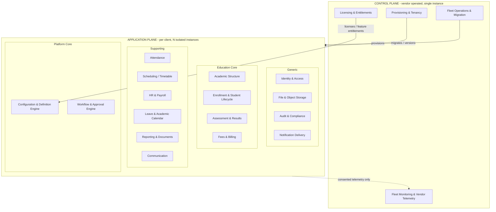
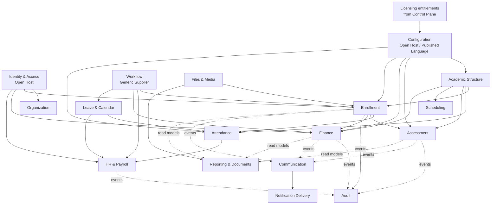
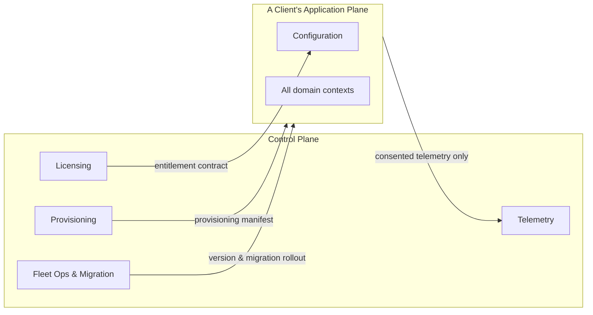
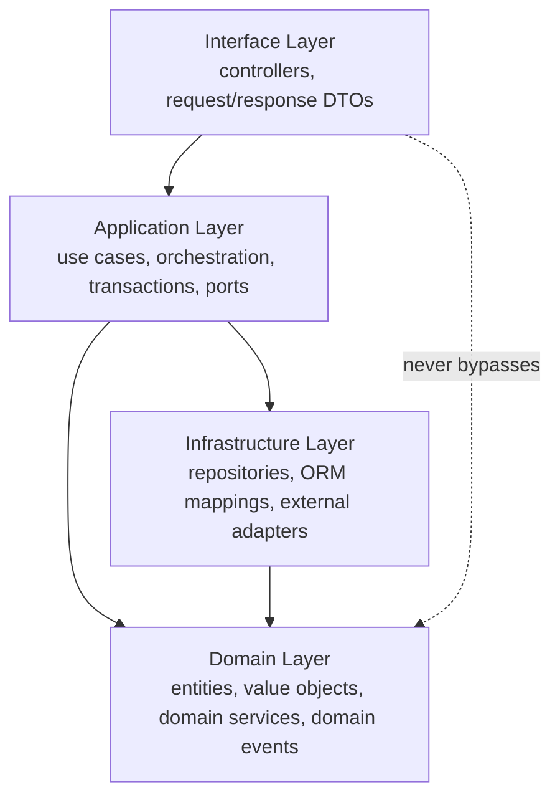

# Enterprise Education ERP — Architecture Blueprint
## Part A — Strategy & Domain Design

**Product:** Enterprise Education ERP (configurable, multi-institution)
**Architecture style:** Two-plane Modular Monolith
**Tenancy model:** Isolated deployment per client (separate database, storage, config)
**Document status:** Part A of the full blueprint. Covers Sections 1–8. Parts B–F follow on approval.
**Decision format:** Every significant decision is recorded as Recommendation → Why → Pros → Cons → Alternatives → Final Decision.

> Scope of Part A: the strategic shape of the system and its domain model — the executive summary, the Domain-Driven Design analysis, the domain map, subdomain classification, bounded contexts, their relationships, the modular-monolith structure, and the module dependency rules. No backend internals, database schema, or non-functional design appears here; those are Parts B–E. This part is the foundation the rest depends on, so it is deliberately thorough.

---

## 1. Executive Architecture Summary

### 1.1 The shape of the system in one paragraph

The product is a configuration-driven Education ERP delivered as **two cooperating modular monoliths**. A single vendor-operated **Control Plane** provisions, licenses, migrates, and monitors a fleet of isolated client deployments. Each client runs its own **Application Plane** instance — a self-contained modular-monolith ERP with its own PostgreSQL database, object storage, and configuration, serving multiple institutes, campuses, and academic sessions for that one client. Inside the Application Plane, behavior is driven by data, not code: a first-class **Configuration & Definition Engine** and a **declarative Workflow Engine** let academic structures, grading, fees, custom fields, forms, and approval flows be defined and versioned without deployments. Bounded contexts are implemented as strictly-encapsulated NestJS modules that integrate only through published interfaces and in-process domain events, so the system stays simple to operate as one deployable, yet internally decoupled enough to evolve — or, if ever truly necessary, to extract a module — over a ten-year horizon.

### 1.2 The five decisions that define the architecture

The architecture rests on five load-bearing decisions, each detailed later in this document and in Parts B–F:

First, a **two-plane split**: the fleet-management concerns (provisioning, licensing, migration, monitoring) live in a separate Control Plane, never mixed into the per-client ERP. Second, **isolated-deployment-per-client tenancy**: each client is a physically separate database and storage, giving clean isolation and white-label readiness at the cost of an operations commitment that the Control Plane exists to absorb. Third, a **modular monolith, not microservices**: one deployable per plane, with enforced internal module boundaries — the right balance of simplicity and structure for a 4–8 engineer team. Fourth, **configuration as a core upstream domain**: the Configuration Engine is not a helper utility but a bounded context that most other contexts depend on, because the entire product thesis is no-code adaptability. Fifth, **event-and-interface integration between modules**, never shared database access, so boundaries are real and the monolith does not silently rot into a tangle.

### 1.3 Guiding principles

The architecture is governed by a small set of principles applied consistently throughout the blueprint. **Configuration over code** — institution-specific knowledge lives in data; the engine is generic and never names a school or a university. **Isolation by default** — client data never crosses deployment boundaries; only consented, anonymized vendor telemetry leaves a client. **Boundaries are enforced, not aspirational** — module encapsulation is checked by tooling, not left to discipline. **Build to the team** — every abstraction must be maintainable by a small senior team; we reject complexity (sandboxed plugins, BPMN engines, premature microservices) that the team cannot sustainably own. **Compliance is designed in** — audit, encryption, retention, and exportability are baseline capabilities, not later retrofits.

### 1.4 What this architecture explicitly is not

To prevent scope drift, the blueprint explicitly excludes: microservices (rejected in Section 7), shared multi-tenant databases (rejected by the tenancy model), sandboxed third-party plugin execution (out of scope for early phases per Cluster 8), a third-party BPMN workflow engine (rejected in favor of a declarative state machine per Cluster 3), and runtime creation of arbitrary new entities (excluded by the Level-B configuration scope per Cluster 2). These exclusions are deliberate and protect the small team's ability to deliver and maintain the system.

### 1.5 Scale envelope this architecture targets

The structure is sized for the trajectory you confirmed: 10–20 client deployments in year one, 50–100 by year three, 200+ by year five, with a largest single client of 30,000+ students, 2,000+ staff, and 3,000+ concurrent users during peak events such as result publishing, online admission, fee generation, and semester registration. Part E details how partitioning, read replicas, Redis, and queue-based load-shedding meet these peaks; Part A only notes that the domain and module structure are designed so that the heavy contexts (Assessment, Finance, Enrollment) are independently optimizable without disturbing the rest.

---

## 2. Domain-Driven Design

### 2.1 Why strategic DDD, and why it matters more here than usual

Strategic DDD is the practice of dividing a large problem into bounded contexts, each with its own consistent model and language, and being deliberate about how those contexts relate. For most products this is good hygiene. For this product it is essential, for two reasons specific to your requirements. First, the configuration-driven thesis means the *meaning* of core concepts varies per client — a "level" is a Class in one deployment and a Semester in another — so the system must separate the stable structural model from the client-specific labels and rules, which is exactly a bounded-context concern. Second, the separate-deployment tenancy and the control/application split create a natural, hard boundary that DDD context mapping describes precisely. Getting the boundaries right now is what lets a small team build incrementally without the modules collapsing into each other.

> **Decision D1 — Adopt strategic DDD with explicit bounded contexts as the organizing principle.**
> **Recommendation:** Organize the entire system as a set of bounded contexts, each implemented as an encapsulated module, with explicit context mapping between them.
> **Why:** The domain is large (20+ contexts), multi-institution, and configuration-driven; without enforced boundaries a small team will produce a big ball of mud within two years. DDD gives a shared language and hard seams.
> **Pros:** Clear ownership; localized change; testability; future extraction possible; onboarding is easier because each context is self-describing.
> **Cons:** Upfront design cost; requires discipline and tooling to enforce; some duplication of similar concepts across contexts (e.g., a student reference appears in several contexts).
> **Alternatives:** (a) Layered-only architecture with no context boundaries — simpler initially, rots fast. (b) Microservices — real boundaries but operationally unaffordable for this team and tenancy model. (c) Anemic CRUD modules — fast to start, no domain integrity, fails the configuration thesis.
> **Final Decision:** Strategic DDD with enforced module boundaries. The duplication cost is real but acceptable and is managed by a minimal shared kernel (Section 8).

### 2.2 The two planes as the top-level domain division

Before listing education domains, the single most important domain distinction is between the two planes, because they have entirely different actors, lifecycles, and even deployment topology.

The **Control Plane** is the vendor's domain. Its actors are the vendor's operations and support staff. Its concern is the *fleet* — creating client deployments, issuing licenses and entitlements, rolling out version migrations across all databases safely, and watching fleet health and product telemetry. It holds no student, fee, or academic data. It is deployed once, centrally, by the vendor.

The **Application Plane** is the client's domain. Its actors are the institution's administrators, teachers, students, parents, and accountants. Its concern is running *one institution group's* education operations. It holds all the sensitive education data. It is deployed N times, once per client, in isolation.

This division is structural and permanent. Everything in Sections 3–8 is tagged to one plane or the other.

---

## 3. Domain Map

The domain map below shows all domains grouped by plane and by strategic category. The categories — Platform Core, Education Core, Supporting, Generic, and Control Plane — are defined and justified in Section 4.

The arrows from the Control Plane into the Application Plane are deliberately few and one-directional: the Control Plane provisions, licenses, and migrates; the Application Plane emits only consented telemetry back. No student data flows upward.

---

## 4. Subdomain Classification

Classifying subdomains by strategic value tells the team where to invest its best engineering and where to keep things deliberately simple. The classes are: **Core** (the competitive differentiators — invest the most), **Supporting** (necessary and somewhat specific, but not differentiators), and **Generic** (commodity problems — use standard patterns and libraries, do not over-engineer). Because this product's differentiation is split between its no-code platform capabilities and its education domain, the Core class is divided into **Platform Core** and **Education Core**. The Control Plane is classified separately as its own operational core.

### 4.1 Platform Core (the strategic heart — horizontal capabilities)

These are the capabilities that make the product configurable, which is the entire reason it can serve schools, universities, and madrasas from one codebase. They deserve the strongest engineers and the most rigorous design.

The **Configuration & Definition Engine** holds the definition registry (institution types, templates, hierarchy-level catalog), dynamic custom fields, dynamic forms, configurable grading and fee structures, terminology, configuration versioning, audit history, and rollback. The **Workflow & Approval Engine** holds workflow definitions and running instances supporting sequential and conditional approvals, escalation, delegation, and timeout actions, defined declaratively as data.

### 4.2 Education Core (the strategic domain — vertical capabilities)

These are the education domains where correctness and richness directly determine product value. **Academic Structure** owns the configurable hierarchy and the subject/course catalogue. **Enrollment & Student Lifecycle** owns admission, student records, enrollment, promotion, transfer, and status from applicant to alumnus. **Assessment & Results** owns exams, configurable grading systems, marks, result processing, and transcripts. **Fees & Billing** owns configurable fee structures, invoicing, payments, discounts, and waivers.

### 4.3 Supporting subdomains

Necessary to run an institution, institution-specific in flavor, but not where the product wins or loses: **Attendance**, **Scheduling/Timetable**, **HR & Payroll**, **Leave & Academic Calendar**, **Reporting & Documents**, and **Communication**. These are built solidly but pragmatically, reusing the Platform Core (config, workflow) heavily rather than inventing per-context machinery.

### 4.4 Generic subdomains

Solved problems where the goal is a clean, secure, standard implementation, not innovation: **Identity & Access** (authentication, sessions, devices, RBAC), **File & Object Storage**, **Audit & Compliance logging**, and **Notification Delivery** (the channel-level send infrastructure for email/SMS/push, distinct from the Communication context that decides what to send). For these we lean on established patterns and libraries and resist gold-plating.

### 4.5 Control Plane subdomains

Operationally core to the vendor but invisible to clients: **Provisioning & Tenancy**, **Licensing & Entitlements**, **Fleet Operations & Migration**, and **Fleet Monitoring & Vendor Telemetry**. These are small but critical; an immature Control Plane makes 200 deployments unmanageable.

### 4.6 Classification summary

| Subdomain | Plane | Class | Investment level |
|---|---|---|---|
| Configuration & Definition Engine | Application | Platform Core | Highest |
| Workflow & Approval Engine | Application | Platform Core | Highest |
| Academic Structure | Application | Education Core | High |
| Enrollment & Student Lifecycle | Application | Education Core | High |
| Assessment & Results | Application | Education Core | High |
| Fees & Billing | Application | Education Core | High |
| Attendance | Application | Supporting | Medium |
| Scheduling / Timetable | Application | Supporting | Medium |
| HR & Payroll | Application | Supporting | Medium |
| Leave & Academic Calendar | Application | Supporting | Medium |
| Reporting & Documents | Application | Supporting | Medium |
| Communication | Application | Supporting | Medium |
| Identity & Access | Application | Generic | Standard |
| File & Object Storage | Application | Generic | Standard |
| Audit & Compliance | Application | Generic | Standard |
| Notification Delivery | Application | Generic | Standard |
| Provisioning & Tenancy | Control | Control Core | High |
| Licensing & Entitlements | Control | Control Core | Medium |
| Fleet Operations & Migration | Control | Control Core | High |
| Fleet Monitoring & Telemetry | Control | Control Core | Medium |

> **Decision D2 — Treat Configuration and Workflow as Platform Core, not as shared utilities.**
> **Recommendation:** Elevate the Configuration Engine and Workflow Engine to first-class core bounded contexts that other contexts depend on as suppliers.
> **Why:** The product's differentiation and your Level-B requirement (dynamic fields, forms, grading, fees, workflows, all versioned) live entirely in these two engines. Treating them as utilities would scatter configuration logic across every module and reproduce the hard-coding you are trying to eliminate.
> **Pros:** One authoritative place for configurable behavior; consistent versioning/audit/rollback; every domain module gets configurability for free; prevents config logic leaking into domains.
> **Cons:** These engines become critical-path dependencies; a defect here affects many contexts; they require the most careful design and testing.
> **Alternatives:** (a) Per-module configuration — simpler per module, but duplicated and inconsistent, and defeats the thesis. (b) An external low-code platform — too heavy, loses control, and pulls toward runtime arbitrary entities you excluded.
> **Final Decision:** Configuration and Workflow are Platform Core supplier contexts. They are built first and best (reflected in the Part F roadmap).

---

## 5. Bounded Context Design

A bounded context is a boundary within which a model and its language are consistent. Each context below lists its responsibility and the core terms of its ubiquitous language. Contexts are *logical*; Section 7 maps them to modules, and the Part F roadmap sequences which are built first — a small team does not build all twenty on day one.

### 5.1 Application Plane bounded contexts

**Identity & Access Context.** Responsibility: who a user is and what they may do — authentication, refresh tokens, sessions, devices, password recovery, roles, and permissions. Language: User, Credential, Session, Device, Role, Permission, Grant. Upstream to every other context.

**Organization Context.** Responsibility: the structure *within* a client deployment — institutes, campuses, academic sessions, and their relationships and regional settings. Language: Institute, Campus, Academic Session, Shift, Locale. (The client/tenant itself is provisioned by the Control Plane; this context governs what lives inside it.)

**Configuration Context.** Responsibility: definitions and configurable behavior — the definition registry, custom fields, dynamic forms, terminology, configurable grading and fee templates, and configuration versioning, audit, and rollback. Language: Definition, Template, Custom Field, Form Schema, Setting, Scope, Version, Effective Value, Terminology Mapping. A primary upstream supplier.

**Academic Structure Context.** Responsibility: the configurable hierarchy (levels and nodes) and the subject/course catalogue. Language: Level, Node, Enrollment Leaf, Subject, Course, Hierarchy Path. Depends on Configuration for level definitions.

**Enrollment & Student Lifecycle Context.** Responsibility: admission, student master records, enrollment into structure nodes, promotion, transfer, and lifecycle status. Language: Applicant, Admission, Student, Enrollment, Promotion, Transfer, Status. Triggers admission approval via the Workflow context.

**Attendance Context.** Responsibility: presence records for students and staff under configurable modes, and minimum-attendance evaluation. Language: Attendance Record, Mode, Status, Working Day, Minimum Percentage.

**Assessment & Results Context.** Responsibility: exams, configurable grading systems, marks entry, result processing, ranking, and transcripts. Language: Exam, Exam Group, Grading System, Grade Rule, Mark, Result, GPA/CGPA, Transcript. Depends on Configuration for grading definitions.

**Scheduling Context.** Responsibility: timetable, periods, rooms, and conflict detection. Language: Period, Routine Entry, Room, Shift, Conflict.

**Finance Context (Fees & Billing).** Responsibility: configurable fee structures, invoice generation, payments, discounts, waivers, and clearance checks. Language: Fee Type, Fee Structure, Invoice, Payment, Discount, Waiver, Due, Clearance. Depends on Configuration for fee templates; triggers waiver approval via Workflow.

**HR & Payroll Context.** Responsibility: staff records, employment, payroll models, allowances, deductions, and salary processing. Language: Staff, Employment, Payroll Rule, Allowance, Deduction, Salary Slip. Triggers employee/payroll approvals via Workflow.

**Leave & Calendar Context.** Responsibility: leave types and applications, holidays, vacations, and the working-day calendar that Attendance and Payroll consume. Language: Leave Type, Leave Application, Holiday, Vacation, Working Day. Triggers leave approval via Workflow.

**Workflow Context.** Responsibility: declarative workflow definitions and running instances — sequential and conditional approvals, escalation, delegation, and timeout actions — generic and domain-agnostic. Language: Workflow Definition, Step, Condition, Instance, Task, Escalation, Delegation, Timeout, Decision. A primary supplier to several domains.

**Communication Context.** Responsibility: deciding what to communicate and to whom — notices, announcements, templates, targeting, and triggering of notifications on domain events. Language: Notice, Template, Audience, Trigger, Channel Preference.

**Reporting & Documents Context.** Responsibility: report definitions, generation, certificates, and exports, built from read models across contexts. Language: Report Definition, Filter, Dataset, Document Template, Export, Certificate.

**Files & Media Context.** Responsibility: object storage and document lifecycle — upload, retrieval, retention, and deletion. Language: File, Object, Bucket Path, Lifecycle, Retention.

**Audit & Compliance Context.** Responsibility: the append-only audit trail, data export, configurable retention, and erasure support. Language: Audit Entry, Actor, Action, Before/After, Retention Policy, Export Request, Erasure Request.

### 5.2 Control Plane bounded contexts

**Provisioning & Tenancy Context.** Responsibility: the client lifecycle — creating, suspending, and decommissioning isolated deployments, each with its own database and storage. Language: Client, Deployment, Provisioning Manifest, Environment.

**Licensing & Entitlements Context.** Responsibility: plans, feature entitlements, and limits issued to each client, which the Application Plane's Configuration context consumes as feature flags. Language: Plan, Entitlement, Limit, License Token.

**Fleet Operations & Migration Context.** Responsibility: rolling schema and application versions across all deployments safely, with health gating and rollback. Language: Release, Migration Batch, Rollout Wave, Health Gate, Rollback.

**Fleet Monitoring & Telemetry Context.** Responsibility: collecting usage, error, and product telemetry — explicitly excluding student data — for vendor product decisions and fleet health. Language: Metric, Heartbeat, Error Event, Usage Counter.

> **Decision D3 — The Configuration context publishes effective values; consumers never read configuration internals.**
> **Recommendation:** Configuration exposes a query interface returning *resolved effective values* (after scope resolution) and publishes change events; no other context reaches into configuration's storage or models.
> **Why:** Configuration's internal model (scopes, versions, overrides) is complex; leaking it would couple every domain to that complexity and break versioning guarantees.
> **Pros:** Domains stay simple — they ask "what is the effective grading scale here?" and get an answer; configuration can evolve its internals freely; versioning and audit stay centralized.
> **Cons:** A query indirection on hot paths (mitigated by caching, Part E); requires a well-designed published contract.
> **Alternatives:** (a) Shared configuration tables read directly — fast but couples everyone to the schema. (b) Embedding config in each domain — defeats the thesis.
> **Final Decision:** Published-language query interface plus change events, with aggressive caching of resolved values.

---

## 6. Context Relationships

Context mapping records *how* contexts integrate and which side leads. The patterns used here are the standard DDD ones: **Customer/Supplier** (downstream depends on upstream, who accommodates them), **Conformist** (downstream simply accepts upstream's model), **Anti-Corruption Layer / ACL** (downstream translates upstream's model to protect its own), **Open Host Service / Published Language** (an upstream offers a stable public contract for many consumers), and **Shared Kernel** (a small shared model, used sparingly).

### 6.1 The integration mechanism in a modular monolith

Because both planes are modular monoliths, contexts integrate **in-process**, by two means only. Synchronous needs (e.g., "give me the effective fee structure," "does this user have this permission") go through a published **application interface / query port** exposed by the upstream context. Asynchronous needs (e.g., "a student was enrolled," "a result was published") go through an in-process **domain event bus** that downstream contexts subscribe to. Cross-context access to another context's entities, repositories, or tables is forbidden (enforced in Section 8). This is what makes the boundaries real despite everything running in one process.

> **Decision D4 — Integrate contexts via published interfaces and domain events only; never via shared data access.**
> **Recommendation:** All cross-context interaction occurs through an upstream context's published query interface or through domain events on an in-process bus.
> **Why:** Shared database access between modules is the single most common way a modular monolith degrades into a big ball of mud; it creates hidden coupling that defeats the boundaries.
> **Pros:** Real decoupling; each context owns its data; future extraction to a service is possible because the contract already exists; clear, testable seams.
> **Cons:** Some indirection and event plumbing; eventual consistency for event-driven flows; developers must resist the temptation to "just join the table."
> **Alternatives:** (a) Shared tables / cross-module repositories — fastest, rots fastest. (b) A message broker (Kafka/RabbitMQ) even in-monolith — unnecessary operational weight for in-process events now; reserved for later if a context is extracted.
> **Final Decision:** Published interfaces plus an in-process domain event bus. A real broker is deferred to Part E and only if a context is ever extracted.

### 6.2 Application Plane context relationship map

### 6.3 The defining relationships, explained

**Identity & Access is Open Host to everyone.** It publishes a stable user/permission contract that all contexts conform to. No context invents its own notion of a user. This is upstream of all.

**Configuration is Open Host / Published Language to the domain contexts.** Academic Structure, Assessment, Finance, Enrollment, and Attendance are **customers** of Configuration; they consume resolved effective values through its published interface and protect themselves with a thin ACL so that a change in configuration's internals never ripples into domain logic. Configuration in turn is a **customer** of the Control Plane's Licensing context, conforming to the entitlements it is issued.

**Academic Structure is supplier to the education domains.** Enrollment, Attendance, Assessment, Scheduling, and Finance all reference the hierarchy; Academic Structure leads and they conform to its node model.

**Enrollment is supplier to the activity domains.** Attendance, Assessment, and Finance all reference enrolled students; Enrollment leads.

**Workflow is a Generic Supplier with an important inversion.** Enrollment (admission), HR (leave, employee), Finance (fee waiver), and Leave are **customers** of Workflow — but Workflow must remain domain-agnostic. So the relationship is inverted through events: a domain *registers a workflow definition* and *raises a request*; Workflow runs the generic state machine and emits decision events; the domain reacts. Workflow never imports domain concepts. This keeps the engine reusable and prevents domain logic leaking into it. An ACL on each domain side translates generic workflow decisions into domain actions.

**Audit and Communication are downstream event consumers.** Every significant domain action raises a domain event; Audit subscribes to record it append-only, and Communication subscribes to decide whether to notify. The domains do not know who is listening — pure publish/subscribe — which keeps them decoupled from cross-cutting concerns. Notification Delivery sits downstream of Communication as the channel-level sender.

**Reporting is downstream and read-only.** It builds from dedicated read models fed by events or queried through published interfaces, never by reaching into source tables, so that reporting load and schema are isolated from the transactional contexts.

### 6.4 Control Plane to Application Plane relationship

The Control Plane is **upstream supplier** to the Application Plane through a strict **Published Language**: a provisioning manifest (what deployment to create) and a license/entitlement contract (what features and limits apply). The Application Plane **conforms** to these. The only upstream flow is **consented telemetry** — usage, error, and product metrics with no student data — which the Application Plane publishes and the Control Plane's Telemetry context consumes. This single, narrow, well-defined seam is what allows 200+ isolated deployments to be managed centrally without compromising isolation.

---

## 7. Modular Monolith Architecture

### 7.1 Why modular monolith, decisively

> **Decision D5 — Modular Monolith per plane, not microservices.**
> **Recommendation:** Build each plane as a single deployable modular monolith with strictly encapsulated internal modules.
> **Why:** A 4–8 engineer team with a 6-month deadline and 200+ isolated deployments cannot afford the operational tax of microservices (network boundaries, distributed transactions, per-service CI/CD, observability across services) — multiplied across every client deployment. A modular monolith gives most of the architectural benefit (clear boundaries, independent evolution) with a fraction of the operational cost. The isolation you need is already provided by the per-client deployment model, not by service decomposition.
> **Pros:** One deployable to build, test, ship, and run per plane; in-process calls (no network failure modes); single transaction boundary available where needed; far simpler operations across 200 deployments; faster development for a small team; boundaries still enforced internally.
> **Cons:** A bad change can affect the whole deployable; scaling is coarse-grained (scale the whole app, not one module) — though acceptable given per-client deployments; requires discipline/tooling to keep modules from coupling.
> **Alternatives:** (a) Microservices — real independent scaling and deployment, but operationally unaffordable here and adds distributed-systems complexity the domain does not need. (b) Layered monolith with no module boundaries — simplest, but no real seams; rots. (c) Modular monolith now with selective extraction later — this is effectively our choice, with the extraction option preserved by strict boundaries.
> **Final Decision:** Modular monolith per plane, with boundaries strict enough that any single context could later be extracted if a genuine, measured need arises. We do not extract now.

### 7.2 The two deployables

There are exactly two application artifacts. The **Control Plane** deployable runs once, centrally, and contains the four control contexts. The **Application Plane** deployable is what gets provisioned per client; every client runs the same artifact against its own isolated database and storage, with behavior differentiated entirely by configuration and license entitlements — never by per-client code. This "same artifact, different data" rule is what keeps 200+ deployments maintainable: there is one codebase to patch, and the Fleet Operations context rolls it out.

> **Decision D6 — One Application Plane artifact for all clients; differentiation by configuration, never by per-client code or branches.**
> **Recommendation:** Ship an identical Application Plane build to every client; all client-specific behavior comes from configuration and entitlements.
> **Why:** Per-client code branches or forks would make 200 deployments unmaintainable and would reintroduce the hard-coding the product exists to avoid.
> **Pros:** One codebase to secure and patch; fleet-wide migrations are uniform; the configuration thesis is enforced structurally; white-labeling is runtime config.
> **Cons:** Every client capability must be expressible as configuration or entitlement — a real design constraint on every feature; no quick per-client hacks.
> **Alternatives:** (a) Per-client forks/branches — flexible short-term, catastrophic long-term. (b) Build-time per-client variants — still N artifacts to manage.
> **Final Decision:** Single artifact, configuration-driven differentiation. The design constraint is accepted as a feature, not a limitation.

### 7.3 Internal structure of a plane — modules over layers, layered within modules

Each plane is organized **primarily by module (bounded context) and secondarily by layer**. That is, the top-level structure is a set of modules (one per bounded context), and *inside* each module sits a consistent four-layer structure. This "modules first, layers inside" arrangement keeps all of a context's code together (high cohesion) rather than scattering it across global "controllers/services/repositories" folders.

The four layers inside every module, with the dependency rule that dependencies point strictly inward:

The **Interface layer** handles transport — receiving requests and shaping responses — and nothing else. The **Application layer** holds use cases: it orchestrates domain objects, manages transactions, and defines *ports* (interfaces) that infrastructure implements; it is where cross-context calls are made through published contracts. The **Domain layer** is pure: entities, value objects, domain services, and domain events, with no dependency on frameworks, ORM, or other modules — this is where business invariants live. The **Infrastructure layer** implements the ports: repositories, persistence mappings, and adapters to external systems (storage, email, the event bus). Dependencies always point inward toward the domain; the domain depends on nothing outward. This is the standard clean/onion arrangement, applied per module.

### 7.4 The shared kernel and platform foundation

A deliberately **minimal shared kernel** holds only the most stable, universal primitives: base entity conventions, common value objects (such as Money, DateRange, identifiers), result and error types, and the domain-event base. It is intentionally tiny because every addition couples all modules to it; changes to the shared kernel require architecture review (Section 8). Alongside it, a **platform foundation** provides cross-cutting infrastructure that modules use but that carries no business meaning: the event bus, the configuration query client, the identity/permission client, logging, and caching access. The platform foundation is infrastructure, not a domain, and domains depend on it through interfaces.

### 7.5 How bounded contexts map to modules

The mapping is one-to-one in the common case: each bounded context from Section 5 becomes one top-level module. A few generic contexts (Files, Notification Delivery, Audit) are thin and may be implemented as platform-foundation services rather than full domain modules, since they have little domain logic. The Part F roadmap sequences construction; logically, the complete module set is the context set from Section 5.

---

## 8. Module Dependency Rules

Boundaries that are not enforced are merely suggestions. These rules are mandatory, and Part B specifies the tooling that enforces them (module encapsulation, lint boundary rules, and architecture tests in CI).

### 8.1 The dependency rule (within a module)

Inside any module, dependencies point inward only: Interface → Application → Domain, and Infrastructure → Domain, with the Application layer depending on Domain and defining ports that Infrastructure implements. The Domain layer depends on nothing outside itself — no framework, no ORM, no other module. Any violation (for example, a controller calling a repository directly, or an entity importing an ORM decorator into pure domain code) is a defect caught in review and CI.

### 8.2 The cross-module rules (between modules)

Cross-module interaction is permitted **only** through (a) another module's published application interface / query port, or (b) domain events on the in-process event bus. The following are forbidden without exception: importing another module's entities, value objects, repositories, or infrastructure; querying another module's tables; and sharing an ORM relationship across a module boundary. A module's internals are private; only its published contract is public.

### 8.3 The allowed dependency direction (the module graph must be acyclic)

Modules are layered into tiers, and dependencies may only point from a higher tier to a lower (more foundational) tier, never the reverse and never sideways into a peer's internals. The tiers, from most foundational upward:

| Tier | Modules | May depend on | May NOT depend on |
|---|---|---|---|
| 0 — Platform foundation | Event bus, config client, identity client, logging, cache | Shared kernel only | Any domain module |
| 1 — Platform Core | Configuration, Workflow | Foundation, shared kernel | Education/Supporting domains |
| 1 — Generic | Identity & Access, Files, Audit, Notification Delivery | Foundation, shared kernel | Education/Supporting domains |
| 2 — Education Core (structural) | Academic Structure | Configuration, Identity, foundation | Enrollment and downstream domains |
| 3 — Education Core (activity) | Enrollment | Academic Structure, Configuration, Identity, Workflow | Assessment/Finance/Attendance internals |
| 4 — Activity & Supporting | Attendance, Assessment, Finance, Scheduling, HR & Payroll, Leave & Calendar | Tiers below + Workflow + Configuration | Each other's internals (use events) |
| 5 — Cross-cutting consumers | Communication, Reporting & Documents | Events + published read interfaces | Writing into source domains |

The key consequences: Platform Core and Generic modules must **never** depend on a domain module (Configuration cannot know about Enrollment); domains depend on platforms, not the reverse. Workflow and Configuration are depended-upon by many but depend on none of the domains, preserving their reusability. Peer domains at Tier 4 integrate with each other **only through events**, never direct calls, which keeps the graph acyclic. Communication and Reporting sit at the top as pure consumers and never write back into domains.

> **Decision D7 — Enforce an acyclic, tiered module dependency graph with platform contexts strictly below domain contexts.**
> **Recommendation:** Permit dependencies only downward through the tier table above; forbid cycles and sideways internal access; enforce in CI.
> **Why:** Without an enforced acyclic graph, a modular monolith inevitably develops circular and hidden dependencies that make it unshippable in parts and unextractable later. Keeping platform engines below domains guarantees their reusability and prevents the configuration/workflow engines from absorbing domain knowledge.
> **Pros:** Predictable build/test order; no cycles; reusable platform engines; future extraction stays possible; new engineers can reason about allowed dependencies from one table.
> **Cons:** Occasionally forces an event-based interaction where a direct call would have been quicker to write; requires CI enforcement tooling.
> **Alternatives:** (a) Unconstrained dependencies with good intentions — fails within months. (b) Strict layering without a module graph — controls layers but not inter-module cycles.
> **Final Decision:** Tiered acyclic module graph, enforced by architecture tests and boundary lint rules in CI (specified in Part B).

### 8.4 Shared kernel governance

The shared kernel is the one place all modules legitimately share code, which makes it dangerous. Rule: nothing enters the shared kernel unless it is universal, stable, and free of business-domain meaning (Money and DateRange qualify; "Student" does not). Every change to the shared kernel requires explicit architecture review, because it ripples across all modules. When in doubt, duplicate a small value object in two contexts rather than promote it to the kernel — duplication is cheaper than coupling.

### 8.5 Event and contract stability

Because events and published interfaces are the integration surface, they are treated as **contracts**: they are versioned, documented, and changed with care, since a breaking change affects every subscriber or caller. Domain events are named in past tense (StudentEnrolled, ResultPublished) and carry a stable, minimal payload. Adding fields is safe; removing or repurposing them is a breaking change requiring coordinated review. Part B defines the event contract and versioning conventions.

---

## Part A — Closing Note and What Comes Next

Part A has established the strategic skeleton: a two-plane modular monolith, isolated-deployment tenancy managed by a lightweight Control Plane, Configuration and Workflow elevated to Platform Core supplier contexts, a complete set of bounded contexts with explicit relationships, and an enforced, acyclic, tiered module dependency graph. Every later part hangs off this structure — the backend folder layout (Part B) realizes the module-and-layer arrangement of Section 7; the database design (Part B) respects the per-context data ownership of Section 6; authentication and authorization (Part C) implement the Identity Open Host of Section 6; and the roadmap (Part F) sequences the contexts of Section 5 for a small team to deliver in six months.

**Awaiting your approval to proceed to Part B — Backend & Data Architecture** (backend folder structure, modules, shared components, domain/application/infrastructure layers, DTO/entity/repository/service strategy, guards/filters/interceptors/middleware, the full PostgreSQL architecture, the Configuration Engine design, and the Workflow Engine design).

*End of Part A.*
