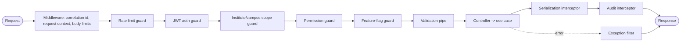
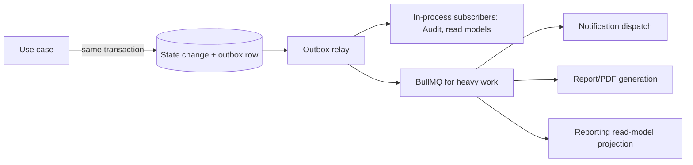
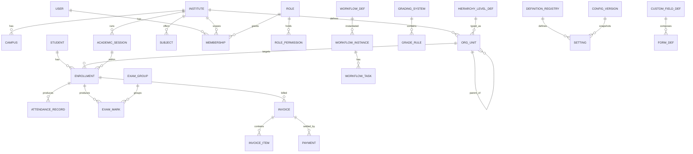

# Enterprise Education ERP — Architecture Blueprint
## Part B — Backend & Data Architecture

**Scope:** Backend application architecture, the layered module internals, the request pipeline, asynchronous infrastructure, and the complete PostgreSQL data architecture, including the resolution of the TypeORM-versus-dynamic-configuration question.
**Status:** Part B of the blueprint. Builds directly on Part A's two-plane modular monolith, bounded contexts, and tiered module dependency graph.
**Constraint:** No source code. Folder trees, conceptual ERDs, table designs, field listings, and strategies only.
**Decision format:** Significant decisions recorded as Recommendation → Why → Pros → Cons → Alternatives → Final Decision. (Decision numbering continues from Part A; this part is D8–D24.)

---

## B-1. NestJS Application Architecture (Sections 1–3, 11–12)

### 1. Complete NestJS Architecture

The Application Plane is a single NestJS application organized **modules-first, layered-inside**, exactly as Part A Section 7 specified. NestJS's own module system is the enforcement mechanism for bounded-context boundaries: each bounded context is a NestJS feature module that exports only its published application interface and its event contracts, and keeps everything else (domain models, persistence, repositories) private to the module. A context that wants another context's capability imports that context's *published provider*, never its internals — and NestJS's provider encapsulation makes "internals" genuinely unreachable rather than merely discouraged.

The application is composed of four top-level concerns that map to four root folders: the **bounded-context modules** (`modules/`), the **platform foundation** (`platform/`) which is tier-0 infrastructure with no domain meaning, the **shared kernel** (`shared/`) which is the tiny stable set of universal domain primitives, and the **common plumbing** (`common/`) which holds the NestJS-specific cross-cutting pipeline elements (guards, interceptors, filters, middleware). This separation matters: it keeps framework plumbing out of the domain, keeps infrastructure out of business logic, and gives each of the four a different change-control policy (the shared kernel is the most locked-down; common plumbing is the most freely edited).

> **Decision D8 — Persistence model and domain model are separated for Core contexts; pragmatically merged for Generic/Supporting contexts.**
> **Recommendation:** In Platform Core and Education Core contexts (Configuration, Workflow, Academic Structure, Enrollment, Assessment, Finance), keep a pure domain model distinct from TypeORM persistence entities, with mappers between them. In Generic and simpler Supporting contexts (Files, Audit, Notification, Attendance, Scheduling), allow TypeORM entities to serve directly as the working model to avoid ceremony.
> **Why:** Full domain/persistence separation everywhere is the textbook clean-architecture answer, but for a 4–8 engineer team it is too much ceremony in CRUD-heavy contexts where there is little real domain logic. Concentrating the separation where business invariants are rich (results processing, fee calculation, configuration versioning) buys correctness where it matters and speed where it does not.
> **Pros:** Domain logic in core contexts is testable without a database and insulated from ORM quirks; simpler contexts ship faster; the team applies effort proportionally.
> **Cons:** Two conventions in one codebase (must be clearly documented so engineers know which applies where); a context that grows in complexity may need to be "promoted" to full separation later.
> **Alternatives:** (a) Full separation everywhere — purest, slowest, over-engineered for CRUD. (b) ORM-entities-as-domain everywhere — fastest, but rich domains (grading, fees) leak persistence concerns into business logic and become hard to test and change.
> **Final Decision:** Calibrated separation — full in Core, merged in Generic/Supporting — with the classification documented in the engineering standards (Part F) so the rule is unambiguous.

### 2. Backend Folder Structure

The structure below is the canonical layout. Every bounded-context module repeats the same internal four-layer shape, so an engineer who learns one module can navigate all of them.

```
src/
├── main.ts                          # bootstrap, global pipes/filters/interceptors
├── app.module.ts                    # composition root: wires modules + platform
│
├── modules/                         # one folder per bounded context (Part A §5)
│   ├── configuration/
│   │   ├── configuration.module.ts  # public provider exports + event subscriptions
│   │   ├── interface/               # controllers + request/response DTOs (transport only)
│   │   ├── application/             # use-cases, application services, ports (interfaces)
│   │   ├── domain/                  # domain entities, value objects, domain services, events
│   │   └── infrastructure/          # ORM persistence entities, repository impls, adapters, mappers
│   ├── workflow/                    #   (same four-layer shape)
│   ├── identity/
│   ├── organization/
│   ├── academic-structure/
│   ├── enrollment/
│   ├── attendance/
│   ├── assessment/
│   ├── scheduling/
│   ├── finance/
│   ├── hr-payroll/
│   ├── leave-calendar/
│   ├── communication/
│   └── reporting/
│
├── platform/                        # tier-0 foundation, no domain meaning
│   ├── persistence/                 # TypeORM datasource, base repository, transaction manager
│   ├── event-bus/                   # in-process domain event dispatcher
│   ├── outbox/                      # transactional outbox + relay
│   ├── cache/                       # Redis access, cache-aside helpers, invalidation
│   ├── queue/                       # BullMQ setup, producers
│   ├── jobs/                        # scheduler + repeatable job definitions
│   ├── storage/                     # S3/MinIO object-storage adapter
│   ├── config-client/              # query port into Configuration context (resolved values)
│   ├── identity-client/            # query port into Identity context (user/permission)
│   └── observability/               # structured logging, metrics, tracing
│
├── shared/                          # shared kernel — tiny, stable, domain-neutral
│   ├── domain/                      # BaseEntity conventions, value objects (Money, DateRange, Id), Result, DomainEvent base
│   └── types/                       # universal types, error taxonomy
│
├── common/                          # NestJS cross-cutting plumbing
│   ├── guards/                      # auth, tenant/institute scope, permissions
│   ├── interceptors/                # context, audit, serialization, timeout, cache
│   ├── filters/                     # global exception filter, domain-error mapping
│   ├── middleware/                  # correlation id, request context, body limits
│   ├── decorators/                  # @CurrentUser, @CurrentScope, @RequirePermissions, @RequireFeature
│   ├── pipes/                       # validation pipe config, dynamic-field validation pipe
│   └── dto/                         # base DTOs: pagination, filtering, envelope
│
└── config/                          # application/env config (NOT business configuration)
```

> **Decision D9 — Four named roots (`modules`, `platform`, `shared`, `common`) with distinct change-control.**
> **Recommendation:** Separate domain modules, infrastructure foundation, the shared kernel, and framework plumbing into four roots, each with its own review policy.
> **Why:** Conflating them (the common "everything in shared/" anti-pattern) is how monoliths lose their boundaries; distinct roots make dependency direction and change risk visible at a glance.
> **Pros:** Clear ownership; the shared kernel can be locked down while plumbing stays editable; new engineers learn the map quickly.
> **Cons:** Requires occasional judgment about where a new utility belongs; some teams find four roots more than they're used to.
> **Alternatives:** (a) Single `shared/` for all cross-cutting code — simpler, but mixes domain primitives with framework plumbing and infra. (b) Type-first global folders (`controllers/`, `services/`) — scatters each context's code, defeats cohesion.
> **Final Decision:** Four roots as above, documented in engineering standards.

### 3. Module Structure

A module's `*.module.ts` is its public contract. It declares which providers are exported (the application services other contexts may call), registers the controllers in its interface layer, and wires its infrastructure implementations to the ports its application layer defines. The rule from Part A Section 8 is realized here mechanically: a module exports *only* its application service interfaces and never its repositories, persistence entities, or domain internals. Cross-module imports of anything not exported are impossible through Nest's DI, and a CI architecture test additionally fails the build if a module file path imports from another module's `domain/` or `infrastructure/` folders.

Each module also declares its **event subscriptions** (which domain events from other contexts it reacts to) and its **published events** (its event contracts). This makes a module self-describing: reading its module file tells you what it offers, what it consumes synchronously, and what it reacts to asynchronously.

### 11. Shared Module Strategy

The shared module (`shared/`) is the shared kernel and is deliberately minimal. It contains only universal, stable, domain-neutral building blocks: the base entity conventions (identifier type, timestamp fields, soft-delete marker, optimistic-lock version), reusable value objects that genuinely recur everywhere (Money with currency, DateRange, PercentageScore, a strongly-typed Id), the domain-event base type, and a Result/error taxonomy used for explicit success/failure returns. Nothing with business-domain meaning enters it — "Student," "Invoice," and "Grade" belong to their contexts, not the kernel. The governing rule from Part A holds: when unsure, duplicate a small value object across two contexts rather than promote it, because duplication is cheaper than the coupling a shared-kernel addition creates. Every change to the shared module requires architecture review because it ripples across all modules.

### 12. Common Module Strategy

The common module (`common/`) holds the NestJS-specific cross-cutting plumbing that the request pipeline needs but that carries no domain meaning: guards, interceptors, exception filters, middleware, decorators, pipes, and base transport DTOs (pagination, filtering, the response envelope). This is distinct from the shared kernel (which is domain primitives) and from the platform foundation (which is infrastructure like Redis and the event bus). The distinction matters because these three have different natures: common plumbing is framework-coupled and freely editable; the shared kernel is domain and locked-down; the platform is infrastructure and adapter-based. Keeping them apart prevents the classic mess where a "utils" or "shared" folder accumulates guards, value objects, database helpers, and string utilities in one undifferentiated heap.

---

## B-2. Layered Module Internals (Sections 4–10)

### 4. Domain Layer Design

The domain layer is the innermost layer and, in Core contexts, the heart of the system. It contains domain entities and aggregates that own business invariants, value objects that model concepts without identity, domain services for logic that spans multiple entities, and domain events that record significant occurrences. It depends on nothing outward — no NestJS, no TypeORM, no other module — which is what lets it be unit-tested in isolation and kept stable while infrastructure churns around it.

The aggregate is the key design unit: a cluster of entities and value objects with a single root that enforces consistency for the whole cluster and is the only entry point for changes. Examples in this system: a Result aggregate enforces that weighted components sum correctly and grades derive from the active grading system; a FeeInvoice aggregate enforces that line items, discounts, and net amounts stay consistent; a WorkflowInstance aggregate enforces that step transitions follow the definition. Aggregates are kept deliberately small — large aggregates create contention and transaction bloat — and references between aggregates are by identity, not by object graph, which also keeps TypeORM relationships from sprawling across the model.

### 5. Application Layer Design

The application layer orchestrates use cases. Each use case is a thin coordinator that loads aggregates through repository ports, invokes domain behavior, persists results, raises domain events through the outbox, and manages the transaction boundary. It contains no business rules itself — those live in the domain — and no transport concerns — those live in the interface layer. It is also where this context's calls to *other* contexts happen, always through published interfaces (for example, Finance's application layer asks the Configuration client for the effective fee structure and asks the Identity client for permission checks). The application layer defines **ports**: interfaces for the things it needs (repositories, the config client, the storage adapter) which the infrastructure layer implements. This dependency inversion is what keeps the application and domain layers free of infrastructure detail.

The transaction boundary lives here, at the use-case level: one use case is one transaction (with rare, explicit exceptions), and the domain events it produced are written to the outbox *inside the same transaction* so that an event is never lost or emitted for a rolled-back change. This is the linchpin of reliable event-driven integration and is detailed in Section 18.

### 6. Infrastructure Layer Design

The infrastructure layer implements the ports the application layer declares. It holds the TypeORM persistence entities (the database-shaped model), the repository implementations that translate between persistence entities and domain models via mappers (in Core contexts), the adapters to external systems (object storage, email/SMS providers, the cache), and the event-publishing implementation. It is the only layer that knows about TypeORM, Redis, S3, or any concrete technology. Because it sits at the outer edge and implements inward-facing ports, any of these technologies can be swapped by writing a new adapter without touching domain or application code — the practical payoff of the dependency rule.

### 7. DTO Strategy

> **Decision D10 — Separate, explicit request and response DTOs; never expose persistence entities across the API.**
> **Recommendation:** Define distinct request DTOs (validated input) and response DTOs (serialized output) in the interface layer; map to/from domain or persistence models internally; never serialize a TypeORM entity directly to a client.
> **Why:** Leaking entities couples the API contract to the database schema, accidentally exposes internal or soft-deleted fields, and breaks the moment the schema changes. Explicit DTOs give a stable, documented, intentional API surface.
> **Pros:** Stable API independent of schema; precise control over what is exposed (no accidental leakage of audit fields, password hashes, internal flags); clean Swagger documentation; versionable.
> **Cons:** Mapping boilerplate between DTOs and models; two shapes to maintain per resource.
> **Alternatives:** (a) Return entities directly — fastest, but couples and leaks; a frequent source of security and compatibility bugs. (b) Generic serialization with field exclusion decorators on entities — better than nothing, but still couples the API to the entity and is easy to get wrong.
> **Final Decision:** Explicit request/response DTOs with a thin mapping layer. Request DTOs carry validation rules; response DTOs are pure shape. Pagination, filtering, and the response envelope come from `common/dto`.

The DTO strategy also accounts for the dynamic side: where a resource carries configurable custom fields, the static DTO covers the fixed columns and a typed `customFields` map covers the dynamic ones, validated at runtime against the field definitions (Section 17). This keeps the static contract stable while admitting per-client custom data.

### 8. Entity Strategy

Per Decision D8, Core contexts maintain two models — a pure **domain entity/aggregate** (in `domain/`) and a **persistence entity** (a TypeORM entity in `infrastructure/`) — connected by a mapper. Generic and simpler Supporting contexts use a single TypeORM entity as the working model. In all cases, every persistence entity follows the shared conventions: a time-ordered UUID primary key (UUIDv7, so keys are index-friendly and sortable by creation), the scoping columns appropriate to the table (institute_id and, where relevant, campus_id and session_id, since one client deployment contains multiple institutes/campuses/sessions), audit columns (created_at, updated_at, created_by, updated_by), the soft-delete marker (deleted_at), and an optimistic-lock version column. Entities never carry presentation logic and never reference another context's entities by object relationship — cross-context references are by identifier only, preserving the aggregate and module boundaries.

### 9. Repository Strategy

> **Decision D11 — Repository ports in the application layer, TypeORM implementations in infrastructure, returning domain models for Core contexts.**
> **Recommendation:** The application layer declares repository interfaces in terms of the domain (load/save aggregates, intention-revealing query methods); the infrastructure layer implements them with TypeORM, mapping persistence entities to domain models. Avoid the active-record pattern and avoid leaking the TypeORM repository to the application layer.
> **Why:** This keeps domain and application code free of ORM concepts, makes them testable with in-memory fakes, and confines all TypeORM specifics to one place. Intention-revealing methods ("findEnrollableStudentsForSession") read better and optimize better than generic find-by-criteria sprinkled through services.
> **Pros:** Testable domain/application layers; one place for query tuning; the ORM is swappable; queries are named and discoverable.
> **Cons:** More indirection than calling TypeORM directly; mapping cost; risk of repository interfaces growing too many bespoke methods (managed by keeping them aggregate-focused).
> **Alternatives:** (a) Active record (entities save themselves) — concise but fuses domain and persistence, hard to test, poor for rich domains. (b) Generic repository exposed everywhere — convenient, but scatters query logic and ORM coupling across services.
> **Final Decision:** Port-and-adapter repositories returning domain models in Core contexts; thinner TypeORM-backed repositories in Generic/Supporting contexts. Complex and hot-path queries use the TypeORM query builder inside the repository implementation (never in services), selecting only needed columns to avoid over-fetching and N+1.

### 10. Service Strategy

The word "service" is overloaded, so the blueprint uses three precise terms. **Application services** (a.k.a. use-case handlers) live in the application layer and orchestrate one use case each; they are the only place transactions and cross-context calls occur. **Domain services** live in the domain layer and hold business logic that doesn't naturally belong to a single entity (for example, a result-calculation service that combines marks, weights, and the grading system). **Infrastructure services / adapters** live in the infrastructure layer and wrap external systems (storage, email). Keeping these three distinct prevents the classic "fat service" that mixes orchestration, business rules, and I/O into an untestable thousand-line file. The rule of thumb: if a method touches the database or an external system, it belongs to infrastructure behind a port; if it coordinates a use case and a transaction, it is an application service; if it expresses a business rule, it is domain.


---

## B-3. Request Pipeline (Sections 13–17)

The request pipeline is the ordered chain every HTTP request passes through before reaching a controller, and the chain every response passes through on the way out. Ordering is deliberate and security-critical: cheap rejections happen first, identity is established before authorization, and authorization before any business logic.



### 13. Guards

Guards make allow/deny decisions before a request reaches a controller, in this order. The **rate-limit guard** sheds abusive or excessive traffic early (per-user and per-IP, with sensitive endpoints like login throttled harder; Redis-backed so limits hold across instances). The **JWT auth guard** validates the access token and establishes the authenticated user. The **scope guard** establishes and enforces the institute/campus the request operates in — critical here because one deployment holds multiple institutes, so every scoped request must prove the user may act in that institute/campus, preventing cross-institute data access within the same client. The **permission guard** checks the specific required permission (declared on the handler via a decorator) against the user's resolved, cached permission set. The **feature-flag guard** blocks endpoints whose module/feature is not entitled or enabled for this client/institute, tying into the Configuration and Licensing contexts. Guards never contain business logic; they only decide admission.

### 14. Interceptors

Interceptors wrap handler execution to add cross-cutting behavior without polluting business code. The **context interceptor** binds the request's correlation id, user, and scope into an async-local context available throughout the call (so deep code and the audit/event machinery can access "who and where" without threading parameters). The **serialization interceptor** transforms domain/persistence models into response DTOs and strips anything not explicitly exposed. The **audit interceptor** records mutating operations (it cooperates with the event-driven audit trail in Section 29 rather than replacing it). The **cache interceptor** serves cache-aside reads for hot, cacheable endpoints (resolved configuration, permission maps). A **timeout interceptor** bounds request duration so a slow query cannot hold a connection indefinitely. Interceptors are configured globally where universal and per-handler where selective.

### 15. Exception Filters

A single global exception filter is the one place errors become HTTP responses, producing a consistent error envelope (a stable error code, a human-readable message, an optional field reference, and the correlation id for support). It maps the domain error taxonomy from the shared kernel to appropriate HTTP statuses: validation failures to 422, authorization failures to 403, authentication failures to 401, not-found to 404, optimistic-lock/conflict to 409, and unexpected errors to 500 with the internal detail logged but never leaked to the client. Centralizing this guarantees that no stack trace, SQL fragment, or internal identifier ever reaches a user, which is both a security and a support-quality requirement. Domain code throws meaningful domain errors; the filter translates them; controllers contain no try/catch ceremony.

### 16. Middleware

Middleware runs before guards and handles concerns that are about the raw request rather than the authenticated operation: assigning a correlation id (propagated through logs, events, and the audit trail for end-to-end traceability), initializing the request context, enforcing body-size and payload limits, and basic hardening headers (the heavier security headers and CORS are configured at the application and Nginx layers, covered in Part E). Middleware is kept thin; anything needing the authenticated user or scope belongs in a guard or interceptor, not middleware.

### 17. Validation Architecture

> **Decision D12 — Two-tier validation: static DTO validation for fixed contracts, definition-driven dynamic validation for configurable fields and forms.**
> **Recommendation:** Validate fixed request DTOs with the standard decorator-based validation pipe; validate dynamic custom fields and dynamic form submissions at runtime against their field/form definitions from the Configuration context.
> **Why:** The product has two kinds of input — stable, code-defined fields (a login, a date range) and client-configured fields (a custom admission field, a dynamic form). The first is best validated by static, compile-time-friendly rules; the second cannot be, because its rules live in data and vary per client. One mechanism cannot serve both well.
> **Pros:** Static inputs get fast, strongly-typed, well-documented validation; dynamic inputs get correct per-client validation driven by the same definitions that render the forms, so rules never drift between rendering and validation.
> **Cons:** Two validation paths to maintain; the dynamic validator is a real component that must support the field types and rules the definition model allows.
> **Alternatives:** (a) Static validation only — cannot validate client-defined fields at all. (b) Fully dynamic validation for everything — loses compile-time safety and clarity for the stable 80% of inputs.
> **Final Decision:** Two-tier validation. The static tier uses the framework validation pipe with a strict global configuration (whitelist unknown properties out, transform types, forbid non-whitelisted properties). The dynamic tier is a definition-driven validation service in the Configuration context, invoked via a pipe for endpoints that accept configurable fields; it enforces required/type/range/option/uniqueness rules expressed as data, returning the same error envelope as static validation so clients see one consistent error shape.

---

## B-4. Asynchronous & Infrastructure (Sections 18–21)

### 18. Event Architecture

> **Decision D13 — In-process domain events with a transactional outbox for reliability; a real broker deferred.**
> **Recommendation:** Domain events are dispatched in-process to subscribers, but every event is first written to an outbox table inside the same database transaction as the state change that produced it; a relay then publishes committed outbox events to in-process handlers and, where work is heavy, onto a queue. No external message broker initially.
> **Why:** Part A chose event-based integration between contexts; doing it purely in-memory risks losing events if the process crashes after committing a change but before handlers run, which for audit and notifications is unacceptable. The outbox pattern guarantees that an event exists if and only if its change committed, giving at-least-once delivery without the operational weight of Kafka/RabbitMQ across 200 deployments.
> **Pros:** No lost events; events and state are atomically consistent; no broker to run per deployment; clean path to a real broker later if a context is extracted (the outbox simply feeds the broker instead).
> **Cons:** Outbox table and relay to build and monitor; at-least-once means handlers must be idempotent; a small publish latency.
> **Alternatives:** (a) Pure in-memory events — simplest, but loses events on crash. (b) Broker from day one — reliable, but heavy operations multiplied across every client deployment, unjustified at current scale. (c) Database LISTEN/NOTIFY — usable but lacks durability and replay.
> **Final Decision:** Transactional outbox feeding in-process handlers, with heavy handlers offloaded to BullMQ. Handlers are idempotent (keyed by event id). Events are versioned, past-tense, minimal-payload contracts (per Part A Section 8.5). A broker is reconsidered only if and when a context is extracted to its own service.



### 19. Redis Integration Strategy

Redis is the shared, in-memory backbone for several distinct concerns, each namespaced to avoid collision and each with its own eviction policy. It caches **resolved configuration** (the effective-value answers from the Configuration context, which are read constantly and change rarely — invalidated by configuration-change events, so reads are fast and never stale). It caches **permission maps** per user (rebuilt on role/permission change). It backs **session and refresh-token state** (including a denylist for revoked tokens, enabling real logout and device revocation). It enforces **rate limiting** with shared counters so limits hold across application instances. It provides **distributed locks** for jobs that must not run concurrently across instances (for example, monthly invoice generation per institute). And it is the **backing store for BullMQ**. Crucially, because each client deployment is isolated, each has its own Redis namespace/instance — there is no cross-client cache sharing, consistent with the tenancy model. Cache invalidation is event-driven, not time-based, for correctness-sensitive data like configuration and permissions; time-based expiry is used only for genuinely tolerant data.

### 20. Queue Architecture

> **Decision D14 — BullMQ on Redis for all asynchronous and deferred work.**
> **Recommendation:** Use BullMQ (Redis-backed) as the single queue technology for background processing, with named queues per work type and per-priority lanes for peak events.
> **Why:** The locked stack already includes Redis; BullMQ is the mature, NestJS-friendly Redis queue with retries, backoff, repeatable (cron) jobs, rate limiting, and concurrency control — covering every async need without adding a second infrastructure dependency.
> **Pros:** One dependency (Redis) serves cache and queue; robust retry/backoff/idempotency support; per-deployment isolation falls out naturally; good observability.
> **Cons:** Redis durability is weaker than a dedicated broker — acceptable because the outbox is the source of truth and jobs are replayable from it; very high throughput would eventually favor a dedicated broker (not at current scale).
> **Alternatives:** (a) A dedicated broker (RabbitMQ/Kafka) — more durable/scalable, but a second infrastructure component per deployment, unjustified now. (b) Database-backed job table — simple, but reinvents BullMQ poorly.
> **Final Decision:** BullMQ on the per-deployment Redis. Named queues (notifications, documents, bulk-operations, projections, telemetry, maintenance) with priority lanes so peak-event work (result publishing, fee generation) can be throttled and isolated from interactive traffic.

### 21. Background Jobs

Background jobs fall into two categories: **scheduled** (time-triggered) and **deferred** (event- or request-triggered). Scheduled jobs include monthly invoice generation, late-fine application, attendance-threshold warning notifications, workflow timeout and escalation checks (driving the escalation/timeout features of the Workflow engine), retention and archival sweeps, and per-deployment backup triggers. Deferred jobs include PDF generation (marksheets, transcripts, ID cards, salary slips, fee receipts), bulk operations (bulk admission import, bulk promotion, bulk invoice runs, bulk report exports), notification dispatch, reporting read-model projection, and consented telemetry shipping to the Control Plane. Every job is **idempotent** and safe to retry (peak-event jobs especially, since they may be re-run), uses distributed locks where a job must be singleton across instances, reports progress for long-running bulk work, and emits failures to observability with the correlation id. Heavy peak-event jobs run on dedicated priority lanes so a 30,000-student result-publish run cannot starve interactive requests — the load-shedding strategy is detailed in Part E.


---

## B-5. PostgreSQL Data Architecture (Sections 22–31)

### 22. PostgreSQL Architecture

Each client deployment owns one PostgreSQL database — there is no shared database and no tenant_id discriminator, because isolation is physical (Part A tenancy model). Within that database, scoping is by institute_id, campus_id, and session_id columns, since one client contains multiple institutes, campuses, and academic sessions. The database runs behind a connection pooler (PgBouncer in transaction mode) so that the application's many short transactions do not exhaust PostgreSQL connections; at the largest client's scale a **read replica** serves reporting and analytics so heavy read workloads never contend with transactional writes (Part E details replica routing). Schemas are used to separate concerns within the database: an application schema for operational tables, an audit schema for the append-only audit and history tables, and an archive schema for cold partitions. Primary keys are time-ordered UUIDs (UUIDv7) — globally unique (helpful for merges, exports, and future federation), non-guessable (no sequential enumeration), and index-friendly because their time-ordering avoids the index fragmentation random UUIDs cause.

> **Decision D15 — One database per client; institute/campus/session as scoping columns; UUIDv7 keys; PgBouncer; read replica at scale.**
> **Recommendation:** Physical database isolation per client with intra-database scoping columns, time-ordered UUID keys, transaction-mode pooling, and a read replica for the large client's reporting.
> **Why:** Matches the tenancy model, gives clean isolation and per-client backup/restore/retention, keeps keys index-friendly and non-enumerable, and protects transactional latency from reporting load.
> **Pros:** Strong isolation; simple per-client compliance and backup; no cross-client leakage risk; good index behavior; reporting isolated from writes.
> **Cons:** No trivial cross-client queries (acceptable — Part A routes vendor needs through telemetry); per-deployment database operations multiply (absorbed by the Control Plane); a replica adds cost at the largest tier only.
> **Alternatives:** (a) Shared DB with tenant_id — cheaper to run, but contradicts the isolation requirement and raises leakage risk. (b) Schema-per-client in one DB — middle ground, but weaker isolation and harder per-client retention/erasure.
> **Final Decision:** As recommended. Bigint sequences are rejected in favor of UUIDv7 specifically for non-enumerability and federation-readiness.

### 23. ERD Design

The conceptual ERD below shows the core relational spine. It is intentionally a representative core, not the full 100+ table model; the dynamic configuration tables (Section 33) and the per-context detail tables hang off this spine.



### 24. Table Design

Tables fall into four families, each with its own conventions. **Reference/structural tables** (institute, campus, session, org_unit, subject, role) change rarely and are heavily read — they are cached and indexed for lookup. **Transactional tables** (enrollment, attendance_record, exam_mark, invoice, payment, payroll) are high-volume, append-heavy, and the targets of partitioning and careful indexing. **Configuration tables** (definition_registry, setting, custom_field_def, form_def, config_version) are the dynamic layer (Section 33), mixing relational structure with JSONB values. **Audit/history tables** (audit_log, config history) are append-only and immutable. Every table carries the standard columns from the entity strategy: UUIDv7 id, the relevant scoping columns (institute_id always where applicable; campus_id and session_id where relevant), created_at/updated_at/created_by/updated_by, deleted_at, and a version column for optimistic locking. Money is stored as integer minor units with an explicit currency, never as floating point. Enumerations that are truly fixed are constrained at the database level; enumerations that clients can extend live in configuration, not as database enums (so they can change without a migration).

### 25. Relationships

Foreign keys enforce referential integrity everywhere within a context's own tables. Across context boundaries, references are by identifier with a foreign key only where the referenced table is owned by a context the referrer legitimately depends on per the tier graph (for example, enrollment references org_unit and session, which are upstream of it); the application still mediates cross-context writes through events, but the database FK protects integrity for these legitimate downward references. Delete behavior is **restrict plus soft-delete**, never cascading hard delete: you cannot hard-delete a row that others reference, and academic and financial records are soft-deleted rather than removed, preserving history and audit. The few genuinely ephemeral tables (transient tokens, expired job records) may be hard-deleted by maintenance jobs.

### 26. Index Strategy

Indexing is designed around the actual hot queries, not added blindly. Every primary key and every foreign key used in joins is indexed. **Composite indexes** cover the dominant access patterns: attendance by (institute_id, session_id, date, org_unit_id) for daily class views; exam marks by (exam_group_id, student_id) for result generation; invoices by (institute_id, status, due_date) for due reports; audit by (entity_type, entity_id, created_at). **Partial indexes** exclude soft-deleted rows (indexing only where deleted_at is null), which keeps the common "active records" queries fast and the indexes small. **Unique constraints** that must coexist with soft delete are implemented as partial unique indexes scoped to non-deleted rows (so a campus code freed by soft delete can be reused) and scoped to the right boundary (unique per institute, not globally). **GIN indexes** support JSONB querying where dynamic fields are filtered (Section 34). Indexes are created in migrations, reviewed for write-amplification cost, and monitored for usage so unused indexes are dropped.

### 27. Partitioning Strategy

> **Decision D16 — Range-partition the high-volume time-series tables; keep the rest unpartitioned.**
> **Recommendation:** Partition attendance_record, exam_mark, audit_log, and notification tables by time range (typically by academic session, or by month for audit/notifications); leave reference and lower-volume tables unpartitioned.
> **Why:** At the largest client (30,000 students), attendance and marks accumulate into tens of millions of rows per year; partitioning keeps queries and index maintenance fast by pruning to the relevant period, and makes archival a cheap partition-detach rather than a mass delete. Partitioning everything would add complexity with no benefit for small tables.
> **Pros:** Query pruning keeps hot-period queries fast; index maintenance is per-partition; archival/retention becomes detach-and-move, not expensive deletes; old data can live on cheaper storage.
> **Cons:** Partitioned tables have constraints (the partition key must be in primary/unique keys); more moving parts; cross-partition queries need care.
> **Alternatives:** (a) No partitioning — simplest, but the large client's tables degrade and archival means costly bulk deletes. (b) Partition everything — needless complexity on small tables.
> **Final Decision:** Range partition the four high-volume families, aligned to session for academic data and to month for audit/notifications; revisit candidates as data grows.

### 28. Soft Delete Strategy

Soft delete is universal for academic, financial, and configuration data and is implemented with a deleted_at timestamp plus a global query filter so that ordinary queries see only live rows automatically. Three pitfalls are handled explicitly: **uniqueness** (partial unique indexes scoped to non-deleted rows, so codes/identifiers free up on deletion), **referential integrity** (restrict-on-delete prevents soft-deleting a row still referenced by live rows, or the application reassigns/cascades the soft-delete deliberately), and **query leakage** (the global filter is applied at the repository layer, with an explicit, audited "include deleted" path for admin/recovery use only). Soft-deleted records remain available for history, audit, and the controlled recovery window before archival or, where retention policy permits, eventual purge.

### 29. Audit Trail Strategy

> **Decision D17 — Event-sourced, append-only audit trail fed by the outbox, separate from configuration version history.**
> **Recommendation:** Maintain an immutable, append-only audit_log written from domain events via the outbox, capturing actor, action, entity type and id, before/after snapshots (JSONB), correlation id, scope, ip, and timestamp; keep it distinct from the Configuration context's version history used for rollback.
> **Why:** Compliance (Cluster 7) requires a tamper-evident record of who changed what and when; sourcing it from the same outbox that drives integration guarantees the audit reflects exactly what happened and cannot be silently bypassed. Configuration rollback is a different concern (restoring a prior config version) and is modeled separately so the two do not entangle.
> **Pros:** Tamper-evident and complete; never bypassed because it rides the outbox; supports compliance export; partitioned for scale; decoupled from request code.
> **Cons:** Storage growth (managed by partitioning and archival); before/after snapshots add write volume; not a substitute for config rollback (intentionally separate).
> **Alternatives:** (a) Trigger-based audit in the database — captures raw changes but loses business context (actor intent, correlation) and is harder to reason about. (b) Interceptor-only audit — convenient but bypassable and misses non-HTTP changes.
> **Final Decision:** Outbox-fed append-only audit_log in a dedicated schema, partitioned by month, immutable (no updates/deletes except retention-driven archival), with configuration version history kept as a separate rollback mechanism in the Configuration context.

### 30. Archival Strategy

Archival keeps the operational database lean while honoring retention and history requirements. Closed academic sessions' high-volume data (attendance, marks) and old audit/notification partitions are, after a defined operational window, detached and moved to the archive schema (and optionally to cheaper object storage as compressed exports), remaining queryable for reports and compliance but out of the hot path. Retention is **configurable per client** (Cluster 7): each client sets how long categories of data are retained operationally, how long archived, and when (if ever) data is purged — with mandatory export-before-purge so nothing is destroyed without a recoverable copy. Right-to-erasure requests are handled through this same machinery, locating and removing or anonymizing a subject's data across operational and archived stores while preserving the integrity of aggregate records. Archival runs as scheduled background jobs with progress and audit.

### 31. Migration Strategy

> **Decision D18 — Explicit, versioned TypeORM migrations using expand-contract, rolled out fleet-wide by the Control Plane in health-gated waves; synchronize is never used in any environment.**
> **Recommendation:** All schema change is via reviewed, versioned migrations applied with the expand-contract (backward-compatible) pattern; the Control Plane's Fleet Operations context orchestrates applying them across all client databases in waves with health gates and rollback.
> **Why:** TypeORM's auto-synchronize is dangerous and forbidden in production; across 200+ isolated databases, migrations must be applied uniformly, safely, and observably, which is exactly a Control Plane responsibility. Expand-contract (add new structures, migrate, switch reads/writes, then remove old) enables zero-downtime changes.
> **Pros:** Reproducible, reviewable schema history; safe zero-downtime changes; uniform fleet rollout with the ability to halt on failure; per-database success tracking.
> **Cons:** Expand-contract is multi-step and requires discipline; fleet rollout tooling is real work (justified by the deployment count); some migrations span releases.
> **Alternatives:** (a) synchronize/auto-migrate — convenient and catastrophic; rejected outright. (b) Manual per-client migration — unmanageable beyond a handful of clients.
> **Final Decision:** Versioned migrations, expand-contract, fleet-orchestrated with health gates and rollback. Definition/seed data (institution types, default templates, base grading scales) ships as idempotent seed migrations so new deployments start with the standard catalog, which clients then extend.


---

## B-6. TypeORM & Dynamic Configuration (Sections 32–34)

### 32. TypeORM Best Practices

TypeORM is the locked ORM, and used disciplined it serves the structured relational core well; used naively it produces slow queries and leaky abstractions. The standards are: **migrations only, never synchronize**, in every environment. **Repositories over active record** — entities are persistence shapes, not self-saving objects (per Decision D11). **Query builder for complex and hot-path reads**, with explicit column selection to avoid over-fetching and explicit joins to avoid N+1; entity-manager find methods are fine for simple lookups. **No lazy relations** — they hide N+1 queries; relations are loaded explicitly when needed. **Transactions at the use-case boundary** via an injected transaction manager, with the outbox write inside the same transaction. **Optimistic locking** via the version column for entities subject to concurrent edits (marks, invoices, configuration). **Controlled cascades** — automatic cascade persist/remove is avoided except within a single aggregate; cross-aggregate changes go through their own use cases. **Indexes defined in migrations**, not only via entity decorators, so the team controls exactly what exists in the database. **Connection pooling** sized to the deployment and fronted by PgBouncer. These practices keep TypeORM in its lane: a competent mapper for the structured core, not a magic layer.

### 33. Dynamic Configuration Storage

This is the decision Part A promised — how the Level-B configurable behavior is stored without hard-coding and without descending into an unqueryable mess.

> **Decision D8-bis (the core data decision) — Hybrid storage: relational definitions + relational values with JSONB payloads, never a generic EAV table.**
> **Recommendation:** Store the configuration *definitions* (institution types, templates, custom-field definitions, form definitions, grading/fee templates) as strongly-typed relational tables; store configuration *values* in a settings table whose payload is JSONB and whose scope is expressed by relational columns (institute_id, campus_id, session_id, etc.); store entity *custom-field values* as a JSONB column on the owning entity, validated against the field definitions. Do not implement a generic entity-attribute-value (EAV) table.
> **Why:** The dynamic layer has two natures. Definitions are structured, finite, and queried by the engine — they belong in real tables with real columns and constraints. Values are sparse, variable per client, and schemaless by nature — JSONB stores them flexibly while remaining queryable via GIN indexes. EAV (one row per attribute) is the classic trap: it is flexible but produces unreadable queries, no integrity, and terrible performance at scale. JSONB gives the flexibility of EAV with far better queryability and atomicity, and the definitions provide the integrity EAV lacks because validation is enforced at the application layer from the definition.
> **Pros:** Definitions get integrity, constraints, and clarity; values get flexibility and per-client variation; JSONB is queryable and indexable (unlike EAV); custom-field values live with their entity (one row, atomic) rather than scattered; the same definitions drive both form rendering and validation, so they never drift.
> **Cons:** JSONB is less strictly typed than columns (mitigated by definition-driven validation); deeply nested or heavily-filtered JSONB needs careful GIN indexing; some queries on dynamic fields are slower than on real columns (mitigated by the promote-to-column rule in Section 34).
> **Alternatives:** (a) Generic EAV — maximal flexibility, but the well-known performance and integrity disaster at scale; rejected. (b) A separate table per custom field — integrity but a schema change per client field, defeating the no-code goal. (c) Everything in JSONB including definitions — loses the integrity and queryability that definitions need.
> **Final Decision:** The hybrid as recommended. Definitions relational and strongly typed; values and custom-field data in JSONB scoped by relational columns; EAV explicitly forbidden. Configuration **versioning** is a config_version table that snapshots the effective configuration so rollback restores a prior version; configuration **audit** rides the same append-only audit trail; **rollback** re-points the active version. The engine resolves effective values by the most-specific-scope-wins rule from Part A and caches the result in Redis, invalidated by configuration-change events.

The storage shape, conceptually:

| Concern | Storage | Why |
|---|---|---|
| Institution types, templates | Relational tables | Structured, finite, integrity-bearing |
| Custom-field definitions | Relational tables | Define type/rules the validator enforces |
| Form definitions | Relational tables (+ JSONB layout) | Structure relational; flexible layout in JSONB |
| Setting values (scoped) | Settings table: relational scope columns + JSONB value | Flexible value, queryable scope |
| Entity custom-field values | JSONB column on the owning entity | Atomic with the row, sparse, per-client |
| Config versions (rollback) | config_version snapshots | Restore a prior effective configuration |
| Config changes (audit) | Append-only audit trail | Tamper-evident history |

### 34. JSONB Usage Strategy

JSONB is powerful and, used indiscriminately, becomes a way to avoid designing a schema — so its use is governed by explicit rules. **Use JSONB for:** entity custom-field values, dynamic form submissions, setting values, flexible metadata, domain-event payloads, and audit before/after snapshots — all cases that are genuinely sparse, variable, or schemaless. **Do not use JSONB for:** core relational entities, anything requiring foreign-key integrity, financial amounts (always typed columns), or fields that are frequently filtered, joined, or aggregated in their own right. The governing **promote-to-column rule**: when a custom or JSONB-held field becomes frequently queried, filtered, or reported on, it is promoted to a real typed column with its own index — JSONB is for the long tail of variable fields, not for data that has earned first-class status. JSONB fields that *are* queried get **GIN indexes** (with jsonb_path_ops where containment queries dominate, for smaller, faster indexes). Payload **size is bounded** (large blobs go to object storage, not JSONB). And every JSONB write that represents client data is **validated against its definition** before storage, so "schemaless" never means "unvalidated." This keeps JSONB an asset for genuine flexibility rather than a dumping ground that erodes data quality.

---

## Part B — Closing Note and What Comes Next

Part B has defined how the Application Plane is built: a NestJS modular monolith with four named roots and a consistent four-layer module shape; a calibrated domain/persistence separation (full in Core, pragmatic in Generic); explicit DTOs, port-and-adapter repositories, and a precise three-way service vocabulary; an ordered, security-first request pipeline of middleware, guards, interceptors, and a single error filter; reliable event-driven integration via a transactional outbox feeding in-process handlers and BullMQ; Redis for caching, sessions, rate limiting, locks, and queues; and a PostgreSQL data architecture sized for the largest client — one database per deployment, UUIDv7 keys, partitioned time-series tables, partial-indexed soft deletes, an outbox-fed immutable audit trail, configurable archival and retention, and fleet-orchestrated expand-contract migrations. Most importantly, it resolved the central data question: a hybrid configuration store — relational definitions plus JSONB values, never EAV — that makes the Level-B configurability real, queryable, versioned, and validated.

The decisions here directly enable later parts: the request pipeline's guards realize the authentication and authorization designs of Part C; the read-replica and partitioning choices feed the performance and scalability designs of Part E; the outbox and audit trail underpin the security and compliance designs of Part E; and the migration/fleet orchestration connects to the DevOps design of Part E and the Control Plane introduced in Part A.

**Awaiting your approval to proceed to the next part.** Per your instruction, I have generated Part B only and will not continue until you direct me. When ready, tell me which part to produce next (your original plan groups Frontend/Auth/Access as Part C, cross-cutting services as Part D, non-functional as Part E, and execution/critique as Part F).

*End of Part B.*
