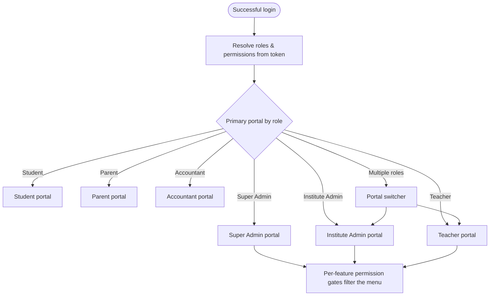
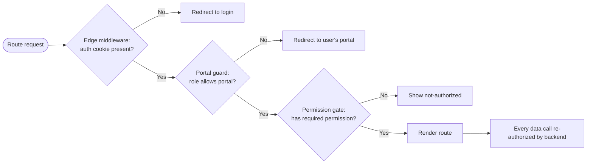
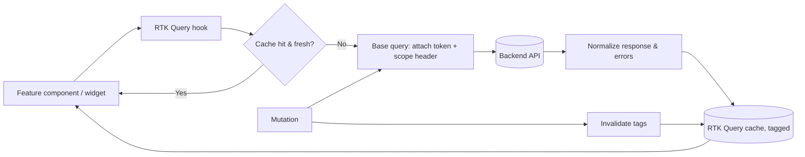
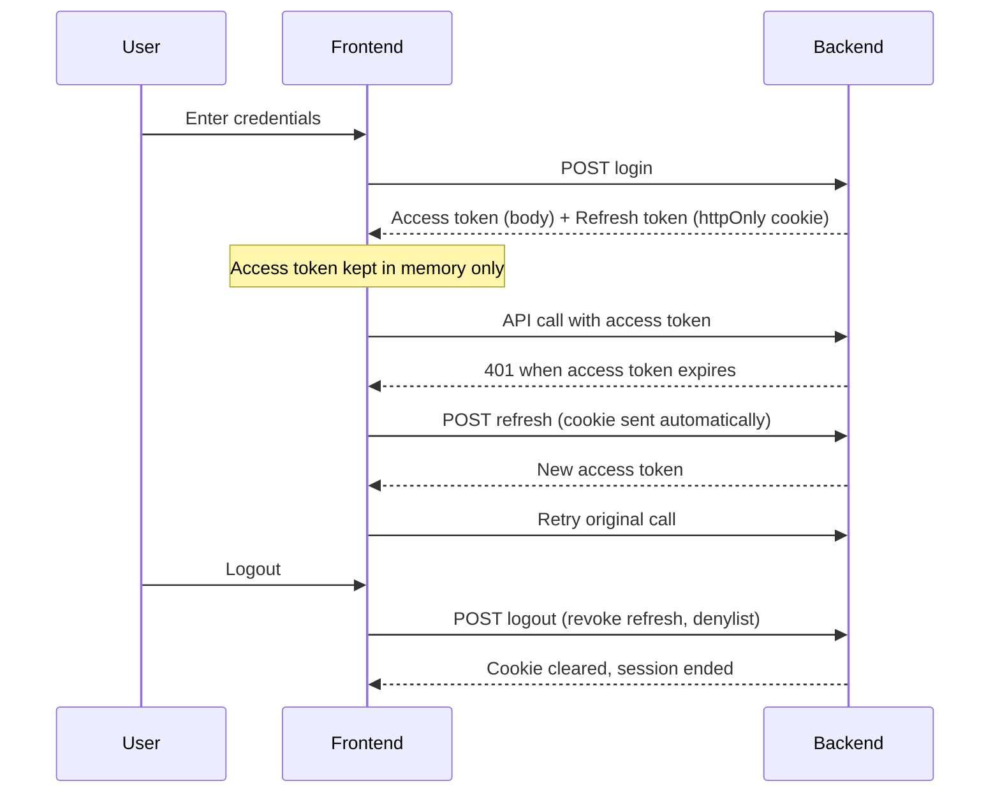
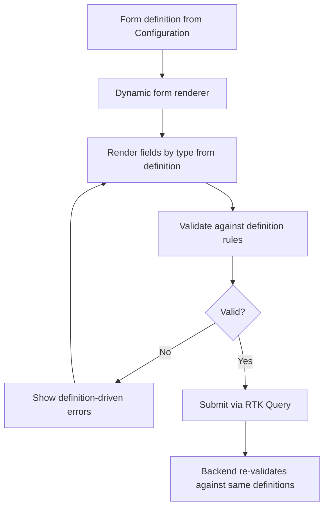

# Enterprise Education ERP — Architecture Blueprint
## Part C — Frontend, Authentication & Access Architecture

**Scope:** The Next.js (App Router) frontend — its application structure, multi-portal routing, dashboard and layout strategy, state and data layer, the authentication and authorization flows, the permission and component systems, and the cross-cutting concerns of white-labeling, theming, internationalization, and mobile-readiness.
**Status:** Part C of the blueprint. Builds on Part A (two-plane, per-client deployment, Identity as Open Host) and Part B (the backend API, RBAC, configuration engine, dynamic validation).
**Constraint:** No source code. Route trees, folder trees, diagrams, and conceptual examples only.
**Decision format:** Significant decisions as Recommendation → Why → Pros → Cons → Alternatives → Final Decision. Numbering continues from Part B (D19 onward).

---

## C-1. Next.js Application Architecture (Sections 1–3, 5, 17)

### 1. Complete Next.js Architecture

The frontend is a single Next.js (App Router) application that serves all six portals — Super Admin, Institute Admin, Teacher, Student, Parent, and Accountant — from one codebase and one build artifact. Like the backend, it follows the "one artifact, configuration-driven" rule: a single build is deployed per client deployment and loads that client's branding, terminology, locale defaults, and feature entitlements at runtime, so branding or terminology changes never require a rebuild (Cluster 5). The application separates two concerns that are commonly and harmfully merged: **routing/composition** (the `app/` directory — thin route files that compose features and own layouts, guards, and navigation) and **features** (a `src/features/` directory — the actual domain UI, hooks, data slices, and types). Route files stay thin and declarative; features are self-contained and portable.

> **Decision D19 — One unified Next.js app with portal-segmented routing, not separate apps per portal.**
> **Recommendation:** Serve all portals from a single Next.js application using App Router route groups per portal, with a post-login redirect that routes each user to their portal by role.
> **Why:** The portals share the same design system, auth, API client, theme engine, and i18n; splitting them into six apps would duplicate all of that six times and complicate deployment across 200+ client deployments. A unified app with strong internal boundaries gives portal separation without the duplication.
> **Pros:** One design system, one auth/data/theme/i18n stack, one build and deploy per client; shared components reused across portals; consistent UX; simpler fleet operations.
> **Cons:** A single large app must be carefully code-split so a parent never downloads admin code; portal boundaries are enforced by convention and routing, not by separate deployables.
> **Alternatives:** (a) Separate app per portal — clean isolation, but six times the infrastructure and shared-code duplication. (b) Micro-frontends — maximum isolation, heavy complexity unjustified for one team and a shared design system.
> **Final Decision:** Unified app, portal route groups, aggressive per-route code-splitting so each portal ships only its own code.

### 2. App Router Structure

The App Router is organized with route groups: a public group for unauthenticated pages, and an authenticated portal group whose layout establishes the auth guard, the application chrome, and the providers (store, theme, i18n, permissions). Each portal is its own segment under the authenticated group, with its own nested layout and navigation, while sharing the design system and data layer.

```
app/
├── layout.tsx                       # root: Store, Theme, I18n, Permission providers; loads per-client bootstrap config
├── not-found.tsx
├── error.tsx                        # root error boundary
│
├── (public)/                        # unauthenticated
│   ├── layout.tsx                   # minimal chrome, branding from runtime config
│   ├── login/
│   ├── forgot-password/
│   └── set-password/
│
├── (portal)/                        # authenticated shell
│   ├── layout.tsx                   # AUTH GUARD + chrome (sidebar/topbar) + scope (institute/campus) selector
│   ├── page.tsx                     # role-aware landing -> redirects to the user's portal
│   │
│   ├── super-admin/                 # one segment per portal
│   │   ├── layout.tsx               # portal nav + portal-level permission gate
│   │   ├── dashboard/
│   │   ├── organizations/           # institutes, campuses, sessions
│   │   ├── configuration/           # definitions, templates, terminology
│   │   └── ...
│   ├── institute-admin/
│   ├── teacher/
│   ├── student/
│   ├── parent/
│   └── accountant/
│
└── api/                             # thin BFF route handlers (token refresh proxy, config bootstrap)
```

> **Decision D20 — Public pages use Server Components; the authenticated portal is client-rendered with RTK Query, using App Router for layout, routing, and code-splitting.**
> **Recommendation:** Render public/marketing/login pages as Server Components (SSR, cacheable, fast first paint). Render the authenticated ERP behind the portal layout primarily as Client Components, fetching data through RTK Query, while still using App Router for nested layouts, route-level code-splitting, and streaming the shell.
> **Why:** App Router's default Server Components shine for public, cacheable, SEO-relevant content — exactly the login and marketing pages. But the authenticated ERP is the opposite case: every screen is per-user, permission-filtered, frequently mutated, and behind auth, so it benefits little from RSC's static/edge caching and benefits greatly from a rich client cache with optimistic updates and invalidation — which is RTK Query's strength and is your locked choice. Forcing RSC data-fetching onto permissioned, interactive dashboards would fight both the data's nature and the locked stack.
> **Pros:** Fast, cacheable public surface; rich, responsive, cache-coherent authenticated experience; App Router still provides nested layouts, code-splitting, and streaming for the shell; honors the locked RTK Query choice.
> **Cons:** Two rendering modes in one app (clear boundary: public = server, portal = client); the authenticated bundle is larger (mitigated by per-route splitting); gives up some RSC data-fetching ergonomics inside the portal.
> **Alternatives:** (a) Full RSC data fetching everywhere — fights the per-user permissioned reality and sidelines RTK Query. (b) Pure SPA with no App Router — loses nested layouts, streaming, and code-splitting. (c) Server Actions for mutations — viable later, but bypasses the unified RTK Query cache and the typed API client; deferred.
> **Final Decision:** Hybrid as recommended — server-rendered public shell, client-rendered RTK Query portal, App Router throughout for structure.

### 3. Folder Structure

```
src/
├── app/                             # (above) routing & composition only
│
├── features/                        # feature-sliced domain UI
│   ├── enrollment/
│   │   ├── components/              # feature components
│   │   ├── hooks/                   # feature hooks
│   │   ├── api/                     # RTK Query endpoints for this feature
│   │   ├── types/
│   │   └── index.ts                 # public surface of the feature
│   ├── attendance/
│   ├── assessment/
│   ├── finance/
│   ├── configuration/
│   ├── workflow/
│   └── ...                          # one slice per domain area
│
├── shared/                          # cross-feature reusable building blocks
│   ├── ui/                          # design-system components (Button, Table, Modal, Field...)
│   ├── forms/                       # form engine + dynamic form renderer
│   ├── tables/                      # table engine
│   ├── layout/                      # app chrome: Sidebar, Topbar, ScopeSwitcher
│   ├── permission/                  # permission provider + can() hook + <Can> gate
│   ├── theme/                       # theme engine, CSS-variable provider
│   ├── i18n/                        # message catalogs + label resolver (i18n + terminology)
│   └── utils/
│
├── lib/                             # framework-level setup
│   ├── store/                       # Redux Toolkit store + RTK Query base API
│   ├── api/                         # base query, auth interceptor, error normalization
│   ├── auth/                        # token handling, silent refresh, session
│   └── config/                      # runtime client-config bootstrap loader
│
└── middleware.ts                    # edge auth gate for protected routes
```

### 5. Layout Strategy

Layouts are nested to match the routing: a **root layout** mounts the global providers (Redux store, theme, i18n, permissions) and loads the per-client bootstrap configuration before rendering, so branding and terminology are correct from first paint. The **portal (authenticated) layout** enforces the auth guard, renders the application chrome (sidebar, topbar, and the institute/campus scope switcher — essential because one deployment holds multiple institutes), and establishes the scope context every feature reads. Each **portal-specific layout** renders that portal's navigation and applies a portal-level permission gate (a parent cannot reach an admin route even by typing the URL). This nesting means cross-cutting chrome and guards are declared once at the right level and inherited, while each portal customizes only its navigation.

### 17. Feature-Based Folder Structure

> **Decision D21 — Feature-sliced architecture: features own their components, hooks, API slices, and types; routing only composes them.**
> **Recommendation:** Organize all domain UI under `src/features/<feature>`, each slice exposing a small public surface; keep `app/` route files thin, importing from features. Cross-feature reusable primitives live in `src/shared`.
> **Why:** Organizing by technical type (all components together, all hooks together) scatters a feature across the codebase and makes change risky; organizing by feature keeps everything for a domain area together, mirrors the backend's bounded contexts, and lets the team reason about and code-split per feature.
> **Pros:** High cohesion; change is localized; features map to backend contexts and to portals' needs; natural code-splitting boundaries; new engineers find everything for a feature in one place.
> **Cons:** Requires judgment about what is feature-specific vs shared; risk of duplicated primitives if `shared` is under-used (managed by review).
> **Alternatives:** (a) Type-first folders — familiar but scatters features. (b) Everything in `app/` — couples domain UI to routing and defeats reuse.
> **Final Decision:** Feature-sliced with a thin `app/` and a curated `shared/`, mirroring the backend's modular boundaries for conceptual symmetry across the stack.

---

## C-2 will continue with dashboard, portals, routing, authorization, and permissions; C-3 with state and data; C-4 with authentication; C-5 with the UI system; C-6 with white-labeling, theming, i18n, and mobile.

---

## C-2. Portals, Dashboard, Routing, Authorization & Permissions (Sections 4, 22, 20, 10, 11)

### 22. Multi-Portal Strategy

The six portals share one application but present six distinct experiences, differentiated by navigation, default landing, available features, and data scope — all driven by the authenticated user's role and permissions rather than by separate code. After login, a role-aware landing route redirects the user into their portal: a teacher to the teacher portal, a parent to the parent portal, and so on. A user who legitimately holds more than one role (e.g., a teacher who is also a parent) is offered a portal switch. Each portal's surface is further filtered by permissions, so two institute admins with different permission sets see different menus within the same portal. The portal a user lands in is UX; the real protection is the permission system (Section 11) enforced both in routing and, authoritatively, by the backend.



### 4. Dashboard Architecture

Each portal's dashboard is composed of permission-gated widgets rather than a fixed page. A widget declares the permission it requires and the data it needs; the dashboard renders only the widgets the user may see, so the same dashboard route yields different content per user without branching code. Widgets fetch their own data through RTK Query (each widget is independently cacheable and refetchable), show their own loading and empty states, and fail in isolation (one widget erroring does not blank the dashboard, by widget-level error boundaries). Heavy or cross-cutting widgets (institution-wide analytics) are lazy-loaded and may be deferred so the dashboard shell paints immediately and fills in progressively. This widget-and-gate model means new dashboard capabilities are added by registering a widget with its permission, not by editing a monolithic dashboard page.

### 20. Route Protection

Route protection is layered, defense-in-depth, with the authoritative check always on the backend. At the **edge**, Next.js middleware checks for a valid authentication cookie on protected routes and redirects unauthenticated requests to login before any portal code loads. At the **portal layout**, a client guard confirms the user's role permits this portal and redirects otherwise. At the **feature/route level**, a permission gate hides or blocks routes and actions the user's permissions do not allow. None of these client checks are trusted for security — they are UX, preventing users from reaching screens they cannot use; every data request they trigger is independently authorized by the backend's guards (Part B). This separation is stated explicitly so no engineer mistakes client-side gating for enforcement.



### 10. Authorization Flow (Frontend)

The frontend authorization flow mirrors the backend RBAC but only for presentation. On authentication the client receives the user's effective permission set and roles (carried in the access token and/or fetched once and cached). A central permission provider exposes a simple capability check used everywhere: routes, menus, buttons, and fields ask "may the current user do X here?" and render accordingly. Scope is part of the question — permissions are evaluated in the context of the currently selected institute/campus, so the same user may have different capabilities in different institutes within the deployment. When the user switches scope, the permission context updates and the UI re-renders to match. Because permissions can change (role edits), the cached set is invalidated on the relevant events and on token refresh.

### 11. Permission Architecture (Frontend)

> **Decision D22 — Centralized, declarative permission gating mirroring backend permission strings; client gating is UX-only.**
> **Recommendation:** A single permission provider supplies a `can(permission, scope)` capability and a declarative gate component/hook used to wrap routes, menu items, actions, and fields. Permission strings are identical to the backend's (module.resource.action), so the two stay in lockstep.
> **Why:** Scattering ad-hoc role checks (`if role === 'admin'`) through the UI is unmaintainable and drifts from the backend; a single declarative mechanism keyed on the same permission strings keeps the UI consistent and easy to audit, while making it unmistakable that the backend is the real enforcer.
> **Pros:** One place to reason about access; UI and API share a permission vocabulary; menus/buttons/fields gate uniformly; easy to audit; scope-aware.
> **Cons:** The permission set must be loaded and kept fresh; a large permission set adds token/payload size (managed by compact encoding and caching).
> **Alternatives:** (a) Role-based `if` checks inline — fast to write, unmaintainable, drifts from backend. (b) Server-driven UI (backend returns the menu) — strong consistency, but heavier coupling and chattier; reserved as a future option for the most dynamic menus.
> **Final Decision:** Centralized declarative permission gating on shared permission strings, scope-aware, explicitly UX-only with backend as the authority.


---

## C-3. State & Data Layer (Sections 6, 7, 8, 19)

### 6. State Management Strategy

The architecture distinguishes three kinds of state and assigns each the right tool, avoiding the common mistake of putting everything in one global store. **Server state** — data that lives on the backend (students, invoices, results) — is owned by RTK Query, which handles fetching, caching, invalidation, and refetching; it is the large majority of state in an ERP. **Global client state** — a small amount of cross-cutting UI state (the selected institute/campus scope, theme, language, the authenticated session summary) — lives in a few Redux Toolkit slices. **Local component state** — ephemeral UI state (form field focus, a modal's open flag, a dropdown's expansion) — stays in the component with React state and never goes near the global store. The rule: data from the server is RTK Query; truly global UI concerns are Redux slices; everything else is local. This keeps the global store small and the data layer coherent.

### 7. RTK Query Architecture

> **Decision D23 — RTK Query as the single server-state layer, organized as one base API with per-feature endpoint injection and tag-based invalidation.**
> **Recommendation:** Define one base API (shared base query with auth, error normalization, and scope headers) and inject endpoints per feature slice; use a disciplined cache-tag taxonomy so mutations invalidate exactly the right queries.
> **Why:** A single base API centralizes auth token attachment, the institute/campus scope header, error normalization, and refresh handling, while per-feature endpoint injection keeps each feature's data access inside its slice (consistent with the feature-sliced structure). Tag-based invalidation gives precise, automatic cache coherence — a successful enrollment invalidates the student list and the dashboard counts without manual refetch wiring.
> **Pros:** One place for cross-cutting request concerns; features own their endpoints; automatic, precise cache invalidation; optimistic updates and request deduplication out of the box; less boilerplate than hand-rolled fetching.
> **Cons:** Tag taxonomy must be designed deliberately or invalidation becomes too broad (refetch storms) or too narrow (stale UI); a learning curve for the team.
> **Alternatives:** (a) React Query — excellent, but Redux Toolkit is already in the stack and RTK Query is your locked choice; using both would duplicate the data layer. (b) Manual fetch + slices — maximal control, maximal boilerplate and bug surface.
> **Final Decision:** RTK Query, one base API, per-feature injected endpoints, a documented cache-tag taxonomy (per-entity and per-list tags, scope-qualified) so invalidation is precise. Peak-event screens (result publishing) use polling or manual invalidation deliberately rather than aggressive auto-refetch.



### 8. API Layer Design

The API layer is the single boundary between the frontend and the backend. A base query wraps every request to attach the access token, set the active institute/campus scope header (so the backend scopes data correctly), normalize errors into the consistent envelope the backend already returns (Part B), and trigger the silent-refresh flow on a 401 (Section 9). Feature endpoints are typed against shared DTO contracts so the client and server agree on shapes; where the backend exposes the dynamic layer (custom fields, dynamic forms), the typed contract covers the fixed fields and a typed dynamic map covers configurable ones, validated by the same definitions the backend uses. This single, typed, interceptor-equipped API layer means cross-cutting request concerns are handled once, and no feature talks to the network directly.

### 19. Caching Strategy (Frontend)

Frontend caching operates at several levels with clear ownership. **RTK Query cache** is the primary layer for server data, with tag-based invalidation and configurable staleness per endpoint (reference data like the academic structure is cached long and rarely refetched; volatile data like live attendance is short-lived). **Runtime client config** (branding, terminology, feature entitlements) is fetched once at bootstrap and cached for the session, refreshed on explicit change. **The permission set** is cached and invalidated on role change and token refresh. **Static assets** are cached by the browser and CDN with content-hashing (Part E). The strategy deliberately avoids over-caching mutable, permission-sensitive data: anything that affects what a user may see or owe is invalidated on the events that change it, never left to time-based expiry alone. RTK Query's request deduplication also prevents the dashboard's many widgets from issuing duplicate calls for the same data.

---

## C-4. Authentication Flow (Section 9)

### 9. Authentication Flow

> **Decision D24 — Access token in memory, refresh token in an httpOnly secure cookie, with silent refresh; never store tokens in localStorage.**
> **Recommendation:** Keep the short-lived access token in memory (and attach it to API calls), keep the long-lived refresh token in an httpOnly, secure, SameSite cookie the JavaScript cannot read, and refresh access tokens silently via a backend refresh endpoint. A thin BFF route handler can proxy refresh so the cookie stays first-party.
> **Why:** localStorage tokens are readable by any injected script, making them the primary prize in an XSS attack; an httpOnly cookie for the refresh token removes it from JavaScript's reach, and keeping the access token only in memory limits its exposure window. This is the standard secure-by-default posture for SPA-style authenticated apps.
> **Pros:** Refresh token not exposed to XSS; access token short-lived and memory-only; real logout and device revocation possible (backend denylist from Part B); silent refresh keeps sessions seamless.
> **Cons:** In-memory access token is lost on full page reload (re-acquired by an immediate silent refresh on load); cookie handling requires correct SameSite/secure config and CSRF defense for cookie-based calls (Part E covers CSRF).
> **Alternatives:** (a) Both tokens in localStorage — simplest, but maximally XSS-exposed; rejected. (b) Both in cookies — viable but makes attaching the access token to API calls and cross-portal logic clumsier; the hybrid is cleaner.
> **Final Decision:** Memory access token + httpOnly refresh cookie + silent refresh, with device/session management surfaced in a security settings screen (list devices, revoke). MFA, when enabled per client (Cluster 6), inserts a verification step into the flow below.



On application load, the frontend immediately attempts a silent refresh: if the refresh cookie is valid, it obtains a fresh access token and restores the session without a visible login; if not, it routes to login. When a client enables MFA, login returns a challenge that the user satisfies (TOTP) before tokens are issued; the architecture is built so SSO/SAML federation (Cluster 6 future) slots in as an alternative credential step without disturbing the token model.


---

## C-5. UI System (Sections 12, 13, 14, 15, 16)

### 13. Design System Architecture

The design system is the foundation the entire UI is built on, and it is **token-driven** so that white-labeling works at runtime. Design decisions — colors, spacing, typography, radii, shadows — are expressed as design tokens implemented as CSS custom properties on the root, not hard-coded into components. Components consume tokens (a button references the primary-color token, never a literal hex), which is precisely what lets a client's brand color flow through the whole interface by changing token values at runtime (Section 23). Above the tokens sits a library of primitive components (Button, Input, Select, Field, Card, Table, Modal, Toast, Badge) in `shared/ui`, built on Tailwind configured to read the token variables, with consistent variants, sizes, and states. Feature components compose these primitives; they never reinvent base elements. This two-tier system (tokens → primitives → feature components) gives visual consistency, runtime themeability, and a single place to evolve the look.

### 12. Component Architecture

Components are layered by responsibility. **Primitives** (`shared/ui`) are stateless, presentational, design-system building blocks with no domain knowledge. **Composite/shared components** (tables, the form engine, modals, the layout chrome) combine primitives into reusable patterns, still domain-agnostic. **Feature components** (`features/<feature>/components`) hold domain UI and may use feature hooks and RTK Query, but delegate all presentation to primitives and composites. **Route components** (`app/`) are thin and compose feature components. The dependency direction is strict and downward — features use shared, shared uses primitives, primitives use tokens — never the reverse, mirroring the backend's dependency discipline. Container/presentational separation is applied where it adds value (data-bound containers vs pure presentational children) so that presentational components stay easily testable and reusable.

### 14. Table Architecture

> **Decision D25 — A single configurable, headless-driven table engine; feature tables are configuration, not bespoke code.**
> **Recommendation:** Build one table engine in `shared/tables` that handles column definition, server-side pagination/sorting/filtering, row selection, density, and column visibility; feature tables supply a column configuration and a query hook rather than re-implementing a table.
> **Why:** An ERP has dozens of data grids (students, staff, invoices, results, audit). Re-implementing each is slow and inconsistent; a single engine driven by configuration gives uniform behavior (pagination, sorting, export, empty/loading/error states), accessibility, and one place to optimize. Server-side operations are essential because the largest client's tables have tens of thousands of rows that must never be loaded client-side.
> **Pros:** Consistent behavior and accessibility everywhere; server-side paging/sort/filter scales to large datasets; one place to add features (export, column chooser, saved views); feature tables are quick to build.
> **Cons:** The engine must be general enough without becoming a sprawling configuration language; very unusual grids may need escape hatches.
> **Alternatives:** (a) Bespoke tables per feature — inconsistent, slow, unscalable. (b) A heavy third-party data-grid — capable but opinionated, heavy, and harder to theme to the design tokens.
> **Final Decision:** One headless-logic-driven table engine with server-side operations, themed via design tokens, configured per feature by columns + a query hook. Custom/dynamic columns (from configurable custom fields) are supported via the same column-definition mechanism.

### 15. Form Architecture

> **Decision D26 — A unified form engine with a definition-driven dynamic renderer mirroring the backend's two-tier validation.**
> **Recommendation:** One form engine in `shared/forms` handles static forms (typed fields, schema validation) and, critically, a dynamic renderer that builds forms at runtime from form/field definitions supplied by the Configuration context, validating against the same definitions the backend uses.
> **Why:** The product's configurability means admission forms, custom fields, and other inputs are defined per client as data; the frontend must render and validate those without code changes, and its validation must match the backend's exactly (the same definitions drive both), or users get inconsistent errors. A unified engine also keeps static forms consistent (labels, errors, layout, accessibility).
> **Pros:** Static and dynamic forms share one consistent system; dynamic forms render and validate from the same definitions as the backend, so rules never drift; one place for field types, error display, and accessibility; new field types added once.
> **Cons:** The dynamic renderer is a real component supporting the definition model's field types and rules; complex conditional form logic must be expressible in the definition.
> **Alternatives:** (a) Hand-built forms per screen — fast initially, but cannot serve client-defined fields and drifts from backend validation. (b) Two separate systems for static and dynamic — duplicated field types and inconsistent UX.
> **Final Decision:** One form engine; static forms use typed schemas; dynamic forms render from definitions and validate against them, returning the same error envelope shape as the backend. Form state, validation timing, and submission/error handling are standardized across both.



### 16. Modal Architecture

Modals are managed centrally rather than scattered as local flags, because uncontrolled modal state leads to stacking bugs, focus traps, and inconsistent behavior. A modal manager provides a declarative way to open, stack, and dismiss modals and drawers, with consistent overlay behavior, focus management, escape/click-away handling, and accessibility (focus trap, return focus on close, ARIA roles) handled once. Confirmation dialogs, form modals, and side drawers are all variants built on the same primitive, themed by design tokens. This centralization ensures that a confirmation before a destructive action, a quick-edit drawer, and a multi-step wizard all behave and look consistent, and that modal-heavy flows (bulk actions, approvals) do not produce focus or stacking defects.

---

## C-6. White-Labeling, Theming, i18n & Mobile (Sections 18, 21, 23, 24, 25)

### 18. Error Handling

Error handling is layered to match the rendering model. **Route-level error boundaries** (App Router `error.tsx` at root and per portal) catch render-time failures and show a recoverable error screen rather than a blank page. **Widget/feature-level boundaries** isolate failures so one broken widget never blanks a dashboard. **Data-layer errors** from RTK Query are normalized by the base query into the consistent envelope and surfaced as inline messages, toasts, or field errors as appropriate — a validation error maps to field highlights, an authorization error to a not-authorized state, a network error to a retry affordance. **Global concerns** (session expiry, lost connectivity) are handled centrally with appropriate recovery (silent refresh, reconnect prompts). Every user-facing error carries the correlation id from the backend so support can trace it. The principle: fail in the smallest scope possible, always offer a recovery path, and never expose raw technical detail.

### 21. White-Labeling Strategy

> **Decision D27 — Runtime white-labeling driven by per-client bootstrap configuration; no rebuild for branding or terminology.**
> **Recommendation:** On application load, fetch a per-client bootstrap configuration (brand colors, logo, favicon, app name, default locale, enabled features/portals, and terminology overrides) and apply it at runtime via design tokens and providers, so the same build serves any client's branding.
> **Why:** Cluster 5 requires that branding changes need no rebuild, and the per-client deployment model means each deployment serves exactly one client's brand. Driving branding from runtime configuration honors both, and reuses the same configuration philosophy as the backend.
> **Pros:** No rebuild or redeploy for branding/terminology changes; one artifact across all clients; branding consistent across all portals and generated views; aligns with the configuration-driven thesis.
> **Cons:** A brief bootstrap step before first meaningful paint (mitigated by caching the config and a branded loading state); branding assets must be served per client.
> **Alternatives:** (a) Build-time theming per client — produces N artifacts, contradicts the one-artifact rule and the no-rebuild requirement. (b) Subdomain-keyed runtime theming on a shared multi-tenant frontend — viable for shared SaaS, but unnecessary given per-client deployments.
> **Final Decision:** Runtime bootstrap configuration applied via design tokens and providers. Branding, terminology, locale defaults, and feature/portal entitlements all load at boot; changing them in the client's configuration is reflected on next load with no deployment.

### 23. Theme Engine Design

The theme engine is the mechanism that applies white-label branding and visual theming at runtime. It works by mapping the per-client brand configuration onto the design tokens (CSS custom properties) at the root, so every token-consuming component instantly reflects the client's palette, logo, and typography choices. It supports light/dark modes (each a token set) and per-client brand overrides layered on top. Because components reference tokens rather than literals, no component code changes when the brand changes — only token values do. The engine resolves tokens in a clear precedence: client brand overrides, then mode (light/dark), then system defaults, so a client's primary color wins where set and sensible defaults fill the rest. This is the visual counterpart to the backend's most-specific-wins configuration resolution.

### 24. Internationalization Design

> **Decision D28 — Two distinct layers: i18n for UI language (English/Bangla) and terminology mapping for per-client domain relabeling, resolved together by one label resolver.**
> **Recommendation:** Separate static UI translation (i18n message catalogs for English and Bangla, with bilingual data support) from per-client terminology overrides (Class → Grade), and resolve any displayed label through one resolver that checks terminology overrides first, then the i18n catalog.
> **Why:** These are genuinely different concerns. Language translation is about the same concept in another tongue; terminology mapping is about a client calling a concept by a different name in the same language. Conflating them would force terminology changes through translation files and break per-client customization. Bangladesh-first with bilingual needs makes both first-class.
> **Pros:** Clean separation of language vs client vocabulary; a teacher in Bangla sees translated UI and the client's chosen terms; bilingual data (names in English and Bangla) supported; future languages add a catalog without touching terminology.
> **Cons:** Two layers to resolve on every label (cheap, cached); content authors must know which layer a string belongs to.
> **Alternatives:** (a) i18n only, putting client terms in translation files — breaks per-client customization and pollutes catalogs. (b) Terminology only — cannot serve a second language.
> **Final Decision:** Two layers, one resolver (terminology override → i18n catalog → key fallback), with right-to-left readiness noted for future markets and bilingual data fields where institutions need both scripts.

### 25. Mobile-Ready Strategy

> **Decision D29 — Responsive-web-first now; API and design system shaped for a future React Native app; no native build in early phases.**
> **Recommendation:** Make every portal fully responsive and touch-friendly so the web app is usable on phones today; keep the API client and design tokens structured so a future React Native app can reuse the contracts and visual language; defer the native app to a later phase (Cluster 8).
> **Why:** Parents and students in Bangladesh are heavily mobile, so the web must work well on phones immediately; but a native app is a separate product with its own lifecycle that a small team should not start in the first phases. Designing the API and tokens cleanly now makes the eventual native app far cheaper without building it prematurely.
> **Pros:** Usable on mobile from day one; no premature native investment; the eventual native app reuses API contracts and design tokens; the team stays focused.
> **Cons:** Responsive web is not identical to native UX (no offline-first, limited push depth) until the native app exists; some mobile-specific flows wait.
> **Alternatives:** (a) Build native now — premature for a small team and timeline. (b) PWA as a middle step — a reasonable later option (installable, push) noted for a future phase. (c) Ignore mobile web — unacceptable given the parent/student audience.
> **Final Decision:** Responsive-web-first with mobile-friendly tables, forms, and navigation; API and tokens kept reusable; native (React Native) and PWA explicitly deferred to later phases per the roadmap.

---

## Part C — Closing Note and What Comes Next

Part C has defined the frontend and access experience: a single Next.js App Router application serving six permission-gated portals from one configuration-driven artifact; a hybrid rendering model (server-rendered public shell, client-rendered RTK Query portal); a feature-sliced structure mirroring the backend's bounded contexts; a three-tier state strategy with RTK Query owning server state; a secure authentication flow (memory access token, httpOnly refresh cookie, silent refresh) ready for MFA and future SSO; layered, UX-only route and permission protection over an authoritative backend; a token-driven design system with one table engine and one form engine — the latter rendering and validating dynamic forms from the same definitions as the backend; and runtime white-labeling, a token-based theme engine, a two-layer i18n-plus-terminology model, and a responsive-web-first mobile posture.

These choices interlock with the rest of the blueprint: the permission gating and auth flow consume the Identity Open Host and RBAC from Parts A and B; the dynamic form and table engines consume the configuration definitions and dynamic validation from Part B; the runtime theme and terminology consume the per-client configuration; and the responsive/token foundation feeds the future mobile and white-label expansion in Part F's roadmap. The performance implications of the client-rendered portal (bundle splitting, CDN, caching) are detailed in Part E.

**Awaiting your approval to proceed.** I have generated Part C only. When ready, direct me to the next part — your plan groups cross-cutting services (notifications, reporting, file management) as Part D, the non-functional architecture (security, performance, scalability, DevOps, observability, backup/DR) as Part E, and engineering standards, roadmap, and the critical self-review as Part F.

*End of Part C.*
