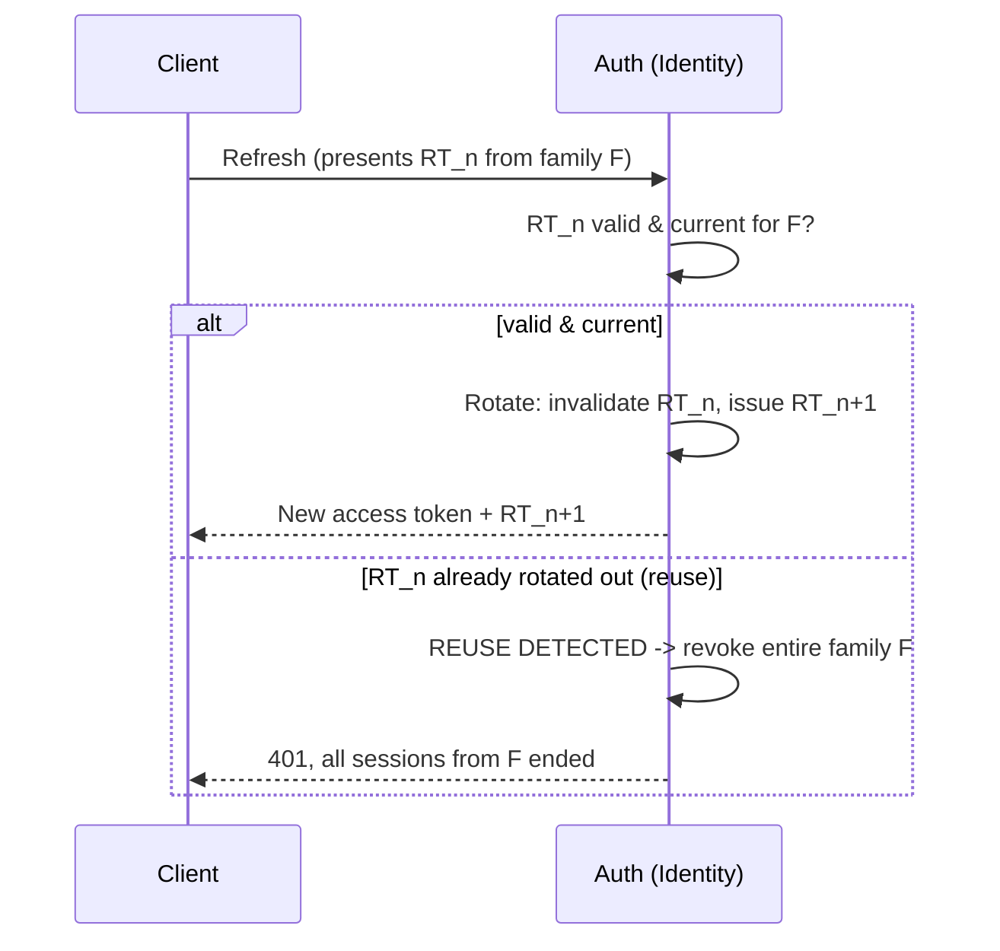
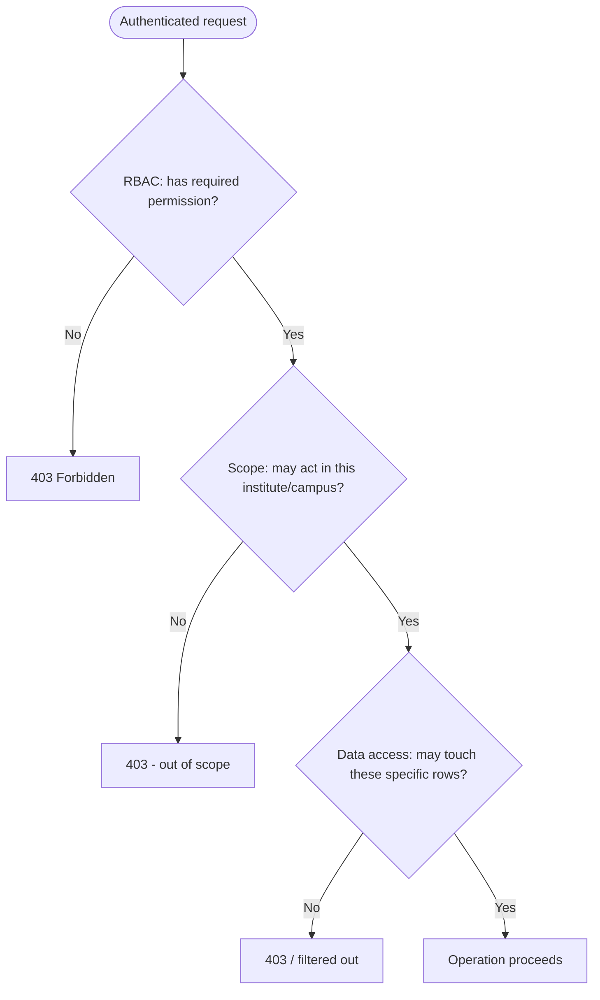
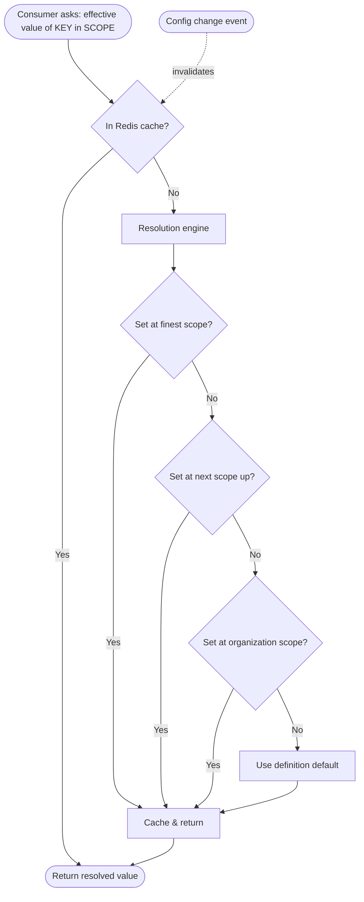
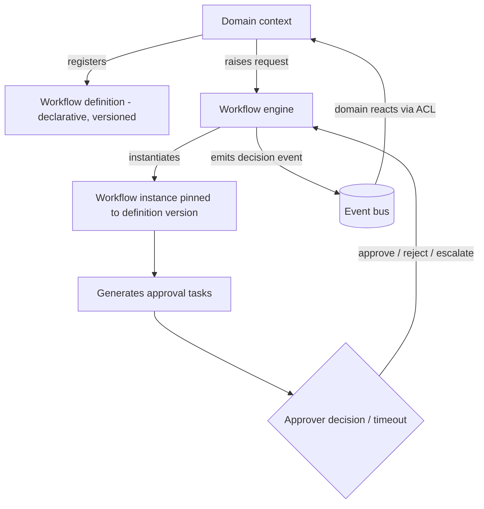

# Enterprise Education ERP — Architecture Blueprint
## Part D — Platform Core: Identity, Access, Configuration & Workflow

**Scope:** The implementation-level design of the four platform capabilities that everything else depends on — authentication, authorization, the configuration engine, and the workflow engine. This is the authoritative deep design; Parts A–C referenced these capabilities, and Part D specifies their internal mechanics.
**Status:** Part D of the blueprint. Builds on Part A (Identity & Configuration & Workflow as upstream contexts), Part B (RBAC pipeline, outbox, hybrid config storage, dynamic validation), and Part C (frontend auth/permission consumption).
**Constraint:** No source code. Mechanics, data shapes (as field listings), resolution algorithms (as steps), and state machines (as diagrams) only.
**Decision format:** Significant decisions as Recommendation → Why → Pros → Cons → Alternatives → Final Decision. Numbering continues from Part C (D30 onward).

---

## D-1. Authentication Architecture (Sections 1–8)

### 1. Authentication Architecture

Authentication lives entirely in the Identity & Access context (Part A's Open Host) and is built around a deliberately small, layered set of mechanisms: a stateless short-lived access token for request authorization, a stateful rotating refresh token for session continuity, server-side session and device records for visibility and revocation, optional MFA enforced per client, secure password recovery, and a pluggable identity-provider abstraction that makes future SSO a configuration concern rather than a rewrite. The guiding posture is **stateless where it scales, stateful where it must be revocable**: access tokens are stateless so every request validates them without a database hit, while sessions, devices, and refresh tokens are stateful so they can be listed, revoked, and reasoned about. Because each client is an isolated deployment, all of this is per-client — separate keys, separate sessions, no shared identity surface.

### 2. JWT Strategy

> **Decision D30 — Short-lived access tokens signed with rotating asymmetric keys; tokens carry identity, active scope, roles, and a permissions-version, not the full permission set.**
> **Recommendation:** Issue access tokens with a short lifetime (on the order of 10–15 minutes), signed with an asymmetric algorithm (ES256/RS256) using a key set that can rotate via a published key endpoint. The token carries the user id, the active institute/campus scope, the user's role identifiers, and a permissions-version stamp — but not the expanded permission list, which is resolved and cached separately.
> **Why:** Short lifetimes bound the damage of a leaked token; asymmetric signing lets any verifier validate without holding a signing secret, which is exactly what future SSO/federation and any auxiliary verifier need, and it enables clean key rotation. Putting a permissions-version (rather than the full permission set) in the token keeps tokens small and, crucially, makes permission changes take effect quickly: bumping the version invalidates cached permissions without waiting for token expiry.
> **Pros:** Small bounded-exposure tokens; verifiable without secret sharing (federation-ready); key rotation supported; permission changes propagate fast via version bump; no per-request DB hit for the common path.
> **Cons:** Asymmetric signing is slightly heavier than symmetric and needs key management; resolving permissions separately adds one cached lookup; a permissions-version scheme must be maintained.
> **Alternatives:** (a) Symmetric (HS256) signing — simpler, but the secret must be shared with every verifier, blocking clean federation. (b) Embed the full permission set in the token — avoids the lookup, but bloats tokens and makes permission changes wait for expiry. (c) Long-lived access tokens — fewer refreshes, far larger breach window; rejected.
> **Final Decision:** Short-lived asymmetric-signed access tokens carrying identity, scope, roles, and permissions-version; permissions resolved from a cache keyed by that version. Keys rotate on a schedule with overlap so in-flight tokens stay valid.

### 3. Refresh Token Strategy

> **Decision D31 — Rotating refresh tokens with token-family reuse detection; stored hashed, never as plaintext.**
> **Recommendation:** Each use of a refresh token issues a new one and invalidates the old (rotation); all refresh tokens descend from an issuance event into a "family." If a already-used (rotated-out) refresh token is ever presented again, treat it as theft: revoke the entire family, ending all sessions derived from it. Store only hashes of refresh tokens.
> **Why:** Rotation limits a refresh token's useful lifetime to a single use; reuse detection turns the classic refresh-token-theft scenario into a self-defeating one — if an attacker replays a stolen token, the legitimate user's next refresh (or the attacker's) exposes the reuse and the whole family is killed. Hashing at rest means a database compromise does not yield usable tokens.
> **Pros:** Strong protection against refresh-token theft and replay; bounded token validity; database breach does not leak usable tokens; clean session lineage for revocation.
> **Cons:** Rotation requires careful handling of races (two near-simultaneous refreshes) — solved with a short grace window keyed to the rotation; more state to track than static refresh tokens.
> **Alternatives:** (a) Static long-lived refresh tokens — simple, but a stolen token works until expiry with no detection. (b) Rotation without reuse detection — better, but misses the theft signal.
> **Final Decision:** Rotating, hashed, family-tracked refresh tokens with reuse detection and full-family revocation on detected replay, with a small race-tolerance window. The refresh token lives in the httpOnly cookie from Part C.

### 4. Session Management

A session is a server-side record representing one authenticated login lineage, linked to the refresh-token family, the user, the originating device, and metadata (created time, last-seen, ip, user agent). Sessions exist so that authentication is **observable and revocable**: a user (or admin) can list active sessions and revoke any of them, and revocation is immediate because the access token's short life plus a Redis denylist of revoked token/family identifiers means a revoked session cannot outlive a few minutes. Concurrent sessions are allowed (a user on a laptop and a phone) and each is independently revocable. Logout revokes the current session's family and denylists its tokens. Because Redis is per-deployment, the denylist and session state are isolated per client.

### 5. Device Management

Devices are first-class so that users and administrators can see and control where the account is active. On login, a device record is created or matched (by a stable device identifier plus contextual signals — never by anything that fingerprints the user covertly), capturing a friendly name, type, last-seen, and location hint. Each session is bound to a device, enabling per-device session lists ("Chrome on Windows — last active 2 hours ago") and per-device revocation ("sign out that device"). Device management also underpins security signals: a login from a new device can trigger a notification and, where a client enables it, an MFA step-up. Devices and their sessions are revocable individually or in bulk ("sign out all other devices").

### 6. MFA Architecture

> **Decision D32 — TOTP-based MFA with recovery codes, enabled per client and optionally step-up for sensitive actions.**
> **Recommendation:** Offer time-based one-time-password (TOTP) MFA with an enrollment flow and single-use recovery codes; let each client enable MFA as policy (optional, encouraged, or required per role), and support step-up MFA for high-risk actions (e.g., publishing results, bulk financial operations).
> **Why:** TOTP is standard, offline-capable, and free of SMS-delivery cost and SIM-swap risk — appropriate for the Bangladesh market and beyond. Per-client policy honors Cluster 6 (MFA optional initially, enabled per client). Step-up lets the system demand stronger proof only when the action warrants it, balancing security and friction.
> **Pros:** Strong second factor without per-message cost; offline; per-client and per-role policy; step-up protects the riskiest actions without burdening routine use; recovery codes prevent lockout.
> **Cons:** Enrollment and recovery flows to build; recovery codes must be stored hashed and handled carefully; some users find authenticator apps unfamiliar (mitigated by clear enrollment UX).
> **Alternatives:** (a) SMS OTP — familiar but costs per message, is phishable, and carries SIM-swap risk. (b) Email OTP — weak second factor (email is often the same account's recovery). (c) No MFA — unacceptable for an enterprise product handling minors' data.
> **Final Decision:** TOTP plus hashed single-use recovery codes, per-client/per-role policy, with step-up for sensitive operations. The design leaves room to add WebAuthn/passkeys later as a stronger factor.

### 7. Password Recovery

Password recovery is built to be secure against the attacks that target it. A recovery request issues a single-use, short-expiry, high-entropy token delivered out-of-band (email/SMS), stored hashed; presenting a valid token lets the user set a new password, after which the token and all of the user's active sessions are invalidated (forcing re-login everywhere, in case the account was compromised). The flow is **non-enumerating**: it returns the same response whether or not the address exists, so attackers cannot use it to discover valid accounts. It is **rate-limited** per account and per ip to prevent abuse. Password changes enforce the password policy and check against known-breached passwords where feasible. The same machinery underpins first-time account activation (admin-invited users set their initial password through an equivalent single-use token).

### 8. SSO-Ready Design

> **Decision D33 — Abstract authentication behind an identity-provider port with adapters; ship local credentials now, design the seam for OIDC/SAML.**
> **Recommendation:** Define an internal identity-provider abstraction (a port) that the authentication flow depends on; implement a local-credentials adapter now, and design the seam so OIDC (Google Workspace) and SAML adapters can be added later with just-in-time provisioning and account linking — without changing the token, session, or RBAC model.
> **Why:** Cluster 6 wants future Google Workspace and SAML SSO without a rewrite. If authentication depends on an abstraction rather than on a hard-coded password check, adding a federated provider becomes implementing an adapter, not re-architecting auth. JIT provisioning (create/link a local user on first federated login) and account linking (connect a federated identity to an existing user) are the two mechanics that make federation usable in an education context where users may pre-exist.
> **Pros:** Federation becomes additive, not disruptive; the token/session/RBAC model is unchanged by the credential source; per-client choice of provider; clean account-linking story.
> **Cons:** The abstraction adds a layer now for a future need; SSO adapters, JIT provisioning, and linking are real work when the time comes (deferred per roadmap).
> **Alternatives:** (a) Hard-code local auth now, add SSO later by refactoring — cheaper now, expensive and risky later. (b) Adopt a third-party identity platform (e.g., an external IdP) outright — powerful, but adds an external dependency and cost per deployment and reduces control; reserved as an option, not the default.
> **Final Decision:** Identity-provider port with a local adapter today; OIDC/SAML adapters, JIT provisioning, and account linking designed-for and scheduled for a later phase. The credential source is pluggable; everything downstream of authentication is unchanged.

---

## D-2, D-3, D-4 follow: authorization, the configuration engine, and the workflow engine.

---

## D-2. Authorization Architecture (Sections 9–14)

### 9. Authorization Architecture

Authorization answers three independent questions for every protected operation, and the design keeps them separate because conflating them is the usual source of access bugs. **Can the user perform this action?** is RBAC — a permission check. **In which institute/campus may they act?** is scoping — the multi-institute boundary within a deployment. **Which specific records may they touch?** is data access control — ownership and relationship rules (a teacher's own classes, a parent's own children). A request is authorized only when all three pass. The first two are checked in the request pipeline guards (Part B); the third is enforced in the data layer so it cannot be bypassed by a query that forgets to filter. The backend is the sole authority; the frontend's gating (Part C) is convenience only.

### 10. RBAC Design

Roles bundle permissions; permissions are fine-grained strings in the form module.resource.action (the same vocabulary the frontend uses). A user is connected to a role **through a scoped membership** — the link carries the institute (and optionally campus) the role applies in — so the same person can be an Institute Admin in one institute and merely a Teacher in another within the same deployment. A user's effective permissions for a given scope are the union of the permissions of the roles they hold in that scope. Default roles (Organization Admin, Institute Admin, Principal, Teacher, Accountant, Exam Controller, HR Officer, Admission Officer, Student, Parent) ship as seed data, not as code constants, which is what makes them editable and extensible.

| Concept | Holds | Notes |
|---|---|---|
| Permission | module.resource.action string | Fine-grained, shared with frontend, registry-defined |
| Role | A set of permissions | Seed roles + custom roles, all data |
| Membership | (user, institute, optional campus, role) | The scoped link; one user may have many |
| Effective permissions | Union of role permissions for the active scope | Resolved and cached by permissions-version |

### 11. Dynamic Permission System

> **Decision D34 — Permissions and roles are data, not code; effective permissions are resolved and cached, invalidated by a version stamp.**
> **Recommendation:** Maintain a permission registry (the catalog of valid permission strings) and roles as data; let clients define custom roles by composing registered permissions; resolve a user's effective permission set per scope and cache it, invalidating via the permissions-version that also lives in the access token (D30).
> **Why:** Hard-coding roles or permission checks in code (the `if role === 'admin'` anti-pattern) makes the system rigid and contradicts the configuration thesis; a registry plus data-defined roles lets institutions create exactly the roles they need (a "Library Assistant," an "Exam Coordinator") without a deployment, while the permission registry keeps custom roles from inventing permissions the code does not enforce.
> **Pros:** Custom roles without code change; one catalog of enforceable permissions; consistent enforcement; fast checks via cache; permission changes propagate quickly via version bump.
> **Cons:** A registry to maintain (new features register their permissions); resolution-and-cache machinery to build; care needed so a custom role cannot escalate beyond registered permissions.
> **Alternatives:** (a) Hard-coded roles — simple, rigid, anti-thesis. (b) Fully attribute-based access control (ABAC) for everything — extremely flexible but complex to reason about and audit for a small team; we use RBAC as the spine and add targeted ownership rules (Section 14) rather than full ABAC.
> **Final Decision:** Registry-backed, data-defined RBAC with custom roles, cached resolution keyed by permissions-version. New code that introduces a capability must register its permission in the catalog (an engineering-standard rule).

### 12. Institute-Level Access

Because one deployment contains multiple institutes, the institute is the primary access boundary inside it. Every scoped request establishes an active institute (from the token's scope claim or an explicit scope selection), and the scope guard verifies the user has a membership granting access there before any handler runs. Data is tagged with institute_id, and the data layer applies the active institute as a mandatory filter, so a user scoped to Institute A simply cannot see Institute B's rows even if they craft the request — the filter is applied in the repository from the request context, not left to each query. Organization-wide roles (an Organization Admin) hold memberships spanning all institutes; institute-scoped roles hold a membership for one. Switching institutes re-establishes scope and re-resolves permissions.

### 13. Campus-Level Access

Campuses subdivide an institute, and access can be further scoped to a campus where an institution operates that way. The mechanism mirrors institute scoping one level down: a membership may carry a campus, the active scope may include a campus, and campus-tagged data is filtered by the active campus. This supports the realistic case of a campus administrator who manages only their branch while an institute administrator sees all campuses. Campus scoping is optional — institutions that do not use multiple campuses operate with a single default campus and never see the distinction — and composes cleanly with institute scoping (campus access always implies and is bounded by institute access).

### 14. Data Access Controls

> **Decision D35 — Three-layer data access: RBAC permission, mandatory scope filter, and ownership/relationship rules enforced in the data layer.**
> **Recommendation:** Enforce data access as RBAC (the action) plus a mandatory institute/campus scope filter applied in the repository from request context, plus ownership/relationship predicates for roles whose access is inherently row-limited (a teacher to their assigned classes, a student to their own record, a parent to their children). Apply these in the data layer, not in controllers, so no query can forget them.
> **Why:** Permission alone is too coarse — a teacher has the "view marks" permission but must see only their own classes' marks. Scoping handles institute/campus; ownership handles the within-scope row limits. Enforcing in the data layer (a scoped repository that always applies the context's filters) makes bypass structurally difficult, whereas per-controller filtering is inevitably forgotten somewhere.
> **Pros:** Correct, fine-grained access; bypass-resistant because filters are applied centrally; clear separation of the three questions; field-level masking can be layered for sensitive attributes.
> **Cons:** Ownership predicates vary by role and resource and must be defined per case; the scoped-repository discipline must be enforced (architecture tests); some queries become more complex.
> **Alternatives:** (a) Controller-level filtering — flexible but bypass-prone; one forgotten filter is a data leak. (b) PostgreSQL row-level security — strong, but harder to manage across the dynamic, application-driven scope model and adds operational complexity per deployment; the application-layer scoped repository is preferred, with RLS reserved as a defense-in-depth option for the most sensitive tables.
> **Final Decision:** Three-layer enforcement (permission + mandatory scope filter + ownership predicates) centralized in the data layer, with field-level masking for sensitive attributes and RLS available as optional defense-in-depth on the highest-risk tables.

---

## D-3. Configuration Engine Design (Sections 15–21)

### 15. Configuration Engine Design

The configuration engine is the Platform Core capability that realizes the no-hard-coding thesis, and its internal design follows directly from Part B's hybrid storage decision. It has four cooperating parts. The **definition registry** holds, as structured relational data, what *can* be configured: institution types, templates, hierarchy-level definitions, custom-field definitions, form definitions, grading and fee templates, and the terminology key catalog. The **value store** holds what a client *did* configure: settings whose payloads are JSONB and whose applicability is expressed by relational scope columns (organization, institute, campus, session, and finer). The **resolution engine** answers "what is the effective value here?" by walking scopes most-specific-first and returning the first value found, or the definition default. The **cache** (Redis) holds resolved values for hot reads, invalidated by configuration-change events so reads are fast and never stale. Consumers never touch definitions or values directly; they ask the engine for resolved effective values through its published interface (Part A's Open Host).

### 16. Configuration Versioning

> **Decision D36 — Change-set-based configuration versioning: every publish creates an immutable version snapshot with an active pointer.**
> **Recommendation:** Group configuration edits into a change set; publishing a change set creates a new immutable configuration version (a snapshot of the effective configuration at that point) and advances an active-version pointer. Prior versions are retained immutably for diff and rollback.
> **Why:** Cluster 2 requires versioning, audit history, and rollback. Snapshotting on publish gives a clean, restorable history and a precise answer to "what was the configuration on the day this result was computed?" — which matters because historical academic and financial records must reference the configuration that was active when they were created (Part A's immutability principle).
> **Pros:** Restorable history; precise point-in-time configuration; clean diffs between versions; supports the "historical records reference the config active at the time" rule; auditable.
> **Cons:** Snapshots consume storage (bounded — configuration is small relative to transactional data); change-set discipline must be enforced in the UI/flow.
> **Alternatives:** (a) Row-level history on each setting only — captures changes but makes "the whole configuration at time T" expensive to reconstruct. (b) No versioning, audit-only — cannot roll back or reconstruct point-in-time config.
> **Final Decision:** Change-set publishing to immutable version snapshots with an active pointer; per-setting change history additionally feeds the audit trail. Records that depend on configuration (results, invoices) store the configuration version id they were computed under.

### 17. Configuration Rollback

Rollback re-points the active configuration to a prior version, but never blindly. Before activating a target version, the engine validates it against the current definition schema (a definition may have changed since), surfaces a diff of what will change, and warns when operational data already created under the newer configuration could be affected (Part A's "warn before changing published config when data exists"). Rollback is itself an audited change set, so the act of rolling back is recorded and is itself reversible. Where a full rollback is too broad, the change-set model supports targeted reversal of a specific change rather than the whole version. Critically, rolling back configuration does not rewrite history: records already computed under a given version keep referencing that version, so a rollback changes future behavior, not past records.

### 18. Dynamic Form System

Forms are defined as data: a form definition references ordered field definitions, each field carrying a key, a label (subject to terminology and i18n), a type (text, number, date, select, multiselect, file, boolean, and the like), validation rules (required, range, pattern, option set, uniqueness), and optional conditional visibility (show this field when another field has a given value). The same definition drives both rendering (the frontend's dynamic form renderer, Part C) and validation (the backend's dynamic validation tier, Part B), so the two never diverge. Submissions of configurable fields are stored as JSONB on the owning entity (next section). New field types are added to the engine once and become available to every form; new forms and fields are created by clients as data, with no deployment.

### 19. Dynamic Custom Fields

> **Decision D37 — Custom field values stored as validated JSONB on the owning entity; frequently-queried fields promoted to real columns.**
> **Recommendation:** Attach custom-field definitions to entity types (student, staff, etc.); store the values in a JSONB column on the owning row; validate every write against the field definitions; and apply the promote-to-column rule when a custom field becomes frequently filtered or reported on.
> **Why:** This is the Part B hybrid decision applied to entities: JSONB-on-the-row keeps a record's custom data atomic with the record (one row, one transaction), avoids the EAV anti-pattern, and stays queryable via GIN indexes, while definition-driven validation ensures "schemaless" never means "unvalidated." Promotion handles the cases where a custom field outgrows JSONB.
> **Pros:** Per-client custom fields without schema changes; atomic with the entity; queryable; validated; a clear path (promotion) when a field needs first-class performance.
> **Cons:** JSONB querying is less efficient than columns for heavy filters (mitigated by GIN indexes and promotion); validation must run on every write.
> **Alternatives:** (a) EAV — flexible, but the performance/integrity disaster rejected in Part B. (b) A column per custom field — needs a migration per client field, defeating no-code.
> **Final Decision:** Validated JSONB custom-field values on the owning entity, GIN-indexed where queried, with the promote-to-column escape hatch — exactly consistent with Part B's JSONB strategy.

### 20. Dynamic Academic Structures

> **Decision D38 — Separate the timeless structure definition from the per-session instance; the hierarchy is data with a marked enrollment leaf.**
> **Recommendation:** Model academic structure in two parts: a per-institute **structure definition** (the ordered hierarchy-level definitions and the org-unit tree describing what the institution *is* — Faculty → Department → ... → the enrollment leaf), and per-**session instances** that realize concrete nodes for a given academic session. Mark the lowest active level as the enrollment leaf where students attach.
> **Why:** This is the definition-versus-instance separation flagged in the very first review: if structure and session-instance are conflated, every node duplicates each year and rollover becomes a mess. Separating them means the institution defines its structure once and each session instantiates it, so promotion and rollover create new instances without duplicating the definition, and historical sessions remain intact.
> **Pros:** No duplication at session rollover; clean promotion/rollover; historical sessions preserved; one structural truth per institution; supports any institution type generically.
> **Cons:** Two related models to keep coherent (definition and instance); the enrollment-leaf concept must be enforced; resolving "a student's path" spans both.
> **Alternatives:** (a) Single structure carrying the session — simple, but duplicates the structure every year and complicates rollover (the flaw caught in the initial review). (b) Hard-coded per-type structures — defeats configurability.
> **Final Decision:** Definition/instance separation with a marked enrollment leaf, the hierarchy expressed as configurable level definitions and an org-unit tree, per institute, instantiated per session. Roll-up queries (all students in a faculty) are served by the tree path; the structure feeds Enrollment, Attendance, Assessment, Scheduling, and Finance as their upstream (Part A).

### 21. Dynamic Fee Structures

Fee structures are configuration, not code. A fee definition catalogs fee types (admission, tuition, exam, lab, transport, and client-defined types); a fee structure binds amounts to structure nodes (a class, a program) for an academic session, carries an **effective-from date** so a mid-cycle change never alters historical invoices, and references computation rules expressed as configuration — components, discounts, waivers, schedules (one-time, monthly, semester, installment), and late-fine rules. The Finance context resolves the effective fee structure through the configuration engine (most-specific-wins: campus override beats institute default), computes invoices from it, and stamps each invoice with the configuration version used, so a published invoice is permanently consistent even as fee configuration evolves. This makes fees fully client-configurable while keeping financial history immutable and auditable.

---

## D-4. Workflow Engine Design (Sections 22–29)

### 22. Workflow Engine Design

The workflow engine is the second Platform Core capability, and its design follows Part A's most important workflow rule: it must be **generic and domain-agnostic**. It knows nothing about admissions, leave, or fee waivers; it knows states, transitions, tasks, approvers, escalation, delegation, and timeouts. Domains use it by registering a declarative workflow definition and raising a request; the engine runs the state machine and emits decision events; the domain reacts through its own anti-corruption layer (Part A's inversion). This keeps every approval flow — admission, leave, employee onboarding, fee waiver, procurement — running on one engine without that engine accumulating domain knowledge, and lets a client design new approval flows as configuration.

### 23. State Machine Design

> **Decision D39 — Declarative finite state machine defined as data; instances are pinned to the definition version they started under.**
> **Recommendation:** A workflow definition is a declarative finite state machine — states, transitions, guard conditions on transitions, and actions on entry/exit — stored as data. A running instance records its current state and is pinned to the exact definition version it began on, so changing a definition never disturbs in-flight instances.
> **Why:** Cluster 3 wants sequential and conditional approvals, escalation, delegation, and timeouts, without a BPMN engine. A declarative FSM expresses all of these as data: conditional approvals are guarded transitions, escalation and timeouts are time-triggered transitions, delegation reassigns a task. Pinning instances to their starting version is essential — an approval that began under last month's policy must finish under it, even if the policy changed.
> **Pros:** Expresses the required patterns without a heavy BPMN engine; definitions are data (client-configurable, versionable); in-flight instances are stable across definition changes; simple to reason about and audit.
> **Cons:** Very complex graph-shaped processes (many parallel branches with joins) are awkward in a pure FSM (acceptable — these are not in scope; BPMN explicitly deferred per Cluster 3); guard/condition expression needs a small, safe rule grammar.
> **Alternatives:** (a) A third-party BPMN engine — handles arbitrarily complex flows, but heavy, a large dependency per deployment, and overkill for approval chains; deferred per Cluster 3. (b) Hard-coded approval flows per domain — fast, but defeats configurability and scatters approval logic.
> **Final Decision:** Declarative FSM as data, version-pinned instances, with a small safe condition grammar for guards. BPMN remains explicitly out of scope unless a future requirement genuinely demands graph-shaped orchestration.

### 24. Approval Engine

The approval engine is the workflow engine specialized to the dominant case — chains of human decisions. A definition's steps each specify how approvers are resolved (a fixed role such as Principal, a specific user, or a dynamic resolver such as "the applicant's reporting manager"), whether the step is sequential or parallel (all-must-approve or any-one-approves), and the conditions under which the step applies. When an instance reaches a step, the engine generates tasks for the resolved approvers, waits for decisions (approve/reject/return-for-changes), and transitions per the outcome and the definition's guards — enabling conditional branches such as "fee waivers above a threshold require an extra approval." Each domain registers its own definitions (admission approval, leave approval, employee approval, fee-waiver approval, procurement approval) and reacts to the engine's terminal decision event.

### 25. Escalation Rules

Escalation is a time-triggered transition declared in the definition: if a task is not acted on within a configured duration, the engine escalates — typically reassigning or additionally assigning to a higher authority (the approver's superior, the principal) and notifying. Escalation can be multi-level (escalate again if still unacted) and is driven by the scheduled-jobs mechanism from Part B (a periodic sweep finds overdue tasks and fires their escalation transition). Because escalation is declarative, a client configures "escalate leave approvals to the principal after two days" without code. Every escalation is recorded in the workflow audit trail.

### 26. Delegation Rules

Delegation lets an approver temporarily transfer their approval authority to another user — for planned absence or load-sharing. A delegation specifies the delegator, the delegate, the scope (which workflows or all), and a validity window; while active, tasks that would route to the delegator route to (or are also offered to) the delegate, with the original authority and the delegation both recorded so the audit trail shows who acted under whose authority. Delegation is bounded (it expires) and revocable, and it never silently expands the delegate's own permissions beyond the delegated approval — it is authority to act on specific tasks, audited as such.

### 27. Timeout Rules

Timeouts define what happens when a step's time budget elapses, and the action is declarative per step: it may **remind** (notify and keep waiting), **escalate** (Section 25), **auto-approve** (where policy permits low-risk auto-progression), or **auto-reject/expire** (where inaction should fail the request). Timeouts and escalations share the same scheduled-sweep mechanism. The choice of timeout action is a deliberate policy expressed in configuration — a client may auto-remind for routine approvals but auto-escalate for time-critical ones — and every timeout-triggered transition is audited, so an auto-action is never silent or unexplained.

### 28. Workflow Versioning

Workflow definitions are versioned exactly like configuration (Section 16): editing a definition and publishing creates a new immutable version, while the active pointer advances. The non-negotiable rule, already stated in D39, is that a running instance is pinned to the version it started under and runs to completion on that version; only new instances use the new version. This guarantees process integrity — an approval cannot have its rules changed mid-flight — and gives a precise audit answer to "which approval policy governed this request?" Versioning also enables safe iteration: a client can refine an approval flow without fear of disrupting approvals already in progress.

### 29. Workflow Audit Trail

> **Decision D40 — Every workflow event is recorded immutably and feeds the central audit trail, with full lineage of decisions, escalations, delegations, and timeouts.**
> **Recommendation:** The workflow engine records every instance event — creation, each transition, each task assignment and decision, every escalation, delegation, and timeout action — immutably, and publishes these as domain events that also feed the central append-only audit trail (Part B).
> **Why:** Approvals are exactly the operations auditors and administrators scrutinize ("who approved this admission, when, and under what policy?"). A complete, immutable workflow history, tied into the central audit trail, answers these definitively and supports compliance (Cluster 7). Capturing delegation and escalation lineage ensures that actions taken under delegated or escalated authority are attributable.
> **Pros:** Complete, tamper-evident approval history; clear attribution including delegated/escalated actions; ties into central audit and compliance export; supports dispute resolution and accountability.
> **Cons:** Storage growth (bounded and partitioned like the rest of the audit trail); every workflow event must be captured (handled by routing all transitions through the engine, never out-of-band).
> **Alternatives:** (a) Log only terminal outcomes — loses the lineage auditors need. (b) Workflow-local logs separate from the central audit — fragments the compliance story.
> **Final Decision:** Full immutable workflow event history feeding the central audit trail, with version, actor, authority (including delegation/escalation lineage), and timestamp on every event.

---

## Part D — Closing Note and What Comes Next

Part D has specified the Platform Core in implementation detail. Authentication is a layered, per-deployment design: short-lived asymmetric-signed access tokens carrying scope and a permissions-version, rotating hashed refresh tokens with family-based reuse detection, revocable server-side sessions and devices, per-client TOTP MFA with step-up, non-enumerating rate-limited password recovery, and a pluggable identity-provider seam ready for OIDC/SAML. Authorization answers three separate questions — RBAC permission, mandatory institute/campus scope, and ownership/relationship data rules — with data-defined roles and permissions resolved and cached by version, enforced centrally in the data layer so they cannot be bypassed. The configuration engine realizes the no-hard-coding thesis: a definition registry plus JSONB-scoped values, most-specific-wins resolution with cache invalidation by event, change-set versioning to immutable snapshots, validated rollback that never rewrites history, and that same machinery powering dynamic forms, validated custom fields, the definition/instance-separated academic structure, and effective-dated fee structures. The workflow engine is a generic, domain-agnostic declarative state machine with version-pinned instances, an approval engine supporting sequential/parallel/conditional steps, and declarative escalation, delegation, and timeout rules, every event feeding the immutable audit trail.

These engines are what the rest of the system stands on: every domain context consumes the configuration engine for its behavior and the workflow engine for its approvals; the authorization model governs every request across all parts; and the audit and versioning machinery underpins the compliance design in Part E. With the Platform Core specified, the remaining parts are the non-functional architecture (Part E: security, performance, scalability, DevOps, observability, backup/DR) and the execution layer (Part F: cross-cutting services if not yet covered, engineering standards, the phased roadmap, and the critical self-review).

**Awaiting your approval to proceed.** I have generated Part D only and will not continue until you direct me to the next part.

*End of Part D.*
