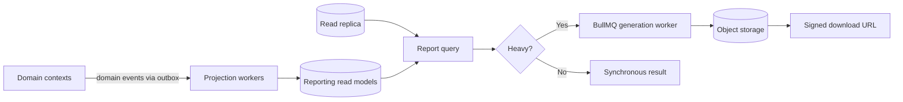
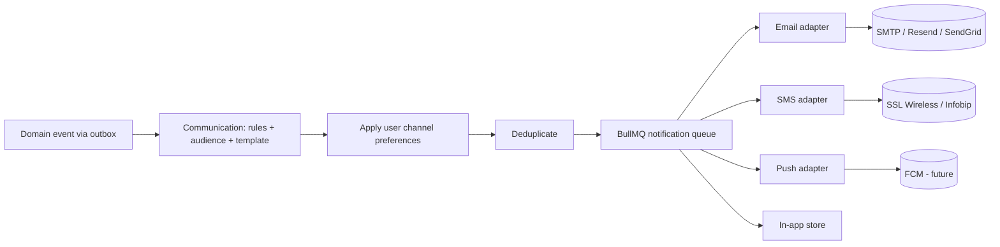
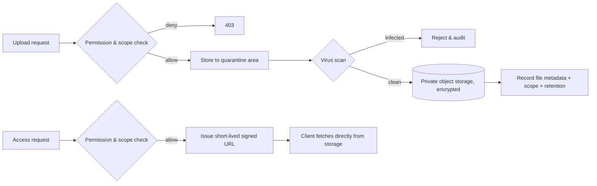
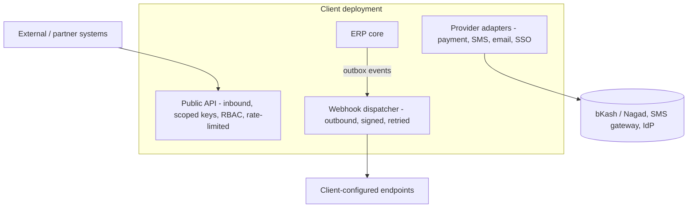

# Enterprise Education ERP — Architecture Blueprint
## Part E — Cross-Cutting Services: Reporting, Notifications, Files & Integration

**Scope:** The cross-cutting service families that every domain relies on — reporting and document generation, the multi-channel notification system, file and media management, and the integration surface (public API, webhooks, external integrations, and the internal extensibility model that underpins the future marketplace).
**Status:** Part E of the blueprint. Builds on Part B (outbox/events, BullMQ, object-storage adapter, read replica), Part D (configuration engine, RBAC/scoping, audit), and Cluster answers (per-client reporting, Bangladesh notification gateways, GDPR-aligned retention, internal plugins with public APIs and no sandboxed third-party code).
**Constraint:** No source code. Diagrams, data shapes, flows, and decisions only.
**Decision format:** Recommendation → Why → Pros → Cons → Alternatives → Final Decision. Numbering continues from Part D (D41 onward).

---

## E-1. Reporting Architecture (Sections 1–6)

### 1. Reporting Architecture

> **Decision D41 — Reporting reads from dedicated read models (a reporting projection), never from transactional tables directly; heavy generation runs on the queue; the largest client uses the read replica.**
> **Recommendation:** Build reporting on read models — denormalized projections maintained from domain events (Part B's outbox) and/or served from the read replica — kept separate from the transactional schema. Generate heavy reports asynchronously on BullMQ workers. Reporting is per-client only (Cluster 4); no data leaves the deployment.
> **Why:** Reports aggregate across many contexts and run heavy scans; running them against live transactional tables couples reporting to every source schema and lets a big report degrade interactive performance — unacceptable at the 30,000-student client during peak events. Read models isolate reporting load and schema, and the read replica absorbs the heaviest queries. Batch generation is acceptable (Cluster 4), so async is the right default.
> **Pros:** Reporting load isolated from transactions; report shapes optimized independently of source schemas; the replica absorbs heavy reads; consistent with Part A's "Reporting is a downstream read-only consumer"; scales for the largest client.
> **Cons:** Read models add storage and projection machinery; projections are eventually consistent (acceptable for reports); two representations of some data to keep coherent.
> **Alternatives:** (a) Query transactional tables directly — simplest, but couples reporting to every schema and loads the OLTP database; rejected at this scale. (b) A separate analytics database/warehouse per deployment now — powerful, but premature operational weight; the read-model-plus-replica approach is the staged path, and a per-client data mart is noted as a future option (Cluster 4).
> **Final Decision:** Event-fed read models plus replica-served queries, async batch generation on the queue, strictly per-client. A per-client data mart and the optional central analytics platform remain future, consent-bound extensions (Cluster 4), with vendor telemetry carrying only usage/error/product metrics — never student data.

### 2. Dynamic Report Builder

> **Decision D42 — Report definitions are configuration: datasets, filters, columns, and grouping defined as data and resolved through the configuration engine.**
> **Recommendation:** Model reports as report definitions — a selected dataset (a read model), available filters, chosen columns, grouping/sorting, and output formats — stored as data and managed through the configuration engine, so institutions can build and save reports without code.
> **Why:** An ERP needs dozens of reports and every institution wants slightly different cuts; hard-coding each is endless work and inflexible. A definition-driven builder lets clients compose reports from curated datasets and filters, reusing the same configuration/versioning/audit machinery as the rest of the system, while curated datasets keep the builder safe (clients compose within bounded, permission-checked data, not arbitrary queries).
> **Pros:** Clients build and save their own reports; reuses configuration engine (versioning, audit); curated datasets prevent unsafe or unbounded queries; consistent with the no-hard-coding thesis.
> **Cons:** The builder is a real component; datasets must be curated and permission-scoped; very bespoke reports may still need a custom dataset added by the team.
> **Alternatives:** (a) Hard-coded reports only — simple, inflexible, endless backlog. (b) Raw query access — maximal flexibility, but a security and performance hazard (unbounded queries, data leakage); rejected.
> **Final Decision:** Definition-driven report builder over curated, permission-scoped datasets, with saved report definitions versioned and audited like other configuration. The team adds new datasets; clients compose reports on them.

### 3. Report Templates

Report and document templates (marksheets, transcripts, fee receipts, ID cards, certificates) are configurable artifacts: a template defines layout, branding placement, columns, and signature areas, consuming the per-client branding and terminology (Part C) so output looks native to each institution. Templates are versioned, and — critically — a generated document records the template version and the data version it was produced from, so a re-print is faithful and a historical marksheet always reflects the grading and template active when it was issued (consistent with Part D's "historical records reference the configuration active at the time"). Templates render through the document pipeline (Section 5).

### 4. Excel Export

Excel export targets data-heavy outputs (student lists, fee collection, payroll sheets, merit lists) where recipients need to sort, filter, and pivot. Exports are generated from the same read models as on-screen reports, run on the queue for large datasets (a 30,000-row export never blocks a request), and stream to object storage for download via a signed URL. Exports respect the requesting user's permissions and scope — an export can never contain rows the user could not see on screen — and large exports report progress and notify on completion. Column sets and formatting follow the report definition, so an export and its on-screen report stay consistent.

### 5. PDF Export

> **Decision D43 — Two-tier PDF generation: HTML-template rendering via a headless browser for rich documents, a lightweight generator for simple ones; all heavy generation async to object storage.**
> **Recommendation:** Render rich, branded documents (marksheets, transcripts, certificates, ID cards) from HTML templates through a headless-browser renderer that honors the design tokens and branding; use a lighter programmatic generator for simple, high-volume documents (receipts) where full HTML rendering is overkill. Run bulk generation on the queue, store outputs in object storage, deliver via signed URLs, and support bulk runs that produce a downloadable archive.
> **Why:** Rich documents need pixel-faithful, brand-consistent layout that HTML/CSS templates express best and that reuse the same design tokens as the UI; headless rendering achieves that. But headless rendering is resource-heavy, so simple high-volume documents use a lighter path. Async generation protects interactive performance during bulk runs (printing all marksheets for a 30,000-student institution).
> **Pros:** Rich documents are brand-faithful and template-driven (configurable, no code per document); simple documents generate cheaply; bulk runs never block users; outputs are stored, auditable, and re-printable.
> **Cons:** Headless rendering needs managed worker resources (memory/CPU) and careful concurrency limits; two generation paths to maintain.
> **Alternatives:** (a) Headless rendering for everything — simplest mentally, but wasteful for high-volume simple documents. (b) Programmatic-only generation — efficient, but painful for rich, frequently-restyled, brand-specific layouts.
> **Final Decision:** Two-tier generation (HTML+headless for rich, programmatic for simple), async on the queue with concurrency limits, outputs to object storage with signed-URL delivery and bulk archive support.

### 6. Scheduled Reports

Scheduled reports use the background-jobs mechanism (Part B): a schedule definition binds a report definition to a cadence (daily attendance summary, monthly fee collection), a recipient set, and a delivery channel (in-app, email). At each run a worker generates the report from read models, stores it, and notifies recipients with a signed link. Schedules respect permissions (a scheduled report is generated under a service identity bounded to the recipients' visibility) and are configurable per client without code. Failed runs surface to observability (Part F's monitoring) and retry per policy.

---

## E-2. Notification Architecture (Sections 7–13)

### 7. Notification Architecture

> **Decision D44 — Two-layer notifications: the Communication context decides what to send; a provider-agnostic Notification Delivery layer with per-channel adapters sends it, all queue-driven and event-fed.**
> **Recommendation:** Separate deciding (Communication context: which event triggers which message to which audience, with templates) from delivering (Notification Delivery: channel adapters for email, SMS, push, in-app). Trigger notifications from domain events (the outbox), render templates per channel and language, enqueue on BullMQ, and deliver through pluggable provider adapters.
> **Why:** Mixing "what to notify" with "how to send" couples business rules to providers and makes channel or provider changes invasive. Separating them, with provider-agnostic adapters, lets a client swap SMS providers or add push without touching the rules, and event-driven triggering means notifications fire reliably from the same outbox that guarantees no lost events (Part B). Queue-driven delivery decouples send latency and absorbs bursts (result-publish day).
> **Pros:** Providers and channels swappable without touching business rules; reliable event-driven triggering; burst absorption via queue; per-channel, per-language templates; clean separation of concerns.
> **Cons:** Two layers plus adapters to build; template management across channels and languages; idempotency/dedup required (handled below).
> **Alternatives:** (a) Direct sends from domain code — simple, but couples domains to providers, risks lost notifications, and floods under bursts. (b) A third-party notification platform — capable, but adds external dependency/cost per deployment and reduces control; reserved as an adapter option, not the default.
> **Final Decision:** Decide/deliver separation, provider-agnostic channel adapters, event-triggered and queue-driven, with per-channel/per-language templates. This is the "ports/adapters" pattern validated in the starter-repo analysis, applied to notifications.

### 8. Email Service

Email delivery is a channel adapter behind a provider-agnostic port, with implementations for SMTP, and managed providers (Resend/SendGrid) selectable per client by configuration; a console adapter serves development. Templates are per-language (English/Bangla) with variable substitution, and rendering reuses the template machinery. The service handles bounce/complaint feedback where the provider supports it, respects per-user preferences, and records delivery outcomes for the audit and notification history. Account-related emails (invitations, password recovery, MFA setup) are transactional and always sent regardless of marketing-style preferences.

### 9. SMS Service

> **Decision D45 — SMS via a provider-agnostic adapter with Bangladesh gateways, Bangla Unicode templates, and strict cost controls.**
> **Recommendation:** Implement SMS as a channel adapter with Bangladesh-appropriate providers (SSL Wireless, Infobip), Bangla (Unicode) and English templates, and cost controls: deduplication (no more than one SMS per recipient per event per day), opt-in/opt-out, rate limits, and per-client credentials stored encrypted.
> **Why:** Bangladesh parents expect Bangla SMS, and SMS carries real per-message cost, so the service must minimize spend and avoid flooding. A provider-agnostic adapter lets a client choose or switch gateways; dedup and rate limits protect cost and goodwill; Unicode handling is essential for Bangla.
> **Pros:** Local-market fit; controlled cost; no flooding; provider flexibility; secure per-client credentials.
> **Cons:** SMS dedup and preference logic to build; Unicode/segment-length handling adds complexity; provider onboarding per client.
> **Alternatives:** (a) A single hard-coded gateway — simpler, but locks clients to one provider and pricing. (b) No cost controls — risks runaway spend and parent annoyance.
> **Final Decision:** Provider-agnostic SMS adapter, Bangladesh gateways, Bangla+English Unicode templates, dedup/rate-limit/opt-out cost controls, encrypted per-client credentials. SMS is a Phase-2 capability (per the roadmap) but the trigger and template infrastructure are built in Phase 1 so enabling it is configuration, not new code.

### 10. Push Notifications

Push is a channel adapter designed-for-now, enabled-later, targeting the future mobile app via a push provider (e.g., FCM). The architecture treats push identically to other channels — event-triggered, template-rendered, preference-respecting, queue-delivered — so when the mobile app ships (Part F roadmap), enabling push is adding the adapter and device-token registration, not re-architecting notifications. Device-token management ties into the device model from Part D. Until the mobile app exists, push is dormant but its seam is in place.

### 11. In-App Notifications

In-app notifications are the always-available channel: every notification is also recorded as an in-app item (recipient, type, title, body, read/unread, timestamp, link), surfaced in the application's notification center across all portals. The client retrieves and marks them through the data layer (RTK Query, Part C), with unread counts and real-time-ish updates via polling initially and a lightweight push/websocket later if warranted. In-app notifications have no per-message cost and no delivery uncertainty, so they are the reliable baseline; email/SMS/push are added per event and per preference on top.

### 12. Notification Preferences

Preferences let each user control which channels they receive which categories of notification on, within client-set policy. A preference resolves per (user, notification category, channel): a parent might receive fee reminders by SMS and in-app but exam schedules in-app only. The Communication context applies preferences after deciding the audience and before enqueuing, and transactional/critical notifications (security, account) override preferences so they are never suppressed. Client-level policy can mandate or cap certain channels (e.g., disable SMS to control cost, or require in-app for all). Preferences are scoped and stored per user, with sensible defaults from the client configuration.

### 13. Notification Queue

The notification queue is a dedicated BullMQ queue (Part B) with priority lanes so urgent notifications (security alerts) are not stuck behind a bulk result-publish blast to 30,000 parents. Delivery is idempotent (keyed by notification id) so retries never double-send, with backoff on provider failures and a dead-letter path for exhausted retries that surfaces to observability. Bulk notification runs (result published for a whole institute) are chunked and rate-limited to respect provider throughput and cost controls. The queue decouples the triggering event from delivery, so a slow provider never slows the domain operation that triggered the notification.

DOCEOF
echo "E-1 and E-2 appended."
---

## E-3. File Management Architecture (Sections 14–18)

### 14. File Management Architecture

> **Decision D46 — Private object storage (S3/MinIO) behind an adapter; access only via short-lived signed URLs; scoped paths; server-side encryption; virus scanning on upload.**
> **Recommendation:** Store all files in private object storage through a provider-agnostic adapter (MinIO self-hosted or AWS S3 per deployment), never publicly accessible; grant access only via short-lived signed URLs issued after a permission/scope check; organize objects under a scoped path convention; encrypt at rest server-side; and scan uploads for malware before they become available.
> **Why:** Files include sensitive student documents and identity images; public buckets or long-lived URLs are a classic leakage vector. Signed URLs gated by the same authorization model (Part D) ensure a file is reachable only by someone permitted to see it, for a short window. Scoped paths keep one institute's files organized and support per-institute lifecycle. Virus scanning prevents the platform from distributing malware uploaded by users.
> **Pros:** No public exposure; access tied to the authorization model; short exposure windows; per-client/per-institute organization; encryption at rest; malware containment; provider-swappable (MinIO ↔ S3).
> **Cons:** Signed-URL issuance adds an authorization step per access; virus scanning adds upload latency and a scanning component; lifecycle management is real work.
> **Alternatives:** (a) Public-read buckets with obscure keys — convenient, but security-through-obscurity and a leakage risk; rejected. (b) Serving files through the application — gives full control but loads the app with large transfers; signed URLs offload transfer to storage while keeping control.
> **Final Decision:** Private storage, authorization-gated short-lived signed URLs, scoped paths (per organization/institute/entity), server-side encryption at rest, and pre-availability virus scanning, all behind a storage port so MinIO and S3 are interchangeable per deployment.

### 15. Document Storage

Documents are user-uploaded files tied to records — admission documents (birth certificate, national ID, testimonials, transfer certificates), verification artifacts, and supporting attachments. Each is stored with metadata (owning entity, document type, scope, uploader, verification status, retention class) so it can be listed, verified, and lifecycle-managed. Document verification status (pending/verified/rejected) gates downstream actions (e.g., admission finalization) per the domain rules. Documents are scoped and access-controlled exactly like any other data — a user sees only documents within their institute/campus and ownership, enforced before any signed URL is issued.

### 16. Certificate Storage

Certificates are system-generated documents (ID cards, admit cards, transcripts, transfer certificates, completion certificates) produced by the document pipeline (Section 5) and stored with provenance: the template version, the data/configuration version, a sequential certificate number where applicable, and the issuing scope. Provenance makes certificates **verifiable and re-issuable** — a re-print reproduces the original faithfully, and a certificate can be validated against its recorded number and provenance (supporting a future QR/verification feature). Certificates follow stricter retention (they are records of issuance) and are immutable once issued; a correction issues a new certificate rather than altering the original.

### 17. Media Storage

Media are images and similar assets — student and staff photos, institution logos, and content media. They follow the same private-storage-and-signed-URL model but with media-specific handling: images are processed on upload (resized into the variants the UI and documents need — thumbnail, card, full — to avoid serving large originals), optimized, and served via signed URLs through the CDN where appropriate (Section on performance in the non-functional design). Photos are sensitive (they identify minors), so they are access-controlled like documents, never public, and subject to retention and erasure like other personal data.

### 18. File Lifecycle Management

> **Decision D47 — Configurable, retention-class-driven file lifecycle with tiering, archival, and compliant erasure.**
> **Recommendation:** Assign every file a retention class; drive lifecycle by configurable per-client retention policies (Cluster 7) — active storage, transition to cheaper/cold storage after a window, archival, and eventual deletion or anonymization — with export-before-purge and full audit, and support targeted erasure for right-to-erasure requests.
> **Why:** Files accumulate and include personal data of minors; GDPR-aligned principles (Cluster 7) require configurable retention, exportability, and erasure. Retention classes let different file types follow different rules (a transient upload purged quickly; a certificate retained for years), and tiering controls storage cost at the 30,000-student scale.
> **Pros:** Compliance-ready (configurable retention, erasure, export); storage cost controlled by tiering; per-client policy; auditable lifecycle; consistent with the data archival strategy in Part B.
> **Cons:** Lifecycle machinery and retention-class tagging to build; erasure across active/archived/derived copies (thumbnails) must be thorough; legal-hold cases need handling.
> **Alternatives:** (a) Keep everything forever — simplest, but non-compliant and ever-growing cost. (b) Fixed global retention — simple, but cannot meet differing per-type, per-client legal needs.
> **Final Decision:** Retention-class-driven, per-client-configurable lifecycle with tiering, archival, export-before-purge, thorough erasure (including derived media), and audit — the file-side counterpart to Part B's data archival and retention strategy, governed by the same compliance posture.

---

## E-4. Integration Architecture (Sections 19–25)

### 19. Integration Architecture

Integration is how a client deployment connects to the outside world — inbound (other systems calling the ERP) and outbound (the ERP calling or notifying other systems) — and it is built on three pillars consistent with Cluster 8: a **public API** as the controlled inbound surface, **webhooks** as the outbound event surface, and **provider adapters** for the specific external services the ERP itself uses (payment, SMS, email, SSO). All three reuse the platform's existing machinery: the public API uses the same RBAC/scoping and the outbox-driven events feed webhooks. Critically, integration adds capability without opening the system to untrusted code — there is no third-party code execution (Section 25); extension happens through these well-defined, secured surfaces.

### 20. Public API Design

> **Decision D48 — Versioned REST public API governed by the same RBAC/scoping model, authenticated by scoped API credentials, rate-limited, and documented via OpenAPI.**
> **Recommendation:** Expose a versioned REST public API as the official integration surface; authenticate integrations with scoped, revocable API credentials (client-credentials style) bound to a permission set and institute/campus scope; apply the same authorization, validation, and rate limiting as the interactive API; document everything with OpenAPI.
> **Why:** Cluster 8 wants public APIs for integrations as the basis of a future marketplace. Reusing the existing RBAC/scoping/validation for the public API means external callers are governed exactly like internal ones — no parallel, weaker access path — and scoped, revocable credentials keep integrations least-privileged and auditable. Versioning protects integrators from breaking changes; OpenAPI makes the surface self-documenting.
> **Pros:** One authorization model for internal and external access; least-privilege, revocable, auditable integration credentials; versioning shields integrators; self-documenting; the foundation for the marketplace.
> **Cons:** Public API surface must be curated and stabilized (a contract to maintain); credential management and rate-limiting per integration to build; versioning discipline required.
> **Alternatives:** (a) Expose internal endpoints directly — fast, but leaks unstable internals and risks a weaker access path. (b) GraphQL public API — flexible for integrators, but a larger attack surface and harder to rate-limit/version safely for a small team initially; REST first, GraphQL reconsidered later.
> **Final Decision:** Versioned REST public API, scoped/revocable credentials under the same RBAC/scoping, rate-limited, OpenAPI-documented. This API is the curated subset of capability deemed stable for external use — not a passthrough to internal endpoints.

### 21. API Gateway Strategy

> **Decision D49 — Per-deployment gateway concerns split between Nginx (edge) and the application; no separate API-gateway product at current scale.**
> **Recommendation:** Handle edge concerns (TLS termination, routing, static assets, basic protection, request size limits) at Nginx in front of each deployment, and application-level gateway concerns (authentication, authorization, rate limiting, versioning, request context) inside the NestJS application. Do not introduce a dedicated API-gateway product per deployment.
> **Why:** The per-deployment, modular-monolith model means there is one application behind Nginx per client; a separate API-gateway product would add an operational component to every one of 200+ deployments for concerns the application and Nginx already handle well. Edge vs application split keeps responsibilities clear without extra infrastructure.
> **Pros:** No extra component per deployment; clear edge/app responsibility split; rate limiting and auth stay close to the application's own model; simpler fleet operations.
> **Cons:** The application carries gateway concerns (acceptable — they are already there); a future multi-service topology might later warrant a real gateway (deferred until/unless that happens).
> **Alternatives:** (a) A dedicated API gateway per deployment — powerful, but unjustified operational weight at this scale and topology. (b) A central shared gateway — contradicts the isolated-deployment model.
> **Final Decision:** Nginx edge + application-level gateway concerns per deployment; revisit only if the topology ever becomes multi-service. The Control Plane may run its own small gateway for vendor APIs, separate from client deployments.

### 22. Webhook Design

> **Decision D50 — Outbound webhooks driven by the outbox, signed, retried with backoff, and subscribable per event type.**
> **Recommendation:** Let clients register endpoints subscribed to specific event types; dispatch webhooks from the outbox-fed event stream; sign each payload (HMAC) so receivers can verify authenticity; retry with exponential backoff and a dead-letter path; and record every delivery attempt.
> **Why:** Webhooks are the outbound half of integration and the natural complement to the public API. Driving them from the outbox guarantees they reflect committed events reliably (no lost or phantom webhooks). Signing prevents spoofing; retries handle transient receiver outages; per-event subscription keeps traffic relevant and least-exposed.
> **Pros:** Reliable (outbox-backed); authentic (signed); resilient (retry/backoff/dead-letter); least-exposure (per-event subscription); auditable delivery history; reuses existing event machinery.
> **Cons:** Delivery infrastructure (retries, dead-letter, signing, attempt logging) to build; receivers must handle idempotency and verify signatures (documented for integrators).
> **Alternatives:** (a) No webhooks, polling only — simpler for the vendor, worse for integrators and chattier. (b) Fire-and-forget webhooks without retries/signing — unreliable and insecure.
> **Final Decision:** Outbox-driven, signed, retried, per-event-subscribed webhooks with delivery auditing — the outbound integration surface paired with the inbound public API.

### 23. External Integrations

External services the ERP itself depends on are each wrapped behind a provider-agnostic port with per-client, encrypted credentials, so providers are swappable and isolated per deployment. The key integrations: **payment** (bKash, Nagad for Bangladesh, plus card providers later) behind a payment port, so the Finance context calls a generic interface and the adapter handles the provider; **SMS and email** (Sections 8–9); **SSO/identity providers** (Part D's identity-provider port, OIDC/SAML adapters); and future integrations (accounting systems, government education boards) added as adapters. The ports/adapters discipline means adding or switching a provider is implementing an adapter and supplying configuration — never changing domain logic. Credentials are stored encrypted (Part F security) and scoped per client.

### 24. Future Marketplace Design

> **Decision D51 — Build the marketplace's foundations now (public API, webhooks, entitlements); defer the marketplace product itself.**
> **Recommendation:** Treat the public API, webhooks, scoped credentials, and the licensing/entitlements model (Control Plane, Part A) as the marketplace foundation, built and hardened now; defer building the marketplace experience (discovery, listing, partner onboarding, billing) to a later phase.
> **Why:** Cluster 8 envisions a future API marketplace but prioritizes stability and a small team now. A marketplace is mostly the disciplined exposure of stable APIs plus entitlement and partner management; building the API/webhook/entitlement foundation well now means the marketplace later is largely assembly, not new core architecture. Building the marketplace product prematurely would divert the small team from the core ERP.
> **Pros:** No wasted effort — the foundation is needed anyway; marketplace becomes incremental later; avoids premature platform-building; keeps the team focused on the core product and first paying client.
> **Cons:** No marketplace in early phases (acceptable per Cluster 8); the foundation must be designed with eventual marketplace needs in mind (entitlement granularity, API stability).
> **Alternatives:** (a) Build the marketplace now — premature, diverts the team, unjustified before product-market fit. (b) Ignore marketplace entirely in the design — would force a larger retrofit later.
> **Final Decision:** Foundations now (stable public API, webhooks, scoped credentials, entitlements), marketplace product deferred to a later roadmap phase, designed-for but not built.

### 25. Internal Plugin Architecture

> **Decision D52 — Internal modular extensibility through trusted extension points and configuration; explicitly no sandboxed third-party code execution in early phases.**
> **Recommendation:** Achieve extensibility three ways, all within the trusted codebase and the existing architecture: (1) the configuration engine (the primary extensibility — behavior changes as data), (2) defined extension points/hooks within trusted modules where new internal capabilities plug in cleanly, and (3) the public API and webhooks for external integration. Do not execute untrusted third-party code in the deployment.
> **Why:** Cluster 8 is explicit: internal modular extensibility and public APIs, no sandboxed third-party code execution early, with a focus on stability, maintainability, and security. Sandboxed third-party plugin execution is a major security and operations project (isolation, resource limits, supply-chain risk) that a small team should not take on now — and most real extensibility needs are met by configuration plus a stable API. Reserving extension to trusted code and configuration keeps the system secure and maintainable.
> **Pros:** Real extensibility without the security/operations burden of untrusted code; configuration covers most variation; the public API/webhooks cover external extension; maintainable and secure for a small team.
> **Cons:** Third parties cannot run code inside the deployment (by design); some advanced extensions wait for the API or a trusted contribution; the "plugin" terminology means internal extensibility, which must be communicated clearly.
> **Alternatives:** (a) Sandboxed third-party plugins now — powerful, but a large security/ops project, explicitly out of scope per Cluster 8. (b) No extensibility model — rigid, contradicts the product's adaptable nature.
> **Final Decision:** Configuration-first extensibility, trusted internal extension points, and the public API/webhooks as the external surface; sandboxed third-party execution explicitly deferred and revisited only with dedicated security/ops investment.

---

## Part E — Closing Note and What Comes Next

Part E has specified the cross-cutting services on top of the platform built in Parts A–D. Reporting reads from event-fed read models and the replica, never the transactional tables, with a configuration-driven report builder and a two-tier document pipeline producing brand-faithful, provenance-stamped PDFs and Excel exports asynchronously to object storage. Notifications separate deciding from delivering, with provider-agnostic channel adapters (Bangladesh-ready SMS, email, future push, always-on in-app), event-triggered and queue-driven with preferences, dedup, and cost controls. File management uses private, encrypted object storage with authorization-gated signed URLs, virus scanning, and a configurable retention-class lifecycle that satisfies the compliance posture. And the integration architecture exposes a versioned, RBAC-governed public API and outbox-driven signed webhooks, wraps external services (payment, SMS, email, SSO) behind swappable ports, lays the marketplace foundations while deferring the marketplace product, and delivers extensibility through configuration and trusted extension points — with no untrusted code execution, exactly as Cluster 8 requires.

Every choice here reused existing machinery rather than inventing new infrastructure: the outbox drives reporting projections, notifications, and webhooks; BullMQ runs the heavy generation and delivery; the configuration engine powers report and notification templates; the authorization model governs the public API and file access; and the compliance posture drives file retention. What remains is the non-functional hardening and execution layer — security, performance, scalability, DevOps, observability, and backup/DR — and the engineering standards, phased roadmap, and the critical self-review.

**Awaiting your approval to proceed.** I have generated Part E only and will not continue until you direct me to the next part.

*End of Part E.*
