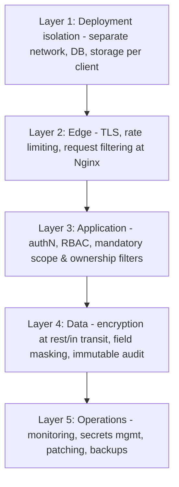
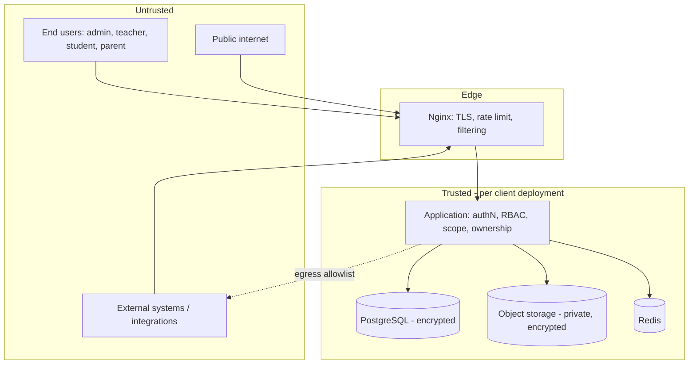
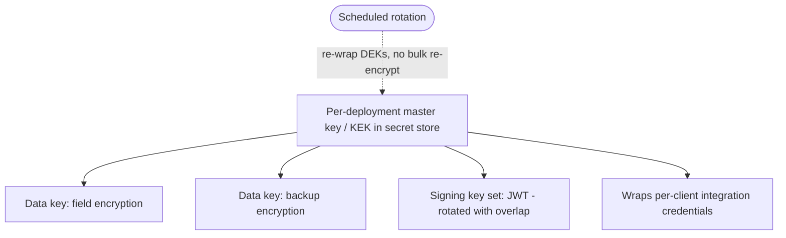
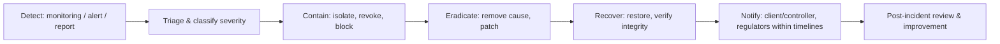

# Enterprise Education ERP — Architecture Blueprint
## Part F — Enterprise Security Architecture

**Scope:** The complete security architecture — threat model, OWASP coverage, attack-specific defenses, authentication/authorization/session/password security, secrets and encryption, audit and monitoring, compliance and GDPR readiness, retention and export, disaster-recovery security, incident response, and the security testing program.
**Status:** Part F of the blueprint. Consolidates and hardens the security threads from Part A (isolation), Part B (audit, encryption baseline, parameterized access), Part D (auth, RBAC, scoping), and Part E (file security, webhooks, PDF rendering), under the Cluster 7 compliance posture.
**Constraint:** No source code. Threat models, control mappings, diagrams, and decisions only.
**Decision format:** Recommendation → Why → Pros → Cons → Alternatives → Final Decision. Numbering continues from Part E (D53 onward).

> **Framing.** Two facts govern this entire part. First, the system processes the personal data of **minors**, which raises the sensitivity and legal bar on every control — child-data protection is the highest priority, not an afterthought. Second, the strongest security control is already architectural: **each client is a physically isolated deployment** (Part A), so cross-client data exposure is structurally prevented rather than merely access-controlled. The security effort therefore concentrates on the risks that isolation does not solve: leakage *between institutes within one deployment*, integrity of academic and financial records, account takeover, and the server-side request surfaces.

---

## F-1. Security Foundation & Threat Model (Sections 1–2)

### 1. Enterprise Security Architecture

> **Decision D53 — Defense-in-depth with deployment isolation as the primary control and scoped, least-privilege access as the secondary.**
> **Recommendation:** Layer controls so no single failure is catastrophic: physical deployment isolation per client (network/database/storage), then edge protections (TLS, WAF-style rules, rate limiting at Nginx), then application controls (authentication, RBAC, mandatory scope and ownership filters), then data controls (encryption, field masking, audit), then operational controls (monitoring, secrets management, patching). Treat isolation as the outer wall and least-privilege scoped access as the inner enforcement.
> **Why:** A single layer will eventually fail; defense-in-depth ensures a breach of one control meets another. Isolation makes the worst-case blast radius one client, never the fleet; least-privilege scoping makes the worst case within a client one institute or one user's authorized data, never everything. For minors' data, bounding blast radius is the dominant design goal.
> **Pros:** Bounded blast radius (one client, then one scope); no single point of total failure; each layer independently testable; aligns with the tenancy model.
> **Cons:** More controls to build and operate; layered defenses add some latency and complexity; requires discipline to keep every layer effective.
> **Alternatives:** (a) Perimeter-only security — one wall, catastrophic if breached. (b) Application-only security on a shared database — no isolation wall; a single flaw exposes all clients; rejected by the tenancy model.
> **Final Decision:** Defense-in-depth anchored by deployment isolation and least-privilege scoped access, with every subsequent section specifying one or more layers.

### 2. Threat Model

> **Decision D54 — STRIDE-based threat modeling plus an education-specific threat catalog, prioritized by impact on minors' data and on academic/financial integrity.**
> **Recommendation:** Model threats with STRIDE (Spoofing, Tampering, Repudiation, Information disclosure, Denial of service, Elevation of privilege) against the system's assets and trust boundaries, and maintain an explicit education-specific threat catalog for the risks generic models miss.
> **Why:** STRIDE gives systematic coverage of categories; the education catalog captures domain-specific high-impact threats (mass exposure of children's records, grade tampering, fee fraud) that drive concrete controls. Prioritizing by impact on minors and on record integrity focuses scarce small-team effort where harm is greatest.
> **Pros:** Systematic plus domain-aware; ties threats to concrete controls; prioritized by real-world harm; reviewable and updatable.
> **Cons:** Threat modeling is ongoing work requiring discipline; must be revisited as the system evolves.
> **Alternatives:** (a) Ad-hoc security — misses categories. (b) Generic checklist only — misses domain threats like grade tampering.
> **Final Decision:** STRIDE plus an education threat catalog, reviewed each phase.

The principal assets and the threats against them:

| Asset | Primary threats | Worst-case impact | Anchor controls |
|---|---|---|---|
| Minors' PII (records, photos, IDs) | Information disclosure, mass exfiltration, IDOR | Exposure of children's data | Isolation, scope+ownership filters, field encryption, signed URLs, audit |
| Academic records (marks, results) | Tampering, repudiation | Grade fraud, loss of trust | Immutable marks, version-stamping, full audit, RBAC + step-up MFA |
| Financial records (invoices, payments) | Tampering, fraud | Financial loss, disputes | Immutable invoices, audit, payment-adapter integrity, RBAC |
| Authentication & accounts | Spoofing, account takeover | Impersonation, mass access | MFA, refresh reuse detection, session/device control, password policy |
| Authorization model | Elevation of privilege, scope bypass | Cross-institute or cross-user access | Mandatory scope filters, ownership predicates, permission registry |
| Server-side fetch (webhooks, PDF render, integrations) | SSRF, template injection | Internal access, data exfiltration | Egress allowlists, URL validation, sandboxed rendering inputs |
| Availability (peak events) | Denial of service | Outage during results/admissions | Rate limiting, queue load-shedding, autoscaling (Part E/scaling) |
| Audit trail | Tampering, repudiation | Loss of accountability | Append-only, immutable, tamper-evident audit |

The trust boundaries that matter most: the client↔application boundary (every request authenticated and authorized), the institute↔institute boundary within a deployment (the scope filter), the application↔external boundary (egress controls for SSRF), and the deployment↔deployment boundary (isolation, never crossed).

---

## F-2. OWASP & Attack-Specific Defenses (Sections 3–7)

### 3. OWASP Top 10 Coverage

The OWASP Top 10 is addressed systematically; the table maps each category to this system's anchor controls, most of which were established in earlier parts and are consolidated here.

| OWASP category | Anchor controls in this architecture |
|---|---|
| Broken Access Control | Mandatory scope + ownership filters in the data layer (D35); permission registry; IDOR prevention via ownership predicates; non-enumerable UUIDv7 keys |
| Cryptographic Failures | TLS everywhere (D61); encryption at rest with field-level for sensitive data (D60); hashed tokens/passwords; no secrets in code (D59) |
| Injection | Parameterized access only via TypeORM/query builder (D57); curated datasets for reporting (no raw SQL); validated dynamic inputs (D12) |
| Insecure Design | Defense-in-depth, threat modeling, isolation, least privilege — this whole part |
| Security Misconfiguration | Hardened defaults, no debug in prod, centralized error filter (no stack leakage), security headers, fleet-uniform config |
| Vulnerable Components | Dependency scanning in CI (D71); pinned versions; regular patching via fleet ops |
| Authentication Failures | MFA (D32), refresh reuse detection (D31), rate-limited non-enumerating recovery (D7/D32), session/device control |
| Software & Data Integrity | Signed artifacts, immutable audit, version-stamped records, signed webhooks (D50) |
| Logging & Monitoring Failures | Append-only audit (D17), security monitoring and alerting (D64), correlation ids |
| SSRF | Egress allowlists and URL validation for all server-side fetches (D58) |

### 4. XSS Protection

> **Decision D55 — Output-encoding by default, a strict Content Security Policy, and treating all dynamic and rich content (custom fields, notices, PDF templates) as untrusted.**
> **Recommendation:** Rely on React's automatic output encoding for the UI, enforce a strict CSP that disallows inline scripts and untrusted sources, and explicitly sanitize any place where user-or-config-supplied content becomes markup — notices, rich text, dynamic custom-field values, and especially the HTML templates rendered to PDF.
> **Why:** XSS is the path to stealing the in-memory access token (Part C) and to acting as a victim. React encodes by default, but the danger spots are the exceptions: rich-text content, configurable custom fields whose values are rendered, and the HTML-to-PDF templates (Part E) which execute in a rendering context. A strict CSP is the backstop that neutralizes injected scripts even if encoding is missed somewhere.
> **Pros:** Default-safe rendering; CSP backstop limits damage of any miss; protects the token; covers the rich-content and PDF-template danger zones explicitly.
> **Cons:** Strict CSP requires discipline (no inline scripts; nonce/hashes); sanitizing rich content needs a vetted sanitizer; PDF templates need a constrained, sandboxed rendering input.
> **Alternatives:** (a) Rely on framework escaping alone — misses rich content and PDF templates. (b) Sanitize only on input — input sanitization is fragile; output encoding plus CSP is the robust posture.
> **Final Decision:** Default output encoding, strict CSP (no inline script, allowlisted sources, nonces where needed), vetted sanitization of rich/dynamic content, and constrained, untrusted-input-safe PDF template rendering. The token's memory-only storage (Part C) plus CSP together make token theft via XSS substantially harder.

### 5. CSRF Protection

> **Decision D56 — Bearer-token API calls are CSRF-immune; the cookie-based refresh path is protected by SameSite plus an anti-CSRF token.**
> **Recommendation:** Because the main API authorizes via a bearer access token sent in the Authorization header (not a cookie), those requests are not CSRF-exploitable. Protect the one cookie-bearing endpoint — refresh — with a strict SameSite cookie attribute and an additional anti-CSRF measure (double-submit token or origin checking).
> **Why:** CSRF exploits ambient cookie authentication; an Authorization-header bearer token is not sent automatically by the browser cross-site, so header-authorized endpoints are inherently safe. The refresh endpoint is the exception because it relies on the httpOnly cookie; SameSite blocks cross-site cookie sending and the anti-CSRF token closes the residual gap.
> **Pros:** Most of the API needs no CSRF tokens (simpler); the one cookie path is robustly protected; layered (SameSite + token).
> **Cons:** The refresh path needs the extra measure correctly implemented; SameSite interactions with any cross-subdomain setup must be verified.
> **Alternatives:** (a) CSRF tokens on every endpoint — unnecessary overhead for header-authorized calls. (b) SameSite alone on refresh — good, but defense-in-depth favors adding the token.
> **Final Decision:** No CSRF tokens on bearer-authorized endpoints; SameSite + anti-CSRF token (and origin validation) on the cookie-based refresh endpoint.

### 6. SQL Injection Protection

> **Decision D57 — Parameterized access only, through TypeORM and the query builder; no string-concatenated SQL anywhere; reporting uses curated datasets, never raw user SQL.**
> **Recommendation:** All database access goes through TypeORM repositories and the query builder with parameterized inputs; raw SQL is forbidden except rare, reviewed, fully-parameterized cases; JSONB queries are parameterized; the dynamic report builder composes over curated, server-defined datasets and filters, never raw user-supplied SQL.
> **Why:** Parameterization eliminates classic SQLi by separating code from data. The one place an ERP risks reintroducing SQLi is a "flexible report builder" that accepts raw query fragments; constraining the builder to curated datasets and parameterized filters keeps that flexibility safe.
> **Pros:** Structurally eliminates SQLi; the report builder stays safe; reviewable raw-SQL exceptions; covers JSONB queries.
> **Cons:** Curated datasets are less flexible than raw SQL (an acceptable, deliberate trade for safety); occasional complex query needs a reviewed parameterized raw statement.
> **Alternatives:** (a) Allow raw SQL freely — flexible, dangerous. (b) Raw user SQL in reporting — a direct injection and data-leakage path; rejected in Part E.
> **Final Decision:** Parameterized-only access, forbidden string concatenation, curated parameterized reporting; raw SQL only via reviewed, parameterized exceptions flagged in code review and architecture tests.

### 7. SSRF Protection

> **Decision D58 — Strict egress controls for every server-side outbound request: allowlists, internal-range blocking, and URL validation; this explicitly covers webhooks, file-URL fetches, integration callbacks, and PDF rendering.**
> **Recommendation:** Any server-initiated outbound request validates and constrains the destination: block requests to internal/loopback/link-local/metadata IP ranges, resolve and re-validate hostnames to prevent DNS-rebinding, allowlist destinations where possible (integration endpoints), and treat user/config-supplied URLs as hostile until validated. Apply this to webhook delivery, any feature that fetches a URL, integration callbacks, and the headless PDF renderer's resource loading.
> **Why:** SSRF lets an attacker make the trusted server reach internal services or cloud metadata endpoints — a severe risk, and this system has several server-side fetch surfaces: webhooks (client-supplied endpoints), the headless PDF renderer (which can load resources referenced in templates), and integration callbacks. Without egress controls, a malicious template or webhook target could pivot into the internal network or storage.
> **Pros:** Closes the SSRF class across all fetch surfaces; protects internal services and cloud metadata; defends the PDF renderer and webhook surfaces specifically called out as risky in Part E.
> **Cons:** Egress validation adds a step to every outbound call; allowlists need maintenance; DNS-rebinding defense requires re-resolution care.
> **Alternatives:** (a) Trust outbound destinations — leaves SSRF wide open, especially via webhooks and templates. (b) Network-level egress firewalling only — good defense-in-depth, but application-level validation is still needed for correctness and per-target rules.
> **Final Decision:** Application-level egress validation (range-blocking, allowlists, re-resolution) combined with network-level egress restrictions, applied uniformly to webhooks, URL fetches, integration callbacks, and the PDF renderer. The renderer additionally runs with constrained, network-restricted inputs so a template cannot weaponize it.

DOCEOF
echo "F-1 and F-2 appended."
---

## F-3. Authentication, Authorization, Session & Password Security (Sections 8–11)

### 8. Authentication Security

Authentication security consolidates the Part D mechanics into a hardened posture. Access tokens are short-lived and asymmetric-signed so a leak is brief and verifiable; refresh tokens rotate with family-based reuse detection so theft is self-defeating; MFA (TOTP) is available per client and stepped-up for sensitive actions (publishing results, bulk financial operations, exporting bulk records). Brute-force and credential-stuffing are countered by per-account and per-ip rate limiting on login, progressive delays, and lockout-with-notification on repeated failures. New-device logins trigger notification and optional step-up. Account enumeration is prevented across login, recovery, and registration (uniform responses). All authentication events — success, failure, MFA, new device, lockout — feed the audit trail and security monitoring. Because each deployment is isolated, a credential compromise is bounded to one client.

### 9. Authorization Security

Authorization security centers on the three-layer model from Part D — permission, mandatory scope filter, ownership predicate — enforced in the data layer so it cannot be bypassed by a forgetful query. The specific high-impact risks and their controls: **IDOR** (accessing another student's record by guessing an id) is prevented by ownership predicates plus non-enumerable UUIDv7 keys, so neither guessing nor authorization gaps expose another's data; **cross-institute leakage** is prevented by the mandatory institute scope filter applied from request context; **privilege escalation** via custom roles is prevented by the permission registry, which bounds custom roles to registered, code-enforced permissions so a role cannot grant a capability the code does not check. Authorization decisions are testable in isolation, and dedicated scope-isolation and ownership tests run in CI (D71) to catch regressions — a forgotten filter is a build failure, not a production leak.

### 10. Session Security

Sessions are server-side, revocable, and observable (Part D). Security properties: revocation is immediate (short token life plus Redis denylist), so logout and admin revocation take effect within minutes; concurrent sessions are visible and individually revocable per device; idle and absolute session lifetimes are enforced; a password change or detected compromise invalidates all sessions; refresh-token reuse revokes the whole family. Session fixation is prevented by issuing fresh tokens on authentication and never accepting client-supplied session identifiers. Sensitive operations can require a fresh authentication (step-up) regardless of session age. Session and device state is per-deployment in that client's Redis, never shared.

### 11. Password Security

Passwords are protected at rest with a strong, salted, memory-hard hashing function (Argon2id or equivalent), never reversible encryption and never plain text. Policy enforces sufficient length and rejects known-breached passwords (checked against a breach corpus where feasible) rather than relying solely on composition rules. Recovery and first-time activation use single-use, short-expiry, hashed tokens through a non-enumerating, rate-limited flow (Part D). Passwords are never logged, never returned, and never placed in tokens. For institutions that adopt SSO later, the federated path bypasses local passwords entirely (Part D's identity-provider abstraction), reducing password risk. MFA mitigates the residual risk of weak or reused passwords, which is significant in a parent/student population.

---

## F-4. Secrets & Encryption (Sections 12–15)

### 12. Secrets Management

> **Decision D59 — Secrets are externalized, never in code or images; per-client integration credentials are encrypted with envelope encryption; access is least-privilege and audited.**
> **Recommendation:** Keep application secrets (database credentials, signing keys, provider keys) outside the codebase and container images, supplied at runtime from environment/secret storage; encrypt per-client integration credentials (payment, SMS, SSO) at rest using envelope encryption (a per-deployment key encrypting per-credential data keys); restrict and audit secret access.
> **Why:** Secrets in code or images leak through repositories, logs, and image registries — a leading breach cause. Externalizing them and encrypting stored credentials with envelope encryption means a database or backup compromise does not directly yield usable provider credentials, and per-deployment keys keep one client's secrets isolated.
> **Pros:** No secrets in source/images; stored credentials protected even if the database leaks; per-client isolation of secrets; rotatable; auditable access.
> **Cons:** Secret storage and envelope-encryption machinery to operate; key management discipline required; the Control Plane must provision secrets securely per deployment.
> **Alternatives:** (a) Secrets in env files committed or baked into images — convenient, a frequent breach source; rejected. (b) Plain-stored credentials — a single DB leak exposes all integrations.
> **Final Decision:** Externalized runtime secrets, envelope-encrypted per-client credentials, least-privilege audited access, provisioned by the Control Plane. A managed secret store (cloud KMS/secret manager or self-hosted equivalent) backs key storage.

### 13. Encryption At Rest

> **Decision D60 — Layered encryption at rest: volume/disk + database storage encryption + application-level field encryption for the most sensitive data + encrypted backups and object storage.**
> **Recommendation:** Encrypt the database storage and volumes, encrypt object storage server-side, encrypt backups, and additionally apply application-level field encryption to the most sensitive fields (national identifiers and similar high-risk PII) so they are protected even from someone with raw database read access.
> **Why:** Storage-level encryption protects against media/backup theft but not against an actor with database read access; field-level encryption of the most sensitive identifiers adds a layer that protects them even then. For minors' identity data, this extra layer is justified. Encrypted backups and object storage close the obvious exfiltration channels.
> **Pros:** Defense-in-depth at rest; sensitive identifiers protected beyond storage encryption; backups and files covered; bounded per-deployment keys.
> **Cons:** Field-level encryption complicates querying those fields (acceptable — they are rarely queried directly and can be searched via blind indexes if needed) and adds key-management overhead; some performance cost.
> **Alternatives:** (a) Storage encryption only — protects media theft but not DB-read compromise of sensitive identifiers. (b) Encrypt everything at field level — heavy performance and query cost for little marginal benefit over storage encryption for non-sensitive fields.
> **Final Decision:** Storage + backup + object-storage encryption universally, plus targeted field-level encryption for the most sensitive PII, with keys managed per deployment and rotated (D62).

### 14. Encryption In Transit

> **Decision D61 — TLS everywhere, internal and external, with strong ciphers and HSTS.**
> **Recommendation:** Terminate TLS at Nginx for client traffic with modern ciphers and HSTS, and encrypt all internal connections too — application to database, to Redis, to object storage — so traffic is never in clear text even within the deployment's network.
> **Why:** External TLS is table stakes; internal TLS matters because a compromised network position should not yield clear-text database or cache traffic, and it supports the GDPR-aligned encryption-in-transit requirement (Cluster 7). HSTS prevents downgrade and stripping attacks.
> **Pros:** No clear-text anywhere; downgrade/stripping prevented; meets compliance; protects internal lateral traffic.
> **Cons:** Internal TLS adds certificate management and minor overhead; must be maintained as services and certs rotate.
> **Alternatives:** (a) External TLS only, clear-text internal — common but leaves internal traffic exposed to a foothold. (b) No HSTS — leaves downgrade risk.
> **Final Decision:** TLS for all external and internal connections, modern ciphers, HSTS, with certificate management automated per deployment.

### 15. Key Rotation Strategy

> **Decision D62 — Scheduled rotation for all key classes with overlap windows; per-deployment keys; no shared keys across clients.**
> **Recommendation:** Rotate each key class on a schedule with grace overlap so in-flight artifacts stay valid: JWT signing keys (publish new, accept old until expiry, via a key set), encryption keys (envelope KEK/DEK so rotating the KEK re-wraps data keys without re-encrypting all data), and integration credentials (coordinated with providers). Keys are per-deployment; none are shared across clients.
> **Why:** Rotation limits the value and lifetime of any compromised key. The KEK/DEK envelope design makes encryption-key rotation cheap (re-wrap keys, not re-encrypt terabytes). Overlap windows prevent rotation from invalidating valid in-flight tokens or sessions. Per-deployment keys keep a key compromise bounded to one client.
> **Pros:** Bounded key lifetime and blast radius; cheap encryption-key rotation via envelope; no rotation-induced outages; per-client isolation.
> **Cons:** Key-management and rotation automation to operate; overlap windows must be handled correctly; the Control Plane coordinates fleet-wide rotation.
> **Alternatives:** (a) Static keys — simplest, but a compromise is unbounded in time. (b) Rotation without overlap — risks invalidating valid tokens/sessions during rotation.
> **Final Decision:** Scheduled, overlap-windowed rotation for signing, encryption (envelope KEK/DEK), and credential keys; per-deployment; orchestrated by the Control Plane.

---

## F-5. Audit, Monitoring & Compliance (Sections 16–21)

### 16. Audit Logs

The audit trail (designed in Part B, security-framed here) is the backbone of accountability and compliance. It is **append-only and immutable** — never updated or deleted except by retention-driven archival — so it is tamper-evident; it is **complete**, sourced from the outbox so every committed change is recorded and none can be bypassed; and it is **rich**, capturing actor, action, entity, before/after, scope, correlation id, ip, and timestamp. Security-relevant events get special attention: authentication outcomes, permission and role changes, scope-violation attempts, bulk exports, configuration and grading changes, and financial actions. The audit trail is access-controlled (reading it is itself a permission), partitioned and retained per policy, and exportable for compliance. For the highest-integrity needs, the trail supports tamper-evidence (chained hashes) so any alteration is detectable.

### 17. Security Monitoring

> **Decision D63 — Per-deployment security monitoring with anomaly alerting, plus aggregated security signals to the Control Plane carrying no student data.**
> **Recommendation:** Aggregate logs and security events within each deployment and alert on anomalies — spikes in failed logins, privilege changes, mass-export activity, repeated scope-violation attempts, new-device logins for privileged accounts, and unusual data access volumes. Forward only security signals and metrics (counts, error rates, alert events) — never student data — to the Control Plane for fleet-wide visibility.
> **Why:** Detection is as important as prevention; many breaches are caught by noticing anomalous behavior. Per-deployment monitoring respects isolation; forwarding only non-sensitive signals to the Control Plane (consistent with Cluster 4's telemetry boundary) gives the vendor fleet-wide security awareness without violating isolation or privacy.
> **Pros:** Early breach detection; respects isolation and the no-student-data-leaves rule; fleet-wide security visibility for the vendor; actionable alerts on the highest-risk patterns.
> **Cons:** Monitoring and alerting infrastructure to operate; tuning to avoid alert fatigue; the Control Plane aggregation must be carefully scoped to non-sensitive signals.
> **Alternatives:** (a) No monitoring — prevention-only, blind to breaches in progress. (b) Centralize full logs to the vendor — violates isolation and privacy; rejected.
> **Final Decision:** Per-deployment monitoring and anomaly alerting; only non-sensitive security signals and metrics aggregated to the Control Plane. Alerts route to an on-call/incident process (Section 23).

### 18. Compliance Readiness

> **Decision D64 — A GDPR-aligned baseline applied everywhere, with Bangladesh-first specifics and explicit minor-data protections, designed so jurisdiction-specific rules are configuration.**
> **Recommendation:** Adopt GDPR-aligned principles as the universal baseline (lawful basis, data minimization, purpose limitation, subject rights, breach notification, records of processing, controller/processor clarity), layer Bangladesh-specific requirements now, and treat minors' data with heightened protection (parental consent, restricted processing). Build retention, consent, and rights mechanisms as configurable so a new jurisdiction is largely configuration, not re-engineering.
> **Why:** Cluster 7 is Bangladesh-first with international future; building to a GDPR-aligned baseline now means international readiness without a later overhaul, and minors' data legally demands the strongest handling. Making jurisdiction rules configurable matches the product's configuration thesis and avoids per-market forks.
> **Pros:** Internationally ready; strong minor-data protection; new jurisdictions mostly configuration; consistent with the configurable architecture; reduces legal risk.
> **Cons:** A higher baseline costs more upfront than Bangladesh-only minimum; consent and rights machinery to build; ongoing legal review needed.
> **Alternatives:** (a) Bangladesh-minimum now, retrofit for international later — cheaper now, a painful and risky retrofit. (b) Full multi-jurisdiction now — over-built before those markets exist.
> **Final Decision:** GDPR-aligned configurable baseline with Bangladesh specifics and heightened minor protections; jurisdiction-specific rules expressed as configuration; legal review each phase.

### 19. GDPR Readiness

GDPR readiness comprises concrete mechanisms, all of which reuse existing machinery. **Data-subject rights**: access and portability via the export mechanism (Section 21), erasure via the lifecycle/erasure mechanism (Part E / Section 20), rectification via normal edit-with-audit. **Consent management**: recording lawful basis and consent (notably parental consent for minors), with the ability to withdraw. **Data minimization and purpose limitation**: collecting only what definitions require and using it only for stated purposes. **Records of processing**: the system's own documentation of what data it holds and why. **Breach notification**: the incident-response process (Section 23) meets notification timelines. **Controller/processor clarity**: the institution is typically the data controller and the vendor the processor, with a data-processing agreement; the architecture supports this by keeping each client's data isolated and under that client's control. These are designed-in capabilities, exercised per client as their jurisdiction requires.

### 20. Data Retention Policies

Retention is configurable per client and per data category (Cluster 7), enforced automatically by the archival and lifecycle machinery (Part B/E). Each category — academic records, financial records, attendance, documents, audit, communications — has a retention class governing how long it stays operational, how long archived, and when (if ever) it is purged or anonymized, always with export-before-purge so nothing is irrecoverably destroyed without a copy. **Legal holds** suspend deletion for data under dispute or legal requirement. Minors' data follows heightened rules. Retention enforcement is automated (scheduled jobs), audited (every retention action recorded), and reversible-until-purge. Because retention is configuration, a client in a new jurisdiction sets policies without code changes.

### 21. Data Export Policies

> **Decision D65 — Machine-readable, scoped, audited data export for subject-access/portability and client data ownership.**
> **Recommendation:** Provide export in machine-readable formats at three granularities — a single data subject (for access/portability requests), a scoped set (an institute's data), and a full client export (data ownership/offboarding) — each permission-gated, scoped, audited, and delivered securely.
> **Why:** GDPR portability and subject-access require machine-readable per-subject export; client data ownership (the institution owns its data) requires the ability to export everything on demand or at offboarding. Making export a first-class, audited capability satisfies both and reinforces that clients control their data.
> **Pros:** Meets portability/access rights; supports clean offboarding and data ownership; audited and scoped so export itself is controlled; reuses the reporting/export pipeline.
> **Cons:** Export of large datasets must be handled asynchronously and securely (signed, expiring delivery); must not become an exfiltration channel (hence permission-gating and audit).
> **Alternatives:** (a) No structured export — fails portability and offboarding. (b) Unrestricted export — an exfiltration risk; rejected in favor of gated, audited export.
> **Final Decision:** Three-granularity, machine-readable, permission-gated, audited, securely-delivered export, with bulk exports run asynchronously and treated as sensitive operations (step-up MFA, alerting).

---

## F-6. DR Security, Incident Response & Testing (Sections 22–25)

### 22. Disaster Recovery Security

Disaster recovery must not become a security weak point. Backups are **encrypted** (D60) and stored with access controls as strict as production; restore procedures are access-controlled and audited so a restore cannot be used to exfiltrate or tamper; DR environments enforce the same isolation, encryption, and access controls as production (no relaxed "temporary" DR posture). Backups are tested by periodic restore drills, and the integrity of backups is verified so a corrupted or tampered backup is detected before it is relied on. Per-deployment isolation extends to backups — one client's backups are isolated from another's — so a DR event for one client never exposes another. The full backup/restore/RPO/RTO design sits in the operational (DevOps/DR) section of the blueprint; this section governs its security properties.

### 23. Security Incident Response

> **Decision D66 — A defined incident-response process with severity classification, breach-notification timelines, runbooks, and clear vendor/client responsibilities.**
> **Recommendation:** Maintain an incident-response plan covering detection, triage and severity classification, containment, eradication, recovery, and post-incident review; define breach-notification timelines (aligned to GDPR's 72-hour expectation where applicable); provide runbooks for the likely incident types (account compromise, data exposure, availability event); and clarify who does what between the vendor (processor) and the client (controller), since notification obligations often fall on the controller.
> **Why:** Incidents are inevitable; the difference between a contained event and a catastrophe is preparation. With minors' data and isolated per-client deployments, both the response speed and the controller/processor coordination matter — the vendor must detect and contain, and the client must often notify regulators and parents. Predefined runbooks and responsibilities make response fast and correct under pressure.
> **Pros:** Fast, correct response; meets legal notification timelines; clear vendor/client coordination; runbooks reduce errors during incidents; post-incident review drives improvement.
> **Cons:** Plan, runbooks, and drills to build and maintain; requires periodic exercise to stay effective.
> **Alternatives:** (a) Ad-hoc response — slow, error-prone, risks missing legal timelines. (b) Plan without drills — degrades; untested plans fail under pressure.
> **Final Decision:** A maintained, drilled incident-response plan with severity classes, notification timelines, runbooks, and explicit controller/processor responsibilities, integrated with security monitoring (Section 17) and the audit trail.

### 24. Security Testing Strategy

> **Decision D67 — Security testing integrated into CI: SAST, dependency and secret scanning, plus dedicated authorization and isolation tests; nothing ships without passing them.**
> **Recommendation:** Run static analysis (SAST), dependency vulnerability scanning, and secret scanning on every build; add dynamic scanning (DAST) against staging; and write dedicated security tests — especially authorization tests (every permission enforced), scope-isolation tests (no cross-institute access), and ownership tests (no cross-user access) — that fail the build on regression.
> **Why:** Security regressions are easy to introduce and hard to catch by eye; automating detection in CI makes security continuous rather than a periodic event. The authorization and isolation tests are the most valuable here because access-control bugs are the highest-impact risk (cross-institute or cross-user data exposure), and they are exactly the kind of regression a test catches and a human misses.
> **Pros:** Continuous security; catches dependency and secret leaks early; access-control regressions become build failures; cheap relative to a breach.
> **Cons:** Test suite and scanning to build and maintain; scanning tuning to manage false positives; authorization tests must be kept comprehensive as features grow.
> **Alternatives:** (a) Manual security review only — periodic, misses regressions between reviews. (b) Scanning without authorization tests — misses the highest-impact access-control bugs.
> **Final Decision:** SAST + dependency + secret scanning + DAST in CI/CD, plus mandatory authorization, scope-isolation, and ownership test suites that gate every release.

### 25. Penetration Testing Strategy

> **Decision D68 — Regular independent penetration testing at a cadence and rigor appropriate to handling minors' data, with tracked remediation.**
> **Recommendation:** Commission independent third-party penetration tests on a regular cadence (at minimum annually and before major releases or new-market launches), covering the application, the public API, authentication/authorization, the multi-institute isolation boundary, and the server-side fetch surfaces; track findings to remediation with severity-based timelines; and re-test fixes.
> **Why:** Automated testing and internal review miss what skilled adversarial testers find; for a system holding minors' data, independent validation is both prudent and increasingly expected by institutional clients and regulators. Focusing pen tests on the isolation boundary, access control, and SSRF surfaces targets this architecture's highest-impact risks.
> **Pros:** Independent adversarial validation; finds what internal testing misses; builds client and regulator confidence; targeted at the real risk areas; drives prioritized remediation.
> **Cons:** Cost and scheduling; findings require remediation capacity; must be repeated as the system evolves.
> **Alternatives:** (a) No external testing — over-reliance on internal assurance, a blind spot for a sensitive system. (b) One-time test — security decays; point-in-time assurance goes stale.
> **Final Decision:** Recurring independent penetration testing (annual minimum plus major-release and new-market triggers), scoped to access control, isolation, API, and SSRF surfaces, with severity-based remediation SLAs and re-testing. Bug-bounty or responsible-disclosure is noted as a later addition once the product and team mature.

---

## Part F — Closing Note

Part F has specified the security architecture as defense-in-depth anchored by the per-deployment isolation that bounds every worst case to a single client, with least-privilege scoped access bounding it further to a single institute or user within that client. It established a STRIDE-plus-education threat model prioritizing minors' data and record integrity; mapped the OWASP Top 10 to concrete controls; specified attack-class defenses (output-encoding and CSP for XSS, SameSite-plus-token for the one cookie path, parameterized-only access for injection, and egress controls for SSRF across webhooks and the PDF renderer); hardened authentication, authorization, sessions, and passwords on the Part D foundation; layered secrets management and encryption at rest and in transit with overlap-windowed per-deployment key rotation; made the audit trail tamper-evident and security monitoring anomaly-aware while respecting the isolation/telemetry boundary; built a GDPR-aligned, configurable compliance baseline with heightened minor protections, retention, and export; secured disaster recovery; defined an incident-response process meeting notification timelines with clear controller/processor roles; and embedded security testing in CI alongside recurring independent penetration testing.

Throughout, the design reused the architecture's existing strengths — isolation, the outbox-fed immutable audit, the three-layer authorization model, the configuration engine, and the ports/adapters discipline — rather than bolting on a separate security system, which is what makes this posture sustainable for a small team. The remaining work in the blueprint is operational and execution-level: the performance, scalability, DevOps, observability, and backup/DR mechanics, and then the engineering standards, the phased roadmap, and the critical self-review that stress-tests every decision made across Parts A–F.

**Awaiting your approval to proceed.** I have generated Part F only and will not continue until you direct me to the next part.

*End of Part F.*
