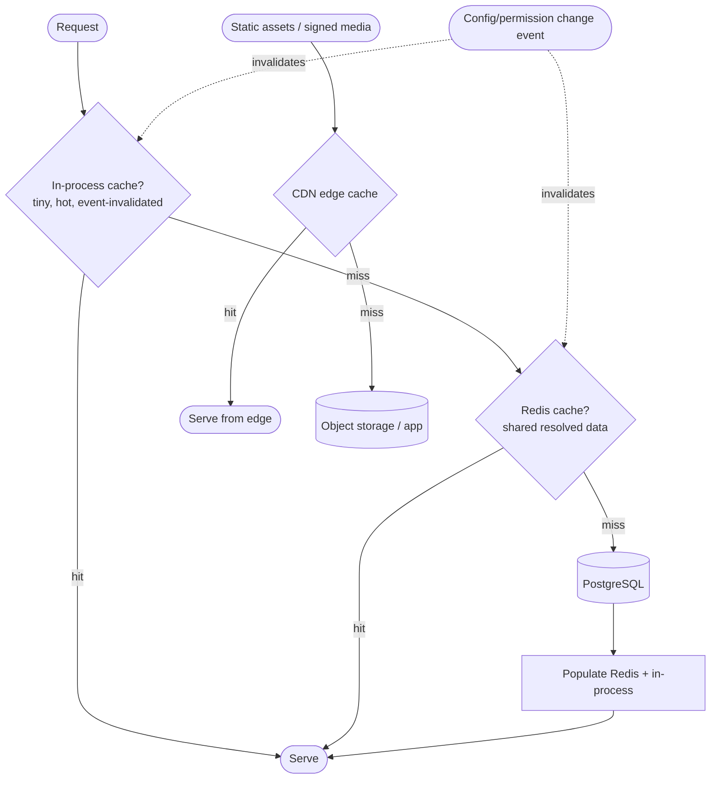
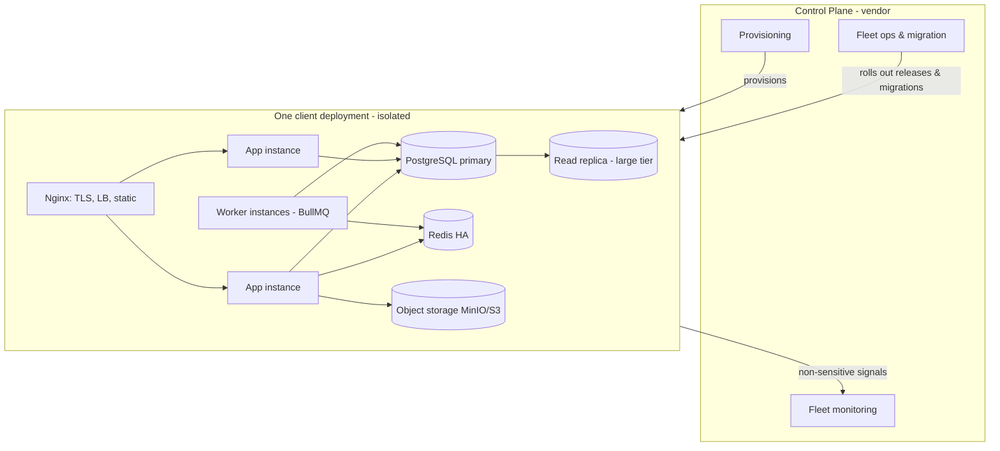
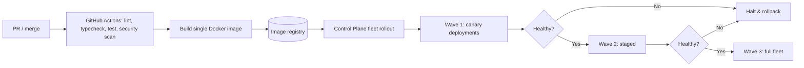
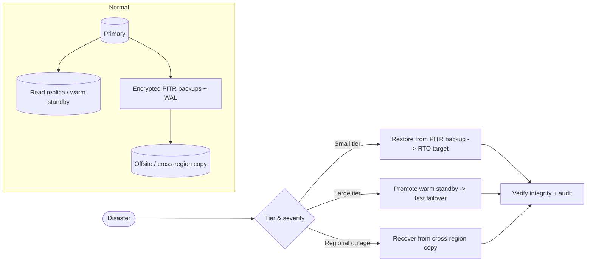

# Enterprise Education ERP — Architecture Blueprint
## Part G — Performance, Scalability, Infrastructure, DevOps & Operations

**Scope:** The non-functional and operational architecture — performance and caching, database optimization, scalability across tiers, the per-deployment and fleet infrastructure, Docker and Nginx, CI/CD and deployment, observability, backup and disaster recovery, and cost.
**Status:** Part G of the blueprint. Builds on Part A (per-client deployment, Control Plane fleet ops), Part B (Redis, BullMQ, partitioning, read replica, expand-contract migrations), Part E (read models, CDN), and Part F (DR and backup security).
**Constraint:** No source code. Topology diagrams, tiering tables, pipelines, and decisions only.
**Decision format:** Recommendation → Why → Pros → Cons → Alternatives → Final Decision. Numbering continues from Part F (D69 onward).

> **Framing.** Two realities govern this part. First, there are two scaling axes: each **client deployment** scales for its own load (the largest at 30,000 students and ~3,000 peak concurrent), and the **fleet** scales by number of deployments (200+ in five years). Most decisions must work on both axes. Second, because deployments are isolated, performance, deployment, monitoring, backup, and cost are **fleet-wide operations orchestrated by the Control Plane** — the per-deployment footprint is modest, but it is multiplied by N, which is the dominant cost and operational consideration and is addressed honestly in the cost sections and the Part H self-review.

---

## G-1. Performance Architecture (Sections 1–8)

### 1. Performance Architecture

> **Decision D69 — Performance is engineered to named peak events with explicit budgets: cache-first reads, async-everything for heavy work, and queue-based load-shedding.**
> **Recommendation:** Define performance targets per peak event (result publishing, online admission, fee generation, semester registration) and engineer to them with three levers: serve hot reads from cache rather than the database, push all heavy or bulk work to the queue rather than the request path, and shed load gracefully during peaks via priority queues and rate limiting so interactive traffic stays responsive.
> **Why:** An ERP's load is spiky, not steady — it is calm most days and slams during a handful of predictable events. Engineering to average load fails on result-publish day; engineering to peak everywhere is wasteful. Naming the peaks and budgeting for them focuses effort, and the cache-first/async/load-shed triad keeps interactive latency stable even when a 30,000-student bulk job is running.
> **Pros:** Predictable performance during the events that matter; interactive responsiveness protected from bulk work; effort focused where load actually spikes; cost-efficient (not over-provisioned for steady state).
> **Cons:** Requires identifying and load-testing each peak event; async flows add eventual-consistency UX (progress indicators); priority/queue tuning needed.
> **Alternatives:** (a) Provision for peak everywhere, always — simple, expensive, wasteful off-peak. (b) Optimize reactively after incidents — risks failing the first big result-publish, the worst time to fail.
> **Final Decision:** Peak-event-driven performance budgets, cache-first reads, async heavy work, queue-based load-shedding, validated by load tests against each named peak (the load-test plan ties into CI, Section 19).

### 2. Redis Strategy

Redis is the per-deployment in-memory backbone (Part B), serving five roles under namespaced keyspaces: resolved-configuration cache, permission-map cache, session/refresh-token state and denylist, rate-limit counters, distributed locks, and the BullMQ backing store. The strategy here adds operational shape: each deployment has its own Redis (isolation preserved, no cross-client sharing); larger-tier deployments run Redis with high availability (primary/replica with automatic failover) so a Redis loss does not take down sessions and queues; eviction policies are set per keyspace (cache keyspaces evict under pressure; session and queue keyspaces are protected from eviction); and cache invalidation is event-driven for correctness-sensitive data (configuration, permissions) and time-based only for genuinely tolerant data. Redis memory is sized per tier, with the queue and session footprint monitored so a backlog never silently exhausts memory.

### 3. Cache Layers

> **Decision D70 — Three cache layers with clear ownership: in-process for tiny hot data, Redis for shared resolved data, CDN for static and signed media.**
> **Recommendation:** Use a small in-process cache for the hottest, smallest, rarely-changing data (e.g., the current request's resolved config snapshot), Redis as the shared distributed cache across app instances (resolved configuration, permissions, hot reference data), and a CDN edge cache for static assets and cacheable media. Each layer has explicit invalidation; the most-specific correctness-sensitive data is invalidated by event, never left to expiry alone.
> **Why:** Different data has different access patterns; one cache cannot serve all well. In-process avoids even a Redis round-trip for the hottest data but must be kept small and consistent across instances (short TTL or event invalidation); Redis is the shared source of cached truth across horizontally-scaled instances; the CDN offloads static and media delivery from the application entirely.
> **Pros:** Each layer matched to its data; minimal latency for hot data; shared consistency via Redis; static/media load offloaded to the edge; correctness preserved by event invalidation.
> **Cons:** Multi-layer invalidation is the hard part — an in-process cache across instances needs careful, event-driven invalidation to avoid staleness; more moving parts to reason about.
> **Alternatives:** (a) Redis-only — simpler, but a Redis round-trip for the hottest data and no edge offload. (b) In-process only — fast, but inconsistent across horizontally-scaled instances; unacceptable for permissions/config.
> **Final Decision:** Three layers (in-process → Redis → CDN), event-driven invalidation for correctness-sensitive data, with in-process caches kept small and invalidated via the event bus to stay consistent across instances.

### 4. Database Optimization

PostgreSQL optimization consolidates the Part B data design into operational practice. The levers: **partitioning** of high-volume time-series tables (attendance, marks, audit, notifications) so queries prune to the relevant period; **disciplined indexing** (composite indexes on hot access patterns, partial indexes excluding soft-deleted rows, GIN indexes on queried JSONB) created and reviewed in migrations; **connection pooling** via PgBouncer in transaction mode so the application's many short transactions never exhaust connections; **autovacuum tuning** for the high-churn tables so bloat and transaction-id wraparound are controlled; **materialized read models** for reporting (Part E) refreshed from events rather than live aggregation; and **query plan review** for the dominant queries with monitoring of slow queries in production. Each deployment is tuned to its tier — a 30,000-student client gets more aggressive partitioning, a read replica, and larger pool/memory settings than a small coaching center.

### 5. Query Optimization

Query optimization is enforced as discipline, not left to chance. The dominant queries (attendance by class/date, result generation by exam group, fee due lists, audit lookups) are designed against their supporting composite indexes and reviewed; complex and hot-path queries use the TypeORM query builder with explicit column selection (never select-all) and explicit joins inside repository implementations, never scattered through services; pagination is mandatory on list endpoints so no query returns an unbounded result set (critical at the 30,000-student client); and slow-query logging in production surfaces regressions to the team. Reporting queries run against read models or the replica, never the transactional tables, so a heavy analytical query never competes with interactive writes.

### 6. N+1 Prevention

> **Decision D71 — N+1 queries are prevented structurally: no lazy relations, explicit batched loading, and detection in tests and monitoring.**
> **Recommendation:** Forbid lazy relations (which silently issue per-row queries); load related data explicitly with joins or batched lookups; use a batching/data-loader pattern where a list needs related data per item; and detect N+1 patterns through query-count assertions in tests and slow-query/high-query-count monitoring in production.
> **Why:** N+1 is the most common and most damaging ORM performance bug — a list of 1,000 students each triggering a separate query for its guardian turns one request into 1,001. It is invisible in development with small data and catastrophic at the 30,000-student scale. Structural prevention (no lazy relations) plus detection (query-count tests) catches it before production.
> **Pros:** Eliminates the most common ORM performance failure; catches regressions in CI; scales to large datasets; predictable query counts.
> **Cons:** Explicit loading is more verbose than lazy relations; batching adds a pattern to learn; query-count tests must be written for hot endpoints.
> **Alternatives:** (a) Lazy relations for convenience — the direct cause of N+1; rejected (consistent with Part B). (b) Hope code review catches it — unreliable; N+1 hides until data grows.
> **Final Decision:** No lazy relations, explicit/batched loading, query-count assertions in tests for hot endpoints, and production high-query-count alerting.

### 7. Read Replica Strategy

> **Decision D72 — A read replica for the large-tier deployments, serving reporting, exports, and heavy reads; transactional reads/writes stay on the primary.**
> **Recommendation:** Provision a PostgreSQL read replica for large-tier deployments and route reporting queries, bulk exports, and read-model projections to it; keep all transactional reads and writes on the primary. Tolerate replication lag for reporting (where slight staleness is acceptable) and never route consistency-critical reads to the replica.
> **Why:** At the 30,000-student client, reporting and bulk-export load is heavy and bursty (result-publish, fee-collection reports); running it on the primary contends with interactive transactions. A replica absorbs that load, protecting transactional latency during exactly the peak events. Smaller tiers do not need a replica, so it is provisioned by tier, not universally.
> **Pros:** Reporting/export load isolated from transactions; protects interactive latency at peak; provisioned only where needed (cost-efficient); also provides a warm standby for DR.
> **Cons:** Replication lag means replica reads are slightly stale (fine for reports, not for consistency-critical reads); added cost and operational surface at the large tier; routing logic to maintain.
> **Alternatives:** (a) Everything on the primary — simpler, but reporting degrades transactions at scale. (b) Replica for all tiers — wasteful for small clients with light reporting load.
> **Final Decision:** Tier-based read replica (large tier and up), reporting/export/projection reads routed to it, consistency-critical reads on the primary, with replication-lag monitoring. The replica doubles as a DR standby (Section 31).

### 8. CDN Strategy

> **Decision D73 — CDN for static assets and cacheable signed media; the application never serves bulk static or media transfer.**
> **Recommendation:** Serve the frontend's static assets (content-hashed JS/CSS, fonts, images) through a CDN with long-lived immutable caching, and deliver cacheable media (logos, processed image variants) via the CDN in front of object storage; sensitive signed media is delivered through the CDN with short-lived signed URLs so access control is preserved while transfer is offloaded.
> **Why:** Serving static assets and media from the application wastes its resources on bulk transfer and adds latency for distant users. A CDN offloads this to the edge, improving load times (important for parents/students on mobile networks in Bangladesh) and freeing the application for dynamic work. Content-hashing makes static assets safely cacheable forever; short-lived signed URLs keep sensitive media access-controlled even when edge-delivered.
> **Pros:** Faster loads, especially on mobile and at distance; application offloaded from bulk transfer; safe long-lived caching of hashed assets; access control preserved for signed media.
> **Cons:** CDN configuration and cache-invalidation discipline; signed-media-through-CDN needs correct short-TTL handling; per-deployment vs shared CDN decision (a shared CDN with per-client paths is acceptable since assets are not sensitive; sensitive media remains signed).
> **Alternatives:** (a) Serve everything from the app — simplest, slow and resource-heavy at scale. (b) No CDN, browser-cache only — misses edge distribution and offload.
> **Final Decision:** CDN for static assets (immutable long-cache) and cacheable/signed media (short-TTL signed), offloading transfer from the application while preserving access control for sensitive media.

---

## G-2. Scalability (Sections 9–14)

### 9. Scalability Roadmap

Scalability is planned in three tiers that the Control Plane uses to size each deployment to its client, and that describe the fleet's growth path. The roadmap's principle: scale each deployment vertically and horizontally for its client's size, and scale the fleet by provisioning more deployments — never by merging clients into a shared system (which the tenancy model forbids).

| Tier | Client profile | Deployment shape | Key scaling features |
|---|---|---|---|
| Current / Small | Coaching center, single school, < 2,000 students, low concurrency | Single app instance + Postgres + Redis, Compose | Modest resources; no replica; vertical headroom |
| Medium | Multi-campus school/college, 2,000–10,000 students | 2–3 app instances behind Nginx + Postgres + Redis(HA) | Horizontal app instances; worker separation; HA Redis |
| Large | University, 10,000–30,000+ students, 3,000 peak concurrent | Multiple app + worker instances + Postgres primary & read replica + Redis HA | Read replica; partitioning; priority queues; autoscaling workers |

### 10. Current Scale

At current/small scale, a deployment is a single application instance with its own PostgreSQL and Redis, typically run via Docker Compose on a modest host, sized for low concurrency and a few thousand students. There is no read replica and no horizontal app scaling — vertical headroom and caching are sufficient. This keeps the per-deployment cost low for the many small clients that will dominate the early fleet, while the architecture (stateless app, externalized state) means scaling up later is configuration and provisioning, not redesign. The Control Plane provisions this shape by default and monitors for clients approaching the medium-tier threshold.

### 11. Medium Scale

At medium scale, the deployment runs two-to-three stateless application instances behind Nginx (which load-balances), with workers separated from web instances so background jobs do not compete with interactive requests, and Redis in a highly-available configuration so sessions and queues survive a node loss. PostgreSQL remains a single well-tuned primary with connection pooling. This tier handles multi-campus institutions with several thousand students and meaningful concurrency. Horizontal app scaling is possible precisely because the application is stateless (JWT-based auth, state in Postgres/Redis), so instances can be added without sticky sessions.

### 12. Large Scale

At large scale, the deployment adds a PostgreSQL read replica (reporting/exports/projections routed to it), more web and worker instances (workers autoscaled by queue depth so a result-publish backlog spins up capacity and releases it after), aggressive partitioning of the high-volume tables, and priority queues that protect interactive traffic during peaks. Redis runs HA. This tier serves the 30,000-student university with 3,000 peak concurrent users during result publishing and semester registration. The load-shedding triad (cache-first, async, priority queues) plus the replica and worker autoscaling are what make these peaks survivable without provisioning peak capacity year-round.

### 13. Horizontal Scaling

> **Decision D74 — Horizontal scaling within a deployment via stateless app and worker instances behind Nginx; workers scale independently by queue depth.**
> **Recommendation:** Scale a deployment out by running multiple stateless application instances behind Nginx and multiple worker instances consuming the queue, with web and worker pools scaled independently — web by request load, workers by queue depth. State lives in Postgres and Redis, never in the app, so any instance can serve any request.
> **Why:** The application was designed stateless (JWT auth, externalized sessions/cache/queue) precisely to enable this. Separating web and worker scaling lets bulk jobs (result generation) scale workers without over-scaling web, and lets interactive load scale web without idle workers — matching capacity to the two different load shapes. No sticky sessions are needed because authentication is stateless.
> **Pros:** Linear scale-out within a deployment; independent web/worker scaling matches the two load profiles; no sticky sessions; resilient to instance loss; cost-matched to actual load.
> **Cons:** Requires the app to remain rigorously stateless (a discipline); a load balancer (Nginx) and process orchestration; shared Postgres/Redis become the scaling ceiling (addressed by replica and Redis HA).
> **Alternatives:** (a) Vertical-only scaling — simpler, but a ceiling and a single point of failure. (b) Stateful instances with sticky sessions — fragile, complicates scaling and failover.
> **Final Decision:** Stateless horizontal scaling of independent web and worker pools behind Nginx, workers autoscaled by queue depth at the large tier, with Postgres (primary+replica) and Redis(HA) as the shared backbone.

### 14. Vertical Scaling

Vertical scaling — giving a deployment bigger CPU, memory, and faster storage — is the first and simplest lever, used to size each tier and to give small/medium deployments headroom before horizontal scaling is warranted. It is especially relevant for PostgreSQL, where a larger primary (more memory for cache, faster disk for writes) often delivers more benefit per unit effort than application instances for a database-bound workload. The Control Plane right-sizes each deployment's resources to its tier and adjusts as a client grows, treating vertical scaling as the default and horizontal scaling as the response when a single instance's ceiling or availability needs are reached. The two are complementary: vertical for the database and baseline, horizontal for the stateless app and workers.

DOCEOF
echo "G-1 and G-2 appended."
---

## G-3. Infrastructure & DevOps (Sections 15–23)

### 15. Infrastructure Architecture

> **Decision D75 — Per-deployment containerized topology orchestrated by the Control Plane; Docker Compose now, with a clear migration path to a cluster orchestrator as the fleet grows.**
> **Recommendation:** Each client deployment is a self-contained set of containers — Nginx, app instances, worker instances, PostgreSQL (primary + optional replica), Redis, and object storage (MinIO or cloud S3) — provisioned and managed by the Control Plane. Run deployments with Docker Compose initially; adopt a cluster orchestrator (Kubernetes or Nomad) for the fleet when deployment count and operational load justify it.
> **Why:** Compose is simple and sufficient for tens of isolated deployments and a small team, avoiding the steep operational cost of Kubernetes prematurely. But at 200+ deployments, manual or Compose-only operations become unwieldy, and an orchestrator pays off — so the architecture is designed to migrate to one, with the Control Plane abstracting "how a deployment runs" so the underlying mechanism can change without redesign.
> **Why now vs later:** introducing Kubernetes on day one would burden a 4–8 person team with significant ops complexity before it is needed; deferring it indefinitely would make the fleet unmanageable. The trigger is fleet size and ops load, monitored by the Control Plane.
> **Pros:** Simple early operations; isolation preserved per deployment; a clear, abstracted path to orchestration; no premature complexity for the small team.
> **Cons:** A future migration from Compose to an orchestrator is real work (mitigated by the Control Plane abstraction); running 200+ Compose deployments is the awkward middle that motivates the migration.
> **Alternatives:** (a) Kubernetes from day one — robust at fleet scale, but heavy for the early team and small fleet. (b) Compose forever — breaks down operationally past a few dozen deployments.
> **Final Decision:** Compose-per-deployment now, Control-Plane-abstracted, with a planned migration to a cluster orchestrator once fleet size/ops load crosses a defined threshold (a roadmap milestone, Part H/I).

### 16. Docker Architecture

The application ships as a single container image built with multi-stage Docker builds (build stage with full toolchain and pnpm, slim runtime stage with only production artifacts), producing a small, reproducible image that runs as a non-root user with a health-check endpoint. The same image runs everywhere — every client deployment, every environment — differentiated only by configuration and entitlements (Part A's one-artifact rule), so there is exactly one image to build, scan, and patch per release. Images are versioned and stored in a registry the Control Plane pulls from during rollout. Web and worker run from the same image with different entry commands (web serves HTTP, worker consumes the queue), keeping the build single while allowing independent scaling.

### 17. Nginx Architecture

Nginx fronts each deployment and owns the edge concerns established in Part E: TLS termination with modern ciphers and HSTS, reverse-proxying and load-balancing across the deployment's app instances, serving/caching static assets and routing media to the CDN/object storage, enforcing request size limits and basic protective rules, and applying security headers. It is the single ingress per deployment, so health checks and graceful draining route through it during deployments (Section 21). Configuration is templated and provisioned by the Control Plane so all deployments share a consistent, hardened Nginx posture, with per-deployment specifics (domain, certificates) injected at provisioning.

### 18. GitHub Actions Architecture

CI runs in GitHub Actions and does the work that happens once per release, independent of the fleet: install dependencies (pnpm), lint and type-check, run the test suites (unit, integration, and the security/authorization/isolation tests from Part F), run security scans (SAST, dependency, secret), build the single Docker image, and publish it to the registry. The pipeline gates merges and releases — nothing reaches the registry without passing tests and scans. Crucially, CI builds and validates the artifact; it does not deploy to 200 clients. Fleet rollout is a separate, Control-Plane-orchestrated step (Section 19), keeping the build pipeline simple and the rollout governed by health gates rather than a CI job fanning out to hundreds of targets.

### 19. CI/CD Pipeline

> **Decision D76 — Build-and-validate once in CI; the Control Plane orchestrates fleet rollout in health-gated waves with coupled expand-contract migrations.**
> **Recommendation:** CI builds, tests, scans, and publishes one validated image. The Control Plane's Fleet Operations context then rolls that release across deployments in waves (canary → staged → full), running the coupled expand-contract migrations (Part B) per deployment, gating each wave on health checks, and halting/rolling back automatically on failure.
> **Why:** Separating "produce a good artifact" (CI) from "safely roll it across 200 isolated deployments" (Control Plane) keeps each concern manageable. A CI job that deploys to hundreds of targets is fragile and hard to gate; a fleet orchestrator with waves and health gates can canary a release on a few deployments, catch problems before the blast radius grows, and apply per-deployment migrations safely.
> **Pros:** Simple, fast CI; safe staged fleet rollout; problems caught at canary, not fleet-wide; per-deployment migration safety; automatic halt/rollback; consistent with Part A/B.
> **Cons:** The fleet-rollout orchestration is real Control Plane work (justified by the deployment count); waves make a full rollout take longer than a single deploy (a worthwhile safety trade).
> **Alternatives:** (a) CI deploys to all clients directly — fragile, ungated, dangerous at scale. (b) Manual per-client deploys — unmanageable past a handful.
> **Final Decision:** CI produces one validated image; Control Plane rolls it out in canary→staged→full waves with health gates, coupled migrations, and automatic rollback.

### 20. Deployment Strategy

Deployment combines two levels. **Per-deployment**, each release is applied with zero downtime via blue-green or rolling update (Section 21), coupled with expand-contract migrations so the database stays compatible with both old and new app versions during the transition. **Fleet-wide**, releases roll out in waves (Section 19) so a regression is caught on a small canary before it reaches the whole fleet. The Control Plane tracks each deployment's version and migration state, so the fleet is never in an unknown state and a specific deployment can be targeted, paused, or rolled back. Releases are scheduled to avoid clients' peak events where possible (not deploying to a university during result-publish).

### 21. Blue-Green Deployment

> **Decision D77 — Per-deployment zero-downtime releases via blue-green (or rolling) with health-gated cutover and instant rollback.**
> **Recommendation:** For each deployment, stand up the new version alongside the old (blue-green) or replace instances incrementally (rolling), cut traffic over only after the new version passes health checks, and keep the old version available for instant rollback until the new one is confirmed healthy. Pair with expand-contract migrations so the database serves both versions during cutover.
> **Why:** Institutions cannot tolerate downtime during the day; zero-downtime deployment is required. Blue-green gives the cleanest instant rollback (flip traffic back) at the cost of running two versions briefly; rolling is lighter on resources. Health-gated cutover ensures a broken release never receives traffic, and expand-contract migrations prevent the schema from breaking either version mid-deploy.
> **Pros:** No downtime; instant rollback; broken releases never serve traffic; safe schema evolution; confidence to deploy during business hours (off-peak).
> **Cons:** Blue-green briefly doubles resources per deployment (multiplied across the fleet — a cost consideration); rolling is cheaper but rollback is less instant; requires health checks and drain handling.
> **Alternatives:** (a) Stop-deploy-start — downtime, unacceptable. (b) Rolling only — lighter, but rollback is slower than blue-green's traffic flip; offered as the resource-efficient option for smaller tiers.
> **Final Decision:** Blue-green for larger tiers (instant rollback worth the brief resource doubling), rolling for smaller tiers (resource-efficient), both health-gated with expand-contract migrations, selected per tier by the Control Plane.

### 22. Rollback Strategy

Rollback operates at four coordinated levels, all of which the architecture already supports. **Application rollback** reverts to the previous image (instant via blue-green traffic flip). **Migration rollback** is safe because expand-contract migrations are backward-compatible — the previous app version still works against the migrated schema, so an app rollback does not require an immediate schema rollback (the contract phase is deferred until the new version is confirmed). **Configuration rollback** re-points to a prior configuration version (Part D). **Bulk-operation rollback** reverts a bulk action like promotion within its window (designed earlier). **Fleet rollback** halts a wave and reverts the affected deployments. This layered rollback means a failure at any level — code, schema, configuration, or a bulk job — has a defined, tested recovery path, and the Control Plane coordinates fleet-level reversions.

### 23. Environment Strategy

The environments are development, staging, and production, plus the Control Plane's own environments. **Development** is local (Docker Compose) with seed data. **Staging** mirrors production closely (same image, same migration path, representative data volumes) and is where DAST and pre-release validation run — critically, staging is where a release is proven before any client sees it. **Production** is the fleet of isolated client deployments. Ephemeral preview environments may be spun up per feature branch for review. The key discipline: the same image and migration path flow dev → staging → production unchanged, so what is tested in staging is exactly what ships, and no client deployment ever receives an artifact that did not pass staging. The Control Plane and its data (provisioning, licensing) have their own staged environments, kept entirely separate from client data.

---

## G-4. Observability (Sections 24–28)

### 24. Monitoring Architecture

> **Decision D78 — Per-deployment observability (logs, metrics, traces) with non-sensitive signal aggregation to the Control Plane; built on open standards.**
> **Recommendation:** Each deployment emits structured logs, metrics, and distributed traces consumed by a per-deployment observability stack; the Control Plane aggregates only non-sensitive operational signals (health, error rates, key metrics, alerts) fleet-wide — never logs containing student data. Use open standards (OpenTelemetry for traces/metrics, structured JSON logs) so tooling is swappable.
> **Why:** Observability is essential to operate 200+ deployments, but isolation and privacy (Part F, Cluster 4) forbid centralizing sensitive logs. Per-deployment observability respects isolation; aggregating only non-sensitive signals gives the vendor fleet-wide operational awareness without violating privacy. Open standards avoid lock-in to a monitoring vendor.
> **Pros:** Operable fleet; isolation/privacy preserved; vendor sees fleet health without sensitive data; standards-based and swappable; ties into the security monitoring from Part F.
> **Cons:** Observability infrastructure per deployment (cost and ops, multiplied by N); careful scoping of what aggregates to the Control Plane; correlation across the boundary needs consistent ids.
> **Alternatives:** (a) Centralize all logs to the vendor — violates isolation/privacy; rejected. (b) No fleet aggregation — the vendor flies blind across 200 deployments.
> **Final Decision:** Per-deployment observability on open standards, with non-sensitive operational signals aggregated to the Control Plane, sharing correlation ids and the security-monitoring pipeline (Part F).

### 25. Logging

Logging is structured (JSON), carries the correlation id that threads a request through middleware, services, events, queue jobs, and the audit trail (Part B), and is leveled appropriately (debug suppressed in production). The non-negotiable rule for an education system: **no personal data of minors in logs** — logs record identifiers and actions, never the sensitive content itself, which protects privacy and keeps logs out of compliance scope. Logs are centralized per deployment, retained per policy, and access-controlled. Security-relevant events (Part F) are logged with the detail incident response needs. Because the same correlation id appears in logs, traces, and audit, an investigator can reconstruct a request's full path across all three.

### 26. Metrics

Metrics cover three layers. **Infrastructure metrics** (CPU, memory, disk, connection-pool saturation, Redis memory, queue depth) reveal resource health. **Application metrics** following the RED method (Rate, Errors, Duration per endpoint) reveal service health and latency, with special attention to the peak-event endpoints. **Business metrics** (admissions processed, results published, invoices generated, notification delivery rates) reveal whether the system is doing its job and feed both operations and product. Metrics are collected per deployment and the key health/error/latency metrics roll up to the Control Plane for fleet dashboards. Queue depth and worker throughput are watched closely because they drive worker autoscaling at the large tier and are the early-warning signal for peak-event overload.

### 27. Tracing

> **Decision D79 — Distributed tracing with OpenTelemetry, propagating the correlation id across modules, the queue, and external calls — even within the monolith.**
> **Recommendation:** Instrument the application with distributed tracing that follows a request across module boundaries, into queued background jobs, and out to external calls (database, Redis, storage, providers), propagating the correlation id throughout, using OpenTelemetry.
> **Why:** Even in a modular monolith, a single user action can span several modules synchronously, trigger asynchronous queue jobs, and make external calls; without tracing, diagnosing a slow or failed peak-event operation means guessing. Tracing shows exactly where time goes and where a failure occurred. Carrying the correlation id into queue jobs is what connects the synchronous request to the asynchronous work it spawned (a result-publish request and the bulk job it queued).
> **Pros:** Pinpoints latency and failure across module, queue, and external boundaries; connects sync requests to async jobs; standards-based; invaluable during peak-event incidents.
> **Cons:** Instrumentation effort and a small runtime overhead; trace storage/retention to manage; sampling needed at high volume.
> **Alternatives:** (a) Logs only — can reconstruct flow painfully via correlation id, but no latency breakdown. (b) No tracing — slow incident diagnosis, especially across the async boundary.
> **Final Decision:** OpenTelemetry distributed tracing with correlation-id propagation across modules, queue jobs, and external calls, sampled at high volume, per deployment.

### 28. Alerting

> **Decision D80 — SLO-based alerting on symptoms users feel, routed by severity to on-call, fleet-aware, and tuned against fatigue.**
> **Recommendation:** Define service-level objectives (availability and latency for key flows) and alert on SLO burn and user-facing symptoms (error-rate spikes, latency breaches, queue backlog growth, failed deployments, security anomalies from Part F) rather than on every low-level metric. Route alerts by severity to an on-call process, make them fleet-aware (which deployment, which tier), and continuously tune to avoid fatigue.
> **Why:** Alerting on causes (high CPU) produces noise; alerting on symptoms (users seeing errors, results not publishing) produces signal. SLO-based alerting ties alerts to actual user impact, and severity routing ensures a security incident or a fleet-wide outage gets immediate attention while a minor anomaly does not page someone at 3 a.m. Fatigue is the enemy of alerting — a tuned, symptom-based set keeps responders trusting the alerts.
> **Pros:** Signal over noise; alerts tied to user impact and SLOs; severity-appropriate response; fleet-aware; sustainable for a small on-call rotation.
> **Cons:** Defining good SLOs and tuning alerts is ongoing work; symptom-based alerting needs good metrics underneath; on-call process to staff.
> **Alternatives:** (a) Alert on every threshold — noise, fatigue, ignored alerts. (b) No alerting, dashboards only — misses incidents until users complain.
> **Final Decision:** SLO- and symptom-based alerting, severity-routed to on-call, fleet-aware, integrated with the security-monitoring alerts from Part F, and tuned continuously against fatigue.

---

## G-5. Backup, Disaster Recovery & Cost (Sections 29–33)

### 29. Backup Strategy

> **Decision D81 — Per-deployment automated, encrypted backups with point-in-time recovery, tested by restore drills, orchestrated by the Control Plane.**
> **Recommendation:** Each deployment runs automated PostgreSQL backups with continuous WAL archiving for point-in-time recovery (PITR), plus object-storage versioning/replication for files; all backups are encrypted (Part F) and stored isolated per client, with offsite/separate-region copies; the Control Plane orchestrates and verifies backups fleet-wide; and backups are proven by periodic automated restore drills.
> **Why:** Education data is critical and largely irreplaceable (a lost result history or fee ledger is catastrophic). PITR allows recovery to a moment before an incident, not just the last nightly snapshot. Per-client isolated, encrypted backups preserve the tenancy and security model. The rule that makes backups real: a backup is not a backup until a restore has been tested — untested backups routinely fail when needed.
> **Pros:** Recoverable to a point in time; per-client isolation preserved; encrypted and offsite; verified by drills; fleet-orchestrated so no deployment is forgotten.
> **Cons:** WAL archiving and backup storage cost (multiplied across the fleet); restore drills take effort; offsite copies add transfer cost.
> **Alternatives:** (a) Nightly snapshots only — simple, but up to a day of data loss and no point-in-time recovery. (b) No offsite copies — a regional failure loses both primary and backup.
> **Final Decision:** PITR via continuous WAL archiving plus object-storage versioning, encrypted, per-client isolated, offsite-replicated, fleet-orchestrated and drill-verified.

### 30. Restore Strategy

Restore is a documented, tested procedure, not an improvisation. It supports several scenarios: full deployment restore (rebuild a client from backup after catastrophic loss), point-in-time restore (recover to just before a bad migration or accidental mass deletion), and partial/targeted restore (recover specific data, e.g., a mistakenly deleted class's records, via the soft-delete recovery window before falling back to backup). Restores are access-controlled and audited (Part F) so they cannot be used to exfiltrate or tamper. Recovery targets — RPO (how much data loss is tolerable) and RTO (how fast service must return) — are defined per tier (tighter for the large university than a small coaching center) and validated by the restore drills that prove the backups. The Control Plane can initiate and track a restore for any deployment.

### 31. Disaster Recovery

> **Decision D82 — Tiered DR with RPO/RTO targets per tier; the large tier uses the read replica as a warm standby and cross-region capability; isolation preserved throughout.**
> **Recommendation:** Define RPO/RTO per tier and meet them with tier-appropriate DR: small tiers rely on fast restore from PITR backups; large tiers add a warm standby (the read replica, promotable to primary) and cross-region backup/failover capability so a regional outage is survivable. Maintain DR runbooks, test failover periodically, and preserve per-client isolation and encryption in DR exactly as in production (Part F).
> **Why:** Different clients tolerate different downtime — a university during semester registration needs fast recovery; a small coaching center can tolerate a longer restore. Meeting DR by tier matches cost to need. Reusing the large tier's read replica as a promotable standby gives fast failover without separate DR infrastructure. Testing failover is what turns a DR plan from paper into reality.
> **Pros:** DR matched to client need and cost; large clients get fast failover via the existing replica; cross-region survives regional outage; isolation/encryption preserved in DR; tested, not theoretical.
> **Cons:** Cross-region and warm-standby add cost at the large tier (multiplied where applied); failover testing takes effort; runbooks to maintain.
> **Alternatives:** (a) Uniform high DR for all — expensive for small clients who don't need it. (b) Backup-restore-only for all — too slow for the large university's RTO.
> **Final Decision:** Tiered DR with per-tier RPO/RTO, warm-standby/cross-region for the large tier (reusing the replica), backup-restore for smaller tiers, isolation/encryption preserved, failover drilled. RPO/RTO targets are set with each client per their tier and contract.

### 32. Cost Optimization

> **Decision D83 — Cost is optimized by tiering, right-sizing, storage lifecycle, worker autoscaling, and a shared Control Plane — while accepting that isolation has an irreducible per-deployment cost.**
> **Recommendation:** Control cost with: tier-based right-sizing (small clients get small footprints), storage lifecycle/archival to cheaper tiers (Part B/E), worker autoscaling so peak capacity is rented only during peaks, MinIO self-hosting where it beats cloud S3 cost, reserved/committed capacity for the steady fleet baseline, and a single shared Control Plane amortized across all clients. Accept and plan for the irreducible cost that isolation imposes — each deployment carries its own database, Redis, and backups.
> **Why:** Isolation is a deliberate, valuable choice (Part A) but it is the dominant cost driver: 200 deployments mean 200 databases, 200 Redis instances, 200 backup streams. The optimizations above shave real cost (right-sizing, lifecycle, autoscaling, MinIO, reservations), but none eliminates the per-deployment floor — so cost planning must be honest that cost scales roughly with deployment count, and pricing must reflect that.
> **Pros:** Meaningful cost reduction via right-sizing, lifecycle, autoscaling, and reservations; shared Control Plane amortized; cost matched to client size; honest cost model.
> **Cons:** The per-deployment floor cannot be optimized away under strict isolation; very small clients may be disproportionately expensive to host in isolation (a tension flagged for the self-review).
> **Alternatives:** (a) Pool small clients into a shared database to cut cost — contradicts the isolation requirement; noted as a future tradeoff to consider only if economics demand it. (b) No optimization — cost balloons with the fleet.
> **Final Decision:** Tiering, right-sizing, storage lifecycle, worker autoscaling, MinIO where cheaper, reservations for baseline, shared Control Plane — with explicit acknowledgment that strict isolation sets a per-deployment cost floor that pricing must cover. The small-client economics tension is carried into the Part H self-review.

### 33. Infrastructure Cost Planning

Cost planning models the fleet as the sum of per-deployment costs by tier plus the shared Control Plane, and projects it along the growth path (10–20 → 50–100 → 200+ deployments). Each deployment's cost comprises compute (app + workers), the database (and replica at large tier), Redis (HA at medium+), object storage (with lifecycle savings), backups (WAL + offsite), CDN, and observability — most of which scale with tier, while a floor exists even for the smallest client. The honest implications for the business: cost grows roughly linearly with the number of deployments (isolation prevents the sublinear economics of shared multi-tenancy), small clients carry a disproportionate fixed overhead, and the large tier's replica/HA/cross-region features concentrate cost in a few big clients. This argues for tier-based pricing that covers each tier's true cost, a possible minimum price floor for the smallest clients to cover their fixed overhead, and continuous monitoring of per-deployment unit economics by the Control Plane. The Part H self-review revisits whether strict isolation for the very smallest clients remains the right economic choice as the fleet grows.

---

## Part G — Closing Note

Part G has specified how the system performs, scales, deploys, and is operated across two axes — per-deployment and fleet-wide. Performance is engineered to named peak events with cache-first reads, async heavy work, and queue-based load-shedding, on a three-layer cache and an optimized, partitioned, pooled PostgreSQL with tier-based read replicas and a CDN. Scalability is tiered (small/medium/large), scaling each deployment vertically and horizontally (stateless web and queue-driven worker pools) and the fleet by provisioning more deployments. Infrastructure is containerized per deployment and Control-Plane-orchestrated, Compose now with a planned path to a cluster orchestrator, fronted by a hardened Nginx, built as one Docker image, validated once in GitHub Actions and rolled out fleet-wide in health-gated canary→staged→full waves with coupled expand-contract migrations, zero-downtime blue-green/rolling releases, and four-level rollback. Observability is per-deployment on open standards (structured logs with no minor PII, RED/USE metrics, OpenTelemetry tracing, SLO-based alerting) with non-sensitive signals aggregated to the Control Plane. Backup and DR are per-client, encrypted, PITR-capable, drill-verified, and tiered, with warm-standby failover for the large tier. And cost is optimized by tiering, right-sizing, lifecycle, autoscaling, and a shared Control Plane — while honestly acknowledging the irreducible per-deployment cost floor that strict isolation imposes.

Every operational choice respected the architecture's two governing realities: isolation (preserved through deployment, backup, DR, and observability) and the small team (Compose-before-Kubernetes, build-once-roll-out-orchestrated, symptom-based alerting). The honest cost tension around isolating the very smallest clients, and the Compose-to-orchestrator transition timing, are carried forward as inputs to the critical self-review.

**Awaiting your approval to proceed.** I have generated Part G only and will not continue until you direct me. What remains is the execution and critique layer — engineering standards, the phased development roadmap, and the critical architecture self-review that stress-tests every decision across Parts A–G.

*End of Part G.*
