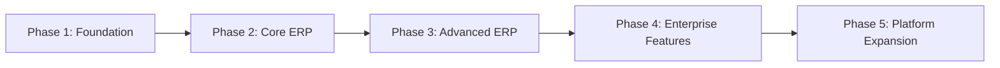

# Enterprise Education ERP — Architecture Blueprint
## Part H — Engineering Standards, Roadmap & Critical Review

**Scope:** The execution layer — engineering standards, Git and review workflow, the testing program, architecture governance, the five-phase development roadmap, and the critical CTO-level self-review with scorecard and go/no-go.
**Status:** Final part of the blueprint. Consolidates and stress-tests every decision across Parts A–G.
**Constraint:** No source code.
**Tone of Sections 17–20:** Deliberately critical and unsparing, as requested.

---

## H-1. Engineering Standards (Sections 1–15)

### 1. Engineering Standards

Engineering standards exist to make a small team's output consistent, reviewable, and maintainable over a decade, despite turnover. They are enforced wherever possible by tooling (linters, formatters, architecture tests, CI gates) rather than by memory, because a standard that depends on everyone remembering it will erode under deadline pressure. The standards below are mandatory and CI-gated; deviations require an architecture-decision record (Section 14).

### 2. Coding Standards

TypeScript is used in strict mode everywhere, with explicit types at module boundaries and inference within. Formatting and lint rules (Prettier + ESLint) are enforced in CI so no time is spent debating style. Functions and classes are kept small and single-purpose; the domain layer stays free of framework and ORM imports (enforced by architecture tests, per Part B). Errors are explicit (the shared error taxonomy, never silent catches); no `any` except at vetted boundaries with justification; no dead code (CI flags it); and no secrets, credentials, or personal data in code or logs (secret scanning in CI, Part F). Asynchronous code uses consistent patterns, and all I/O is behind ports so it is mockable.

### 3. Naming Conventions

Names follow consistent, predictable rules so code is navigable: domain terms use the ubiquitous language of their bounded context (a "Student" is a Student, not a "User" or "Record," in the Enrollment context); permission strings follow module.resource.action (shared frontend/backend, Part D); events are past-tense (StudentEnrolled, ResultPublished); files and folders follow the feature-sliced and four-layer conventions of Parts B and C; database tables and columns use a single consistent case and pluralization rule; and terminology that clients relabel (Class→Grade) is never hard-coded as a name — it is a terminology key (Part D). The test: a new engineer should infer a name's meaning and location from the conventions alone.

### 4. Module Rules

The module rules from Part A Section 8 and Part B are mandatory and CI-enforced: dependencies point inward (domain depends on nothing outward); cross-module interaction only through published interfaces or domain events, never another module's internals; the tiered acyclic dependency graph is respected (platform contexts never depend on domain contexts); the shared kernel stays minimal and changes require architecture review. An architecture test suite fails the build if any module imports another module's `domain/` or `infrastructure/`, if a cycle appears in the module graph, or if a platform module imports a domain module. These are not guidelines; they are gates.

### 5. Folder Rules

The four-root structure (`modules`, `platform`, `shared`, `common` on the backend; the feature-sliced + thin-`app/` structure on the frontend) from Parts B and C is mandatory. Each module repeats the four-layer internal shape so navigation is uniform. New code goes in the correct root and layer; misplaced code (a guard in `shared`, a domain entity in `common`, business logic in a controller) is a review rejection. The folder structure is part of the architecture, not a preference.

### 6. Documentation Standards

Documentation is pragmatic and lives close to the code. Every bounded context has a short README describing its responsibility, its published interface, its events, and its dependencies. Architectural decisions are recorded as ADRs (Section 14). The public API is documented via OpenAPI (Part E). Complex domain logic (result calculation, fee computation, configuration resolution, workflow evaluation) carries explanatory comments on the *why*, not the *what*. Tests serve as living documentation of business rules (Section 10). The standard: a competent engineer should be able to understand a context's purpose and contract from its README and tests without reading every line.

### 7. Git Workflow

> **Decision D84 — Trunk-based development with short-lived feature branches and CI-gated merges.**
> **Recommendation:** Use a single long-lived main branch (always releasable) with short-lived feature branches merged via pull request after passing CI; avoid long-lived divergent branches.
> **Why:** For a small team shipping continuously, trunk-based development minimizes merge pain and integration drift and keeps main always deployable, which suits the build-once/roll-out-fleet model (Part G). Long-lived branches accumulate conflicts and hide integration problems until late.
> **Pros:** Continuous integration, minimal merge conflicts, always-releasable main, fast feedback, simple mental model.
> **Cons:** Requires discipline (small frequent merges, feature flags for incomplete work); main must be protected by strong CI.
> **Alternatives:** (a) Git-flow with long-lived develop/release branches — heavier, more merge overhead, slower for a small team. (b) Forking workflow — overhead unjustified for an internal team.
> **Final Decision:** Trunk-based with short-lived branches, feature flags for incomplete features (reusing the feature-flag mechanism), and CI-gated protected main.

### 8. Branch Strategy

Branches are short-lived and named by intent (feature/, fix/, chore/). Incomplete work merges to main behind feature flags rather than living on a branch for weeks. Release tagging marks what the Control Plane rolls out. Hotfixes branch from the released version, are fixed and tested, and roll out through the same fleet-wave mechanism. The principle: main is always releasable, branches are measured in days not weeks, and nothing incomplete is visible to users without a flag.

### 9. PR Review Rules

> **Decision D85 — Every change is peer-reviewed against a security- and architecture-aware checklist before merge; no direct pushes to main.**
> **Recommendation:** Require at least one peer review (two for security-sensitive or architectural changes) on every PR, against a checklist covering correctness, tests, the module/dependency rules, authorization/scope correctness, and absence of secrets/PII; block direct pushes to main.
> **Why:** Review is the highest-leverage quality and knowledge-sharing mechanism for a small team, and it is the human backstop to the automated gates — especially for the access-control correctness that automated tests can miss in novel cases. A checklist keeps reviews consistent rather than dependent on the reviewer's mood.
> **Pros:** Catches defects and security issues early; spreads knowledge (reduces bus factor); enforces standards consistently; second reviewer for risky changes.
> **Cons:** Review latency (mitigated by small PRs); reviewer load on a small team (managed by keeping PRs small and focused).
> **Alternatives:** (a) Optional review — defeats the purpose; quality and knowledge-sharing suffer. (b) Heavy multi-stage review on everything — slows a small team unnecessarily; reserve the heavier bar for risky changes.
> **Final Decision:** Mandatory single review (dual for security/architecture changes) against a checklist, protected main, small focused PRs.

### 10. Testing Standards

> **Decision D86 — A risk-weighted test pyramid: heavy unit testing of domain logic, integration tests of critical flows and authorization, and focused end-to-end tests of key journeys, all gating releases.**
> **Recommendation:** Concentrate testing where risk is highest: unit-test the rich domain logic (configuration resolution, result calculation, fee computation, workflow evaluation) thoroughly; integration-test the critical flows (admission, result publish, payroll, fee generation) and — non-negotiably — the authorization, scope-isolation, and ownership controls (Part F); end-to-end-test the handful of key user journeys. All gate releases.
> **Why:** Exhaustive testing everywhere is unaffordable for a small team; risk-weighting puts effort where failure hurts most. The domain engines are correctness-critical and isolatable (cheap to unit-test); the authorization/isolation tests catch the highest-impact bug class (cross-institute leakage); critical-flow integration tests prove the system actually works end to end. Tests double as living documentation of business rules.
> **Pros:** Effort matched to risk; correctness-critical logic well-covered; the highest-impact security bugs gated; affordable for a small team; tests document behavior.
> **Cons:** Risk-weighting means some lower-risk code is less covered (a deliberate trade); requires judgment about what is critical; test maintenance.
> **Alternatives:** (a) Uniform high coverage everywhere — expensive, slows a small team, false sense of security. (b) Minimal testing — fast now, catastrophic later, especially for access control and financial/academic correctness.
> **Final Decision:** Risk-weighted pyramid, with mandatory authorization/scope/ownership and critical-flow suites as release gates, and domain engines held to high unit coverage.

### 11. Backend Testing Strategy

Backend tests follow the layers. **Domain unit tests** verify business rules in isolation without a database (enabled by the domain/persistence separation in Core contexts) — result calculation, fee computation, configuration resolution, workflow transitions. **Application/integration tests** run use cases against a real test database, proving flows like full admission, result publish, and payroll, and asserting query counts to catch N+1 (Part G). **Authorization and isolation tests** are a dedicated suite proving every permission is enforced and that no cross-institute or cross-user access is possible — these are the most important tests in the codebase. **Contract tests** verify event payloads and published interfaces stay compatible. The transactional outbox and idempotent handlers are tested for at-least-once correctness.

### 12. Frontend Testing Strategy

Frontend tests focus on what breaks for users. **Component tests** verify the design-system primitives and the engines (table, form, modal) behave correctly, including the dynamic form renderer validating against definitions (the frontend half of the two-tier validation, Part C). **Integration tests** verify feature flows with mocked API responses, including permission-gated rendering (the right things show/hide for a given permission set). **End-to-end tests** (Playwright, per the locked stack) cover the critical journeys across portals — login through MFA, admission, result viewing, fee payment — against a running stack. Visual/accessibility checks guard the design system. The permission-gating tests matter especially because they verify the UX-level access control stays aligned with the backend's authoritative checks.

### 13. Architecture Governance

> **Decision D87 — Lightweight architecture governance: enforced automated rules, ADRs for significant decisions, and a periodic architecture review — proportionate to a small team.**
> **Recommendation:** Govern the architecture with three mechanisms: automated enforcement of the module/dependency/boundary rules in CI (the primary gate), ADRs recording significant decisions (Section 14), and a periodic (e.g., per-phase) architecture review that revisits whether the design still fits reality. Avoid heavyweight governance boards or processes a small team cannot sustain.
> **Why:** The architecture's integrity depends on its boundaries holding; automated enforcement makes most governance free and unbypassable, ADRs preserve the reasoning behind decisions (so future engineers don't relitigate or unknowingly violate them), and a periodic review catches drift. Heavy governance would slow the team without proportionate benefit.
> **Pros:** Boundaries enforced automatically; decisions and their rationale preserved; drift caught periodically; proportionate to team size; sustainable.
> **Cons:** Periodic reviews require discipline to actually happen; ADRs require the habit of writing them; automated rules need maintenance as the system grows.
> **Alternatives:** (a) No governance — boundaries erode, decisions are forgotten and relitigated, the architecture rots. (b) Heavy governance board/process — unsustainable overhead for a small team.
> **Final Decision:** Automated enforcement + ADRs + per-phase architecture review, owned by the most senior engineer/architect, kept deliberately lightweight.

### 14. ADR Strategy

Architecture Decision Records capture every significant decision — including the D-numbered decisions in this blueprint — in a short, consistent format: context, decision, alternatives considered, consequences. They live in the repository alongside the code, are written when a significant decision is made (not retroactively), and are immutable once accepted (a superseding decision gets a new ADR referencing the old). This blueprint's decisions become the founding ADRs. The value is institutional memory: when a future engineer wonders "why TypeORM, why isolation per client, why no microservices," the ADR answers definitively, preventing both relitigating settled decisions and unknowingly violating their rationale. For a small team with turnover risk, ADRs are the defense against losing the "why" when a senior engineer leaves.

### 15. Technical Debt Prevention

Technical debt is managed, not pretended away. Deliberate, documented debt (a conscious shortcut to hit a milestone) is recorded with a ticket and a payback plan; accidental debt is caught by the automated gates (boundary violations, N+1, coverage drops, lint failures). A standing allocation of capacity each phase pays down the highest-interest debt before it compounds. The architecture's strict boundaries are themselves the strongest debt-prevention mechanism: because modules are decoupled and the dependency graph is enforced, debt in one module stays contained rather than spreading. The honest acknowledgment: a small team under a six-month deadline *will* incur debt — the goal is to keep it deliberate, contained, and visible, not zero.

---

## H-2. Development Roadmap (Section 16)

The roadmap sequences construction to respect the dependency order established throughout the blueprint: the platform spine before features, foundational contexts before dependent ones, and one institution type proven end-to-end before breadth. The phases below give scope and rough sequencing; the honest timeline caveat is in the CTO review (Section 17).

### Phase 1 — Foundation

The platform spine and the thinnest path to an operational, configurable institution. Build: the Control Plane MVP (provision a deployment, basic licensing, run migrations), identity and access (auth, RBAC, scoping), the Configuration Engine (definitions, values, resolution, versioning), the organization setup wizard, and the audit/outbox/event foundation. Deliverable: a client can be provisioned and an administrator can set up an organization and its structure. This phase builds the hardest, most load-bearing components first, deliberately, because everything depends on them and they are where a small team's best engineers must concentrate.

### Phase 2 — Core ERP

One institution type proven end-to-end through the core academic and financial flows. Build: academic structure (definition/instance), subjects, admission and student lifecycle, attendance, exams and grading, and basic fees and invoicing — all configuration-driven, all on the platform spine. Deliverable: a school (the chosen first type) can admit students, run classes, take attendance, examine, grade, and bill — a usable ERP for one institution type. This is the phase that should produce the first paying client (see the honest timeline note in Section 17).

### Phase 3 — Advanced ERP

Breadth across operations and institution types. Build: the full Workflow Engine (approvals, escalation, delegation, timeout), payroll, leave and calendar, promotion and transfer, class routine/timetable, the reporting read models and report builder, and additional institution types (college, university, madrasa, coaching) proven on the same platform. Deliverable: the full operational ERP across multiple institution types.

### Phase 4 — Enterprise Features

The capabilities that make it enterprise-grade and market-ready. Build: notifications (in-app, then email/SMS/push), parent and student portals, advanced fees (discounts, installments, payment integration with bKash/Nagad), certificates and document generation, white-label polish, MFA, and the security/compliance hardening (retention, export, monitoring) reaching production maturity. Deliverable: a polished, compliant, multi-channel enterprise product.

### Phase 5 — Platform Expansion

The platform and ecosystem ambitions. Build: the public API and webhooks (the marketplace foundation), the mobile app, SSO/federation, optional central analytics/data mart (consent-bound), the LMS, library/transport/hostel modules, and the AI assistant. Deliverable: a platform, not just a product — extensible, integrable, and expanding into adjacent capabilities.

---

## H-3. CTO Review — Critical Self-Assessment (Section 17)

> This section is written against the architecture's own interests, as a CTO would write it before committing budget. It assumes the design in Parts A–G is good — and then attacks it. Where I have been flagging tensions throughout the blueprint, they are consolidated and sharpened here, and several new ones are named. Strengths are acknowledged, but the purpose of this section is the problems.

### 17.0 The honest one-line verdict

This is a genuinely strong, internally coherent architecture that a team of 12–20 engineers could build well over 18–24 months — and it is being handed to a team of 4–8 with a six-month target for the first paying client. **The dominant risk in this entire blueprint is not a technical flaw; it is the mismatch between the architecture's ambition and the team's capacity and timeline.** Almost every concrete risk below is a symptom of that root cause.

### 17.1 Weaknesses

**The platform surface to build before features is enormous.** Before a single school can admit a student, this design requires a working transactional outbox, a configuration engine with versioning and rollback, a resolution-and-cache layer, a dynamic validation engine, a dynamic form engine, a table engine, a Control Plane that can provision and migrate deployments, RBAC with scoping, and an audit pipeline. That is months of foundational platform work that produces no visible feature. A small team can easily spend the entire six months building the spine and have little a customer can see. This is the single most important weakness: **the architecture is platform-heavy, and platforms are slow to first value.**

**TypeORM is the weakest load-bearing choice, and the mitigation is a tax.** The dynamic configuration core wants flexible, schema-light access; TypeORM wants rigid entities. The blueprint's answer (TypeORM for the structured core, JSONB + query builder for the dynamic layer, calibrated domain/persistence separation) works, but it means **two persistence conventions in one codebase** and an ORM that actively resists the product's central thesis. Every engineer must know which convention applies where. This is a permanent, low-grade maintainability cost baked in by a locked decision.

**Configuration and Workflow are concentration risks.** These two engines are the hardest things in the system and everything depends on them. If they are merely adequate rather than excellent — if resolution is slow, if versioning has edge-case bugs, if rollback corrupts state, if the workflow state machine has race conditions — the failure radiates into every domain. A small team is betting the product on getting its two hardest components right, early, under deadline. There is no margin for these to be second-rate.

**The Control Plane is a hidden second product.** Provisioning, licensing, fleet migration across 200 databases, and monitoring aggregation is not a side utility; it is a substantial engineering effort that competes directly with building the ERP. The blueprint treats it as "lightweight," but a Control Plane that can safely migrate 200 isolated databases in health-gated waves with rollback is not lightweight — it is a serious distributed-operations tool. **The team is building two products with the resources for one.**

**Eventual consistency is pervasive and adds cognitive load.** The outbox, read-model projections, event-driven audit and notifications, and event-driven workflow all introduce eventual consistency. Each is individually justified, but collectively they mean engineers must constantly reason about "this will be consistent soon, not now," reporting may lag, and debugging spans asynchronous boundaries. For a small team, this is real ongoing complexity.

### 17.2 Risks

**Timeline risk (high).** Six months to first paying client, given the platform surface above, most likely means one of three outcomes: a much thinner MVP than the full vision (acceptable, if planned), a rushed platform with corners cut that cost dearly later (dangerous), or a missed deadline (costly). The blueprint's roadmap honestly lands the first client in Phase 2, but Phase 1's foundation is heavy enough that even reaching Phase 2 in six months is aggressive.

**Bus-factor / key-person risk (high).** A small team building a sophisticated, boundary-heavy, platform-centric system concentrates critical knowledge in a few people. Losing one senior engineer who owns the configuration engine or the Control Plane would be a severe setback. The ADR and documentation standards mitigate but do not eliminate this.

**Operational capacity risk (high).** Operating 200+ isolated deployments — backups, monitoring, incident response, key rotation, fleet migrations — is a significant ongoing operational load. A 4–8 person team that is also building features will be stretched thin on operations, and operational neglect (a failed backup, a missed security patch, an unmonitored deployment) is exactly how incidents happen with sensitive data.

**Config-driven ceiling risk (medium).** The architecture forbids per-client code and bets that configuration can express everything clients need. It cannot. Some client will want behavior the configuration model does not support, creating pressure to either say no (losing the deal) or bend the rules (eroding the architecture). The blueprint has no explicit pressure-release valve for "configuration cannot express this" — that gap will be felt.

**Migration-at-fleet-scale risk (medium-high).** Expand-contract migrations rolled out in waves sound clean on paper. In practice, a migration that behaves differently against one client's data shape, or a partial-fleet failure mid-rollout, is genuinely hard to manage. With 200 databases, the probability that *some* migration eventually goes wrong on *some* deployments is high; the blast-radius controls help, but this is a persistent operational hazard.

### 17.3 Future Bottlenecks

**The PostgreSQL primary's write throughput at the largest client.** Partitioning and read replicas address *read* scaling, but every write still goes to a single primary. During peak events — publishing results for 30,000 students, generating invoices for all of them, semester registration — the system does large bursts of writes to one primary. This is the most likely future performance bottleneck, and the blueprint's mitigations (queue-based smoothing, batching) reduce but do not eliminate it. A single-primary write ceiling is a real future limit for the biggest clients.

**The Control Plane as the fleet grows.** Fleet migration orchestration, monitoring aggregation, and provisioning all run through the Control Plane. As the fleet approaches and exceeds 200 deployments, the Control Plane itself becomes a scaling and reliability concern — and a Control Plane outage affects the vendor's ability to operate the whole fleet.

**Read-model projection lag under heavy event volume.** During peak events the event volume spikes, and the projections feeding reporting must keep up. If projection workers fall behind, reports go stale exactly when people are refreshing them (result day). This is a foreseeable bottleneck at the large tier.

**Headless PDF rendering throughput.** Bulk document generation (all marksheets, all ID cards) through a headless browser is resource-heavy and a likely throughput bottleneck and cost center during bulk runs.

### 17.4 Scaling Challenges

**The challenge is operational, not architectural.** The per-deployment architecture scales fine for any single client; the hard part is scaling the *operation* of 200+ deployments with a small team. The Compose-to-orchestrator transition (Part G) is a genuine cliff — running 200 Compose deployments is the painful middle, and migrating a live fleet to Kubernetes is a major project that will land at an inconvenient time. **The blueprint defers this correctly but does not eliminate the eventual pain.**

**Cross-client analytics is impossible by design.** The isolation that is a strength for security is a wall for the "data warehouse / analytics" future goal. Aggregating insight across clients requires a separate, consent-bound pipeline that fights the entire isolation model. This future ambition and the core tenancy decision are in genuine tension.

### 17.5 Security Risks

**Access-control bugs are the highest-impact risk, and they are a human risk.** The three-layer authorization model is sound, but a single forgotten scope filter in a new query is a cross-institute data leak involving minors. The mandatory CI tests are the right defense, but they only catch what they cover; a novel access path that no test anticipated is exactly how these bugs ship. This risk never goes away; it requires permanent vigilance.

**Small-team incident response for minors' data.** Can a 4–8 person team realistically provide the detection-and-response capacity that a breach of children's data demands, across 200 deployments, at any hour? Honestly, that is a stretch. The incident-response plan is good on paper; the capacity to execute it 24/7 is questionable at this team size.

**SSRF via webhooks and PDF rendering.** Flagged in Part F and worth repeating: these server-side fetch surfaces are real and easy to under-defend. They are the kind of risk that is invisible until exploited.

**Key management across 200 deployments.** Per-deployment keys are correct for isolation, but managing, rotating, and protecting keys across hundreds of deployments is operationally demanding, and key-management mistakes are high-impact.

### 17.6 Maintainability Risks

**Discipline-dependent boundaries under deadline pressure.** The architecture's integrity depends on boundaries that are enforced by tooling — but tooling can be bypassed by a tired engineer adding an `eslint-disable` at 2 a.m. before a deadline. The strict structure is a strength only as long as the team upholds it, and deadline pressure is precisely when discipline slips.

**Two conventions, one codebase.** The calibrated domain/persistence separation (full in Core, merged in Generic) is pragmatic but means the codebase is not uniform. New engineers face a learning curve, and the boundary between "Core" and "Generic" can blur as contexts evolve, leading to inconsistency.

**Platform breadth vs team depth.** A small team maintaining a config engine, a workflow engine, a Control Plane, multiple UI engines, an outbox, and projections is maintaining a lot of sophisticated machinery per person. As features grow, the maintenance surface per engineer becomes heavy, and the risk of under-maintained corners rises.

### 17.7 What is genuinely strong (in fairness)

The critique above is the job; the strengths are real and worth stating. The domain model and bounded contexts are clean and correct. The isolation model gives security and compliance properties most products cannot match. The configuration-driven thesis is the right strategic bet for serving many institution types. The security architecture is strong and appropriately prioritizes minors' data. The boundaries, dependency rules, and event-driven integration are well-designed and, if upheld, will keep the system maintainable for a decade. The decisions are internally consistent — this is a coherent architecture, not a pile of disconnected choices. **The problem is not that the architecture is wrong; it is that it is ambitious for the team and timeline that must execute it.**

---

## H-4. Final Recommendations, Scorecard & Go/No-Go (Sections 18–20)

### 18. Final Recommendations

Given the review, the following are the actions that most reduce risk, in priority order.

**Ruthlessly narrow the MVP.** Pick one institution type (a school), implement the minimum end-to-end flow (admission, attendance, exams, basic fees) on the platform spine, and defer everything else. Resist building breadth until one vertical slice is real and a paying client is using it. The six-month goal is achievable only as a thin slice, not the full vision — plan for that explicitly.

**Sequence the two hardest engines first, with the best people.** Configuration and Workflow are the concentration risk; assign the strongest engineers to them, build them with the most tests, and do not let feature pressure rush them. Everything depends on these being excellent.

**Treat the Control Plane as a first-class product and scope its MVP hard.** It is necessary, but its Phase-1 version should do the minimum — provision a deployment, run a migration, basic health — and grow only as the fleet grows. Do not gold-plate it early.

**Decide the small-client isolation economics deliberately.** Strict per-deployment isolation makes the smallest clients disproportionately expensive. Either set a price floor that covers their fixed cost, or consciously plan a future pooled tier for the smallest clients (accepting the isolation trade-off for that segment). Do not discover this problem from the accounts later.

**Buy operational capacity rather than building it.** For a small team, use managed infrastructure where possible (managed PostgreSQL, managed object storage, managed monitoring) to reduce the operational load of 200 deployments, even at higher per-unit cost — engineering time is scarcer than infrastructure money at this stage. This directly mitigates the operational-capacity and incident-response risks.

**Build the access-control test suite before the features it protects.** The highest-impact security risk is a forgotten scope filter; write the scope-isolation and ownership test framework early so every feature is born with its access tests, rather than retrofitting them.

**Plan a configuration "pressure-release valve."** Decide in advance how you will handle "configuration cannot express this client's need" — a roadmap process for promoting a common custom need into a first-class configurable capability — so the answer is neither "no" nor a quiet architecture violation.

**Augment the team or extend the timeline — pick one honestly.** The architecture wants more than 4–8 engineers in six months. Either grow the team, extend the timeline to first client, or cut scope hard (the first recommendation). Pretending all three constraints hold simultaneously is the path to a rushed, corner-cut platform.

### 19. Architecture Scorecard

Scored out of 10, honestly — high where the design excels, lower where real concerns exist. These rate the *architecture*, with execution risk reflected in the team-fit, time-to-market, and operational-readiness dimensions.

| Dimension | Score | Rationale |
|---|---|---|
| Domain & DDD design | 9 | Clean bounded contexts, correct config thesis, well-defined boundaries |
| Security architecture | 9 | Isolation, three-layer authz, strong minor-data posture; execution is the risk, not design |
| Data isolation & compliance | 9 | Per-client isolation is excellent for security and compliance |
| Configurability / no-hard-coding | 8 | The thesis is right and well-designed; ceiling pressure is the caveat |
| Maintainability (design) | 8 | Strong boundaries and rules; the two-convention tax and discipline-dependence pull it down |
| Scalability (per deployment) | 8 | Tiered, sound; single-primary write ceiling is the limit |
| Performance design | 7 | Good peak-event strategy; depends on disciplined execution and projection keep-up |
| Frontend architecture | 8 | Coherent, portal/permission model strong; App-Router/RTK-Query split adds nuance |
| Cost-efficiency | 6 | Strict isolation imposes a linear cost floor; small-client economics are poor |
| Operational readiness (for this team) | 6 | 200-deployment ops + Control Plane is heavy for 4–8 people |
| Team-fit / executability | 5 | The most honest mark: ambitious for the stated team and timeline |
| Time-to-market | 6 | Platform-heavy; first value is slow unless scope is cut hard |
| **Overall (weighted)** | **7.5** | **An excellent architecture carrying significant execution risk** |

The shape of these scores is the message: the **design** dimensions score 8–9; the **execution-and-economics** dimensions score 5–6. This is a strong architecture with a hard delivery problem, not a weak architecture.

### 20. Go / No-Go Assessment

**Verdict: CONDITIONAL GO.**

The architecture itself is approved — it is coherent, secure, appropriately configurable, and built to last. I would not ask for it to be redesigned. As a CTO committing budget, I would proceed **on conditions**, and I would treat the conditions as non-negotiable because without them the execution risk is unacceptable:

**Go, if and only if:** the MVP is ruthlessly scoped to one institution type and a thin end-to-end slice; the timeline expectation for the *full* vision is set realistically (the six-month goal yields a thin first client, not the full ERP); the two platform engines are sequenced first with the best engineers; the small-client isolation economics are decided deliberately (price floor or future pooled tier); operational load is reduced by using managed infrastructure; and the team is either augmented or the scope cut to match capacity. Under these conditions, this architecture is a sound foundation for a ten-year product and the investment is justified.

**No-Go, if:** the expectation is the full multi-institution-type, multi-portal, enterprise-featured vision delivered in six months with the current 4–8 person team and no scope cuts. That is not a question of architecture quality; it is a capacity-versus-ambition impossibility, and proceeding under that expectation would set the team up to either miss the deadline or ship a rushed, corner-cut platform handling children's data — the worst outcome. If the constraints cannot flex (more time, more people, or less scope), the honest answer is No-Go until one of them does.

**The bottom line a CTO would deliver to the board:** the design is worth building and worth funding; the risk is entirely in execution, and the money should be released against a scoped plan with realistic milestones — not against the full vision on the original timeline. Fund the architecture; discipline the delivery.

---

## Blueprint Conclusion (Parts A–H)

This completes the enterprise architecture blueprint. Across eight parts it has defined the strategy and domain model (A), the backend and data architecture including the resolution of the configurable-storage question (B), the frontend and access experience (C), the Platform Core of identity, authorization, configuration, and workflow (D), the cross-cutting services of reporting, notifications, files, and integration (E), the security architecture for a system handling minors' data (F), the performance, scalability, infrastructure, DevOps, and operations design (G), and the engineering standards, roadmap, and this unsparing self-review (H). Every significant decision was recorded in the Recommendation/Why/Pros/Cons/Alternatives/Final-Decision format and is traceable as a founding ADR.

The blueprint's honest summary is the one in the go/no-go: this is a strong, coherent, decade-durable architecture whose risk lies not in its design but in the gap between its ambition and the team and timeline set to execute it. Built with scope discipline, sequenced sensibly, and operated with bought-in infrastructure capacity, it is a sound foundation for the product. Built under the pressure of the full vision on the original timeline with the current team, it will strain. The architecture has done its job; the remaining work is disciplined delivery.

*End of Part H. End of Blueprint.*
